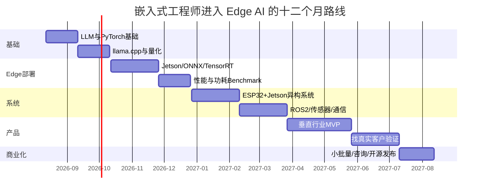

# 大模型落地浪潮下，嵌入式软硬件工程师的机会地图：从职业升级到独立创业

## 执行摘要

**核心判断：未来几年，嵌入式工程师最大的机会，并不是简单地“学会调用大模型 API”，也不是把自己转成纯算法工程师，而是成为连接“模型世界”与“物理世界”的那一层。**

全球 AI 已经从“模型能力竞赛”进入“规模化部署与 ROI 验证”阶段。McKinsey 2025 年调查中，88% 的受访组织已在至少一个业务职能中经常使用 AI，但真正开始企业级规模化部署的只有约三分之一；62% 已经至少开始试验 AI Agent。也就是说，**模型本身越来越容易获得，而把模型变成可靠、低延迟、低成本、可维护、可认证的真实产品，仍然是瓶颈。** citeturn18view0turn18view1

这一转变对嵌入式工程师尤其有利，因为 AI 正从云端向手机、PC、汽车、机器人、工业设备、摄像头、智能家居和医疗终端扩散。中国政策甚至把“端侧推理芯片、边缘计算服务器、大模型一体机”直接列入“人工智能+制造”的基础能力，到 2027 年计划推动 3–5 个通用大模型在制造业深度应用、形成 1000 个工业智能体和 500 个典型应用场景。 citeturn17view2

**真正稀缺的不是“会 LLM”，而是下面这个交集：**

> 嵌入式 Linux / RTOS + 硬件接口 + GPU/NPU + 模型量化部署 + 实时系统 + 功耗热设计 + 传感器 + 网络通信 + 安全可靠性 + 场景工程。

这类人才可以同时吃到三种红利：

| 路径 | 主要价值 | 天花板 |
|---|---|---|
| 就业升级 | 从传统 BSP/驱动/MCU 开发进入 Edge AI、机器人、智能汽车、端侧模型部署 | 高 |
| 高价值技术服务 | 为硬件厂、机器人公司、工业客户做模型移植、性能优化、端侧方案集成 | 很高 |
| 产品/创业 | 把“模型+硬件+场景”做成垂直 AI 设备、模组、SDK 或行业方案 | 最高但风险最大 |

从个人战略看，我更推荐一种 **“杠铃式路径”**：一边继续保持 C/C++、Linux、驱动、RTOS、硬件调试、网络和实时控制这些难以被大模型替代的底层能力；另一边迅速补齐 PyTorch、量化、ONNX/ExecuTorch/llama.cpp、GPU/NPU、VLM/Agent 等端侧 AI 技能。中间那些单纯“写普通业务代码”的工作反而最容易被压缩。

独立参与这轮浪潮，也不意味着一定要融资做“大模型公司”。更现实的机会往往是：

**卖一个设备、一个模组、一个 SDK、一套部署能力、一项行业解决方案，或者把一个优秀开源项目做成事实标准。**

Edge Impulse 就是典型案例：它没有训练基础模型，而是做“模型到 MCU/边缘设备”的开发、部署和监控平台，形成超过 17 万开发者的生态，2025 年被 Qualcomm 收购。中国 M5Stack 则通过模块化 ESP32 硬件、软件工具和开发者生态，把“开发板”做成商业平台，2024 年被乐鑫科技收购控股。 citeturn15search1turn20search1turn15search5

因此，对已有嵌入式经验的人而言，**当前值得押注的方向不是“再做一个 ChatGPT”，而是“让 AI 真正进入设备”。**

## 宏观背景与市场窗口

### 全球正在从训练竞赛转向部署竞赛

IDC 的预测显示，全球企业 AI 解决方案支出在 2025 年约为 **3070 亿美元**，到 2028 年预计达到 **6320 亿美元**，对应 2024–2028 年约 29% CAGR；其中生成式 AI 支出预计从 2025 年约 691 亿美元增长到 2028 年超过 2020 亿美元。需要注意，IDC 不同年份预测的统计口径和基准年份存在调整，所以这些数字更适合看趋势，而不是机械拼成一条绝对精确的时间序列。 citeturn3view0

IDC 的另一项经济影响模型预计，到 2030 年 AI 对全球经济的直接、间接和诱导影响累计可能达到约 **19.9 万亿美元**，2030 年约相当于全球 GDP 的 3.5%；这是经济影响模型，并不是“AI 市场规模”。 citeturn3view1

Stanford 2026 AI Index 同样显示资本投入仍在快速上升：2025 年全球企业 AI 投资同比增长超过一倍，私人 AI 投资达到约 3447 亿美元；生成式 AI 是其中增长最快的部分之一。美国私人 AI 投资显著领先中国，但 Stanford 特别提醒，仅比较私人投资会低估中国通过政府引导基金等渠道投入的资本。 citeturn19search3turn19search7turn19search10

更重要的是，产业正在从“有 AI”转向“AI 能否赚钱”。McKinsey 最新调查中，88% 的组织已经使用 AI，但约三分之二还没有实现企业级规模化；只有 39% 的受访者报告 AI 对企业整体 EBIT 已产生任何程度的影响。制造业、软件工程和 IT 是当前最常报告出成本收益的领域之一。 citeturn18view0turn18view2

BCG 2026 AI Radar 中，企业预计将 AI 投入从约占收入的 0.8% 提升到约 1.7%；94% 的受访组织表示，即使短期回报不明显，也计划继续投资。 citeturn19search6turn19search12

这意味着未来竞争重点逐渐从：

**谁有更大的模型**

变成：

**谁能以更低成本、更低延迟、更高可靠性把模型嵌进真正的业务与设备。**

而后者恰好大量依赖嵌入式系统工程。

### 中国的窗口尤其偏向“端侧+制造+机器人”

中国 AI 产业规模的公开统计存在明显口径差异。援引中国信通院数据的官方信息显示，2024 年中国人工智能核心产业规模已超过 **9000 亿元人民币**，2025 年初步估计超过 **1.2 万亿元**；另一方面，其他官方渠道援引不同统计体系给出的 2024 年规模超过 7000 亿元。因此，不能把不同数字直接比较为同一市场序列。 citeturn4search2turn4search6

信通院 2025 年人工智能产业研究已经把基础模型演进、具身智能、算力基础设施、AI 原生应用以及安全治理放在同一产业框架中讨论，反映出的趋势不是“模型单独发展”，而是模型、终端、算力和行业应用共同演进。 citeturn0search2

政策信号更明确。

2025 年国务院《关于深入实施“人工智能+”行动的意见》提出，到 **2027 年新一代智能终端、智能体等应用普及率超过 70%，到 2030 年超过 90%**；政策同时提出财政、金融、长期资本、政府采购、人才和安全治理等支持措施。 citeturn17view3turn22view2

2026 年八部门“人工智能+制造”专项行动进一步提出，到 2027 年：

> 推动 3–5 个通用大模型在制造业深度应用，推出 1000 个工业智能体、100 个工业高质量数据集、500 个典型应用场景，并支持端侧推理芯片、AI 服务器、边缘计算服务器和大模型一体机。 citeturn17view2

此外，中国生成式 AI 服务备案数量仍在快速增加。截至 2026 年 4 月 30 日，累计已有 **868 项生成式人工智能服务完成备案**，另有 **530 个应用或功能完成登记**。 citeturn0search1

机器人尤其值得嵌入式工程师关注。国际机器人联合会数据显示，全球 2024 年新增工业机器人约 **54.2 万台**，运行中的工业机器人存量约 466 万台；中国新增安装约 29.5 万台，占全球约 54%，中国本土机器人厂商在国内市场份额升至 57%。 citeturn5search2

因此，从中国的产业结构看，我会把未来五年的机会强度排序为：

**机器人/具身智能 ≈ 智能汽车 > 工业边缘 AI > AIoT/智能家居 > 新型消费电子 > 医疗端侧 AI。**

医疗的单项目价值可能更高，但法规和验证周期显著更长。

### 为什么“端侧”会长期存在，而不是全部回云端

端侧推理并不是为了取代云模型，而是解决云端天然难以解决的问题：

| 约束 | 纯云模式问题 | 端侧价值 |
|---|---|---|
| 延迟 | 网络 RTT 和排队不可控 | 本地推理可获得稳定响应 |
| 离线 | 工厂、汽车、户外机器人可能断网 | 仍可执行核心功能 |
| 隐私 | 图像、语音、医疗和生产数据外传敏感 | 数据可尽量留在设备 |
| 成本 | 高频调用会持续产生 token/API/带宽成本 | 一次性硬件成本可摊销 |
| 实时控制 | 云端无法提供硬实时保证 | MCU/RTOS 本地闭环 |
| 数据量 | 多路高清视频上传成本高 | 本地筛选、压缩、理解 |
| 产品差异化 | 云 API 容易被竞争者复制 | 软硬一体优化可形成壁垒 |

Raspberry Pi 在介绍搭载 Hailo-10H 的 AI HAT+ 2 时，就明确把离线运行、低延迟、降低云 API 成本和数据安全作为端侧生成式 AI 的价值。 citeturn22view7

所以未来更可能出现的是：

> **云端“大脑” + 边缘“小脑” + MCU“脊髓反射”**

而不是单一架构。

这恰好意味着传统嵌入式能力不会消失，而是被 AI 重新放大。

## 技术栈、硬件平台与工程岗位

### 嵌入式工程师在 LLM 系统里究竟做什么

一个真正可量产的 AI 设备，工程链条大致是：

**传感器 → 驱动/BSP → 数据预处理 → AI/VLM/LLM → Agent/决策 → 实时控制 → 通信 → 云服务 → OTA/监控**

模型只在中间占了一层。

嵌入式工程师的新工作内容可以具体拆成：

| 技术方向 | 实际工作 | 核心能力 |
|---|---|---|
| Edge inference | 将 LLM/VLM/ASR 模型部署到 ARM/GPU/NPU | C++、Python、CUDA、runtime |
| 模型压缩 | INT8/INT4、weight-only、剪枝、蒸馏 | PyTorch、AWQ、SmoothQuant |
| Kernel/加速 | GEMM、attention、FlashAttention、算子融合 | CUDA、SIMD、NEON、profiling |
| SoC/BSP | GPU/NPU 驱动、Device Tree、DMA、IOMMU、PCIe/MIPI | Linux kernel、Yocto、U-Boot |
| 固件/实时 | 电机、传感器、watchdog、fault handling | C/C++、FreeRTOS/Zephyr |
| 功耗与热 | DVFS、idle、thermal throttling、功耗预算 | PMIC、thermal、power profiling |
| Sensor Fusion | Camera/IMU/LiDAR/Radar/audio 时间同步与融合 | ROS 2、Kalman、timestamps |
| Connectivity | CAN/CAN-FD、EtherCAT、Ethernet、Wi-Fi、BLE、5G | 网络栈、现场总线 |
| 安全 | Secure Boot、密钥、加密、OTA、模型保护 | TPM/TEE、安全启动 |
| 系统可靠性 | crash recovery、降级、offline fallback | systemd、watchdog、A/B OTA |

其中“模型压缩”并不是纯算法研究人员的专属工作。

例如 AWQ 研究表明，LLM 权重中存在少量对模型质量特别敏感的权重，可以利用硬件友好的低比特量化降低模型内存占用；SmoothQuant 则通过平滑激活值实现 W8A8 的后训练量化。 citeturn12search1turn12search2

针对真实边缘设备的研究还发现，低比特量化不仅影响内存和速度，也可能显著降低能耗，但具体收益高度依赖模型、芯片、runtime 和 workload，不能把单篇论文中的节能百分比直接当作通用结论。 citeturn12search0turn12search9

这也是一个重要职业分界：

**未来值钱的人不是“知道 INT4 是什么”，而是能解释为什么这个模型在这块 SoC 上 INT4 反而没有预期提速，并把问题定位到内存带宽、kernel、KV cache、runtime 或算子支持的人。**

### 软件栈正在快速成熟

目前值得嵌入式工程师重点关注的部署栈包括：

**llama.cpp** 的目标就是让 LLM/VLM 能够在广泛硬件上以较少依赖实现本地推理，是理解 GGUF、CPU/GPU 混合卸载、量化和本地模型工程的非常好入口。 citeturn16search0

**ExecuTorch** 已在 2025 年进入 1.0，并于 2026 年成为 PyTorch Core 的一部分，目标是把 PyTorch 模型部署到手机、嵌入式系统、AR/VR 和其他 edge device。 citeturn16search5turn16search20

**ONNX Runtime** 支持 CPU、GPU、NPU 等多类执行后端，并通过 Execution Provider 接入 CUDA、TensorRT、OpenVINO、QNN、CoreML 等硬件栈。 citeturn16search3turn16search18

**MLC-LLM** 则强调通过机器学习编译实现跨平台 LLM 部署。 citeturn16search1

对 NVIDIA 平台，还应学习 JetPack、CUDA、TensorRT、Nsight、Isaac ROS；对 MCU 则要掌握 TensorFlow Lite Micro、CMSIS-NN、ESP-DL 等。

### 硬件平台比较

下面价格为 **2026 年 8 月能从官方资料确认的美元标价**；地区、税费、模组与开发板区别会导致实际采购价明显不同。“TOPS”之间也不是完全可比的 benchmark，尤其 INT8 TOPS 与 FP4 sparse TFLOPS 不能横向直接相除。

| 平台 | AI 算力 | 功耗 | 官方参考价格 | 内存 | LLM/VLM 适合度 | 最适合 |
|---|---:|---:|---:|---:|---|---|
| NVIDIA Jetson Orin Nano Super | 67 INT8 TOPS | 7–25 W | ~$249 | 8 GB LPDDR5 | ★★★★☆ | 学习、原型、小机器人 |
| NVIDIA Jetson AGX Orin | 最高约 275 TOPS | 15–60 W | Dev Kit 当前约 $3,499 | 最高 64 GB | ★★★★★ | 工业/机器人高性能部署 |
| NVIDIA Jetson Thor | 2070 FP4 sparse TFLOPS | 40–130 W | $5,499 | 128 GB | ★★★★★ | 高端具身智能/VLA |
| Raspberry Pi 5 + AI HAT+ 2 | 40 INT4 TOPS | NPU 典型约数 W 级 | HAT $200 + Pi | HAT 8 GB | ★★★★☆ | 低成本 GenAI 产品原型 |
| Google Coral Edge TPU | 4 TOPS | 约 2 W NPU | **未指定/存量市场** | 外部主机 | ★☆☆☆☆ | TinyML/CV，不适合现代 LLM |
| Intel Movidius NCS2 | 官方当前未给统一 TOPS | USB 功耗级 | **已停产** | Myriad X 内部 | ★☆☆☆☆ | 维护旧 OpenVINO 项目 |
| Orange Pi RV2 / RISC-V | 2 TOPS | **未指定** | **未指定** | 2/4/8 GB | ★★☆☆☆ | RISC-V、低成本边缘研究 |

Jetson Orin Nano Super 官方规格为 67 INT8 TOPS、8 GB LPDDR5、102 GB/s 内存带宽和 7–25 W 功耗，并明确定位 LLM、VLM、机器人等生成式 AI 工作负载。 citeturn22view5

Jetson Thor 则提升到 2070 FP4 sparse TFLOPS、40–130 W，目前 NVIDIA 官方开发套件标价 5499 美元，其定位已经非常明显地指向下一代机器人/physical AI。 citeturn22view6

Raspberry Pi AI HAT+ 2 搭载 Hailo-10H，提供 40 INT4 TOPS 和独立 8 GB RAM，当前官方价格 200 美元，并明确支持本地 LLM/VLM。 citeturn22view7

Google Coral 的早期 Edge TPU 约为 4 TOPS、2 TOPS/W，设计时代主要围绕 TensorFlow Lite Edge AI；因此它仍适合 CV/TinyML 教学或既有系统，但并不是今天端侧 LLM 的理想起点。 citeturn10search2turn10search8

Intel Movidius Neural Compute Stick 2 已进入停产状态，因此更适合维护遗留项目，而不是作为新项目长期技术路线。 citeturn8search7turn8search1

Orange Pi RV2 搭载 RISC-V Ky X1，公开规格提供约 2 TOPS NPU 与最高 8 GB LPDDR4X，其意义主要在于研究 **RISC-V + AI accelerator + Linux** 的未来国产/开放架构，而不是跑大型 LLM。 citeturn8search2turn8search6

### 一个非常重要的系统架构原则

不要试图让 LLM 负责所有事情。

机器人、电机、汽车或工业控制里，更成熟的设计通常应当把：

**硬实时、安全闭环、watchdog、急停**

留在 MCU/RTOS；

而把：

**视觉、语言理解、规划、语义决策**

放在 Linux SoC/GPU/NPU。

例如：

```text
Camera / Mic / LiDAR
        │
        ▼
Linux SoC / Jetson
VLM + LLM + Agent
        │
   High-level command
        ▼
MCU / RTOS
PID / Motor / Safety
        │
        ▼
Actuator
```

LLM 即使 hallucinate，底层 safety controller 也不应该允许它直接输出一个未经约束的 PWM、电机电流或制动指令。

这会成为具身智能时代非常重要的嵌入式架构能力。

## 就业市场与能力门槛

### 职位名称正在发生变化

未来不一定会出现统一的“LLM 嵌入式工程师”名称，目前招聘市场更多表现为以下混合岗位：

| 岗位 | 英文常见名称 | 技能关键词 |
|---|---|---|
| 端侧 AI 工程师 | Edge AI Engineer | ONNX/TensorRT/NPU/C++ |
| 模型部署工程师 | Model Deployment Engineer | quantization/runtime/CUDA |
| AI 推理优化工程师 | AI Inference Engineer | kernel/GPU/profiling |
| Embedded ML Engineer | Embedded ML Engineer | MCU/SoC/TinyML |
| 机器人系统工程师 | Robotics Systems Engineer | ROS 2/C++/sensor |
| 具身智能部署工程师 | Embodied AI Deployment Engineer | VLM/VLA/Jetson |
| BSP/AI Platform Engineer | Embedded Platform Engineer | Linux/BSP/driver |
| AI Accelerator Engineer | NPU/ASIC Engineer | RTL/compiler/kernel |
| Automotive AI Engineer | Automotive Embedded AI | AUTOSAR/CAN/SoC |
| Firmware AI Engineer | AI Firmware Engineer | RTOS/DSP/NPU firmware |

McKinsey 2025 调查中，在企业近期的 AI 招聘岗位里，软件工程师和数据工程师仍是最常被报告的需求类别之一。 citeturn18view2

美国 BLS 也预计软件开发人员就业在 2024–2034 年增长约 **16%**，并明确把 AI、IoT、机器人和自动化应用列为推动软件开发需求的因素；计算机硬件工程师预计同期增长约 **7%**。 citeturn17view5turn17view6

这并不能直接证明“嵌入式 LLM 岗位会增长 X%”，因为目前官方职业统计中并没有这么细的分类，但它说明 **AI+IoT+机器人+物理产品的软件需求并没有随着 AI 编程工具出现而消失。**

### 中国薪资

目前没有权威全国统计把“端侧 LLM/Embedded AI Engineer”单列成职业，所以只能使用公开招聘作为样本，不能理解成全国薪资均值。

2025–2026 年公开职位样本中：

| 类型 | 公开招聘样本 |
|---|---|
| AI 嵌入式软件 | 约 ¥20k–35k/月 × 14 |
| 端侧大模型开发 | 约 ¥20k–40k/月 × 14 |
| 机器人 Embedded Linux | 约 ¥25k–45k/月 |
| 具身模型部署 | 约 ¥30k–50k/月 × 15 |
| 嵌入式机器学习 | 约 ¥30k–50k/月 × 13–15 |
| 高级大模型算法 | 部分岗位约 ¥40k–65k/月 × 15 |

例如公开招聘样本中，DJI 嵌入式机器学习相关职位出现约 30–45K×15、30–50K×13 的区间；上海部分具身智能模型部署岗位出现 30–50K×15，具身嵌入式岗位约 20–40K；端侧大模型开发职位也出现 20–40K×14 的样本。 citeturn13search16turn13search13turn13search18

这些数字受城市、年限、奖金、股票、公司阶段影响非常大，只能用来判断 **技术交叉岗位的价格中枢通常高于普通 MCU/BSP 维护岗**，不能当成个人报价标准。

少量公开兼职职位甚至已经直接出现“Embedded AI / AIoT / Edge AI / LLM”形式的按小时项目，但公开样本极少，不足以形成可靠市场价格统计。 citeturn13search4

### 美国及全球参考

美国 BLS 2024 年工资数据显示：

**软件开发工程师中位年薪约 133,080 美元；计算机硬件工程师约 155,020 美元。** citeturn17view5turn17view6

真正处于 AI+embedded 前沿的企业岗位明显高于这一平均水平。例如 NVIDIA 公开的 TensorRT Edge-LLM、汽车/机器人 Embedded Platform 等高级工程职位，部分基本薪酬区间约为 **184k–287.5k 美元/年**，更高职级可能进一步达到 300k 美元以上；这些属于顶级美国科技公司的特殊岗位，不能视为行业中位数。 citeturn14search20turn14search4turn14search10

中国以外其他国家目前没有足够统一、同口径的“Embedded LLM Engineer”薪酬统计，**未指定**。

### 到底应该会哪些技能

我会把技能分成四层：

**第一层：不能丢的嵌入式硬实力**

C/C++、Linux、RTOS、ARM、Device Tree、U-Boot、驱动、SPI/I²C/UART/CAN、网络、GDB、perf、CMake、交叉编译、Git。

**第二层：AI deployment**

Python、PyTorch、Transformers、ONNX、llama.cpp、ExecuTorch、TensorRT、量化、GGUF、LoRA、KV cache、tokenizer、profiling。

**第三层：Edge/robotics**

CUDA、ROS 2、OpenCV、GStreamer、camera pipeline、sensor fusion、Docker、MQTT、CAN-FD、EtherCAT。

**第四层：product engineering**

Secure Boot、OTA、A/B partition、SBOM、CI/CD、日志、telemetry、功耗、thermal、EMC、reliability。

最稀缺的是能同时跨过第二层和第一层的人。

### 证书的重要性低于作品，但行业标准很重要

目前不存在业界统一要求的“LLM 嵌入式工程师认证”。NVIDIA 等厂商提供培训和认证，但对大多数开发岗来说，能够展示真实硬件 benchmark、代码和完整系统作品通常比课程证书更有说服力。NVIDIA 自身也提供针对加速计算与 AI 的培训/认证体系。 citeturn22view6

真正进入汽车、工业、医疗后，行业规范的重要性会快速增加。例如汽车领域 ISO 26262 覆盖安全相关 E/E 系统的功能安全生命周期；工业控制安全对应 IEC 62443；医疗设备软件生命周期则涉及 IEC 62304。 citeturn21search3turn21search20turn21search4

因此，更好的策略并不是“收集 AI 证书”，而是：

> **选择一个行业，把它的 safety/security/regulatory language 学会。**

这往往能形成比某个框架证书更长久的职业壁垒。

## 产品、商业模式与独立路径

### 真正适合个人和小团队的产品机会

最容易犯的错误是：

> “现在大模型火，我做一个 AI 硬件。”

这是产品定义，而不是商业需求。

更好的问题应该是：

> “哪个现实世界流程，每天重复 100 次，而且目前依赖一个人在现场看、听、判断或查询？”

这才是 edge AI 的机会来源。

我会优先看以下领域：

| 垂直行业 | 可以做什么 | 购买者 | 商业模式 | 收入潜力* | 小团队可行性 |
|---|---|---|---|---|---|
| 工业 | AI 视觉质检、故障诊断盒、维修 Copilot | 工厂/集成商 | 硬件+软件年费 | ★★★★★ | ★★★★★ |
| 机器人 | VLM 控制盒、语音交互、导航/操作模块 | 机器人 OEM | 模组+SDK+授权 | ★★★★★ | ★★★★☆ |
| 汽车 | 座舱 AI、DMS、离线语音、诊断 | Tier1/OEM | NRE+license | ★★★★★ | ★★☆☆☆ |
| AIoT | 本地智能网关、能源管理、安防 | 企业/家庭 | 硬件+订阅 | ★★★★☆ | ★★★★★ |
| 医疗设备 | 离线语音记录、设备助手、监测 | 医疗厂商 | OEM/license | ★★★★★ | ★★☆☆☆ |
| 消费电子 | AI 玩具、桌面机器人、翻译器 | 消费者 | 硬件+服务 | ★★★★☆ | ★★★★☆ |
| 农业 | 病虫检测、巡检、自动控制 | 农场/集成商 | 设备+SaaS | ★★★★☆ | ★★★★☆ |

\*“收入潜力”为本文基于客单价、部署数量、复购/软件收入和进入壁垒做出的相对判断，并非市场规模预测。

工业和机器人尤其值得注意，因为机器人安装量和制造业 AI 政策都已经给出了明确的产业化信号。 citeturn5search2turn17view2

### 六类适合独立工程师的商业模式

**项目型咨询**

最容易开始。

例如：

> “把客户的 Qwen/MiniCPM/Llama 模型移植到 RK3588/Jetson。”

收入来自 NRE、按天或按项目咨询。

缺点是没有复利。

**产品化咨询**

比纯外包更好。

例如针对工业摄像头做：

> Jetson/RK3588 + VLM + OPC-UA/Modbus + Web UI + OTA

做成一套 reusable stack。

同一套软件可以卖给十家客户。

**SDK / IP licensing**

例如开发：

- INT4 inference backend
- CAN+LLM diagnostic SDK
- offline voice SDK
- industrial VLM runtime
- NPU abstraction layer

按设备 license、年度 license 或 OEM 授权收费。

这是技术型工程师最值得追求的模式之一。

**硬件产品**

例如：

- Edge AI Box
- AI Camera
- AI Gateway
- Robot Brain Module
- Voice AI Module

收入：

`硬件售价 − BOM − 制造 − 渠道成本`

关键不是“硬件利润”，而是通过硬件建立安装基数。

**Hardware-as-a-Service**

例如工业巡检盒：

`¥799/月/节点`

客户不买设备，你拥有设备，持续收订阅。

这可以把一次性项目收入转换为 ARR。

**开源 + 商业服务**

模式类似：

```text
Open-source runtime
        ↓
Developer adoption
        ↓
Enterprise support
        ↓
OEM/custom hardware
        ↓
Cloud/device management
```

这是非常适合嵌入式 AI 的长期模式，因为硬件天然碎片化，企业往往愿意为“稳定支持”付费。

### 单位经济不能只看“模型成本”

一个简单的工业 AI Box 可以这样算账。

以下数字是**示范模型，不是市场报价**：

假设：

```text
硬件 BOM                    ¥4,000
制造/物流/安装              ¥1,500
一次性售价                 ¥12,000
```

那么一次性贡献毛利：

```text
12,000 - 4,000 - 1,500
= ¥6,500
```

再加：

```text
设备管理/模型更新
¥2,400 / 年
```

假定年服务可变成本 ¥600，则：

```text
服务年贡献 = ¥1,800
```

部署 100 台：

```text
首年贡献 ≈
100 × (6,500 + 1,800)
= ¥830,000
```

这还没有扣销售、研发、人力和公司运营费用，但已经显示了一个关键问题：

> **边缘 AI 生意真正好看的地方，往往不是硬件本身，而是“硬件安装基数 × 软件/维护/模型收入”。**

因此，不要做：

> “卖一块板子。”

而要做：

> “卖一块板子 + 一项持续能力。”

### 独立参与浪潮的几个真实案例

**llama.cpp：个人/开源项目成为基础设施**

llama.cpp 的核心目标是让 LLM/VLM 能够以较少依赖运行于广泛硬件平台，本质上直接解决“LLM 如何从数据中心走向普通设备”的问题。 citeturn16search0

它说明独立工程师不一定需要创建模型；**把现有模型运行得更快、更容易、更跨平台，本身就可能产生巨大的生态价值。**

**Edge Impulse：从 Edge AI 工具链做到战略收购**

Edge Impulse 提供从数据、模型开发到 MCU/边缘设备部署和监控的工具链，Qualcomm 在 2025 年宣布收购时称该平台已服务超过 **17 万开发者**，应用覆盖资产监控、制造、异常检测、预测性维护、视觉、音频等。 citeturn15search1turn15search25

最值得学习的是：

> 它卖的不是一个模型，而是“模型到设备的最后一公里”。

**M5Stack：中国开发者硬件生态的产品化案例**

M5Stack 从模块化 ESP32 硬件发展出硬件、UIFlow、AI/IoT 软件和定制服务体系。公司官方披露其产品已覆盖 110 多个国家、累计销售超过 300 万件，并形成超过 18 万人的开发者/创客社区；这些属于公司自报数据。2024 年乐鑫科技收购其多数股权。 citeturn15search5turn20search1

其经验不是“做一块爆款开发板”，而是：

**模块 → 开发者 → 软件 → 应用 → SKU → OEM。**

2026 年 M5Stack 还在把 StackFlow 等能力扩展到 embedded AI。 citeturn15search14

**Seeed Studio：从开发板升级到 Edge AI 基础设施**

Seeed 的 reComputer 产品线把 Jetson SoM 与 carrier board、散热、存储、机箱和软件支持组合成 edge AI 平台，并进一步通过 SenseCraft/reComputer AI Lab 提供 CV、LLM、VLM 模型和部署工具。 citeturn15search0turn15search6

其商业价值来自：

> hardware + integration + manufacturing + ODM + fulfillment + software ecosystem。

Seeed 官方也明确把自身定位为帮助客户从原型走向量产的集成、ODM 和制造伙伴。 citeturn15search24

这非常值得个人工程师学习——**越靠近“客户从 Demo 到量产”的痛点，越容易收费。**

**中国端侧模型正在主动向硬件靠拢**

面壁智能 MiniCPM 系列明确以端侧模型为重要方向。其 MiniCPM 4 系列包含 8B 和 0.5B 等规模，并通过量化、稀疏等方法针对端侧部署优化；2026 年还公布了面向端侧智能开发的“松果派”硬件计划。 citeturn20search0turn20search15

这个趋势很关键：

以前：

> 芯片厂 → 工程师负责适配模型。

以后越来越可能：

> 模型设计 ↔ compiler/runtime ↔ chip ↔ hardware ↔ application

从一开始就协同设计。

**懂模型又懂 SoC 的工程师，价值会因此上升。**

## 技能路线与十二个月行动计划

### 学习路线不要从“学 Transformer 数学”开始

对于已经是嵌入式工程师的人，我建议：

**先学部署，再补模型原理。**

原因很简单：你的差异化不是和算法博士竞争训练模型，而是把模型放进物理系统。

### 短期：建立 Edge LLM 基线

目标时间：约两个月。

重点：

```text
Python
PyTorch
Transformers
llama.cpp
GGUF
INT8 / INT4
ONNX
Docker
Jetson
```

需要真正理解：

- prefill 与 decode
- tokens/s
- TTFT
- KV cache
- context length
- model memory
- quantization
- CPU/GPU offload
- memory bandwidth
- latency vs throughput

Portfolio 项目：

> **Jetson Orin Nano 本地 LLM benchmark**

至少测：

```text
模型大小
量化等级
RAM
启动时间
TTFT
tokens/s
CPU/GPU usage
功耗
温度
```

不要只录一段“模型跑起来了”的视频。

**Benchmark 本身就是作品。**

### 中期：从模型部署进入系统工程

目标时间：三到六个月。

学习：

```text
TensorRT
ONNX Runtime
ExecuTorch
CUDA basics
Nsight
GStreamer
OpenCV
ROS 2
MQTT
CAN
Modbus
```

做一个真正的 multimodal project：

> Camera → VLM → LLM → structured command → MCU

例如：

```text
摄像头看到设备仪表
        ↓
VLM 读取读数/状态
        ↓
LLM 分析异常
        ↓
JSON command
        ↓
ESP32
        ↓
蜂鸣器 / relay / motor
```

最重要的不是模型精度，而是实现：

- watchdog
- timeout
- malformed output handling
- network disconnect
- sensor disconnect
- model crash recovery
- OTA
- logging

这才会让作品从“AI Demo”变成“嵌入式系统”。

### 长期：做软硬件协同

六到十二个月时，应开始研究：

```text
BSP
Device Tree
NPU runtime
DMA
Zero-copy
Quantization-aware deployment
Kernel profiling
Power/thermal
Secure Boot
OTA
```

然后选择一个垂直领域：

**机器人**：

ROS 2、Isaac ROS、camera/IMU、motor control、VLM/VLA。

**工业**：

Modbus、OPC-UA、EtherCAT、IEC 62443、工业相机。

**汽车**：

CAN-FD、AUTOSAR 基础、ISO 26262、车载 Linux/QNX。

**消费电子**：

ESP32、BLE、Wi-Fi、Matter、audio、低功耗。

**医疗**：

IEC 62304、风险管理、数据安全、可验证性。 citeturn21search4

### 最推荐的硬件组合

预算有限：

```text
ESP32-S3
+
Raspberry Pi 5 / AI HAT+2
```

ESP32-S3 自带用于 NN/DSP 工作负载的向量指令，并提供 Wi-Fi/BLE、Secure Boot 和 Flash Encryption，非常适合学习“MCU + AI SoC”双层架构。 citeturn20search2

预算中等：

```text
ESP32-S3
+
Jetson Orin Nano Super
```

这是我最推荐的组合。

原因是可以同时学习：

```text
RTOS
Linux
CUDA
LLM
VLM
sensor
robotics
network
```

而且 Orin Nano Super 已经能够真实运行多种 LLM/VLM。 citeturn22view5

### Portfolio 应该长什么样

不要做十个 ChatGPT UI。

做三到四个真正系统级项目更有价值。

**项目一：Offline multimodal industrial copilot**

```text
Jetson
Camera
Mic
VLM
LLM
local RAG
Modbus
Web UI
```

核心指标：

TTFT、tokens/s、功耗、断网能力。

**项目二：LLM + RTOS robot**

```text
Jetson
│
ROS 2
│
ESP32
│
Motor + IMU
```

LLM 负责意图，MCU 负责硬实时。

**项目三：Quantization Benchmark Suite**

比较：

```text
FP16
INT8
INT4
```

记录：

```text
quality
latency
memory
energy/token
thermal
```

AWQ、SmoothQuant 等论文可以成为实验基线。 citeturn12search1turn12search2

**项目四：Secure Edge AI Appliance**

加入：

```text
Secure Boot
signed OTA
A/B partition
encrypted model
watchdog
telemetry
```

这一个项目在面试或拿 B2B 客户时，很可能比再实现一次 RAG 更有区分度。

### 十二个月执行计划

假定从 **2026 年 8 月**开始：



对应的 milestone 应该非常明确：

| 时间点 | 必须产出 |
|---|---|
| 两个月 | 一个公开 Edge LLM benchmark repo |
| 四个月 | 一个真实 Jetson VLM/LLM 项目 |
| 六个月 | 一个 MCU + AI SoC 完整设备 |
| 八个月 | 选定一个垂直行业 |
| 九个月 | 与至少 5–10 个真实潜在用户交流 |
| 十个月 | 一个可付费 MVP |
| 十二个月 | 至少完成一次销售、付费咨询、OEM 试用或开源社区验证 |

这里最重要的 milestone 不是：

> “学完 CUDA”。

而是：

> **有人愿意因为你做出来的东西付钱、采用或贡献代码。**

## 风险、约束与最终判断

### 最大技术风险不是模型，而是系统不可靠

典型失败路径包括：

```text
模型升级 → 算子不支持
Driver升级 → runtime崩
温度上升 → throttling
context增长 → OOM
sensor丢帧 → VLM误判
LLM输出格式错误 → actuator异常
断网 → Agent失效
OTA失败 → device brick
```

因此应该从第一天建立：

```text
fallback
watchdog
health monitoring
structured output
resource limit
A/B update
offline mode
```

这也是传统嵌入式工程师相对纯 AI 工程师最大的优势之一。

### 合规会越来越“进入固件”

中国已经要求符合适用范围的 AI 生成合成内容服务对文本、图片、音频、视频和虚拟场景等内容加入显式和隐式标识；相关办法自 2025 年起进入实施体系。 citeturn22view3

生成式 AI 对公众提供服务时，还可能涉及生成式 AI 服务管理、安全评估和算法备案等要求；实际是否适用于某个离线设备、企业内部设备或公网产品，需要根据产品形态逐项判断。 citeturn0search16

如果产品进入欧盟，EU AI Act 已于 2026 年 8 月 2 日进入主要适用阶段；部分嵌入受监管产品的高风险 AI 规则有更长过渡期，到 2027–2028 年分阶段适用。 citeturn22view4

这意味着未来 embedded AI 的一项新能力将是：

> **policy → system requirement → firmware/software implementation**

例如：

```text
AI标识
audit log
model version
consent
data retention
access control
```

最终都会变成代码。

### 供应链不能忽略

先进 AI 芯片已经是贸易政策和出口管制的重要对象。例如美国 BIS 在 2025–2026 年持续调整针对先进计算芯片、相关出口和中国市场的许可政策。 citeturn6search18turn6search6

因此创业时不应该让产品：

> 只能跑在一颗无法替代的芯片上。

更合理的是做 runtime abstraction：

```text
Application
    │
AI Runtime API
    │
 ┌──┼──────┐
Jetson RK3588 Qualcomm ...
```

即使第一版只支持 Jetson，也应从架构上保留迁移能力。

### 医疗、汽车和工业的高利润来自高门槛

汽车需要面对 ISO 26262 等功能安全框架；医疗软件生命周期涉及 IEC 62304；工业控制网络和产品安全则越来越受到 IEC 62443 系列影响。 citeturn21search15turn21search4turn21search8

这看起来是障碍，但其实也是护城河。

普通 AI App：

> 一个月可能出现几十个竞争者。

通过汽车、工业或医疗验证的嵌入式 AI 方案：

> 很难被一个周末复制。

所以职业生涯越往后，我反而建议选择一个 **“有监管、有硬件、有现场、有实时性”的行业**。

### AI 本身也会降低嵌入式开发门槛

必须承认，大模型也会逐渐自动生成：

```text
driver skeleton
C/C++
unit test
device tree
scripts
documentation
basic PCB
```

所以只靠“会写 C”的价值会下降。

真正不容易被替代的是：

**知道哪段 AI 生成的 C 会导致 race condition。**

**知道为什么 DMA buffer 必须 cache coherent。**

**知道 motor control 为什么不能等待 LLM。**

**知道 GPU OOM 后系统应该如何降级。**

**知道硬件在 70℃ 与 25℃ 的行为为什么不同。**

**知道客户工厂现场的 Ethernet、EMI、电源和网络环境为什么总会打败 Demo。**

这是 embodied AI 时代工程师真正的护城河。

### 最终机会地图

如果把“机会大小”和“个人可进入性”放到同一个矩阵里，我的判断是：

| 方向 | 市场机会 | 技术壁垒 | 资本要求 | 个人/小团队推荐度 |
|---|---|---|---|---|
| Edge AI 部署/优化 | ★★★★★ | ★★★★☆ | ★☆☆☆☆ | **★★★★★** |
| AI+机器人 | ★★★★★ | ★★★★★ | ★★★☆☆ | **★★★★★** |
| 工业 AI Box | ★★★★★ | ★★★★☆ | ★★☆☆☆ | **★★★★★** |
| AIoT 模组/SDK | ★★★★☆ | ★★★★☆ | ★★☆☆☆ | **★★★★★** |
| 开源 runtime/tool | ★★★★★ | ★★★★★ | ★☆☆☆☆ | **★★★★★** |
| AI 玩具/消费设备 | ★★★★☆ | ★★★☆☆ | ★★★☆☆ | ★★★★☆ |
| 汽车 Tier1 方案 | ★★★★★ | ★★★★★ | ★★★★☆ | ★★★☆☆ |
| 医疗 AI 设备 | ★★★★☆ | ★★★★★ | ★★★★☆ | ★★☆☆☆ |
| 自研 AI 芯片 | ★★★★★ | ★★★★★ | ★★★★★ | ★☆☆☆☆ |
| 自研基础大模型 | ★★★★★ | ★★★★★ | ★★★★★ | ★☆☆☆☆ |

因此，对于一个已经具有嵌入式软硬件背景的工程师，未来一到三年我认为最优解不是：

> **“转行 AI。”**

而应该是：

> **“把自己升级成 AI 系统工程师。”**

传统嵌入式时代，你解决的是：

> **如何让软件可靠地控制硬件。**

未来的 embedded AI / Physical AI 时代，你解决的是：

> **如何让不完全可靠、资源消耗巨大的概率模型，在功耗、实时性、安全、成本和物理世界约束下，可靠地控制一台真正的机器。**

这件事情比调用 API 难得多，也因此更有价值。

而从独立参与的角度，最值得寻找的也不是下一个“大模型”，而是大模型基础设施成熟之后涌现出的无数 **“最后一公里”**：

> 模型怎么压到 4 bit，  
> 怎么跑进一块 10 W 的板子，  
> 怎么接摄像头和麦克风，  
> 怎么连 PLC 和电机，  
> 怎么断网还能工作，  
> 怎么控制延迟和温度，  
> 怎么安全 OTA，  
> 怎么量产一万台，  
> 怎么让客户三年之后仍然敢升级模型。

**这整个“最后一公里”，恰恰就是嵌入式软硬件工程师最大的下一轮浪潮。**