```mermaid
graph LR
    %% 定义节点样式
    classDef root fill:#f9f,stroke:#333,stroke-width:2px,color:black;
    classDef gen fill:#e1f5fe,stroke:#01579b,color:black;
    classDef rte fill:#fff9c4,stroke:#fbc02d,color:black;
    classDef sys fill:#e8f5e9,stroke:#2e7d32,color:black;
    classDef com fill:#f3e5f5,stroke:#7b1fa2,color:black;
    classDef mem fill:#fff3e0,stroke:#e65100,color:black;
    classDef diag fill:#fce4ec,stroke:#880e4f,color:black;
    classDef mcal fill:#eceff1,stroke:#455a64,color:black;

    %% 根节点
    Root[**AUTOSAR 规范体系**]:::root

    %% 1. 顶层架构与方法论
    subgraph G1 [1. General & Methodology]
        direction TB
        Root --> EXP_LA[**EXP_LayeredArchitecture**<br/>层级架构地图]:::gen
        Root --> TR_Meth[**TR_Methodology**<br/>开发工作流]:::gen
        Root --> TPS_Sys[**TPS_SystemTemplate**<br/>系统描述模板]:::gen
        Root --> TPS_SWC[**TPS_SWC_Template**<br/>软件组件模板]:::gen
    end

    %% 2. RTE
    subgraph G2 [2. Runtime Environment]
        Root --> SWS_RTE[**SWS_RTE**<br/>层级: RTE<br/>功能: 虚拟总线/中间件]:::rte
    end

    %% 3. System Services
    subgraph G3 [3. System Services Stack]
        Root --> Sys_Stack
        Sys_Stack(系统服务栈):::sys --> SWS_OS[**SWS_OS**<br/>层级: Services<br/>功能: 任务调度/中断]:::sys
        Sys_Stack --> SWS_EcuM[**SWS_EcuM**<br/>层级: Services<br/>功能: 上下电管理]:::sys
        Sys_Stack --> SWS_BswM[**SWS_BswM**<br/>层级: Services<br/>功能: 模式仲裁控制]:::sys
        Sys_Stack --> SWS_WdgM[**SWS_WdgM**<br/>层级: Services<br/>功能: 程序流监控]:::sys
    end

    %% 4. ComStack
    subgraph G4 [4. Communication Stack]
        Root --> Com_Stack
        Com_Stack(通信栈):::com --> SWS_COM[**SWS_COM**<br/>层级: Services<br/>功能: 信号打包/解包]:::com
        Com_Stack --> SWS_PduR[**SWS_PduR**<br/>层级: Services<br/>功能: 路由分发]:::com
        Com_Stack --> SWS_CanTp[**SWS_CanTp**<br/>层级: Services<br/>功能: 长帧分包重组]:::com
        Com_Stack --> SWS_CanIf[**SWS_CanIf**<br/>层级: ECU Abs<br/>功能: 硬件无关接口]:::com
        Com_Stack --> SWS_Can[**SWS_Can**<br/>层级: MCAL<br/>功能: CAN控制器驱动]:::com
    end

    %% 5. MemStack
    subgraph G5 [5. Memory Stack]
        Root --> Mem_Stack
        Mem_Stack(存储栈):::mem --> SWS_NvM[**SWS_NvM**<br/>层级: Services<br/>功能: 数据管理/校验]:::mem
        Mem_Stack --> SWS_MemIf[**SWS_MemIf**<br/>层级: ECU Abs<br/>功能: 设备抽象路由]:::mem
        Mem_Stack --> SWS_Fee[**SWS_Fee**<br/>层级: ECU Abs<br/>功能: Flash模拟EEPROM]:::mem
        Mem_Stack --> SWS_Fls[**SWS_Fls**<br/>层级: MCAL<br/>功能: Flash物理驱动]:::mem
    end

    %% 6. DiagStack
    subgraph G6 [6. Diagnostic Stack]
        Root --> Diag_Stack
        Diag_Stack(诊断栈):::diag --> SWS_DCM[**SWS_DCM**<br/>层级: Services<br/>功能: UDS协议通信]:::diag
        Diag_Stack --> SWS_DEM[**SWS_DEM**<br/>层级: Services<br/>功能: 故障/DTC管理]:::diag
        Diag_Stack --> SWS_FIM[**SWS_FIM**<br/>层级: Services<br/>功能: 功能抑制]:::diag
    end

    %% 7. MCAL General
    subgraph G7 [7. MCAL IO/Drivers]
        Root --> MCAL_Gen
        MCAL_Gen(MCAL 外设):::mcal --> SWS_MCU[**SWS_MCU**<br/>功能: 时钟/复位]:::mcal
        MCAL_Gen --> SWS_Port[**SWS_Port**<br/>功能: 引脚复用配置]:::mcal
        MCAL_Gen --> SWS_Dio[**SWS_Dio**<br/>功能: 数字IO读写]:::mcal
        MCAL_Gen --> SWS_Adc[**SWS_Adc**<br/>功能: 模数转换]:::mcal
        MCAL_Gen --> SWS_Gpt[**SWS_Gpt**<br/>功能: 通用定时器]:::mcal
    end
```

### 如何使用这个图表：

1. **颜色编码**：
    
    - **蓝色 (Blue)**: 顶层架构与方法论，非代码类。
        
    - **黄色 (Yellow)**: RTE，连接应用与底层的桥梁。
        
    - **绿色 (Green)**: 维持系统生存的基础服务 (OS, EcuM)。
        
    - **紫色 (Purple)**: 通信栈 (ComStack)，数据流动最为复杂。
        
    - **橙色 (Orange)**: 存储栈 (MemStack)，自上而下的存储抽象。
        
    - **粉色 (Pink)**: 诊断栈 (DiagStack)，处理 UDS 和故障。
        
    - **灰色 (Grey)**: 纯硬件驱动 (MCAL)，直接操作寄存器。
        
2. 节点信息：
    
    每个节点都包含了三个关键信息：
    
    - **文件名**: 如 `SWS_CanTp` (方便你在官网搜索)。
        
    - **层级**: 如 `Services`, `ECU Abs`, `MCAL` (明确其在架构图中的纵向位置)。
        
    - **功能**: 核心作用的一句话总结。
        
