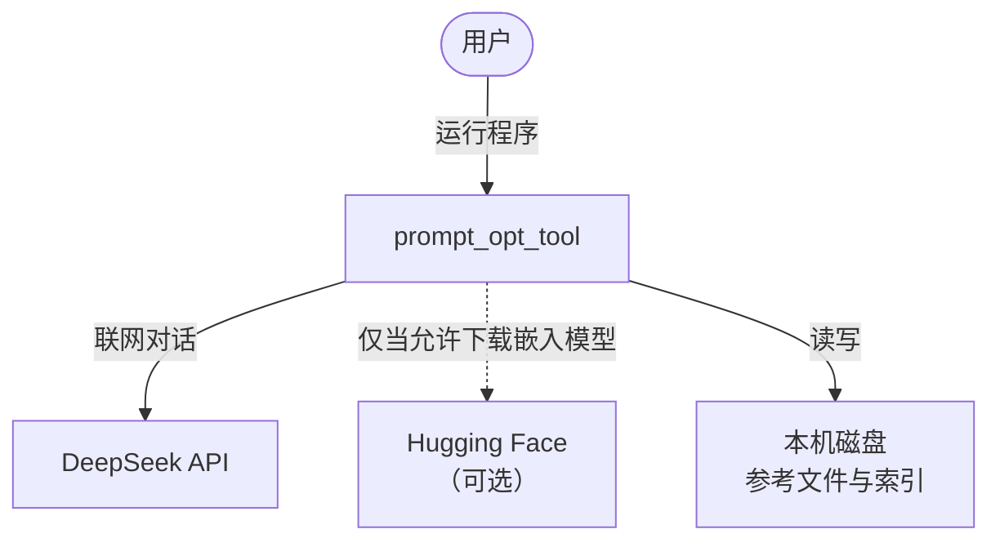
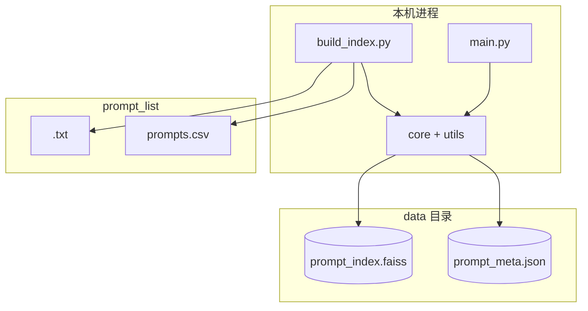
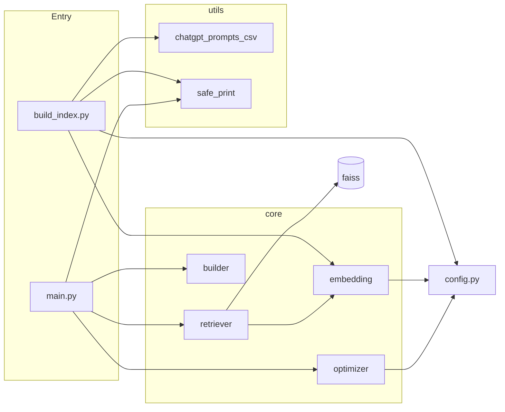
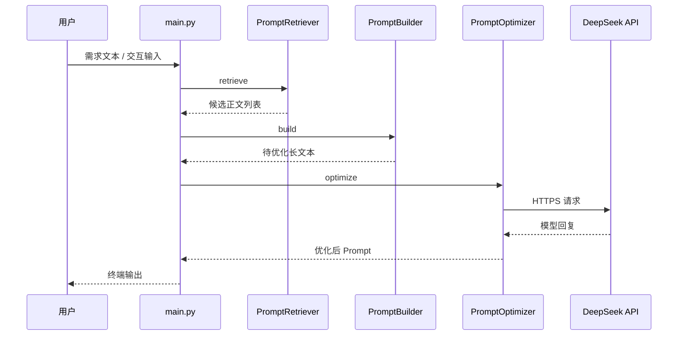
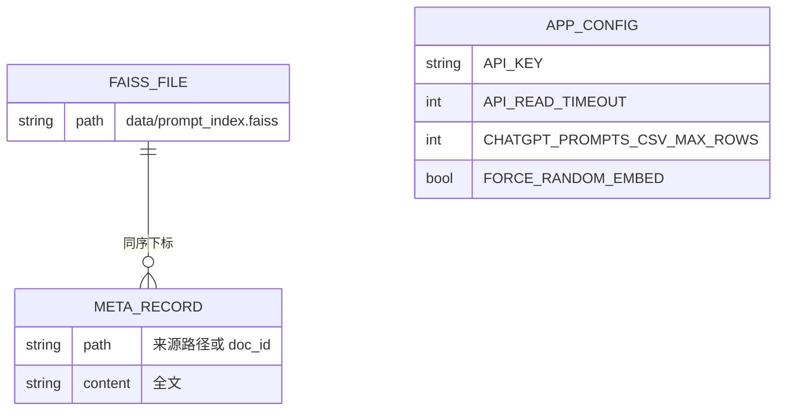
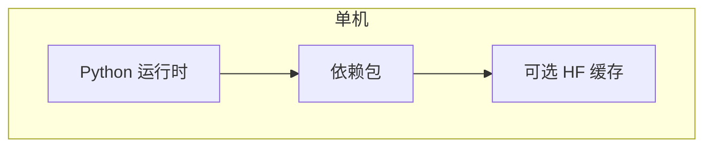

<!--
  文档性质说明（符合 ISO/IEC 12207、ISO/IEC/IEEE 15289 对「信息项」的常见约定）：
  - 封面与第 0～5 章、第 7～15 章：规范性（描述本系统架构基线与追溯关系）。
  - 第 6 章「执行摘要」、附录 A～C：资料性（便于非技术读者理解，不替代实现细节）。
-->

# 软件架构说明（Architecture Description）

## 0 文档控制信息

| 信息项 | 内容 |
|--------|------|
| **文档标识** | SAD-prompt_opt_tool |
| **标题** | Prompt 优化助手 — 软件架构说明 |
| **版本** | 2.0 |
| **发布日期** | 2026-03-26 |
| **状态** | 受控稿（Controlled） |
| **系统名称** | prompt_opt_tool |
| **存储位置** | `design/01-软件架构说明-SAD.md` |

### 0.1 编制、审核与批准（模板）

| 角色 | 姓名 | 日期 | 签署 |
|------|------|------|------|
| 编制 | | | |
| 审核 | | | |
| 批准 | | | |

### 0.2 修订历史

| 版本 | 日期 | 修订说明 | 作者 |
|------|------|----------|------|
| 1.0 | 2026-03-26 | 初版架构视图与 ADR | — |
| 2.0 | 2026-03-26 | 强化 ISO 信息项结构、全源码追溯矩阵、非技术导读 | — |

### 0.3 规范性引用文件

下列文件对于本文件的应用必不可少。凡注明日期的引用，仅该日期对应版本适用；未注明日期的，以最新版本为准。

| 编号 | 标准 / 文件 |
|------|----------------|
| REF-1 | ISO/IEC/IEEE 42010:2011，*Systems and software engineering — Architecture description* |
| REF-2 | ISO/IEC/IEEE 15289:2019，*Systems and software engineering — Content of life-cycle information items* |
| REF-3 | ISO/IEC 12207:2017，*Systems and software engineering — Software life cycle processes* |

### 0.4 如何使用本文档（读者指引）

| 读者类型 | 建议阅读顺序 |
|----------|----------------|
| **管理者、产品、业务方** | 先读 **第 6 章 执行摘要** → **附录 A 白话词汇表** → 浏览第 7～11 章各节开头的「非技术导读」→ 需要时再看图。 |
| **架构师、开发、测试** | 通读第 1～5 章 → 第 7～15 章全部视图与决策 → **第 16 章 源代码追溯矩阵** → 附录 B 插图索引。 |
| **运维与安全** | 第 5 章术语 → 第 10 章质量属性 → 第 11 章 ADR → 第 16 章中与 `config`、外部 API 相关的行。 |

---

## 1 引言（规范性）

### 1.1 目的

依据 REF-1，建立本系统的**架构说明（Architecture Description）**：识别利益相关方及其关注点，通过多视点、多视图描述系统结构，并记录架构决策与视图间对应关系，作为实现、验证与演进的共同依据。

### 1.2 范围

| 类别 | 说明 |
|------|------|
| **包含** | 本仓库内由项目方维护的交付软件：`main.py`、`build_index.py`、`config.py`、`core/`、`utils/` 中与索引/检索/优化相关的模块；产物 `data/prompt_index.faiss`、`data/prompt_meta.json`；自动化测试 `tests/`。 |
| **不包含** | Git 子模块 `prompt_list/awesome-chatgpt-prompts/` 内部产品实现细节；DeepSeek、Hugging Face 等外部服务内部架构。 |
| **边界说明** | 根目录下 `debug_embed.py`、`test_chat.py`、`test_embed.py` 为**手工探针脚本**，**不属于**正式交付运行路径，架构上视为「开发辅助工件」。`core/cache.py`、`utils/file_loader.py` 当前**未被** `main.py` / `build_index.py` 引用，列为**未接入构件**（见第 16 章）。 |

### 1.3 架构说明与生命周期信息项的关系（规范性）

依据 REF-2、REF-3，本架构说明对应生命周期中的**系统/软件架构信息项**，与《详细设计说明》（`02-详细设计说明-DDS.md`）构成**粗粒度（架构）→ 细粒度（详细设计）**的分解关系；验证活动（测试用例）在 DDS 中追溯至单元与接口。

---

## 2 缩略语与术语（规范性）

| 术语 / 缩略语 | 定义 |
|---------------|------|
| AD | Architecture Description，架构说明（REF-1） |
| ADR | Architecture Decision Record，架构决策记录 |
| API | 应用程序接口；本项目中特指 HTTPS 上的 Chat Completions 调用 |
| CLI | 命令行界面 |
| FAISS | 向量相似检索库；本项目使用 `IndexFlatL2` |
| 嵌入（Embedding） | 将文本变为固定长度数值向量，用于「意思相近」的近似比较 |
| 参考库 | 所有被编入索引的文本条目（`.txt` 与 CSV 行展开后的正文） |
| 元数据（Meta） | `prompt_meta.json` 中与每个向量一一对应的 `path`、`content` |

> **非技术导读**：可以把「嵌入」理解成**给每段话打一个指纹编号**；编号相近的话，系统认为**用途或说法相近**，就会把那段旧话当作参考，交给云端大模型帮你**改写成更清楚的新指令**。

---

## 3 系统上下文与目标（规范性）

本系统支持用户用**自然语言**描述任务；系统在**本地**从参考库中挑出若干条相似示例，再调用**大模型服务**生成一条更结构化、便于工程使用的 **Prompt（指令）**。

---

## 4 利益相关方与架构关注点（规范性）

REF-1 要求识别利益相关方及其对架构的**关注点（Concerns）**。下表为映射。

| 利益相关方 | 关注点 ID | 关注点描述 | 主要承载视图 |
|------------|-----------|------------|--------------|
| 终端用户 | C-01 | 输入方式简单、等待时间可接受、结果可读 | 进程视图、质量属性 |
| 开发维护 | C-02 | 模块边界清晰、便于修改与测试 | 构件视图、第 16 章追溯矩阵 |
| 运维 / 安全 | C-03 | 密钥与超时可配置、故障可诊断 | 上下文视图、数据视图、ADR |
| 合规 | C-04 | 第三方数据许可遵从 | 范围、上下文（子模块） |

---

## 5 架构视点与视图（规范性）

REF-1 采用**视点（Viewpoint）**与**视图（View）**：视点定义观察角度，视图是该角度下的具体模型。下述各视图前有简短**非技术导读**（资料性辅助，不缩小规范性条文的范围）。

### 5.1 视点 VP-1：系统环境（上下文视图）

**非技术导读**：这张图回答「**我们和谁打交道**」——您、电脑里的文件、可选的模型下载网站、以及网上的 DeepSeek 服务。

### 5.2 视点 VP-2：运行时容器（逻辑部署）

**非技术导读**：**两条路**共用同一套「如何把话变成数字」的规则：**建索引**像**编目录**（可离线慢慢跑）；**主程序**像**查目录 + 请人润色**（需要联网调 API）。

### 5.3 视点 VP-3：构件（开发结构）

**非技术导读**：把软件拆成几块「责任田」：**找相似**、**拼信件**、**发信给大模型**、**读表格**，各管一段。

### 5.4 视点 VP-4：进程（主路径交互）

**非技术导读**：您一句话进去，机器先在**本地索引**里找几段像样的话，**拼成一封说明信**，再发给 **DeepSeek**，把回信显示给您。

### 5.5 视点 VP-5：数据与配置

**非技术导读**：**索引文件**像**图书馆检索卡**；**JSON** 记着每张卡对应**哪段原文**；**config** 里是**钥匙、超时、是否全量读 CSV** 等开关。

### 5.6 视点 VP-6：部署（物理）

**非技术导读**：默认就是**一台电脑**装好 Python 和依赖；模型文件要么早就缓存好了，要么按配置允许上网拉取。

---

## 6 执行摘要（资料性）

> 本章供**非技术读者**快速建立共同语境，**不构成**对实现行为的规范性约束；实现细节以第 5、16 章及《详细设计说明》为准。

**本系统是做什么的？**  
帮助您把「我想让 AI 帮我办一件事」这种说法，变成**角色清楚、步骤清楚、输出格式清楚**的一条专业 **Prompt**。

**怎么做到的？（四步白话）**

1. **准备参考书**：把您提供的 `.txt` 和社区整理的 `prompts.csv` 里的范例，做成**本地检索库**（需先运行建索引程序）。  
2. **您描述需求**：用日常语言写下任务。  
3. **本地找相似范例**：系统在参考书里挑出最相近的几段，**不**把整本书发给模型，只发**少量精选**。  
4. **云端润色**：把「您的需求 + 精选范例」发给 **DeepSeek**，请它输出**最终可用的一条 Prompt**。

**您需要知道的风险与成本**

- 调云端 API 会产生**费用与网络依赖**（由 DeepSeek 账户策略决定）。  
- **API 密钥**属于敏感信息，应通过公司安全规范保管；**不应**在公开仓库明文存放。  
- 若使用「随机向量」模式，本地相似检索**不可靠**，仅适合演示流水线。

---

## 7 架构决策记录 ADR（规范性）

| ADR-ID | 决策 | 状态 | 简要依据 |
|--------|------|------|----------|
| ADR-01 | 使用 FAISS `IndexFlatL2` 本地检索 | 生效 | 无训练、实现直接、规模可控 |
| ADR-02 | 默认句子嵌入模型 `all-MiniLM-L6-v2`（384 维） | 生效 | 体积与效果平衡；与 Flat 索引维度一致 |
| ADR-03 | 运行参数集中于 `config.py` | 生效 | 可重复、易审计 |
| ADR-04 | `awesome-chatgpt-prompts` 以 Git 子模块引入 | 生效 | 版本可钉扎、与上游解耦 |
| ADR-05 | 嵌入支持随机向量回退 | 生效 | 离线或缺模型时仍可跑通（检索语义降级） |
| ADR-06 | Windows 控制台输出经 `safe_print` | 生效 | 规避 GBK 下 Unicode 崩溃 |

---

## 8 质量属性与架构措施（规范性）

| 质量属性 | 说明 | 架构 / 实现措施 |
|----------|------|-----------------|
| 可用性 | 用户能完成端到端任务 | CLI 双模式（参数 / `-i`）；分步进度提示 |
| 性能 | 可接受的响应时间 | 在线路径仅 1 次查询嵌入 + Top-K；建索引离线批量 |
| 可靠性 | 网络波动下可理解失败 | 超时、重试、错误字符串（见 DDS） |
| 可维护性 | 修改局部不影响全局 | 检索 / 拼装 / API 分层；配置单文件 |
| 可测试性 | 可自动化验证 | `tests/` 对 CLI、Builder、Retriever、CSV 做 Mock 或临时文件测试 |
| 安全性 | 密钥与数据暴露可控 | 密钥配置与代码分离（策略由组织规定）；索引仅存本地 |

---

## 9 视图对应关系 Correspondence（规范性）

REF-1 要求说明多视图之间的一致性。

| 视图 | 与其他视图的对应关系 |
|------|----------------------|
| 上下文 | 容器视图中的 `main` / `build_index` 实现与 DeepSeek、文件系统、可选 HF 的交互。 |
| 容器 | 构件视图中 `core` + `utils` 填充两个脚本的内部逻辑。 |
| 构件 | 进程视图的每个参与者映射到具体 Python 模块（见第 16 章矩阵）。 |
| 数据 | `data/` 下文件实现 VP-5 中的 FAISS 与 META 关系。 |

---

## 10 未决问题与后续演进（资料性）

| ID | 主题 | 说明 |
|----|------|------|
| O-01 | `config.EMBEDDING_API_KEY` | 当前代码未引用，保留字段；若未来改为 API 嵌入需更新 DDS。 |
| O-02 | `core/cache.py`、`utils/file_loader.py` | 未接入主路径；复用前需补充设计与测试。 |

---

## 11 源代码与架构元素追溯矩阵（规范性）

本矩阵实现**代码库全覆盖**：每个由项目维护的 `.py` 文件至少对应一行；满足「架构说明应能映射到实现」的评审要求。

| 源代码路径 | 架构角色 | 主路径 | 说明 | 对应视图 |
|------------|----------|--------|------|----------|
| `main.py` | 交付入口 | 是 | CLI 编排检索→拼装→优化 | VP-3、VP-4 |
| `build_index.py` | 批处理入口 | 是 | 汇聚、嵌入、写 FAISS/JSON | VP-2、VP-3 |
| `config.py` | 配置单 | 是 | API、超时、嵌入策略、CSV 上限 | VP-5 |
| `core/embedding.py` | 嵌入服务 | 是 | 模型 / 随机回退、`dimension` 探测 | VP-3、VP-5 |
| `core/retriever.py` | 检索服务 | 是 | `INDEX_PATH`/`META_PATH`、FAISS search | VP-3、VP-4、VP-5 |
| `core/builder.py` | 文本拼装 | 是 | 固定专家模板 | VP-3、VP-4 |
| `core/optimizer.py` | API 客户端 | 是 | Chat Completions、重试 | VP-1、VP-4 |
| `core/__init__.py` | 包标识 | 是 | 无业务逻辑 | VP-3 |
| `utils/chatgpt_prompts_csv.py` | CSV 适配 | 是 | 大字段、`iter`/`load` | VP-3 |
| `utils/safe_print.py` | I/O 适配 | 是 | Windows 编码安全打印 | ADR-06 |
| `utils/__init__.py` | 包标识 | 是 | 无业务逻辑 | VP-3 |
| `utils/file_loader.py` | 遗留工具 | **否** | `load_all_prompts` 未被主路径调用 | O-02 |
| `core/cache.py` | 内存缓存 | **否** | 未被主路径调用 | O-02 |
| `tests/test_cli.py` | 验证 | — | Mock 主流程 | 质量-可测试性 |
| `tests/test_builder.py` | 验证 | — | `PromptBuilder` | 质量-可测试性 |
| `tests/test_retriever.py` | 验证 | — | `PromptRetriever` | 质量-可测试性 |
| `tests/test_chatgpt_prompts_csv.py` | 验证 | — | CSV 解析与边界 | 质量-可测试性 |
| `debug_embed.py` | 开发探针 | **否** | 手工试 API，非产品 | 范围外工件 |
| `test_chat.py` | 开发探针 | **否** | 手工试 Chat | 范围外工件 |
| `test_embed.py` | 开发探针 | **否** | 手工试 Embeddings | 范围外工件 |

**依赖包（非源码，架构相关）**：`requirements.txt` 列出 `requests`、`faiss-cpu`、`numpy`、`sentence-transformers`；`huggingface_hub` 为嵌入模块可选探测路径的传递依赖。

---

## 附录 A 白话词汇表（资料性）

| 技术说法 | 可以这样想 |
|----------|------------|
| 建索引 | 把参考书「做成可搜索的目录」，耗时可较长，做一次即可（资料更新后重做）。 |
| Top-K | 「最相近的前 K 条」；K 默认 3，可在命令行调整。 |
| 向量 / 嵌入 | 把文字变成一串数字，用来比「像不像」。 |
| FAISS | 在大量数字串里**快速找最近邻**的工具库。 |
| Mock（测试） | 用「假零件」代替真网络、真索引，检查程序逻辑是否接对。 |

---

## 附录 B Mermaid 插图索引（资料性）

| 图号 | 位置 | 类型 |
|------|------|------|
| 图 B-1 | §5.1 | 上下文 flowchart |
| 图 B-2 | §5.2 | 容器 flowchart |
| 图 B-3 | §5.3 | 构件 flowchart |
| 图 B-4 | §5.4 | 主序列 sequenceDiagram |
| 图 B-5 | §5.5 | 数据 erDiagram |
| 图 B-6 | §5.6 | 部署 flowchart |

---

## 附录 C 与 ISO/IEC/IEEE 42010 条款的对照（资料性）

| REF-1 概念 | 本文档位置 |
|------------|------------|
| 识别利益相关方与关注点 | §4 |
| 架构视点与视图 | §5 |
| 架构决策与原理 | §7（ADR） |
| 视图间对应关系 | §9 |
| 架构说明与系统关系 | §1.3、§3 |

（本附录用于**符合性自查**，不作为认证唯一依据。）
