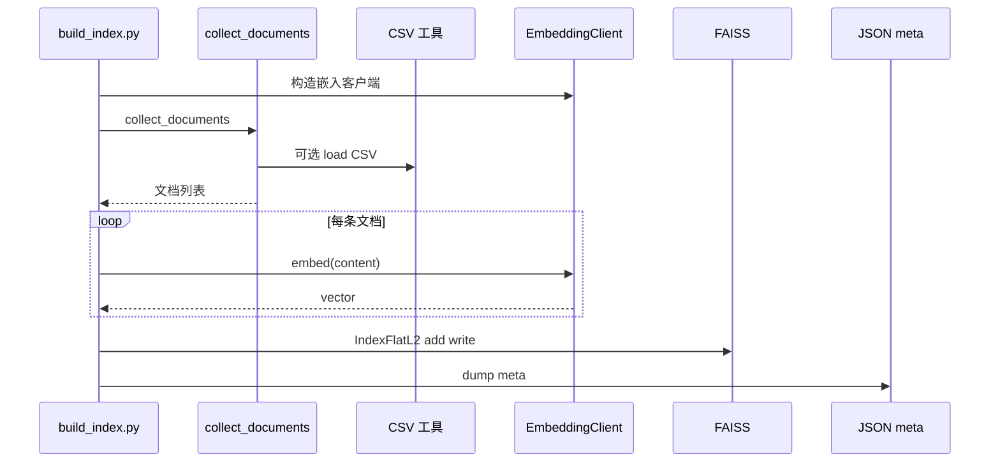

<!--
  规范性：第 0～4、6～12、14 章 — 规定软件单元、接口与追溯，供实现与验证对照。
  资料性：第 5 章执行摘要、附录 A～D — 便于非技术读者理解；不缩小规范性章节义务。
-->

# 软件详细设计说明（Detailed Design Specification）

## 0 文档控制信息

| 信息项 | 内容 |
|--------|------|
| **文档标识** | DDS-prompt_opt_tool |
| **标题** | Prompt 优化助手 — 软件详细设计说明 |
| **版本** | 2.0 |
| **发布日期** | 2026-03-26 |
| **状态** | 受控稿（Controlled） |
| **对应架构说明** | `design/01-软件架构说明-SAD.md`（版本 2.0） |
| **存储位置** | `design/02-详细设计说明-DDS.md` |
使用 FAISS IndexFlatL2 本地检索
### 0.1 编制、审核与批准（模板）

| 角色 | 姓名 | 日期 | 签署 |
|------|------|------|------|
| 编制 | | | |
| 审核 | | | |
| 批准 | | | |

### 0.2 修订历史

| 版本 | 日期 | 修订说明 | 作者 |
|------|------|----------|------|
| 1.0 | 2026-03-26 | 初版单元与接口 | — |
| 2.0 | 2026-03-26 | ISO 信息项结构、全源码覆盖、测试追溯矩阵、非技术导读 | — |

### 0.3 规范性引用文件

| 编号 | 标准 / 文件 |
|------|----------------|
| REF-1 | ISO/IEC/IEEE 15289:2019（软件详细设计相关信息项） |
| REF-2 | ISO/IEC 12207:2017（实现与验证过程与信息项衔接） |
| REF-3 | ISO/IEC/IEEE 42010:2011（详细设计与架构说明的对应关系） |
| REF-4 | 本项目《软件架构说明》`01-软件架构说明-SAD.md` v2.0 |

### 0.4 读者指引

| 读者 | 阅读建议 |
|------|----------|
| **非技术** | **第 5 章** → **附录 A** → 需要时看各章「非技术导读」框。 |
| **开发** | 第 1～4、6～12、14 章全文；实现时对照 **§11 源代码追溯矩阵**。 |
| **测试** | **§12** 测试用例与单元映射；**§8** 错误与可见输出。 |

---

## 1 引言（规范性）

### 1.1 目的

在 REF-4 规定的架构边界内，细化到**软件单元**级别：标识单元、规定接口与行为、描述数据与算法步骤，使实现与**自动化测试**可逐条对照验证。

### 1.2 范围

| 包含 | 不包含 |
|------|--------|
| `main.py`、`build_index.py`、`config.py` | 子模块内第三方业务代码 |
| `core/*.py`、`utils/chatgpt_prompts_csv.py`、`utils/safe_print.py` | DeepSeek / HF 服务端实现 |
| `tests/*.py`（验证规格） | `debug_embed.py`、`test_chat.py`、`test_embed.py` 的**产品设计**（仅 §11 标注为探针） |

### 1.3 与架构说明的追溯

| DDS 章节 | SAD 对应 |
|----------|----------|
| §6 单元标识 | SAD §5.3、§11 |
| §7～8 接口与行为 | SAD §5.4、§5.5 |
| §9 持久化 | SAD §5.5 |
| §10 批处理序列 | SAD §5.2 |
| §12 测试 | SAD §8 |

---

## 2 设计约束与假设（规范性）

### 2.1 环境与依赖

- **语言**：Python 3.12+（与当前验证环境一致）。  
- **声明式依赖**：`requirements.txt` → `requests`、`faiss-cpu`、`numpy`、`sentence-transformers`。  
- **传递依赖**：`sentence-transformers` 可能引入 `huggingface_hub`、`torch` 等；`core/embedding.py` 使用 `huggingface_hub.try_to_load_from_cache`（可选路径）。

### 2.2 设计约束

- **DC-01**：`build_index.py` 与 `main.py` 必须使用**相同** `EmbeddingClient` 策略（同一 `config`），否则检索无效。  
- **DC-02**：`PromptRetriever` 依赖固定相对路径常量 `INDEX_PATH`、`META_PATH`（见 §7.2）。  
- **DC-03**：文档与示例**禁止**写入生产环境 API 密钥；探针脚本须使用占位符。

### 2.3 假设

- 运行 `main.py` 前已生成 `data/prompt_index.faiss` 与 `data/prompt_meta.json`。  
- 参考源至少满足其一：`prompt_list` 下存在非空 `.txt`，或存在可解析的 `prompts.csv`（见 `build_index.py` 异常文案）。

---

## 3 配置项规格 `config.py`（规范性）

> **非技术导读**：这一份文件像**控制面板**：填 API 钥匙、等多久算超时、要不要下载模型、CSV 读多少行。

| 标识符 | 类型（逻辑） | 用途 | 被引用单元 |
|--------|----------------|------|------------|
| `API_KEY` | 字符串 | Bearer 令牌 | `PromptOptimizer` |
| `BASE_URL` | 字符串 | Chat API 根 URL，拼接 `/chat/completions` | `PromptOptimizer` |
| `EMBEDDING_API_KEY` | 字符串 | 与 `API_KEY` 同值 | **当前未使用**（SAD O-01） |
| `API_CONNECT_TIMEOUT` | 整数秒 | 连接超时 | `PromptOptimizer` |
| `API_READ_TIMEOUT` | 整数秒 | 读取超时 | `PromptOptimizer` |
| `API_RETRY_COUNT` | 整数 | 失败重试次数（不含首次） | `PromptOptimizer` |
| `FORCE_RANDOM_EMBED` | 布尔 | 为真则始终随机向量 | `EmbeddingClient` |
| `ALLOW_DOWNLOAD_EMBED_MODEL` | 布尔 | 无本地缓存时是否允许联网拉模型 | `EmbeddingClient` |
| `CHATGPT_PROMPTS_CSV_MAX_ROWS` | 整数 | `≤0` 表示不限制；`>0` 仅读前 N 行 | `build_index._collect_chatgpt_csv_items` |

---

## 4 外部可见行为：命令行 `main.py`（规范性）

> **非技术导读**：您平时用的就是这一条命令；程序会分四步在屏幕上**打字提示进度**，最后打印**优化后的 Prompt**。

### 4.1 命令行参数

| 参数 | 含义 | 默认 |
|------|------|------|
| `prompt` | 位置参数，用户任务描述 | 无（与 `-i` 二选一） |
| `-i` / `--interactive` | 交互输入 | 关闭 |
| `-k` / `--topk` | 检索条数 K | `3` |
| `-v` / `--verbose` | 打印候选摘要（截断） | 关闭 |

### 4.2 行为序列

1. 解析参数；若交互模式则 `input()` 读入。  
2. 若最终字符串为空，打印 `[错误] Prompt不能为空` 并 **return**（退出码由解释器默认）。  
3. `_progress` 四步文案；实例化 `PromptRetriever`、`PromptBuilder`、`PromptOptimizer`。  
4. `retrieve` → `build` → `optimize`；结果经 `safe_print` 输出。

### 4.3 可见输出约定

- 成功：含 `[OK] 优化后的Prompt：` 及正文。  
- 检索前失败：`FileNotFoundError`（未建索引）由 Python 默认栈追踪输出。

---

## 5 执行摘要（资料性）

**给业务方的一句话**：详细设计规定**每个程序文件管什么、怎么接在一起、出错时用户看到什么**；**测试文件**对应检查这些规定是否成立。

**与架构说明的分工**：架构说明回答「**分几块、和谁联网**」；本文档回答「**每块里有哪些函数、输入输出是什么、磁盘上文件长什么样**」。

---

## 6 软件单元标识与职责（规范性）

### 6.1 交付单元总表

| 单元 ID | 名称 | 路径 | 职责 |
|---------|------|------|------|
| U-01 | 主程序 | `main.py` | CLI、编排 |
| U-02 | 索引构建 | `build_index.py` | 汇聚、嵌入、写盘 |
| U-03 | 配置 | `config.py` | 全局常量 |
| U-04 | 嵌入客户端 | `core/embedding.py` | `EmbeddingClient` |
| U-05 | 检索器 | `core/retriever.py` | `PromptRetriever` |
| U-06 | 拼装器 | `core/builder.py` | `PromptBuilder` |
| U-07 | 优化器 | `core/optimizer.py` | `PromptOptimizer` |
| U-08 | CSV 工具 | `utils/chatgpt_prompts_csv.py` | 解析 `prompts.csv` |
| U-09 | 安全打印 | `utils/safe_print.py` | `safe_print` |

### 6.2 非交付 / 未接入单元（规范性说明）

| 路径 | 状态 | 说明 |
|------|------|------|
| `core/cache.py` | 未接入 | 进程内 dict 缓存，**无**调用方 |
| `utils/file_loader.py` | 未接入 | `load_all_prompts`，**无**调用方 |
| `debug_embed.py`、`test_chat.py`、`test_embed.py` | 探针 | 人工连通性试验，**非** `pytest` 范围 |

---

## 7 单元详细设计 — 接口与内部逻辑（规范性）

### 7.1 `build_index.py`

> **非技术导读**：把文件夹里的 `.txt` 和表格里的范例**统统过一遍秤**（变成数字），再**写进两个文件**备查。

**模块级常量**：`PROMPT_DIR`、`CHATGPT_PROMPTS_DIR`、`CHATGPT_CSV_NAME`、`OUTPUT_INDEX`、`OUTPUT_META`。

| 函数 / 段 | 规格 |
|-----------|------|
| `_p(msg)` | 调用 `safe_print(msg, flush=True)` |
| `_collect_chatgpt_csv_items()` | 若 CSV 不存在返回 `[]`；否则 `load_chatgpt_prompts_csv_as_list`，`max_rows` 由 `CHATGPT_PROMPTS_CSV_MAX_ROWS` 推导；打印统计日志 |
| `collect_documents()` | `os.walk(PROMPT_DIR)`，跳过 `.git`、`.github`、`__pycache__`；收集 `.txt` 非空内容；extend CSV 项；返回 `list[tuple[path, content]]` |
| `_should_log_embed_step(i, total)` | 控制进度日志密度 |
| 脚本主体 | 初始化 `EmbeddingClient`；若文档为空抛 `Exception`（固定多行中文说明）；循环 `embed`；`IndexFlatL2` + `add` + `write_index`；`json.dump(meta)` |

**元数据项结构**：`{"path": str, "content": str}`，与向量行序一致。

### 7.2 `core/retriever.py`

| 项 | 值 |
|----|-----|
| `INDEX_PATH` | `"data/prompt_index.faiss"` |
| `META_PATH` | `"data/prompt_meta.json"` |

| 类 / 方法 | 规格 |
|-----------|------|
| `PromptRetriever.__init__` | 若索引文件不存在抛 `FileNotFoundError`；`faiss.read_index`；`json.load` 列表到 `self.meta`；构造 `EmbeddingClient` |
| `retrieve(query, topk=3)` | `embed(query)` → `np.array` shape `(1,dim)` float32；`index.search`；仅保留 `0 <= idx < len(meta)` 的 `meta[idx]["content"]` |

### 7.3 `core/builder.py`

| 方法 | 规格 |
|------|------|
| `build(user_prompt, candidates)` | 无候选时 `candidate_text = "（无可用参考prompt）"`；否则 `"\n\n====\n\n".join(candidates)`；返回固定中文专家模板包裹的字符串 |

### 7.4 `core/optimizer.py`

| 方法 | 规格 |
|------|------|
| `optimize(prompt)` | 校验 `API_KEY` 非空且前缀 `sk-`；`POST {BASE_URL.rstrip("/")}/chat/completions`（与 `config.BASE_URL` 常见取值 `https://api.deepseek.com/v1` 组合为 `.../v1/chat/completions`）；`model: deepseek-chat`，`temperature: 0.2`；成功返回 `choices[0].message.content`；HTTP 非 200 返回 `[ERROR] API错误: ...`；`RequestsTimeout`/`ConnectionError` 重试，退避 `min(2**attempt, 30)`；其他异常单次失败；最终返回 `[ERROR]` 多行提示 |

### 7.5 `core/embedding.py`

> **非技术导读**：优先用**小语言模型**在本地把话变成数字；不行就按规则**假装**成数字（随机但同一句话每次一样），方便演示。

| 类 / 成员 | 规格 |
|-----------|------|
| `EmbeddingClient.__init__(model_name="all-MiniLM-L6-v2", use_random_fallback=True)` | 见配置分支：强制随机 / 缺库随机 / 本地 `local_files_only=True` / 允许下载时再在线加载 / 失败回退 |
| `_sentence_transformer_repo_id` | 无 `/` 时加前缀 `sentence-transformers/` |
| `_has_local_hf_snapshot` | `try_to_load_from_cache(..., "config.json")` |
| `embed(text)` | 空文本 `ValueError`；随机模式：MD5 种子 → `RandomState` → `randn(dimension)`；否则 `model.encode(..., show_progress_bar=False)` 返回 list |

### 7.6 `utils/chatgpt_prompts_csv.py`

| 项 | 规格 |
|----|------|
| `SOURCE_URL` / `SOURCE_LABEL` | 文档字符串常量，写入生成正文 |
| `_bump_csv_field_size_limit()` | 提升 `csv.field_size_limit` 以支持超大 `prompt` 字段 |
| `iter_chatgpt_prompts_csv(csv_path, max_rows=None)` | `DictReader`；`act`/`prompt` 列兼容大小写；空 `prompt` 跳过；产出 `(doc_id, body)` |
| `load_chatgpt_prompts_csv_as_list` | `list(iter_...)` |

### 7.7 `utils/safe_print.py`

| 函数 | 规格 |
|------|------|
| `safe_print(msg, *, flush=True)` | 先 `print`；`UnicodeEncodeError` 时用 stdout 编码 `errors="replace"` 再打印 |

---

## 8 错误、日志与用户可见消息（规范性）

| 场景 | 单元 | 行为 |
|------|------|------|
| 空用户输入 | `main.py` | 打印 `[错误] Prompt不能为空`，return |
| 无索引文件 | `PromptRetriever.__init__` | `FileNotFoundError` 与指引文案 |
| 无文档可索引 | `build_index.py` | `Exception`，多行中文说明 |
| API 密钥缺失或格式 | `PromptOptimizer` | 返回 `[ERROR] ...` 字符串 |
| HTTP 错误 / 超时 | `PromptOptimizer` | 返回 `[ERROR] ...` 或重试 |
| 嵌入空字符串 | `EmbeddingClient.embed` | `ValueError` |

---

## 9 持久化与数据格式（规范性）

| 文件 | 格式 | 说明 |
|------|------|------|
| `data/prompt_index.faiss` | FAISS 二进制 | `IndexFlatL2`，L2 距离 |
| `data/prompt_meta.json` | UTF-8 JSON 数组 | 与 FAISS 行号一一对应 |

---

## 10 批处理序列：建索引（规范性）

---

## 11 源代码全覆盖追溯矩阵（规范性）

本表要求：**仓库内每个由项目编写的 `.py` 文件**均有明确归属；与 SAD §11 一致并补充**函数级**说明。

| 文件 | 单元 ID | 对外符号 / 要点 |
|------|---------|-----------------|
| `main.py` | U-01 | `main`, `_progress` |
| `build_index.py` | U-02 | `collect_documents`, `_collect_chatgpt_csv_items`, `_should_log_embed_step`, 模块级脚本 |
| `config.py` | U-03 | 见 §3 |
| `core/embedding.py` | U-04 | `EmbeddingClient`, 模块内辅助函数 |
| `core/retriever.py` | U-05 | `PromptRetriever`, `INDEX_PATH`, `META_PATH` |
| `core/builder.py` | U-06 | `PromptBuilder.build` |
| `core/optimizer.py` | U-07 | `PromptOptimizer.optimize` |
| `core/cache.py` | — | `get`/`set`/`get_cache_key`，未接入 |
| `core/__init__.py` | — | 包初始化 |
| `utils/chatgpt_prompts_csv.py` | U-08 | `iter_*`, `load_*`, `_bump_*`, `SOURCE_*` |
| `utils/safe_print.py` | U-09 | `safe_print` |
| `utils/file_loader.py` | — | `load_all_prompts`，未接入 |
| `utils/__init__.py` | — | 包初始化 |
| `tests/test_cli.py` | — | 见 §12 |
| `tests/test_builder.py` | — | 见 §12 |
| `tests/test_retriever.py` | — | 见 §12 |
| `tests/test_chatgpt_prompts_csv.py` | — | 见 §12 |
| `debug_embed.py` | — | 探针，非产品 |
| `test_chat.py` | — | 探针，非产品 |
| `test_embed.py` | — | 探针，非产品 |

---

## 12 测试规格与用例追溯（规范性）

> **非技术导读**：下面这张表说明「**自动测试覆盖了哪些文件**」；跑通测试表示**主流程和关键零件**按设计工作，**不**保证联网 API 一定成功（API 是用假替身测的）。

| 测试文件 | 验证对象 | 主要断言 / 行为 |
|----------|----------|-----------------|
| `tests/test_cli.py` | `main.main` | Mock `PromptRetriever`/`Builder`/`Optimizer`/`faiss`/`json`；参数模式 `retrieve(..., topk=3)`；交互模式 `-i`；输出含「优化后的Prompt」 |
| `tests/test_builder.py` | `PromptBuilder.build` | 无候选含「（无可用参考prompt）」；有候选含 `====` 与参考文本 |
| `tests/test_retriever.py` | `PromptRetriever.retrieve` | Mock FAISS search 返回索引 0,1；meta 三条；结果长度与 content |
| `tests/test_chatgpt_prompts_csv.py` | CSV 解析 | 多行引号字段、`max_rows`、空 prompt 跳过 |

**测试命令**：`python -m pytest tests/ -v`（预期 7 条通过，具体数量以仓库为准）。

**不在 pytest 范围内**：`debug_embed.py`、`test_chat.py`、`test_embed.py`。

---

## 13 需求 — 设计 — 测试追溯简表（规范性）

| 用户需求（摘要） | 设计承载 | 测试 |
|----------------|----------|------|
| 命令行优化 Prompt | U-01, U-05～U-07 | `test_cli.py` |
| 无参考时仍可拼装 | U-06 | `test_builder.py` |
| 本地相似检索 | U-04, U-05 | `test_retriever.py` |
| 社区 CSV 可导入 | U-02, U-08 | `test_chatgpt_prompts_csv.py` |

---

## 附录 A 非技术 FAQ（资料性）

**问：为什么要先运行建索引？**  
答：程序需要在您电脑里有一份「参考书目录」，检索是在这份目录上做，而不是每次把整个互联网扫一遍。

**问：测试里为什么能「假装」API 成功？**  
答：自动测试要**又快又稳定**，所以用假对象代替真网络；真 API 一般由您偶尔用手工探针脚本试。

**问：`config` 里的钥匙安全吗？**  
答：密钥应遵循公司政策；理想做法是密钥不进 Git、由安全渠道注入。**任何人拿到钥匙都可能产生费用**，需像保管密码一样保管。

---

## 附录 B 配置与命令速查（资料性）

| 目的 | 操作 |
|------|------|
| 限制 CSV 行数试跑 | `CHATGPT_PROMPTS_CSV_MAX_ROWS = 正整数` |
| 完全离线嵌入演示 | `FORCE_RANDOM_EMBED = True` |
| API 总读超时 | 增大 `API_READ_TIMEOUT` |

---

## 附录 C 与 ISO/IEC/IEEE 15289 信息项对照（资料性）

| 信息项意图（摘要） | 本文档章节 |
|--------------------|------------|
| 软件项设计说明 | §6～§11 |
| 接口与数据定义 | §7、§9 |
| 验证与测试相关追溯 | §12、§13 |

---

## 附录 D Mermaid 图目（资料性）

| 图号 | 章节 | 内容 |
|------|------|------|
| 图 D-1 | §10 | 建索引序列图 |
