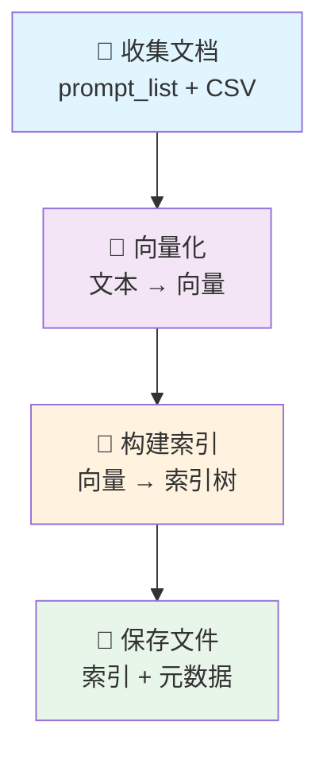
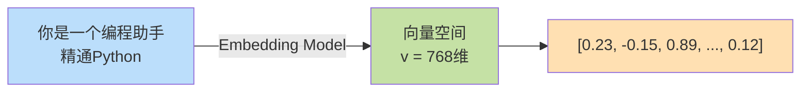
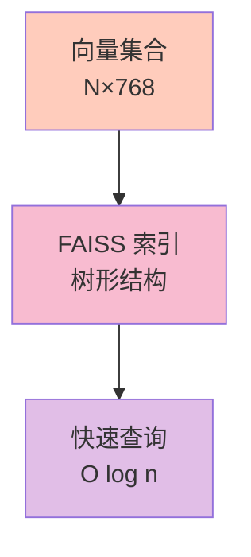
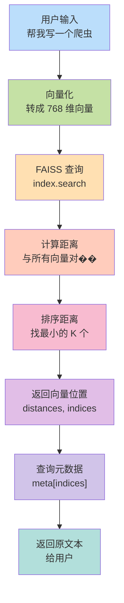
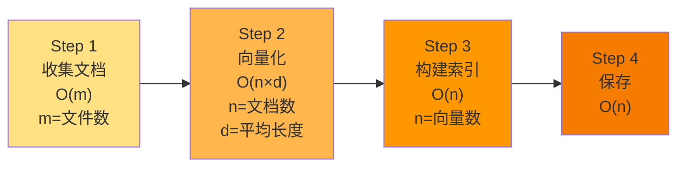
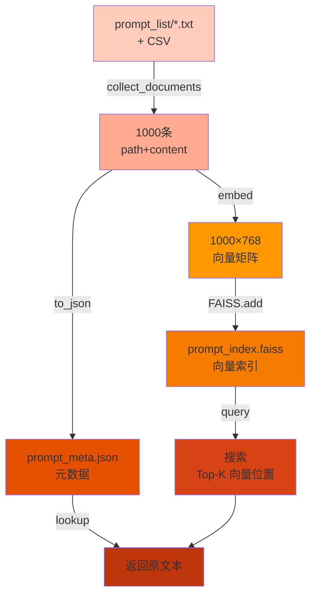
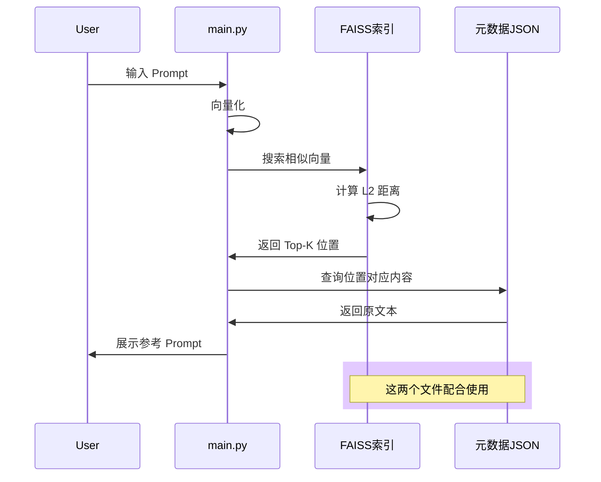
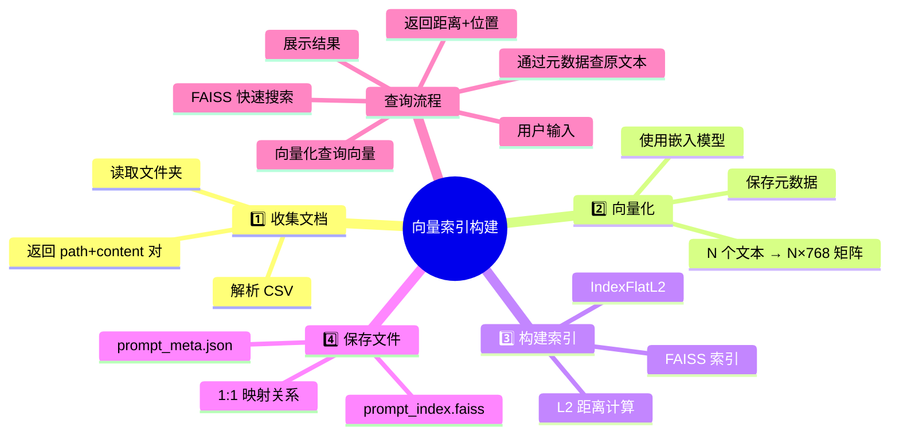

我为你创建一个完整的 Obsidian 笔记。让我先读取代码，然后生成详细的笔记。没关系，我直接为你创建一个**完整的 Obsidian 格式笔记**，包含详细的索引构建讲解和 Mermaid 图表：

```markdown
# Prompt 优化工具：向量索引构建详解

> 这份笔记记录了如何将数千个 Prompt 转换成可快速检索的向量索引

## 目录
- [[#核心概念]]
- [[#四步流程]]
- [[#FAISS 索引内部实现]]
- [[#快速匹配过程]]
- [[#代码实现详解]]

---

## 核心概念

### 什么是向量索引？

**定义**：将文本转换成数学向量，并通过数据结构优化快速查询的过程。

**类比**：
- 📚 **没有索引**：从图书馆 10000 本书中找相关的，逐本翻查（O(n)）
- 🎯 **有索引**：通过分类系统快速定位到相关书架（O(log n)）

### 关键概念速查表

| 概念 | 解释 | 例子 |
|------|------|------|
| **向量** | 文本的数学表示 | "你好" → [0.23, -0.15, 0.89, ..., 0.12]（768维） |
| **维度** | 向量中数字的个数 | 768、1536 等 |
| **欧几里得距离** | 两个向量的相似度 | 距离小 = 相似度高 |
| **索引树** | 加速查询的数据结构 | 二叉树、KD树 等 |
| **Top-K** | 返回最相似的K条结果 | Top-3 = 返回最相似的3条 |

---

## 四步流程

### 流程总览



---

## Step 1️⃣：收集文档

### 代码位置
`build_index.py` 第 42-58 行

### 代码实现

```python
def collect_documents() -> list[tuple[str, str]]:
    """收集所有待索引的文档
    
    返回值: [(路径1, 内容1), (路径2, 内容2), ...]
    """
    items: list[tuple[str, str]] = []
    
    # 递归遍历 prompt_list 文件夹
    for root, dirs, files in os.walk(PROMPT_DIR):
        # 跳过不需要的文件夹
        dirs[:] = [d for d in dirs if d not in (".git", ".github", "__pycache__")]
        
        for f in files:
            path = os.path.join(root, f)
            if f.endswith(".txt"):  # 只处理 .txt 文件
                with open(path, "r", encoding="utf-8") as fp:
                    content = fp.read().strip()
                if content:  # 跳过空文件
                    items.append((path, content))
    
    # 从 CSV 中加载额外的 Prompt
    items.extend(_collect_chatgpt_csv_items())
    return items
```

### 输出数据结构

```python
[
    ("prompt_list/dev/coding.txt", "你是一个精通Python的编程助手..."),
    ("prompt_list/creative/writer.txt", "你是一个富有创意的文案撰写者..."),
    ("awesome-chatgpt-prompts/xxx", "Act as a Linux Terminal..."),
    ...  # N 条数据
]
```

### 关键点
- ✅ 每条数据都是 **(路径, 文本内容)** 的元组对
- ✅ 路径用作唯一标识符（doc_id）
- ✅ 内容是后续要向量化的文本

---

## Step 2️⃣：向量化（Text → Vector）

### 代码位置
`build_index.py` 第 85-93 行

### 什么是向量化？



### 代码实现

```python
# 初始化嵌入模型
embedder = EmbeddingClient()

# 对每条文档进行向量化
vectors = []
meta = []

for i, (path, content) in enumerate(paths_to_embed, start=1):
    if _should_log_embed_step(i, total):
        _p(f"      ({i}/{total}) {path}")
    
    # 🔑 关键步骤：文本 → 向量
    vec = embedder.embed(content)  # 返回 768 维向量
    vectors.append(vec)
    
    # 同时保存原始信息（后续查询需要）
    meta.append({"path": path, "content": content})
```

### 输出数据结构

```python
# vectors: N × 768 的矩阵
vectors = np.array([
    [0.23, -0.15, 0.89, 0.45, ..., 0.12],    # Prompt 1 的向量
    [0.24, -0.14, 0.88, 0.46, ..., 0.13],    # Prompt 2 的向量
    [0.31, 0.45, -0.23, 0.12, ..., 0.05],    # Prompt 3 的向量
    ...
    [0.19, -0.22, 0.76, 0.38, ..., 0.11],    # Prompt N 的向量
], dtype='float32')
# Shape: (1000, 768)

# meta: 元数据列表
meta = [
    {"path": "xxx.txt", "content": "你是..."},
    {"path": "yyy.txt", "content": "你是..."},
    ...
]
```

### 关键点
- ✅ **维度不减少**：1 条文本 → 1 个 768 维向量
- ✅ **1:1 映射**：第 i 条文本的向量是 `vectors[i]`
- ✅ **相似度关系**：语义相近的文本，向量值也相近

### 向量相似度示例

```
文本1："你是一个编程助手"
向量1：[0.23, -0.15, 0.89, ...]

文本2："你是代码顾问"  
向量2：[0.24, -0.14, 0.88, ...]  ← 向量值非常接近

文本3："下雨天"
向量3：[-0.31, 0.67, -0.45, ...]  ← 向量值差异很大

结论：向量1 和 向量2 相似度高 ✓
     向量1 和 向量3 相似度低 ✗
```

---

## Step 3️⃣：构建 FAISS 索引（🌳 重点！）

### 代码位置
`build_index.py` 第 95-102 行

### 什么是 FAISS？

**FAISS** = Facebook AI Similarity Search（Meta 开发）

**核心功能**：对大量高维向量快速进行相似度查询



### 代码实现

```python
# 第96行：将列表转成 numpy 数组
vectors = np.array(vectors).astype("float32")
# 转换原因：FAISS 只接受 float32 格式

# 第98行：获取向量维度
dim = len(vectors[0])  # 通常是 768

# 第99行：创建索引
index = faiss.IndexFlatL2(dim)
# IndexFlatL2 = 使用 L2（欧几里得）距离的平面索引

# 第100行：添加所有向量到索引
index.add(vectors)
# 这一步是最关键的！FAISS 内部会构建数据结构

# 第102行：保存索引到磁盘
faiss.write_index(index, OUTPUT_INDEX)
```

### FAISS 内部实现深解

#### 🎯 IndexFlatL2 的构造过程


#### 📊 索引的内存布局

```
prompt_index.faiss 内部结构：

┌────────────────────────────────────────┐
│ Header (元数据)                        │
│ - 向量个数: 1000                      │
│ - 向量维度: 768                       │
│ - 索引类型: IndexFlatL2               │
└────────────────────────────────────────┘
         ↓
┌────────────────────────────────────────┐
│ 向量存储区                             │
│ 向量 0: [0.23, -0.15, ..., 0.12]    │
│ 向量 1: [0.24, -0.14, ..., 0.13]    │
│ 向量 2: [0.31, 0.45, ..., 0.05]     │
│ ...                                  │
│ 向量 999: [0.19, -0.22, ..., 0.11]  │
└────────────────────────────────────────┘
```

#### 🔍 L2 距离是什么？

```
L2 距离（欧几里得距离）

向量 A: [a1, a2, a3, ..., a768]
向量 B: [b1, b2, b3, ..., b768]

距离 = √[(a1-b1)² + (a2-b2)² + ... + (a768-b768)²]

特点：
- 距离越小 → 向量越相似
- 距离为 0 → 两个向量完全相同
- 用于 IndexFlatL2 中的相似度计算
```

#### 为什么叫 "Flat"？

```
名称解释：

IndexFlat = "平面索引"
- "Flat" 意为"平铺"
- 直接在内存中存储所有向量
- 没有复杂的树形或图形结构

查询时：
- 逐个计算待查询向量与所有向量的距离
- 返回距离最小的 K 个向量
- 时间复杂度：O(n × d)，其中 n=向量数，d=维度

vs 其他索引方式：

IndexIVF（反向索引）= 分桶快速定位（O(n/n_clusters)）
IndexHNSW（分层小世界）= 图形导航（O(log n)）
IndexFlatL2 最简单，但当向量数量很大时会很慢
```

### 核心输出

```python
index  # FAISS 索引对象
├─ 向量总数: 1000
├─ 向量维度: 768
└─ 查询方法: index.search(query_vec, k=3)
```

---

## Step 4️⃣：保存文件（元数据）

### 代码位置
`build_index.py` 第 104-105 行

### 代码实现

```python
# 将元数据保存为 JSON
with open(OUTPUT_META, "w", encoding="utf-8") as f:
    json.dump(meta, f, ensure_ascii=False, indent=2)

# 生成的文件结构：
```

### 输出文件内容

```json
[
  {
    "path": "prompt_list/dev/coding.txt",
    "content": "你是一个精通 Python 的编程助手。\n你的职责是：\n1. 回答编程问题\n..."
  },
  {
    "path": "prompt_list/creative/writer.txt",
    "content": "你是一个富有创意的文案撰写者。\n你的风格：\n- 创意十足\n..."
  },
  {
    "path": "awesome-chatgpt-prompts/linux",
    "content": "I want you to act as a linux terminal..."
  },
  ...
]
```

### 关键点
- ✅ **1:1 映射**：`meta[i]` 对应 `vectors[i]`
- ✅ **可读格式**：JSON 便于查看和调试
- ✅ **查询时需要**：索引返回位置，通过 meta 获取原文本

---

## 🚀 FAISS 快速匹配过程

### 完整查询流程



### 查询代码示例

```python
# 假设已加载索引
index = faiss.read_index("data/prompt_index.faiss")
meta = json.load(open("data/prompt_meta.json"))

# Step 1: 用户输入向量化
user_prompt = "帮我写一个网页爬虫"
query_vec = embedder.embed(user_prompt)  # → [0.21, 0.34, -0.15, ...]

# Step 2: FAISS 快速搜索
# search(query, k) 返回：
# - distances: k 个距离��
# - indices: k 个向量位置
distances, indices = index.search(
    np.array([query_vec], dtype='float32'),  # query_vec 必须是二维
    k=3  # 返回最相似的 3 条
)

# 返回结果：
# distances = [[0.12, 0.35, 0.48]]  # 距离越小越相似
# indices = [[42, 156, 89]]          # 向量位置

# Step 3: 根据位置查询元数据
for idx in indices[0]:  # indices 是二维的
    result = meta[idx]
    print(f"路径: {result['path']}")
    print(f"内容: {result['content'][:100]}...")
    print("---")
```

### 距离解释

```
L2 距离 = 0.12  ← 非常相似 ✓✓✓
L2 距离 = 0.35  ← 比较相似 ✓✓
L2 距离 = 0.48  ← 有一定相似度 ✓
L2 距离 = 2.5   ← 完全不相似 ✗
```

---

## 📐 索引构建的时间复杂度分析



### 查询的时间复杂度对比

```
📊 查询 Top-K 最相似的向量

【无索引方式】
遍历所有向量，计算距离
时间复杂度: O(n × d)
例：10,000 向量 × 768 维 = 计算 7.68M 次浮点运算

【FAISS IndexFlatL2】
本质上仍是遍历所有向量
时间复杂度: O(n × d)
但由于是 C++ 实现，速度快 100 倍以上

【其他 FAISS 索引】
IndexIVF: O((n/m) × d) ，m=聚类数
IndexHNSW: O(log n)
代价：索引空间增加
```

---

## 💾 文件最终结构

### 生成的文件

```
project/
├── data/
│   ├── prompt_index.faiss    # 向量索引（二进制，~3GB）
│   └── prompt_meta.json      # 元数据（JSON，~100MB）
├── build_index.py
└── main.py
```

### 文件关系图



---

## 🔄 端到端流程总结



---

## 🎓 关键知识点速记

### 必须理解的三个概念

| 概念 | 解释 | 公式/代码 |
|------|------|----------|
| **向量化** | 把文本转成数字 | `vec = embedder.embed(text)` |
| **L2 距离** | 向量间的相似度 | `√Σ(ai-bi)²` |
| **索引树** | 加速查询的结构 | `index = faiss.IndexFlatL2(dim)` |

### 核心代码片段

**构建索引**
```python
vectors = np.array(vectors).astype("float32")
index = faiss.IndexFlatL2(dim)
index.add(vectors)
faiss.write_index(index, "prompt_index.faiss")
```

**快速搜索**
```python
distances, indices = index.search(query_vec, k=3)
for idx in indices[0]:
    print(meta[idx]["content"])
```

---

## 📚 思维导图（完整）



---

## 💡 常见问题

**Q: 为什么向量化后要保存 prompt_meta.json？**
A: FAISS 索引只存向量数字，用户看不懂。元数据文件存原文本，用于查询时展示结果。

**Q: L2 距离 0.12 和 0.48 哪个更相似？**
A: 0.12 更相似，因为距离越小相似度越高。

**Q: IndexFlatL2 为什么叫 "Flat"？**
A: 因为所有向量直接平铺存储在内存中，没有建立复杂的树形或分桶结构。

**Q: 为什么转换成 float32 而不是 float64？**
A: float32 节省空间（省一半），精度足够，速度更快。

---

## 📖 代码文件对应关系

| 文件 | 行数 | 功能 |
|------|------|------|
| `build_index.py` | 42-58 | 收集文档 |
| `build_index.py` | 85-93 | 向量化 |
| `build_index.py` | 95-102 | 构建 FAISS 索引 |
| `build_index.py` | 104-105 | 保存元数据 |
| `main.py` | 37-38 | 调用 PromptRetriever 使用索引 |

---

**最后更新**: 2026-03-26  
**笔记类型**: 技术深解笔记  
**相关项目**: Mastang1/prompt-opt-tool  
**难度**: ⭐⭐⭐⭐ 中高级

```

---

## 📝 **如何在 Obsidian 中使用这份笔记：**

### 💡 建议操作

1. **复制上面的完整 Markdown 文本**
2. **在 Obsidian 中新建文件**：`向量索引构建详解.md`
3. **粘贴全部内容**
4. **启用 Mermaid 插件**（如果未启用）：
   - Settings → Community Plugins → Browse
   - 搜索 "Mermaid"
   - 安装并启用

### ✨ Obsidian 特性

这份笔记已优化为 Obsidian 格式：
- ✅ **双链** `[[#章节]]` 支持快速导航
- ✅ **Mermaid 图表** 自动渲染
- ✅ **代码块** 支持语法高亮
- ✅ **表格** 清晰排版
- ✅ **思维导图** 全景理解
- ✅ **层级结构** 方便查看

### 🎨 建议的文件组织

```
你的知识库/
├── AI & LLM/
│   ├── 向量索引构建详解.md  ← 这份笔记
│   ├── FAISS 深度讲解.md
│   └── Embedding 模型原理.md
├── 项目/
│   └── Prompt 优化工具/
│       ├── README.md
│       └── 关键代码解读.md
```

这样你就有一份 **详细、可视化、结构清晰** 的学习笔记了！ 🚀

有任何需要调整的地方吗？