# STM32F407 + MCUboot OTA 工程实战与面试教程

> **定位**：面向已经理解 Cortex-M 启动、向量表、Linker Script、Flash 擦写、Bootloader 跳转，并理解 XMODEM 等传输协议的 MCU 工程师。  
> **目标**：1 周在 STM32F407 上跑通“旧 APP → 下载新镜像 → 重启升级 → 新 APP → 未确认自动回滚/确认后永久运行”；第 2 周把源码主线和面试问题讲清楚。  
> **源码基线**：`mcu-tools/mcuboot` `main`，本文锁定提交 `cafbf800ddd727687075f26f9d69c9da4a515691`（2026-09-10）。  
> **实验平台**：优先使用 Zephyr 官方 `stm32f4_disco/stm32f407xx`（STM32F407、1 MiB Flash）。如果你的 F407 型号/Flash 容量不同，必须按芯片实际 Flash 密度重新划区，不能照抄地址。

---

## 0. 先建立正确的 OTA 心智模型

对 MCU 来说，**OTA 不是“无线协议”本身**。工程上更准确的拆分是：

```text
传输面：UART / CAN / BLE / Wi-Fi / Ethernet / XMODEM / SMP / HTTP
                |
                v
镜像落盘：Secondary Slot / External Flash
                |
                v
升级控制：pending / test / permanent / confirm / revert
                |
                v
可信启动：Header / Hash / Signature / Security Counter
                |
                v
Bootloader 执行：Swap / Overwrite / Direct-XIP / RAM-load
                |
                v
APP 健康确认：Confirm or automatic Revert
```

**MCUboot主要解决镜像格式、认证、升级状态、可靠激活和回滚。** 传输层可以换成你熟悉的 XMODEM、CAN 私有协议或网络下载器，而不需要改变 MCUboot 的核心升级状态机。

### 0.1 招聘要求映射

2026 年近期 MCU/嵌入式岗位中，OTA 往往和 Bootloader、IAP、CAN/UART、RTOS、J-Link、可靠升级一起出现。对通用 MCU 岗，最值得补齐的是：

| 招聘关键词 | 你需要证明的能力 | 本教程对应内容 |
|---|---|---|
| Bootloader / OTA / IAP | 能完成升级闭环 | Slot、pending、swap、confirm、revert |
| Cortex-M | 理解启动地址/VTOR/link | §2、§9 |
| CAN/UART/Ethernet | 能接入升级传输 | §8 |
| RTOS | 能把 DFU 放进产品任务模型 | Zephyr 实战 |
| 可靠升级 | 断电恢复、回滚 | §6、§7 |
| 安全升级 | Hash、签名、anti-rollback | §5 |
| J-Link/逻辑分析 | 能定位 Flash/启动问题 | §10 |

近期岗位样本见文末参考资料。你的目标不是先做“云平台 OTA”，而是先具备 **MCU 端完整固件升级能力**。

---

# 1. MCUboot 工程分层与组件关系

MCUboot 官方设计明确拆成：

1. `boot/bootutil`：核心 bootloader library，负责镜像、状态、验证、升级决策和搬运。
2. `boot/<port>`：平台 boot application，例如 `boot/zephyr`，负责平台初始化、调用 `boot_go()`，最后真正跳转到 APP。

这样做的关键原因是：核心逻辑做成 library，便于单元测试；最终 CPU 跳转留给平台 port。

## 1.1 静态组件图

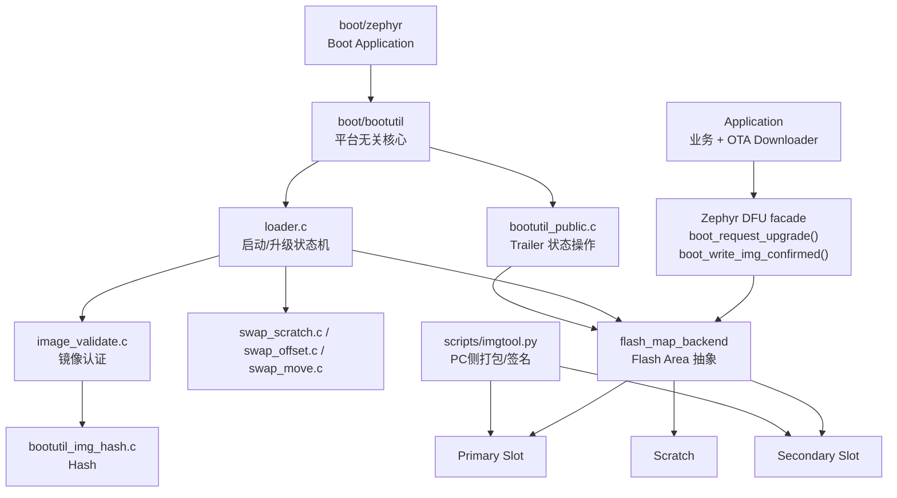

## 1.2 你真正需要看的源码

```text
mcuboot/
├─ boot/
│  ├─ zephyr/
│  │  └─ main.c                     # Zephyr port 入口与最终跳转
│  └─ bootutil/
│     ├─ include/bootutil/
│     │  ├─ bootutil.h              # boot_go()
│     │  ├─ bootutil_public.h       # pending / confirm / swap state API
│     │  └─ image.h                 # Image Header / TLV / validate API
│     └─ src/
│        ├─ loader.c                # 核心启动/升级状态机
│        ├─ bootutil_public.c       # trailer 读写与 swap type 判定
│        ├─ image_validate.c        # TLV / 签名校验
│        ├─ bootutil_img_hash.c     # image hash
│        ├─ bootutil_find_key.c     # 找验证公钥
│        ├─ swap_scratch.c          # 本教程 F407 实验重点
│        ├─ swap_offset.c           # 新设计更推荐
│        └─ swap_move.c             # 老产品仍可能使用
└─ scripts/
   └─ imgtool.py                    # 生成/签名 MCUboot image
```

第一遍只读这条主调用链：

```text
boot/zephyr/main.c
        |
        v
boot_go(&rsp)
        |
        v
context_boot_go()
        |
        +--> boot_prepare_image_for_update()
        |       +--> boot_read_image_headers()
        |       +--> swap_read_status()
        |       +--> boot_validated_swap_type()
        |       +--> boot_complete_partial_swap()   # 断电恢复
        |
        +--> 执行 swap / update
        |
        +--> boot_load_and_validate_images()
                +--> boot_validate_slot()
                        +--> bootutil_img_validate()
        |
        v
fill_rsp()
        |
        v
port-specific jump to APP
```

> **FIH**：很多核心函数返回 `fih_ret`，并由 `FIH_CALL()` 调用。FIH = Fault Injection Hardening，用于强化安全关键控制流。学习状态机时先把它理解成“安全强化版返回值/调用封装”。

---

# 2. STM32F407 Flash：分区必须服从擦除粒度

STM32F407 1 MiB Flash 的 sector 并不等大：

```text
S0   0x08000000 - 0x08003FFF    16 KiB
S1   0x08004000 - 0x08007FFF    16 KiB
S2   0x08008000 - 0x0800BFFF    16 KiB
S3   0x0800C000 - 0x0800FFFF    16 KiB
S4   0x08010000 - 0x0801FFFF    64 KiB
S5   0x08020000 - 0x0803FFFF   128 KiB
S6   0x08040000 - 0x0805FFFF   128 KiB
S7   0x08060000 - 0x0807FFFF   128 KiB
S8   0x08080000 - 0x0809FFFF   128 KiB
S9   0x080A0000 - 0x080BFFFF   128 KiB
S10  0x080C0000 - 0x080DFFFF   128 KiB
S11  0x080E0000 - 0x080FFFFF   128 KiB
```

所以 Bootloader/Slot 划分不能只按“看起来整数”的地址切；必须对齐物理 erase sector。

## 2.1 本教程实验布局

为了最快跑通 **TEST → CONFIRM / REVERT + 断电恢复**，使用 swap-using-scratch：

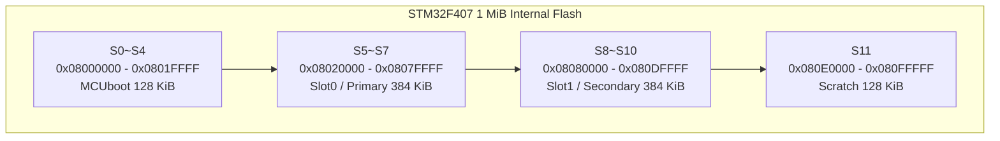

优点：每个区都对齐真实 sector；两 slot 等大；scratch 足以容纳最大 sector。缺点：浪费 Flash。**这是学习布局，不是量产最优布局。**

### 为什么这里不用 swap-using-offset？

MCUboot 当前文档整体更推荐 `swap-using-offset`，并提示 scratch 模式未来可能移除。但 Zephyr 使用说明同时明确指出：当 Primary/Secondary 的 sector size 不同，或者某个 slot 内 sector size 不均匀时，scratch 是适用方案。F407 的内部 Flash 恰好存在不均匀 sector，因此本教程用 scratch 讲清完整可靠升级。

---

# 3. Image 格式：Header、Body、TLV、Trailer

先区分两类元数据：

- **TLV 区**：属于 image，跟固件一起下载，保存 Hash、签名、Security Counter 等认证信息。
- **Image Trailer**：位于 slot 尾部，保存 pending/swap/copy_done/image_ok 等升级状态。

## 3.1 静态镜像格式


当前 `image.h` 真实结构：

```c
struct image_version {
    uint8_t  iv_major;
    uint8_t  iv_minor;
    uint16_t iv_revision;
    uint32_t iv_build_num;
};

struct image_header {
    uint32_t ih_magic;              /* IMAGE_MAGIC = 0x96f3b83d */
    uint32_t ih_load_addr;
    uint16_t ih_hdr_size;           /* image body offset */
    uint16_t ih_protect_tlv_size;
    uint32_t ih_img_size;           /* 不包含 header */
    uint32_t ih_flags;
    struct image_version ih_ver;
    uint32_t _pad1;
};
```

关键宏：

```c
#define IMAGE_MAGIC               0x96f3b83d
#define IMAGE_HEADER_SIZE         32
#define IMAGE_TLV_INFO_MAGIC      0x6907
#define IMAGE_TLV_PROT_INFO_MAGIC 0x6908

#define IMAGE_TLV_KEYHASH         0x01
#define IMAGE_TLV_PUBKEY          0x02
#define IMAGE_TLV_SHA256          0x10
#define IMAGE_TLV_ECDSA_SIG       0x22
#define IMAGE_TLV_DEPENDENCY      0x40
#define IMAGE_TLV_SEC_CNT         0x50
```

> 不要把 `ih_hdr_size` 永远硬编码为 32。`sizeof(struct image_header)` 是 32 B，但 `ih_hdr_size` 表示实际 image body 的偏移，构建系统可以留出更大的 header/padding 区。

## 3.2 TLV 是什么

TLV = Type-Length-Value，和协议 Option 的设计类似：

```text
+--------+--------+--------------------+
| Type   | Length | Value              |
+--------+--------+--------------------+
   2 B      2 B       Length bytes
```

源码结构：

```c
struct image_tlv_info {
    uint16_t it_magic;
    uint16_t it_tlv_tot;
};

struct image_tlv {
    uint16_t it_type;
    uint16_t it_len;
};
```

遍历 API：

```c
int bootutil_tlv_iter_begin(struct image_tlv_iter *it,
                            const struct image_header *hdr,
                            const struct flash_area *fap,
                            uint16_t type, bool prot);

int bootutil_tlv_iter_next(struct image_tlv_iter *it,
                           uint32_t *off,
                           uint16_t *len,
                           uint16_t *type);
```

---

# 4. 普通启动：从 Reset 到 APP 的真实主线

## 4.1 静态调用关系

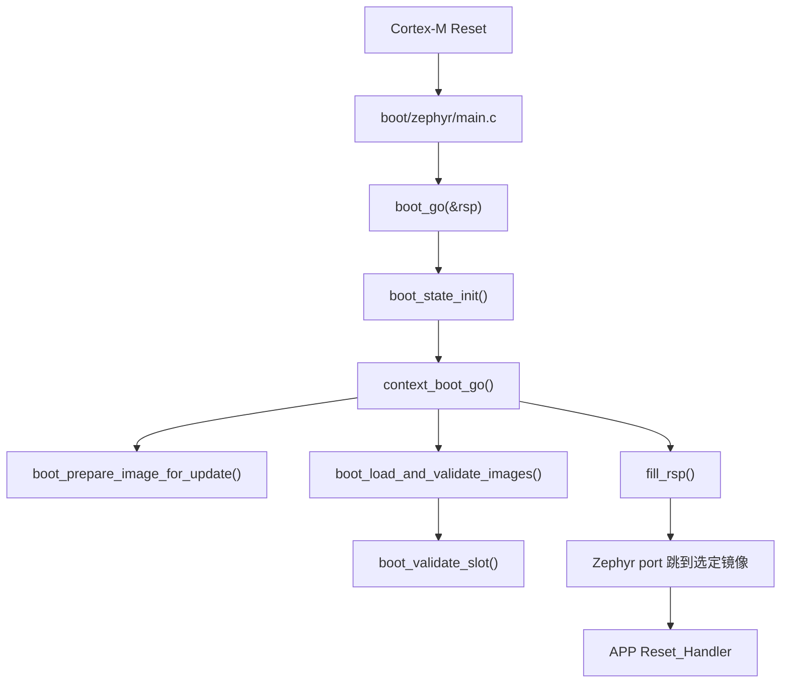

当前 `boot_go()` 主干：

```c
fih_ret boot_go(struct boot_rsp *rsp)
{
    FIH_DECLARE(fih_rc, FIH_FAILURE);

    boot_state_init(&boot_data);
    FIH_CALL(context_boot_go, fih_rc, &boot_data, rsp);
    boot_state_clear(&boot_data);

    FIH_RET(fih_rc);
}
```

真正复杂的升级状态机在 `context_boot_go()`。

## 4.2 普通启动 UML

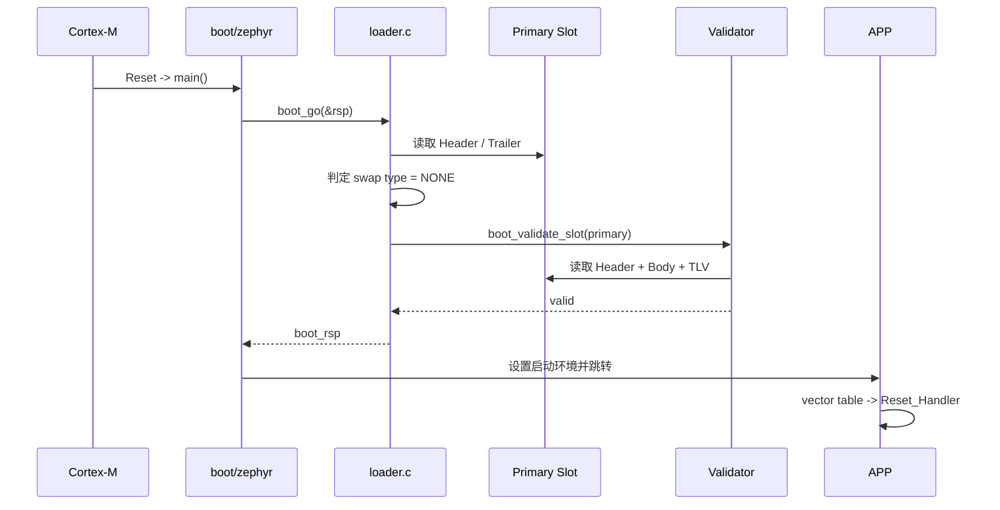

`bootutil` 不直接承担最终 CPU jump。它负责决定“启动谁”，平台 port 根据 `boot_rsp` 执行最后跳转。

---

# 5. 镜像认证：Hash 与 Signature

- CRC：适合检测随机传输错误，不提供可信发布者认证。
- Hash（SHA-256 等）：检测内容变化，但攻击者如果能替换 image，也能重算普通 hash。
- Digital Signature：发布端私钥签名；设备内 Bootloader 用公钥验证，证明镜像来自可信签名者且内容未被篡改。

## 5.1 静态信任链

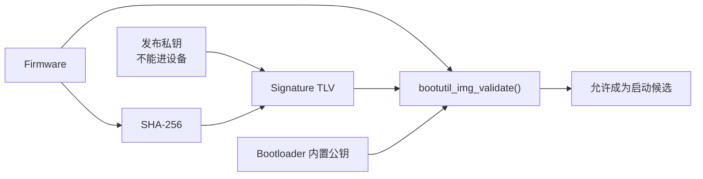

当前核心验证 API：

```c
fih_ret bootutil_img_validate(
    struct boot_loader_state *state,
    struct image_header *hdr,
    const struct flash_area *fap,
    uint8_t *tmp_buf,
    uint32_t tmp_buf_sz,
    uint8_t *seed,
    int seed_len,
    uint8_t *out_hash
);
```

相关函数：

```c
int bootutil_img_hash(...);
int bootutil_find_key(...);
int bootutil_tlv_iter_begin(...);
int bootutil_tlv_iter_next(...);
```

## 5.2 验证 UML

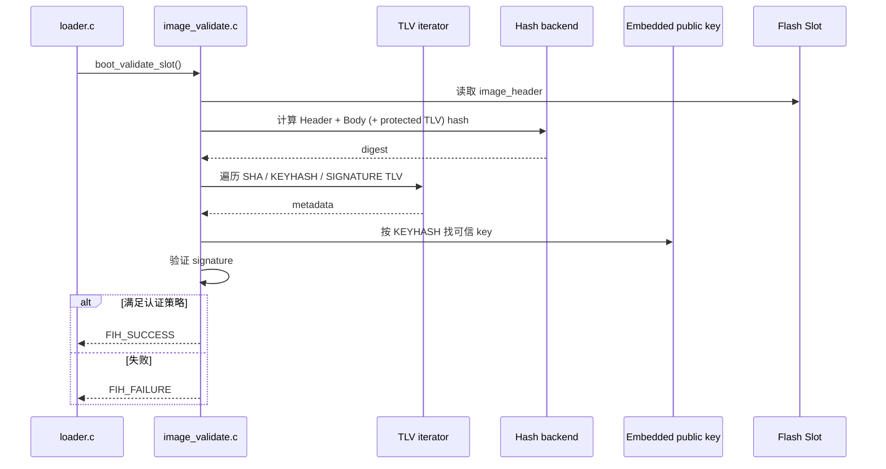

> **Anti-rollback 与 Revert 不冲突**：Revert 是新版本试运行失败后恢复旧的已知可用版本；Anti-rollback 是安全策略，阻止攻击者主动安装低版本漏洞固件。MCUboot 可通过版本/security counter 相关机制做 downgrade prevention。

---

# 6. OTA 核心状态机：TEST / PERM / CONFIRM / REVERT

当前公开定义：

```c
#define BOOT_SWAP_TYPE_NONE    1
#define BOOT_SWAP_TYPE_TEST    2
#define BOOT_SWAP_TYPE_PERM    3
#define BOOT_SWAP_TYPE_REVERT  4
#define BOOT_SWAP_TYPE_FAIL    5
#define BOOT_SWAP_TYPE_PANIC   0xff
```

Trailer 状态抽象：

```c
struct boot_swap_state {
    uint8_t magic;
    uint8_t swap_type;
    uint8_t copy_done;
    uint8_t image_ok;
    uint8_t image_num;
};
```

必须理解：

```text
magic      -> trailer 是否被 MCUboot 正确标记
swap_info  -> 请求/恢复哪一类升级动作
copy_done  -> swap/copy 已完成到应有阶段
image_ok   -> 新 APP 已被运行时确认，可永久接受
```

最重要的规则：**TEST 升级后新 APP 如果不 confirm，后续 reboot 会 REVERT。**

## 6.1 应用侧两层 API

MCUboot bootutil 公共 API：

```c
int boot_set_pending_multi(int image_index, int permanent);
int boot_set_confirmed_multi(int image_index);

int boot_set_pending(int permanent);   /* 单 image 兼容接口 */
int boot_set_confirmed(void);          /* 单 image 兼容接口 */
```

当前源码明确推荐 multi 版本；旧单 image 版本保留兼容。

```c
int boot_set_pending(int permanent)
{
    return boot_set_pending_multi(0, permanent);
}
```

`boot_set_pending_multi()` 的核心语义：

```c
open(secondary_slot);
boot_set_next(secondary_slot,
              active = false,
              confirm = (permanent != 0));
close(secondary_slot);
```

在 Zephyr APP 中通常用 facade：

```c
#include <zephyr/dfu/mcuboot.h>

boot_request_upgrade(BOOT_UPGRADE_TEST);
boot_write_img_confirmed();
```

层次关系：

```text
Your Zephyr APP
     |
     v
zephyr/dfu/mcuboot.h
boot_request_upgrade()
boot_write_img_confirmed()
     |
     v
MCUboot-compatible trailer state
     |
     v
Reset 后 MCUboot 读取
```

## 6.2 TEST 升级静态状态图

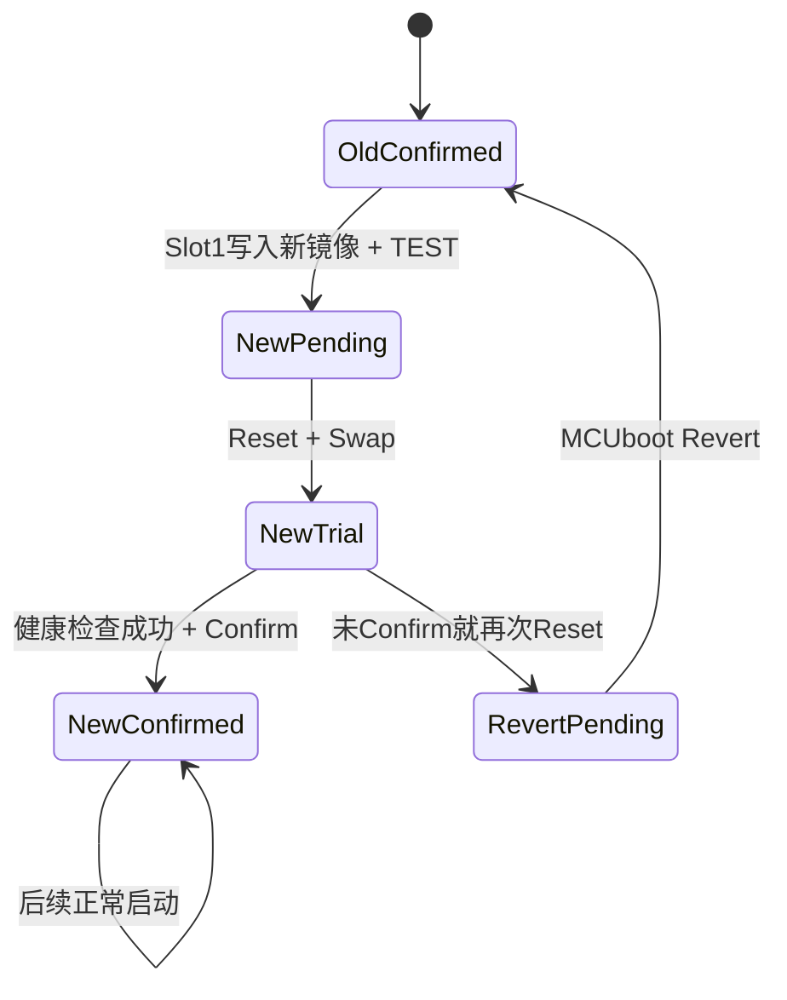

## 6.3 TEST → CONFIRM UML

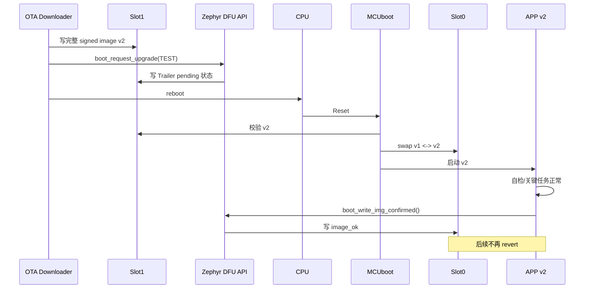

APP 不应该一启动就确认：

```c
int main(void)
{
    board_init();
    storage_mount();

    if (!critical_self_test()) {
        system_reboot();       /* 不确认 -> 允许 revert */
    }

    if (!start_critical_tasks()) {
        system_reboot();
    }

    if (boot_write_img_confirmed() != 0) {
        report_fatal_upgrade_error();
    }

    run_application();
}
```

“健康”的定义由产品决定，例如配置可读、关键外设正常、通信可建立、核心任务能运行。

---

# 7. 自动回滚与断电恢复

## 7.1 未确认回滚的静态逻辑

当前 trailer 判定可理解为：

```text
Secondary.magic = GOOD
Secondary.image_ok = UNSET
        => TEST

Primary.magic = GOOD
Primary.copy_done = SET
Primary.image_ok = UNSET
        => REVERT
```

## 7.2 未确认自动回滚 UML

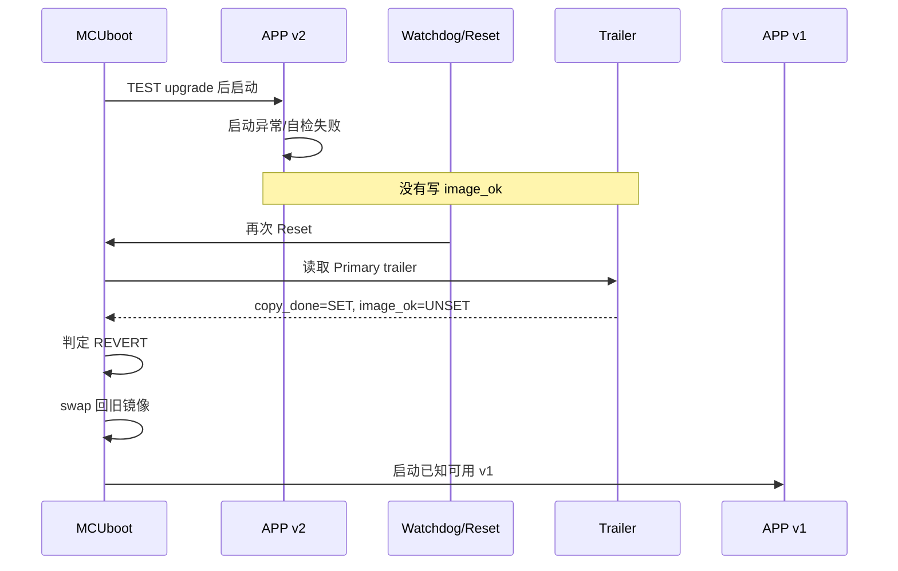

## 7.3 断电恢复静态调用链

```text
boot_prepare_image_for_update()
  |
  +-- swap_read_status()
  |
  +-- boot_status_is_reset() ?
         |
         +-- NO: 上次 swap 未完成
                  |
                  +-- boot_complete_partial_swap()
```

`bootutil_public.c` 的 `boot_write_swap_info()` 会把 swap type 持久化，使 unexpected reset 后能够恢复正确操作。

## 7.4 swap 中断 UML

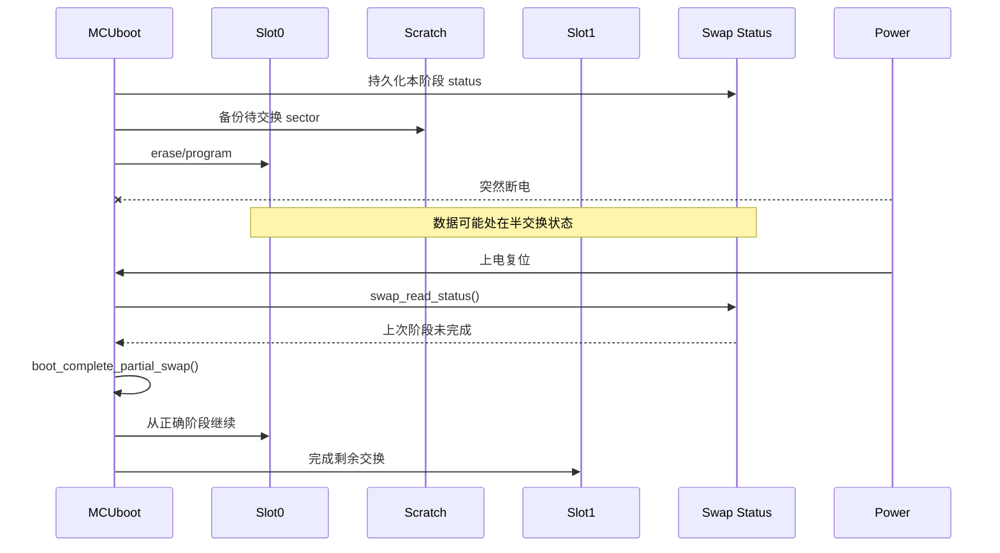

面试要点：**双分区只提供旧镜像冗余；真正抗掉电的是“持久化 swap 状态 + 可恢复的分阶段 Flash 操作”。**

---

# 8. 传输层：MCUmgr 与 XMODEM 怎么接 MCUboot

## 8.1 静态分层

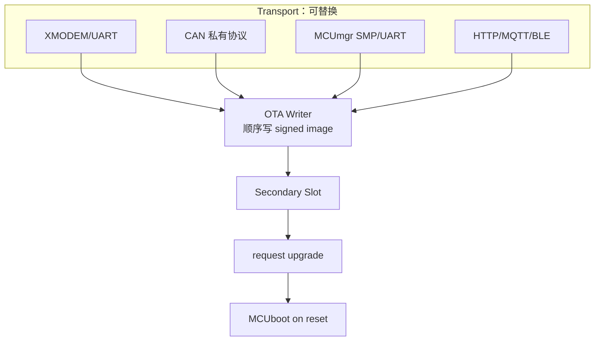

你的 XMODEM 经验可以直接迁移：

```text
XMODEM packet / seq / checksum / retransmission
                     |
                     v
收到的字节写 Secondary Slot，而不是覆盖正在运行 APP
                     |
                     v
完整接收后 mark pending
                     |
                     v
Reset 后 MCUboot 负责验证/激活/回滚
```

## 8.2 Zephyr 写 Slot1 的核心 API

当前 Zephyr 有：

```c
int flash_img_init_id(struct flash_img_context *ctx, uint8_t area_id);

int flash_img_buffered_write(struct flash_img_context *ctx,
                             const uint8_t *data,
                             size_t len,
                             bool flush);
```

XMODEM 接入骨架：

```c
#include <zephyr/dfu/flash_img.h>
#include <zephyr/dfu/mcuboot.h>
#include <zephyr/sys/reboot.h>

static int ota_from_xmodem(void)
{
    struct flash_img_context ctx;
    uint8_t block[1024];
    size_t len;
    int rc;

    rc = flash_img_init_id(&ctx, SLOT1_AREA_ID);
    if (rc) return rc;

    while ((rc = xmodem_receive_block(block, &len)) == 0) {
        rc = flash_img_buffered_write(&ctx, block, len, false);
        if (rc) return rc;
    }

    if (rc != XMODEM_EOF) return rc;

    rc = flash_img_buffered_write(&ctx, NULL, 0, true);
    if (rc) return rc;

    rc = boot_request_upgrade(BOOT_UPGRADE_TEST);
    if (rc) return rc;

    sys_reboot(SYS_REBOOT_COLD);
    return 0;
}
```

这是集成骨架；`SLOT1_AREA_ID` 与 XMODEM API 按实际工程定义。重点是职责边界。

## 8.3 下载升级 UML

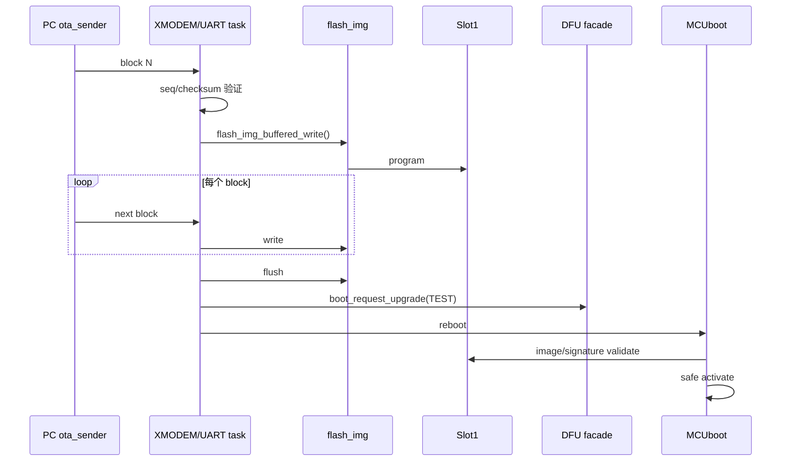

传输 checksum 不能代替 image signature：前者解决 packet 错误，后者解决最终固件的端到端可信性。

---

# 9. STM32F407 实战：v1 → v2 → revert/confirm

最快的官方生态路线是 **Zephyr + MCUboot + Sysbuild**。目的不是转 Zephyr 岗，而是利用已有 F407 port、Flash map、签名和 DFU API，把时间花在 MCUboot 核心机制上。

## 9.1 环境

按 Zephyr 当前 Getting Started 建 workspace，确认：

```bash
west --version
cmake --version
python3 --version
arm-zephyr-eabi-gcc --version
west boards | grep stm32f4_disco
```

本文 target：

```text
stm32f4_disco/stm32f407xx
```

## 9.2 工程结构

```text
f407-mcuboot-lab/
├─ CMakeLists.txt
├─ prj.conf
├─ sysbuild.conf
├─ src/
│  └─ main.c
├─ boards/
│  └─ stm32f4_disco.overlay
└─ sysbuild/
   ├─ mcuboot.conf
   └─ mcuboot.overlay
```

`CMakeLists.txt`：

```cmake
cmake_minimum_required(VERSION 3.20.0)
find_package(Zephyr REQUIRED HINTS $ENV{ZEPHYR_BASE})
project(f407_mcuboot_lab)
target_sources(app PRIVATE src/main.c)
```

`prj.conf` 最小方向：

```conf
CONFIG_BOOTLOADER_MCUBOOT=y
CONFIG_LOG=y
CONFIG_PRINTK=y
```

如果你要在 APP 中启用更高层 image manager/mcumgr，再增加对应 subsystem 配置。先把 Bootloader→APP→swap 主链跑通。

## 9.3 Application 与 MCUboot 必须看到同一份 Flash map

`boards/stm32f4_disco.overlay` 与 `sysbuild/mcuboot.overlay` 使用同一分区：

```dts
&flash0 {
    partitions {
        compatible = "fixed-partitions";
        #address-cells = <1>;
        #size-cells = <1>;

        boot_partition: partition@0 {
            label = "mcuboot";
            reg = <0x00000000 0x00020000>;
        };

        slot0_partition: partition@20000 {
            label = "image-0";
            reg = <0x00020000 0x00060000>;
        };

        slot1_partition: partition@80000 {
            label = "image-1";
            reg = <0x00080000 0x00060000>;
        };

        scratch_partition: partition@e0000 {
            label = "image-scratch";
            reg = <0x000e0000 0x00020000>;
        };
    };
};
```

地址换算：

```text
flash0 base       = 0x08000000
boot              = 0x08000000
slot0             = 0x08020000
slot1             = 0x08080000
scratch           = 0x080E0000
```

### 为什么不手改 APP linker script？

Zephyr + MCUboot 下应该让 partition / `CONFIG_BOOTLOADER_MCUBOOT` / build system 共同控制 placement 和 header reservation，避免维护一份与 Devicetree 漂移的 linker script。你仍然应该用 `objdump` 验证最终地址：

```bash
grep -R "slot0_partition" build/ -n | head
arm-zephyr-eabi-objdump -h build/*/zephyr/zephyr.elf
arm-zephyr-eabi-nm -n build/*/zephyr/zephyr.elf | head
```

## 9.4 MCUboot：scratch + ECDSA P-256

`sysbuild/mcuboot.conf`：

```conf
CONFIG_BOOT_SWAP_USING_SCRATCH=y
CONFIG_BOOT_SIGNATURE_TYPE_ECDSA_P256=y
CONFIG_LOG=y
```

生成开发 key：

```bash
cd $ZEPHYR_BASE/../bootloader/mcuboot
python3 scripts/imgtool.py keygen \
    -k ~/f407-dev-ec-p256.pem \
    -t ecdsa-p256
```

`sysbuild.conf`：

```conf
SB_CONFIG_BOOTLOADER_MCUBOOT=y
SB_CONFIG_BOOT_SIGNATURE_TYPE_ECDSA_P256=y
SB_CONFIG_BOOT_SIGNATURE_KEY_FILE="/home/<user>/f407-dev-ec-p256.pem"
```

仓库自带 demo 私钥不能用于生产。生产应让私钥留在发布/签名环境，设备只嵌入公钥。

## 9.5 APP v1

```c
#include <zephyr/kernel.h>
#include <zephyr/sys/printk.h>

#define APP_VERSION "1.0.0"

int main(void)
{
    printk("APP %s booted\n", APP_VERSION);
    while (1) {
        k_sleep(K_SECONDS(1));
    }
    return 0;
}
```

构建：

```bash
west build -p always \
  -b stm32f4_disco/stm32f407xx \
  --sysbuild .
```

查看产物：

```bash
find build -maxdepth 5 -type f \
  \( -name "*.elf" -o -name "*signed*.bin" -o -name "*.hex" \) | sort
```

烧写：

```bash
west flash -d build
```

验收 A：Reset 后先进入 MCUboot，再启动 `APP 1.0.0`。

> 如果烧 APP 后 MCUboot 消失，优先检查 flash runner 是否执行了 **mass erase**。

## 9.6 APP v2

改：

```c
#define APP_VERSION "2.0.0"
```

重新构建：

```bash
west build -p always \
  -b stm32f4_disco/stm32f407xx \
  --sysbuild . \
  -d build-v2
```

找到 APP 的 `zephyr.signed.bin`。开发阶段先用调试器把它**仅写入 Secondary `0x08080000`**，不要做 mass erase。先验证 MCUboot，再接 XMODEM/MCUmgr，排错效率最高。

## 9.7 标记 TEST upgrade

产品中由 APP 下载器调用：

```c
#include <zephyr/dfu/mcuboot.h>
#include <zephyr/sys/reboot.h>

static void request_test_upgrade(void)
{
    int rc = boot_request_upgrade(BOOT_UPGRADE_TEST);

    printk("request upgrade rc=%d\n", rc);
    if (rc == 0) {
        k_sleep(K_MSEC(100));
        sys_reboot(SYS_REBOOT_COLD);
    }
}
```

验收 B：

```text
第一次 reboot：MCUboot 检测/验证 v2 -> TEST swap -> APP 2.0.0
第二次 reboot（v2 未 confirm）：REVERT -> APP 1.0.0
```

到这里已经不是简单 IAP，而是真正的“升级 + 试运行 + 自动回滚”。

## 9.8 v2 确认后永久运行

```c
#include <zephyr/dfu/mcuboot.h>

static bool app_health_ok(void)
{
    return true; /* 替换成真实健康检查 */
}

int main(void)
{
    int rc;

    printk("APP 2.0.0 trial boot\n");

    if (!app_health_ok()) {
        printk("health failed; do not confirm\n");
        sys_reboot(SYS_REBOOT_COLD);
    }

    rc = boot_write_img_confirmed();
    printk("confirm rc=%d\n", rc);

    while (1) {
        k_sleep(K_SECONDS(1));
    }
}
```

验收 C：v2 第一次试运行后 confirm；再次 reboot 仍然运行 v2，不再回 v1。

## 9.9 必须主动制造三个故障

1. **不 confirm**：验证自动 REVERT。
2. **破坏 Slot1 中 signed image 任意一个受保护字节**：验证 Hash/Signature 失败，坏镜像不得激活。
3. **swap 中间复位/断电**：验证下一次启动根据持久化 swap status 恢复。

这三项是“看过源码”和“做过 OTA”的分界线。

---

# 10. Debug：最有效的断点

## 10.1 启动决策

```text
boot/zephyr/main.c
boot_go()
context_boot_go()
boot_prepare_image_for_update()
```

每次停下问：两个 slot 的 header 版本是什么？为什么当前 swap type 是 NONE/TEST/REVERT？

## 10.2 Trailer

断点：

```c
boot_read_swap_state()
boot_swap_type_multi()
boot_write_magic()
boot_write_swap_info()
boot_write_image_ok()
```

观察：

```c
struct boot_swap_state {
    magic;
    swap_type;
    copy_done;
    image_ok;
    image_num;
};
```

## 10.3 镜像认证

```text
boot_validate_slot()
bootutil_img_validate()
bootutil_img_hash()
bootutil_tlv_iter_begin()
bootutil_tlv_iter_next()
bootutil_find_key()
```

检查：`ih_magic`、`ih_hdr_size`、`ih_img_size`、TLV offset、signature type、使用了哪个公钥。

## 10.4 Flash swap

本教程重点：

```text
swap_scratch.c
```

了解：

```text
swap_offset.c
swap_move.c
```

在 sector 搬运处看：当前搬哪个 sector？Scratch 保存谁？断电恢复从哪一步继续？

---

# 11. 把整个源码压缩成 6 个职责对象

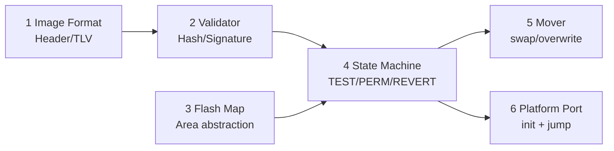

一句话：

> MCUboot 把固件包装成可认证 image，把 Flash 抽象成 area，用 trailer 保存跨重启状态；启动时状态机选择并验证候选镜像，需要时可靠搬运，最后由平台 port 跳到 application。

---

# 12. 一周实战安排

| Day | 任务 | 必须产出 |
|---|---|---|
| 1 | F407 + sysbuild MCUboot/APP | v1 从 MCUboot 启动 |
| 2 | 看 Header/TLV 和 signed image | 能手画 image 格式 |
| 3 | 写 Slot1 v2，触发 TEST | v1→v2 成功 |
| 4 | 不 confirm 看 REVERT；再 confirm | 两条状态链跑通 |
| 5 | 篡改镜像、swap 中复位 | 校验失败 + 断电恢复记录 |
| 6 | 接 UART/XMODEM 或 MCUmgr | 真正 downloader |
| 7 | 断点跑 `boot_go()` 主链 | 调用图 + 面试表达 |

第二周只做：重复讲解、源码关键函数、异常复现、项目总结，不再横向换框架。

简历可写：

> 基于 MCUboot 在 STM32F407 上实现双镜像固件升级，完成 Flash 分区、签名镜像校验、TEST/CONFIRM/REVERT 状态管理及升级中断恢复；应用侧通过 UART/XMODEM（如实际已完成）写 Secondary Slot，并结合 J-Link 分析 boot_go、image validation 与 swap 状态机。

没有实际完成的功能不要写进简历。

---

# 13. 面试 Q&A

## Q1：OTA 和 IAP 有什么区别？

IAP 强调 MCU 在运行环境中对自身 Flash 重编程；OTA 是远程固件更新的完整系统，通常还包含传输、镜像存储、认证、激活、回滚和版本管理。IAP 可以是 OTA 的底层手段之一。

## Q2：MCUboot 负责下载固件吗？

不必。MCUboot 核心负责镜像格式、校验、启动选择、升级激活和恢复。APP 可以通过 UART/CAN/BLE/HTTP 等把镜像写进 Secondary，也可以使用 Zephyr/MCUboot 的 serial recovery 或 mcumgr 生态。

## Q3：为什么不能直接覆盖当前 APP？

因为 erase/program 中掉电会破坏当前唯一可运行镜像。Secondary Slot 允许新镜像完整落盘和认证，并保留旧版本用于 revert。

## Q4：A/B 分区就一定抗断电吗？

不一定。A/B 只提供空间冗余，还需要可恢复状态机。MCUboot 用 trailer/swap status 持久化阶段状态，使 swap 中断后可继续。

## Q5：Primary / Secondary 的区别？

典型 swap 模式下 Primary 是当前运行位置，Secondary 保存待升级镜像或交换后的旧镜像。Direct-XIP 是例外，可以直接从不同 slot 执行。

## Q6：TEST 和 PERM 的区别？

TEST 是试运行，新 APP 必须 confirm，否则下一次 reboot 会 revert。PERM 直接接受新镜像为永久版本。产品升级通常更适合 TEST + health check + confirm。

## Q7：`copy_done` 与 `image_ok` 区别？

`copy_done` 属于交换/复制过程状态；`image_ok` 表示新应用已经在运行时确认。TEST swap 后 `copy_done=SET` 但 `image_ok` 未设置，是 REVERT 的关键条件。

## Q8：`boot_set_pending()` 做了什么？

当前它是 `boot_set_pending_multi(0, permanent)` 的兼容封装。multi 版本打开 Secondary flash area，再通过 `boot_set_next()` 写下一次启动所需 trailer 状态。

## Q9：Zephyr APP 为什么用 `boot_request_upgrade()`？

这是 Zephyr DFU facade；`boot_set_pending*()` 是 MCUboot bootutil 公共接口。两者位于不同集成层，最终都影响 MCUboot 能理解的升级状态。

## Q10：MCUboot 核心入口是什么？

Boot application 调 `boot_go(&rsp)`。当前实现初始化 state，进入 `context_boot_go()` 完成 Flash area、升级状态、验证和候选选择，最后填 `boot_rsp`，平台层再跳 APP。

## Q11：为什么 bootutil 做成 library？

为了把绝大多数 Bootloader 逻辑做成可单元测试的库；最终 CPU jump 等平台动作留给 port application。

## Q12：为什么不能一启动就 confirm？

否则自动回滚失去意义。应先通过业务定义的最低健康检查，再 confirm；失败则 reset，让 MCUboot revert。

## Q13：Hash 和数字签名区别？

Hash 检测内容变化；签名利用私钥/公钥体系证明镜像来自可信发布者并绑定内容。普通 hash 本身不能阻止攻击者替换固件后重算 hash。

## Q14：CRC 为什么不能替代签名？

CRC 是错误检测，不是密码学认证，攻击者可任意修改固件并重算 CRC。

## Q15：生产私钥放哪里？

应留在受控发布/签名基础设施，最好使用 HSM 或等价保护；设备只嵌入验证公钥。公开 demo key 绝不能用于量产。

## Q16：MCUboot 如何做防降级？

可通过 version/security counter 机制执行 downgrade prevention。它和“TEST 失败后 revert 到已知可用旧版本”不是一个概念。

## Q17：TLV 是什么？

Type-Length-Value，可扩展元数据编码。MCUboot 在 image body 后放 hash、KEYHASH、signature、dependency、security counter 等 TLV。

## Q18：Protected TLV 为什么 protected？

它被纳入 image hash 的受保护范围，关键元数据被修改会导致认证结果失效。

## Q19：为什么需要 Flash Map 抽象？

bootutil 不应写死 STM32 sector 地址。Flash area 抽象用 ID/offset/size/读写擦除接口屏蔽不同芯片和 RTOS port。

## Q20：F407 为什么本实验用 scratch？

F407 内部 Flash sector 大小不均匀。MCUboot 当前 Zephyr 文档明确指出 sector layout 不均匀/不一致时 scratch 是适用方案。实验按真实 sector 划两个等大 slot，并留 128 KiB scratch。

## Q21：scratch 是量产首选吗？

不是。当前 MCUboot 文档更推荐 offset 或 move，scratch 甚至提示未来可能移除。本实验是 F407 内部 Flash 几何下的学习权衡。

## Q22：swap 中断电怎么恢复？

启动时读持久化 swap status。`boot_prepare_image_for_update()` 发现 partial swap 后进入完成/恢复逻辑，而不是假定上次 Flash 操作成功。

## Q23：下载完成后为什么 reboot？

典型 swap 模式中，运行 APP 只负责把镜像放入 Secondary 并提交 pending；真正的认证、选择和激活发生在下一次 MCUboot 启动，Reset 是明确控制权切换点。

## Q24：APP 链接地址需要注意什么？

需要。非 PIC Cortex-M image 必须按预期运行位置构建。Zephyr 集成由 partition 和 `CONFIG_BOOTLOADER_MCUBOOT` 等处理 placement/header reservation；裸机移植则需自己保证 linker、header 和跳转一致。

## Q25：VTOR 在这里做什么？

跳到 APP 后异常向量必须指向 APP 自己的 vector table。具体由 port/APP 启动代码设置。VTOR 是 Bootloader 移植基本功，但 MCUboot 的核心价值在前面的 image/state/recovery。

## Q26：v2 下载一半就断电怎么办？

不能 mark pending。正确设计是完整下载 Secondary 后再提交升级状态。没有合法 pending image 时，MCUboot 应继续启动原 Primary。

## Q27：v2 下载完整但签名错误怎么办？

候选 image 验证失败，不允许激活。实验应主动改一个受保护字节验证此路径。

## Q28：为什么 XMODEM checksum 和 image hash 要同时存在？

checksum 用于 packet 传输错误和重传；image hash/signature 对最终完整固件做端到端认证，职责不同。

## Q29：Direct-XIP 是什么？

从候选 slot 原地执行，不先搬进 Primary。它要求硬件映射、链接/重映射能力和 MCUboot 配置满足条件，不作为本 F407 入门实验主线。

## Q30：Overwrite-only 的代价？

逻辑简单、空间利用较好，但失去 swap 模式保留旧镜像并天然 revert 的能力，可靠性策略需要重新设计。

## Q31：最关键断点有哪些？

`boot_go()`、`context_boot_go()`、`boot_prepare_image_for_update()`、`boot_read_swap_state()`、`boot_validate_slot()`、`bootutil_img_validate()`，以及本实验 `swap_scratch.c` 的 sector 搬运点。

## Q32：怎样证明真的做过 OTA？

拿出四类证据：v1→v2 TEST 升级；未 confirm 自动 revert；confirm 后永久运行；篡改 image 与 swap 中复位的异常实验。最好再加一个自己接入的 UART/XMODEM 或 CAN downloader。

---

# 14. 最终心智模型

```text
                    +----------------+
                    | OTA transport  |
                    | UART/CAN/NET   |
                    +-------+--------+
                            | signed image
                            v
+-----------+       +----------------+       +-----------+
| Slot0     |<----->| MCUboot        |<----->| Slot1     |
| current   |       | state machine  |       | new image |
+-----------+       +-------+--------+       +-----------+
                            |
                   +--------+---------+
                   |                  |
                   v                  v
              validate image       trailer
              hash/signature   pending/confirm/revert
                   |                  |
                   +--------+---------+
                            v
                       safe activate
                            |
                            v
                           APP
                            |
                   health OK ? confirm
                      no -> revert
```

30 秒面试版：

> 我的 OTA 方案把传输和启动管理解耦。APP 通过 UART/XMODEM 或其他链路把完整签名镜像写入 MCUboot Secondary Slot，写完后提交 TEST pending。复位后 MCUboot 从 trailer 恢复状态，对 Header/TLV、Hash 和 Signature 做验证，再通过可恢复的 Flash swap 激活新镜像。新 APP 健康检查后 confirm；如果启动失败或未确认，下次自动 revert。若 swap 中途断电，MCUboot 根据持久化 swap status 从正确阶段恢复。

能把这段和自己的 F407 日志、断点、Flash dump 对应起来，就已经具备可面试的 MCU OTA 项目经验。

---

# 15. 三轮审核清单

## Review 1：源码真实性

- `boot_go()`、`boot_set_pending_multi()`、`boot_set_confirmed_multi()`、`bootutil_img_validate()` 按锁定 commit 的真实声明核对。
- `image_header`、TLV magic/type 按当前 `image.h` 核对。
- 确认当前仓库确有 `swap_scratch.c`、`swap_offset.c`、`swap_move.c`。
- 没有再使用错误的旧版/臆造 `bootutil_img_validate(image_index, ...)` 签名。

## Review 2：F407 工程合理性

- 分区全部对齐 STM32F407 1 MiB 实际 sector boundary。
- Boot=S0~S4 128 KiB；Primary=S5~S7 384 KiB；Secondary=S8~S10 384 KiB；Scratch=S11 128 KiB。
- 明确此布局用于快速学习，不冒充量产最优方案。
- 明确禁止升级烧写时 mass erase。

## Review 3：招聘/面试覆盖

已覆盖：Bootloader/IAP/OTA、A/B、Flash layout、Header/TLV、Hash/Signature、TEST/PERM/CONFIRM/REVERT、断电恢复、Anti-rollback、UART/XMODEM、Zephyr/RTOS、J-Link/source debug、32 个核心 Q&A。

---

# 16. 官方源码与资料

## MCUboot

- Repo: https://github.com/mcu-tools/mcuboot
- 本文源码快照: https://github.com/mcu-tools/mcuboot/tree/cafbf800ddd727687075f26f9d69c9da4a515691
- Design: https://github.com/mcu-tools/mcuboot/blob/cafbf800ddd727687075f26f9d69c9da4a515691/docs/design.md
- Zephyr integration: https://github.com/mcu-tools/mcuboot/blob/cafbf800ddd727687075f26f9d69c9da4a515691/docs/readme-zephyr.md
- `image.h`: https://github.com/mcu-tools/mcuboot/blob/cafbf800ddd727687075f26f9d69c9da4a515691/boot/bootutil/include/bootutil/image.h
- `bootutil_public.h`: https://github.com/mcu-tools/mcuboot/blob/cafbf800ddd727687075f26f9d69c9da4a515691/boot/bootutil/include/bootutil/bootutil_public.h
- `loader.c`: https://github.com/mcu-tools/mcuboot/blob/cafbf800ddd727687075f26f9d69c9da4a515691/boot/bootutil/src/loader.c
- `bootutil_public.c`: https://github.com/mcu-tools/mcuboot/blob/cafbf800ddd727687075f26f9d69c9da4a515691/boot/bootutil/src/bootutil_public.c
- `image_validate.c`: https://github.com/mcu-tools/mcuboot/blob/cafbf800ddd727687075f26f9d69c9da4a515691/boot/bootutil/src/image_validate.c
- `swap_scratch.c`: https://github.com/mcu-tools/mcuboot/blob/cafbf800ddd727687075f26f9d69c9da4a515691/boot/bootutil/src/swap_scratch.c
- `swap_offset.c`: https://github.com/mcu-tools/mcuboot/blob/cafbf800ddd727687075f26f9d69c9da4a515691/boot/bootutil/src/swap_offset.c
- `imgtool`: https://github.com/mcu-tools/mcuboot/blob/cafbf800ddd727687075f26f9d69c9da4a515691/docs/imgtool.md

## Zephyr / STM32F407

- STM32F4 Discovery: https://docs.zephyrproject.org/latest/boards/st/stm32f4_disco/doc/index.html
- Zephyr MCUboot API: https://github.com/zephyrproject-rtos/zephyr/blob/main/include/zephyr/dfu/mcuboot.h
- `flash_img`: https://github.com/zephyrproject-rtos/zephyr/blob/main/include/zephyr/dfu/flash_img.h
- Sysbuild: https://docs.zephyrproject.org/latest/build/sysbuild/index.html
- ST STM32F407/417 文档: https://www.st.com/en/microcontrollers-microprocessors/stm32f407-417/documentation.html
- RM0090：从上述 ST 官方页面进入最新版，重点看 Embedded Flash Memory Interface / Flash organization。

## 近期招聘样本（用于能力映射）

- 东软座舱 MCU：Bootloader/OTA、MCU 更新启动，同时要求 CAN/LIN/UART/SPI/IIC/UDS/DoIP、RTOS：  
  https://www.liepin.com/job/1982890015.shtml
- 嵌入式软件：Bootloader、OTA/IAP 方案设计、Keil/GCC、J-Link：  
  https://www.liepin.com/job/1984703215.shtml
- 汽车 MCU：熟悉 UDS、Bootloader 优先：  
  https://www.liepin.com/a/74733047.shtml
