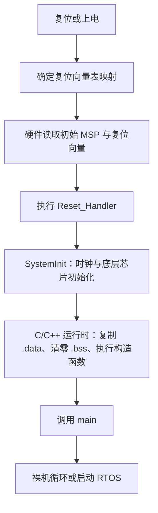

# Cortex-M 启动与底层运行机制笔记

> 适用范围：以 Cortex-M3/M4/M7 和 GNU Arm Embedded Toolchain 为主；Cortex-M0/M0+、Cortex-M23/M33 以及具体厂商芯片可能在 `VTOR`、TrustZone、缓存、启动映射等方面不同，必须再查对应内核手册和芯片参考手册。
>
> 示例假定片上 Flash 位于 `0x08000000`、SRAM 位于 `0x20000000`。这只是常见 MCU 布局，不是 Cortex-M 架构固定地址。

## 1. 对原笔记的总体评论

你的笔记已经抓住了启动过程的主干：**向量表 → `Reset_Handler` → `.data` 搬运 → `.bss` 清零 → 应用程序**。这条主线是正确的，也已经把编译器、启动文件和链接脚本联系了起来。

目前最需要修正的不是大方向，而是四个边界：

1. CPU 不是“从地址 4 取指令”，而是从向量表第 2 项读取 `Reset_Handler` 的入口地址，再到该地址取指。
2. 链接器不是把 `Reset_Handler` 函数体放在地址 4，而是把它的地址值放进向量表的偏移 `+0x04` 处。
3. `.bss` 不占用 Flash 初始化数据，但 RAM 通常不会由硬件自动保证为 0，仍须由启动代码清零。
4. `.data/.bss` 初始化属于完整的“启动路径”，具体由 `Reset_Handler` 直接完成，还是由它调用的 C 运行库入口完成，取决于工具链和启动文件。

> 导师评价：你已经理解了“启动不是 `main()` 凭空被调用”，下一步应把硬件复位、启动汇编、C 运行时和链接器四层严格分开。分层以后，Bootloader 跳转、HardFault 定位、RTOS 栈切换都会自然串起来。

---

## 2. 对原笔记逐条批注

| 原笔记观点                                      | 评价              | 准确表述                                                                                                                        |
| ------------------------------------------ | --------------- | --------------------------------------------------------------------------------------------------------------------------- |
| CPU 从地址 4 取指令执行                            | **需修正**         | CPU 从“复位时的向量表基地址 `+0x04`”读取复位向量，将其装入 PC；随后才从 `Reset_Handler` 地址取指。`0x04` 中放的是地址，不是处理器要执行的第一条指令。                             |
| 地址 0 放栈顶指针                                 | **基本正确**        | 向量表第 1 个字保存初始 MSP 值。它通常指向主栈顶端，并应满足 ABI/异常栈对齐要求。这里保存的是数值，不是指向另一个变量的普通 C 指针。                                                  |
| 上来执行的就是 `Reset_Handler`                    | **主线正确**        | 对“用户映像直接作为复位映像”的常规场景成立。若芯片先执行 Boot ROM、安全启动代码或 Bootloader，则这些软件先运行，之后才进入用户映像。                                               |
| 要把 `Reset_Handler` 放到地址 4                  | **错误**          | 应把**向量表**放到处理器复位后能看到的位置，并让向量表第 2 项保存 `Reset_Handler` 地址。函数体通常位于后续 `.text` 区域。                                               |
| `isr_vector` 是中断向量表的段                      | **正确但不完整**      | `.isr_vector` 只是工程约定的输入节名称，并非 CPU 认识的魔法名字。CPU 只认最终内存地址和表内格式；链接脚本负责把该输入节放到输出映像开头。                                            |
| Linker 读取 `link.ld` 排列各段                   | **正确**          | 更准确地说：链接器把各目标文件的输入节收集为输出节，为它们分配 VMA/LMA，解析符号和重定位，并生成 ELF 映像。                                                                |
| Flash 从 `0x08000000` 启动，所以向量表放在 Flash 起始位置 | **条件正确**        | `0x08000000` 是 STM32 等部分 MCU 的 Flash 地址，不是 Cortex-M 固定值。复位时处理器可能通过地址别名在 `0x00000000` 看到该 Flash，也可能先运行 Boot ROM。必须检查芯片的启动映射。 |
| `.data > RAM AT > FLASH`                   | **正确**          | `.data` 的运行地址 VMA 在 RAM，装载地址 LMA 在 Flash。烧录文件携带初值，启动时将这些字节复制到 RAM。                                                          |
| `.bss` 是未初始化的全局或静态变量                       | **基本正确**        | 包括具有静态存储期、未显式初始化或初始化为 0 的对象；普通自动局部变量不在 `.bss`。现代 GCC 默认 `-fno-common`，`COMMON` 的作用比旧工具链小。                                   |
| `.bss` 不占 Flash，所以不需要处理                    | **前半句正确，后半句错误** | `.bss` 通常是 ELF 的 `SHT_NOBITS`，不携带初始化字节；但 C 语言要求这些对象进入程序时为 0，所以启动代码必须清零，除非加载器明确代劳。                                           |
| `.data` 搬运和 `.bss` 清零在 `Reset_Handler` 中实现 | **常见但不唯一**      | 有的启动文件直接执行；CMSIS 的另一种典型形式是 `Reset_Handler()` 调用 `SystemInit()`，再进入工具链 C 运行库，由运行库完成内存初始化并调用 `main()`。                        |
| 最后跳到应用 entry                               | **正确但需分层**      | 硬件入口是复位向量；ELF 可用 `ENTRY(Reset_Handler)` 标记调试/工具入口；C 应用入口通常是 `main()`。三者不是同一概念。                                              |

### 最关键的纠错

```text
错误心智模型：CPU 在地址 0x00000004 执行 Reset_Handler 指令

正确心智模型：
vector_base + 0x00 处的 32 位值  ──装入──> MSP
vector_base + 0x04 处的 32 位值  ──装入──> PC
PC 指向的地址                     ──取指──> Reset_Handler 第一条指令
```

复位向量最低位必须符合 Thumb 状态要求。符号表中经常能看到函数地址最低位为 0，而向量表中的函数指针最低位为 1；处理器用该位建立 Thumb 状态，实际取指地址按对齐后的地址解释。

---

## 3. 修正后的 Cortex-M 启动笔记

### 3.1 一句话模型

> Cortex-M 复位后，硬件先用向量表初始化 MSP 和 PC；`Reset_Handler` 再建立芯片与 C 语言所需的运行环境，最终调用 `main()`。

### 3.2 完整启动链



注意：`SystemInit()` 与 `.data/.bss` 初始化的先后顺序由具体启动实现决定。CMSIS 推荐的抽象流程是 `Reset_Handler → SystemInit → C/C++ runtime → main`；自己手写启动代码时，必须明确 `SystemInit()` 能否在全局变量尚未初始化时运行。

### 3.3 硬件复位阶段

设复位时处理器看到的向量表基地址为 `VT_BASE`：

```text
[VT_BASE + 0x00]  initial MSP value
[VT_BASE + 0x04]  Reset_Handler address
[VT_BASE + 0x08]  NMI_Handler address
[VT_BASE + 0x0C]  HardFault_Handler address
...
```

处理器完成的核心动作是：

1. `MSP = *(uint32_t *)(VT_BASE + 0x00)`。
2. 从 `VT_BASE + 0x04` 读取复位向量并建立 Thumb 状态。
3. PC 转到复位处理函数入口，开始取指执行。

这里有两个容易混淆的地址：

- **向量槽地址**：`VT_BASE + 0x04`。
- **处理函数地址**：向量槽中保存的数值，例如 `0x08000191`；实际指令位于对齐后的地址附近。

### 3.4 软件启动阶段

启动路径通常承担以下职责：

- 必要的处理器设置，例如 Armv8-M 的栈限制、FPU 或安全状态配置。
- 调用设备相关的 `SystemInit()`，设置时钟、总线或必要的存储器接口。
- 将 `.data` 初值从 LMA 复制到 VMA。
- 将 `.bss` 对应 RAM 清零。
- 必要时处理 `.preinit_array/.init_array`，执行 C++ 全局构造函数。
- 建立标准库所需环境，随后调用 `main()`。
- 如果 `main()` 返回，进入明确的终止策略，例如死循环、复位或运行库退出路径。

CMSIS 形式常被抽象为：

```c
void Reset_Handler(void)
{
    SystemInit();       /* 设备级初始化；不要默认它可以使用已初始化全局变量 */
    __PROGRAM_START();  /* 进入工具链的 C/C++ 运行时，最终调用 main() */
}
```

手写最小运行时则可能直接完成内存初始化：

```c
extern uint32_t _sidata; /* .data 的 Flash 装载地址，来自 LOADADDR(.data) */
extern uint32_t _sdata;
extern uint32_t _edata;
extern uint32_t _sbss;
extern uint32_t _ebss;

static void runtime_memory_init(void)
{
    uint32_t *src = &_sidata;
    uint32_t *dst = &_sdata;

    while (dst < &_edata) {
        *dst++ = *src++;
    }

    for (dst = &_sbss; dst < &_ebss; ) {
        *dst++ = 0U;
    }
}
```

`_sidata` 等是链接器定义的“地址符号”。C 代码通常取它们的地址 `&_sidata` 来获得链接器赋予的地址，而不是把它们当作普通变量读取。

### 3.5 VMA 与 LMA：把 `.data` 真正讲透

假设：

```text
.data LMA = 0x08002000   烧录映像中的初值位置
.data VMA = 0x20000000   程序运行时变量所在位置
```

编译得到：

```c
uint32_t counter = 100;
```

则数值 `100` 的初始字节保存在 Flash 的 LMA 区域；代码访问 `counter` 时使用的是 RAM 中的 VMA。启动代码必须执行一次复制：

```text
Flash 0x08002000  --copy-->  RAM 0x20000000
```

记忆：

> LMA 回答“初值烧在哪里”，VMA 回答“运行时对象在哪里”。

### 3.6 `.bss`：不占初始化镜像，不等于不用初始化

```c
uint32_t ready;          /* 通常进入 .bss */
static uint8_t buffer[128];
static uint32_t count = 0;
```

这些对象在 C 程序开始时必须为 0。ELF 只需记录 `.bss` 的地址和大小，不必保存一大段 0，因此能减少 Flash 镜像。但 SRAM 上电值、软复位后的保留值和调试器预置值均不应被默认视为 0。

记忆：

> `.bss` 省的是 Flash 文件字节，不省启动时的清零动作。

---

## 4. 对原链接脚本的评价与改进

### 4.1 原脚本做对的地方

- 用 `MEMORY` 描述 Flash/RAM 的地址和大小。
- 用 `KEEP(*(.isr_vector))` 防止向量表在 `--gc-sections` 时被回收。
- 将只读代码放入 Flash，将 `.data/.bss` 放入 RAM。
- 用 `AT > FLASH` 为 `.data` 分配 Flash LMA。
- 用链接符号给启动代码提供段边界。

### 4.2 原脚本存在的隐患

1. `_etext` 不应被默认当作 `.data` 的装载地址。Flash 中还可能存在 `.ARM.exidx`、构造函数表、对齐填充或其他只读节；应使用 `LOADADDR(.data)`。
2. `.bss` 的注释“RAM 已清零”不成立，应显式由启动路径清零。
3. 只定义 `_stack_top` 没有预留栈空间，无法在链接阶段发现静态区与栈即将碰撞。
4. 若项目含 C++、异常展开或库代码，仅收集 `.text/.rodata/.data/.bss` 可能遗漏 `.init_array`、`.ARM.exidx` 等节。
5. `ENTRY(Reset_Handler)` 与硬件复位是两个概念；可以声明 ELF 入口，但它不能代替向量表。
6. `FLASH (rx)`、`RAM (rwx)` 是链接器的区域匹配属性，不会自动配置 MPU，也不是运行期访问保护。

### 4.3 教学版改进脚本

```ld
ENTRY(Reset_Handler)

_Min_Stack_Size = 0x400;

MEMORY
{
    FLASH (rx)  : ORIGIN = 0x08000000, LENGTH = 64K
    RAM   (rwx) : ORIGIN = 0x20000000, LENGTH = 20K
}

SECTIONS
{
    .isr_vector ORIGIN(FLASH) :
    {
        . = ALIGN(4);
        KEEP(*(.isr_vector))
        . = ALIGN(4);
    } > FLASH

    .text :
    {
        . = ALIGN(4);
        *(.text*)
        *(.rodata*)
        KEEP(*(.init))
        KEEP(*(.fini))
        . = ALIGN(4);
    } > FLASH

    .ARM.extab :
    {
        *(.ARM.extab* .gnu.linkonce.armextab.*)
    } > FLASH

    .ARM.exidx :
    {
        __exidx_start = .;
        *(.ARM.exidx* .gnu.linkonce.armexidx.*)
        __exidx_end = .;
    } > FLASH

    .preinit_array :
    {
        PROVIDE_HIDDEN(__preinit_array_start = .);
        KEEP(*(.preinit_array*))
        PROVIDE_HIDDEN(__preinit_array_end = .);
    } > FLASH

    .init_array :
    {
        PROVIDE_HIDDEN(__init_array_start = .);
        KEEP(*(SORT(.init_array.*)))
        KEEP(*(.init_array*))
        PROVIDE_HIDDEN(__init_array_end = .);
    } > FLASH

    .fini_array :
    {
        PROVIDE_HIDDEN(__fini_array_start = .);
        KEEP(*(SORT(.fini_array.*)))
        KEEP(*(.fini_array*))
        PROVIDE_HIDDEN(__fini_array_end = .);
    } > FLASH

    .data :
    {
        . = ALIGN(4);
        _sdata = .;
        *(.data*)
        . = ALIGN(4);
        _edata = .;
    } > RAM AT > FLASH

    _sidata = LOADADDR(.data);

    .bss (NOLOAD) :
    {
        . = ALIGN(4);
        _sbss = .;
        *(.bss*)
        *(COMMON)
        . = ALIGN(4);
        _ebss = .;
    } > RAM

    .noinit (NOLOAD) :
    {
        . = ALIGN(4);
        *(.noinit*)
        . = ALIGN(4);
    } > RAM

    _end = .;
    _stack_top   = ORIGIN(RAM) + LENGTH(RAM);
    _stack_limit = _stack_top - _Min_Stack_Size;
    _heap_start  = _end;
    _heap_end    = _stack_limit;

    ASSERT(_end <= _stack_limit, "RAM overflow: static data overlaps stack")
}
```

这是一份用于建立心智模型的通用脚本，不可不加检查地替换芯片厂商脚本。真实工程还可能需要 CCM/DTCM/ITCM、外部 RAM、双 Flash Bank、TrustZone 安全区、DMA 不缓存区、`.ramfunc` 等区域。

---

## 5. 扩展核心知识一：启动地址不是简单的“Flash 地址”

### 机制

Cortex-M 架构定义向量表格式，但具体芯片决定上电后哪块存储器出现在复位取向量的位置。常见情况包括：

- 片上 Flash 被别名映射到 `0x00000000`。
- 系统 Boot ROM 被映射到复位地址，先执行厂商下载程序。
- Bootloader 先运行，再验证并跳转到应用映像。
- Armv8-M TrustZone 先进入 Secure 启动路径。

因此，“Flash 物理地址是 `0x08000000`”和“处理器复位时从哪里读取向量”是两个问题。

### 记忆笔记

> 内核规定向量表长什么样，芯片厂商决定复位时哪块存储器被映射给内核。

---

## 6. 扩展核心知识二：`ENTRY()`、向量表和 `main()` 是三层入口

| 入口 | 谁使用 | 作用 |
|---|---|---|
| 向量表中的复位向量 | Cortex-M 硬件 | 决定复位后 PC 去哪里 |
| ELF 的 `ENTRY(Reset_Handler)` | 链接器、调试器、加载工具 | 标记 ELF 的入口符号/入口地址 |
| `main()` | C/C++ 运行时 | 用户程序的语言级入口 |

裸机烧录的 `.bin` 没有 ELF 头，CPU 更不解析 ELF 的 entry 字段。因此，即使写了 `ENTRY(Reset_Handler)`，向量表错误仍然无法启动。

### 记忆笔记

> 硬件看向量表，工具看 ELF entry，C 运行库调用 `main()`。

---

## 7. 扩展核心知识三：输入节、输出节、ELF 与 BIN

### 机制

编译单个源文件后，目标文件可能包含 `.text.foo`、`.rodata.str1.4`、`.data.counter` 等**输入节**。链接脚本用通配符将它们收集成最终 ELF 的**输出节**。

```text
main.o:.text.main  ┐
uart.o:.text.send  ├── *(.text*) ──> firmware.elf:.text
irq.o:.text.irq    ┘
```

ELF 保存节、段、符号、调试信息、VMA/LMA 等丰富信息；`objcopy -O binary` 生成的 BIN 主要是待写入存储器的原始字节流，不再携带这些元数据。

### 记忆笔记

> 编译器生产输入节，链接器组装输出节，ELF 负责描述，BIN 只保留要烧录的字节。

---

## 8. 扩展核心知识四：MSP、PSP 与 RTOS 栈模型

### 机制

Cortex-M 提供两个栈指针：

- **MSP**：复位后默认使用；Handler mode 始终使用 MSP。
- **PSP**：Thread mode 可选择使用；RTOS 常让每个任务运行在各自 PSP 上。

典型 RTOS 模型：

```text
复位/启动/main 前期       -> MSP
中断与异常 Handler mode   -> MSP
普通任务 Thread mode      -> 各任务 PSP
PendSV 上下文切换         -> 保存/恢复任务 PSP
```

向量表第一个字只初始化 MSP，不会直接初始化 PSP。RTOS 创建任务时才为任务准备栈帧和 PSP。

### 记忆笔记

> MSP 是启动栈和异常栈，PSP 常是任务栈；异常永远不会改用任务的 PSP 来执行 Handler 本体。

---

## 9. 扩展核心知识五：异常入口为何天然适合写 C Handler

### 机制

发生异常时，处理器硬件自动把基本现场压栈：

```text
R0, R1, R2, R3, R12, LR, PC, xPSR
```

随后：

- 从向量表取对应 Handler 地址。
- 进入 Handler mode。
- LR 获得特殊的 `EXC_RETURN` 值，用于描述异常返回方式。
- 异常返回时硬件自动恢复基本现场。

这组自动保存寄存器与 Arm 过程调用约定相配合，因此普通中断函数通常可以直接用 C 编写。RTOS 在 PendSV 中还要额外保存 R4-R11，因为它们不属于硬件基本栈帧。

若实现了 FPU，且发生浮点上下文保存，异常栈帧可能进一步扩展；不能永远假定栈帧只有 8 个字。

### 记忆笔记

> 硬件保存“调用者易失寄存器”，RTOS 再保存“被调用者保存寄存器”，两部分合起来就是任务上下文。

---

## 10. 扩展核心知识六：弱符号如何让用户接管中断

### 机制

启动文件通常先给每个设备中断提供一个弱定义：

```c
void Default_Handler(void)
{
    for (;;) {
    }
}

void TIM2_IRQHandler(void)
    __attribute__((weak, alias("Default_Handler")));
```

如果应用代码提供同名的强定义，链接器会选择强定义：

```c
void TIM2_IRQHandler(void)
{
    /* 清外设状态并处理事件 */
}
```

因此中断函数名不是随意约定：它必须与启动文件向量表中的符号完全一致。设备外部中断 `IRQn` 对应向量表索引通常为 `IRQn + 16`，因为前 16 项保留给初始 MSP 和内核异常。

`KEEP(*(.isr_vector))` 解决的是向量表节被链接垃圾回收的问题；弱符号解决的是默认实现被用户实现覆盖的问题。这是两个不同机制。

### 记忆笔记

> 向量表决定“调用哪个符号”，弱符号提供“没有用户实现时的兜底”，同名强符号完成“用户接管”。

---

## 11. 扩展核心知识七：向量表重定位与 Bootloader 跳转

### 向量表重定位

带 `VTOR` 的实现可通过 `SCB->VTOR` 指定当前向量表基地址。常见用途：

- Bootloader 与 Application 各有一张向量表。
- 将向量表复制到 RAM，运行时修改中断入口。
- TrustZone 系统维护 Secure/Non-secure 向量表。

并非所有 Cortex-M 实现都具有相同的 `VTOR` 能力，应检查 CMSIS 的 `__VTOR_PRESENT`、内核版本和芯片参考手册。向量表基地址还必须满足该内核要求的对齐。

### Bootloader 跳转的本质

假设应用向量表位于 `APP_BASE`：

```text
new_msp   = *(APP_BASE + 0x00)
reset_pc  = *(APP_BASE + 0x04)
```

Bootloader 不是简单执行 `app_main()`，而是要把系统恢复到接近复位入口的条件：

1. 校验 `new_msp` 是否位于合法 RAM，`reset_pc` 是否位于合法可执行区且 Thumb 位有效。
2. 停止 SysTick、DMA 和可能继续产生中断的外设。
3. 禁用中断并按设计清理 NVIC pending/enable 状态。
4. 将 `VTOR` 指向应用向量表（若芯片支持）。
5. 设置 MSP，并通过分支进入应用复位入口。
6. 明确时钟、缓存、MPU、FPU、外设是否由 Bootloader 留给应用，双方必须有接口契约。

### 记忆笔记

> Bootloader 跳应用不是调用一个函数，而是把“向量表、栈、异常和硬件状态”的所有权交给应用。

---

## 12. 扩展核心知识八：复位并不保证整个 MCU 回到同一种状态

### 机制

上电复位、外部引脚复位、软件系统复位、独立看门狗复位和低功耗唤醒，可能覆盖不同的复位域。SRAM、备份域、RTC、外设寄存器或调试模块是否复位，由具体芯片定义。

因此工程中应：

- 启动早期读取并保存复位原因寄存器。
- 不依赖 SRAM 的偶然值。
- 对必须保留的数据使用明确的 `.noinit`/备份 SRAM，并添加 magic、版本、长度和 CRC。
- 在读取复位原因后按芯片手册清除标志。
- 防止看门狗复位后因同一故障无限重启。

`.noinit` 只表示启动代码不初始化该节，不代表掉电后仍能保留，也不代表内容天然可信。

### 记忆笔记

> “发生了复位”不等于“所有硬件都恢复上电值”；复位原因和复位域必须查芯片手册。

---

## 13. 扩展核心知识九：HardFault 调试要从自动栈帧反推现场

### 核心方法

故障发生时，优先保存：

- 异常栈帧中的 `PC/LR/xPSR/R0-R3/R12`。
- 当前 `MSP/PSP` 和 `EXC_RETURN`。
- `SCB->CFSR`、`HFSR`；若内核支持，再看 `MMFAR/BFAR`。
- 当前向量号 `SCB->ICSR.VECTACTIVE`。

排查顺序：

1. 用堆栈中的 PC 对照反汇编，定位触发故障的指令。
2. 根据 `CFSR` 区分 MemManage、BusFault、UsageFault。
3. 只有地址有效标志置位时才解释 `MMFAR/BFAR`。
4. 检查栈是否越界、函数指针 Thumb 位、非对齐访问、除零、非法返回地址。
5. M0/M0+ 的可用故障寄存器较少，不能照搬 M3/M4/M7 的模板。

### 记忆笔记

> HardFault 不是“只能重启”的黑盒；自动栈帧给出出事指令，故障状态寄存器给出出事类型。

---

## 14. 扩展核心知识十：中断优先级最容易被数字方向欺骗

### 机制

- Cortex-M 中通常是**优先级数值越小，紧急程度越高**。
- 芯片只实现优先级字段的高若干位，写入未实现的低位不会产生预期效果。
- Priority Grouping 将有效位划分为抢占优先级和子优先级；Cortex-M0/M0+ 的能力更有限。
- `PRIMASK` 可屏蔽可配置优先级异常；`BASEPRI` 可设置优先级阈值，但并非所有 Cortex-M 都提供；`FAULTMASK` 的适用范围更窄。
- NVIC 允许中断不等于外设已经产生中断；外设使能、状态标志和 NVIC enable 是不同层次。

### 记忆笔记

> 中断是否进入 Handler，要同时看外设源、NVIC 使能、屏蔽寄存器和优先级；优先级数字越小通常越紧急。

---

## 15. 扩展核心知识十一：Cortex-M 裸机属于 freestanding 环境

### 机制

在 freestanding 环境中：

- 程序启动不要求从 `main()` 开始。
- 完整标准库和操作系统服务可能不存在。
- `printf/malloc/new` 是否可用取决于链接的 C 库、堆实现和系统调用桩。
- GCC 仍可能生成对 `memcpy/memset/memmove/memcmp` 或 `libgcc` 辅助函数的调用。
- C++ 全局对象需要构造函数表和运行时支持；只调用 `main()` 可能导致全局对象没有构造。

这解释了为什么“代码里没调用 `memcpy`，链接器却报 `memcpy` 未定义”，也解释了为什么启动代码与 C 库版本必须匹配。

### 记忆笔记

> 裸机 C 不是没有运行时，而是运行时由固件工程自己提供和裁剪。

---

## 16. 建议掌握的启动调试方法

### 15.1 静态检查 ELF

```bash
arm-none-eabi-readelf -h -S -l firmware.elf
arm-none-eabi-objdump -h -t firmware.elf
arm-none-eabi-nm -n firmware.elf
arm-none-eabi-size -A firmware.elf
arm-none-eabi-objdump -d -S firmware.elf > firmware.dis
```

链接时建议生成 map 文件：

```bash
-Wl,-Map=firmware.map,--cref,--gc-sections
```

必须核对：

- `.isr_vector` 的 VMA 是否等于预期映像基址。
- 第一个向量是否是合法 RAM 地址。
- 第二个向量是否指向 `Reset_Handler`，且 Thumb 位正确。
- `_sidata` 是否位于 Flash，`_sdata/_edata/_sbss/_ebss` 是否位于 RAM。
- `.data` 的 LMA 是否没有与其他 Flash 节重叠。
- `_end` 与 `_stack_limit` 是否有足够余量。
- map 中是否出现意外的 orphan section。

### 15.2 在 GDB 中检查启动现场

```gdb
monitor reset halt
info registers
x/8wx 0x08000000
p/x &_sidata
p/x &_sdata
p/x &_edata
p/x &_sbss
p/x &_ebss
b Reset_Handler
b main
continue
```

如果芯片通过 `0x00000000` 别名启动，还应同时检查别名区和物理 Flash 区的向量内容是否一致。

### 15.3 三个最有价值的小实验

1. 定义一个非零初始化全局变量、一个零初始化全局变量，在 `Reset_Handler` 前后观察 Flash/RAM。
2. 故意去掉 `.bss` 清零，执行软复位，观察静态变量为何可能保留旧值。
3. 将向量表复制到 RAM，修改一个定时器向量并更新 `VTOR`，验证中断入口切换。

---

## 17. 从启动继续向外扩展的 MCU 核心知识图谱

掌握本笔记后，建议按下列顺序继续。它们都能从“CPU 如何获得正确运行环境”这条主线自然推出。

| 顺序  | 核心主题             | 必须回答的问题                                                 |
| --- | ---------------- | ------------------------------------------------------- |
| 1   | 内存映射与总线          | Flash、SRAM、外设、PPB 为什么出现在不同地址？CPU 一次 load/store 经过什么路径？  |
| 2   | 异常与 NVIC         | pending、active、enable、优先级、抢占和尾链分别解决什么问题？                |
| 3   | Fault 与 MPU      | 非法访问如何被检测？怎样从 Fault 寄存器和栈帧定位到源码？                        |
| 4   | ABI 与栈           | 参数、返回值、R4-R11、LR、栈对齐和函数现场如何协作？                          |
| 5   | 时钟树与复位树          | 内核时钟、总线时钟、外设时钟、复位域为何必须分开理解？                             |
| 6   | `volatile` 与内存屏障 | 为什么 `volatile` 只约束编译器访问，不能替代原子操作、锁和 DMB/DSB/ISB？        |
| 7   | DMA 与缓存一致性       | CPU Cache 中的数据为何可能与 DMA 看到的 RAM 不同？何时 clean/invalidate？ |
| 8   | RTOS 上下文切换       | SysTick、SVC、PendSV、MSP、PSP 如何组成一个最小调度器？                 |
| 9   | Bootloader 与升级   | 映像布局、向量重定位、完整性验证、回滚和掉电保护怎样形成闭环？                         |
| 10  | 低功耗与唤醒           | WFI/WFE、睡眠模式、唤醒源和时钟恢复怎样影响软件状态？                          |

---

## 18. 最终心智模型

把 Cortex-M 启动压缩为四层：

1. **硬件层**：复位映射决定向量表在哪里；内核读取初始 MSP 和复位 PC。
2. **启动层**：`Reset_Handler` 与 `SystemInit()` 建立芯片可运行的最低条件。
3. **语言运行时层**：按照 LMA/VMA 初始化 `.data`，清零 `.bss`，执行必要构造函数。
4. **应用层**：进入 `main()`；裸机开始主循环，RTOS 则创建任务并切换到任务栈。

再把链接过程压缩为一句话：

> 编译器把代码和对象放入输入节，链接器按脚本分配输出节的运行地址与装载地址，烧录器写入 LMA 对应内容，启动代码把 RAM 恢复成 VMA 所要求的初始状态。

### 考试式自测

如果能独立回答下面 8 个问题，就算真正掌握启动机制：

1. 为什么说 CPU 不是从地址 4 执行第一条指令？
2. `ENTRY(Reset_Handler)` 为什么不能代替向量表？
3. `.data` 为什么同时具有 VMA 和 LMA？
4. `.bss` 不占 Flash 字节，为什么仍必须清零？
5. 为什么应使用 `LOADADDR(.data)`，而不是盲目使用 `_etext`？
6. RTOS 为什么通常让任务使用 PSP，而中断使用 MSP？
7. Bootloader 跳转应用为什么不能只调用应用函数？
8. 怎样仅通过 ELF、map 和 GDB 证明启动布局正确？

---

## 19. 官方资料索引

以下结论优先依据 Arm、CMSIS、GNU 官方资料：

1. [CMSIS-Core：Startup File `startup_<Device>.c`](https://arm-software.github.io/CMSIS_6/latest/Core/startup_c_pg.html)  
   核对 `Reset_Handler`、初始 MSP、异常/中断向量、`SystemInit()` 和 C/C++ 运行时之间的职责。
2. [CMSIS-Core：Using CMSIS-Core](https://arm-software.github.io/CMSIS_6/v6.0.0/Core/using_pg.html)  
   核对启动文件、设备头文件和系统配置文件的标准分工。
3. [CMSIS-Core：Interrupts and Exceptions / NVIC](https://arm-software.github.io/CMSIS_6/v6.0.0/Core/group__NVIC__gr.html)  
   核对向量表、处理器异常、设备 IRQ、弱默认 Handler 与 `VTOR`。
4. [Armv7-M Architecture Reference Manual：The vector table](https://developer.arm.com/documentation/ddi0403/d/System-Level-Architecture/System-Level-Programmers--Model/ARMv7-M-exception-model/The-vector-table)  
   核对复位向量表基址和架构级向量定义。
5. [Cortex-M3 Technical Reference Manual：Stacking](https://developer.arm.com/documentation/ddi0337/e/Exceptions/Pre-emption/Stacking)  
   核对异常入口自动保存的基本寄存器现场。
6. [CMSIS-Core：System and Clock Configuration](https://arm-software.github.io/CMSIS_6/main/Core/group__system__init__gr.html)  
   核对 `SystemInit()`、`SystemCoreClock` 和 `SystemCoreClockUpdate()` 的角色。
7. [GNU ld：Output Section LMA](https://sourceware.org/binutils/docs/ld/Output-Section-LMA.html)  
   核对 VMA/LMA、`AT/AT>`、`.data` 复制和 `.bss` 清零示例。
8. [GNU ld：Input Section and Garbage Collection](https://sourceware.org/binutils/docs/ld/Input-Section-Keep.html)  
   核对 `KEEP()` 与 `--gc-sections` 的关系。
9. [GNU ld：MEMORY Command](https://sourceware.org/binutils/docs/ld/MEMORY.html)  
   核对内存区域、属性、`ORIGIN()` 与 `LENGTH()`。
10. [GNU GCC：C Dialect Options](https://gcc.gnu.org/onlinedocs/gcc/C-Dialect-Options.html)  
    核对 freestanding 环境与 `-ffreestanding` 的含义。

> 最后提醒：Arm 手册只定义内核架构行为；Flash 地址、复位源、Boot 模式、RAM 保留、时钟树和外设复位必须以具体 MCU 的 Reference Manual 为最终依据。
