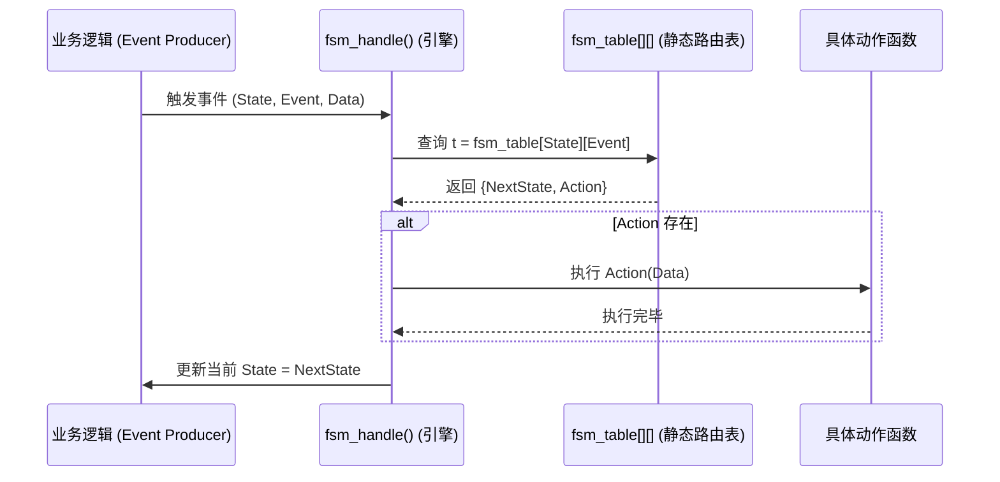
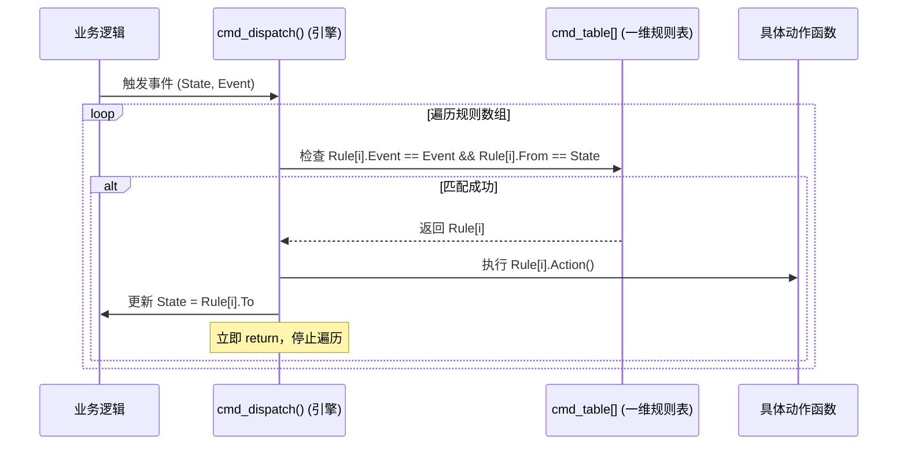

这份关于 C 语言状态机设计的[微信文章](https://mp.weixin.qq.com/s?__biz=MzY4NjM5OTQ0MQ==&mid=2247483719&idx=1&sn=96afff5fc8bc6f1ff550c4166d9719e7&chksm=f2f455f59dd50460ba3208ec2f3f5dc7f930ba39150ff74aaebc262f3fa9012ae5fcf6ed668f&mpshare=1&scene=1&srcid=0910IcbL1XfoOHyMmpHH2u5k&sharer_shareinfo=0c1b300b717d433180cbc2c09327b569&sharer_shareinfo_first=0c1b300b717d433180cbc2c09327b569&utm_source=gemini#rd)非常契合底层软件开发的痛点。在 Linux 内核（如 TCP 状态机、设备驱动模型）和大型开源项目（如 QEMU、各类协议栈）中，几乎见不到冗长的 `switch-case` 嵌套，取而代之的正是文章中提到的数据驱动（Data-Driven）思想。

  

作为习惯了 `switch-case` 的开发者，你的思维惯性往往是“控制流”导向的。下面我们将以 `switch-case` 为锚点，通过费曼技巧（Feynman Technique）将复杂的重构理念转化为直观的现实隐喻，帮你完成思维迁移，并提供标准的设计模型和 UML 图例。

  

### 第一阶段：思维迁移（破除 Switch-Case 执念）

#### 你的现状：Switch-Case 模式（控制流思维）

目前你写状态机，脑海里是一个“尽职尽责但极其劳累的分拣员”（CPU）：

包裹（Event）来了，分拣员先看包裹现在的状态（外层 `switch(state)`），然后在一堆规则里挨个比对这是什么包裹（内层 `switch(event)`），找到匹配的逻辑后，亲自把包裹盖章、扔进下一个筐里（更新 state）。

  

- **痛点**：规则全记在脑子里（硬编码在逻辑中）。新加一个状态，分拣员脑子就要多记几十条规则，最终大脑宕机（代码圈复杂度爆炸，无法维护）。
    
      
    

#### 目标思维：数据驱动模式（数据流思维）

在 GitHub 的优秀开源项目中，核心思想是“状态与动作的分离”**。 分拣员（CPU）不再记规则了，而是拿到一本**《操作手册》（数据结构/表格）。包裹来了，分拣员什么都不用想，直接翻开手册的第 X 页 第 Y 行（查表），手册上写着“盖合格章，扔进3号筐”，分拣员照做即可。

  

- **跃迁关键**：将状态机的“控制逻辑（If/Else）”**抽离出来，变成静态的**“数据结构（Struct Array）”。
    
      
    

### 第二阶段：三大状态机设计模型教程

根据文档，我们将这本《操作手册》的编写形式分为三种经典模型。

  

#### 模型一：二维查表法（The 2D Table-Driven Pattern）

这是在嵌入式和内核开发中最经典、最高效的写法（O(1) 复杂度）。

  

- **费曼比喻**：九九乘法表。横轴是状态，纵轴是事件，交叉点就是动作和下一个状态。
    
      
    
- **核心组成图**：
    
      
    

|**状态(行) \ 事件(列)**|**EV_A (事件 A)**|**EV_B (事件 B)**|
|---|---|---|
|**ST_IDLE (空闲)**|`{ST_RUN, do_start}`|`{ST_ERROR, do_err}`|
|**ST_RUN (运行)**|`{ST_RUN, ignore}`|`{ST_STOP, do_stop}`|

- **UML 序列图**：
    
      
    

代码段



#### 模型二：一维规则表/命令模式（The Rule-Array Pattern）

适用于状态矩阵非常稀疏（很多空白格子）的场景，为了节省内存（特别是 MCU 极其有限的 RAM/ROM）。

  

- **费曼比喻**：字典。不需要给所有不存在的词语留空白，只把“有效的规则”按顺序列出来。分拣员从头翻到尾，找到匹配的规则就执行。
    
      
    
- **核心组成图**：一条规则由 4 个元素组成一个 Struct。
    
      
    

|**规则集合 (Array)**|**触发事件 (Event)**|**当前状态 (From)**|**目标状态 (To)**|**执行动作 (Action)**|
|---|---|---|---|---|
|Rule[0]|EV_A|ST_IDLE|ST_RUN|do_start()|
|Rule[1]|EV_B|ST_IDLE|ST_ERROR|do_err()|
|Rule[2]|EV_B|ST_RUN|ST_STOP|do_stop()|

- **UML 序列图**：
    
      
    

代码段



#### 模型三：注册法 / 观察者模式（The Registration Pattern）

适用于系统极为庞大，或者各模块解耦要求极高的场景（类似于 Linux 驱动模型中的设备与驱动匹配注册）。框架不知道有哪些规则，业务模块在初始化时主动“挂载”自己的处理逻辑。

  

- **费曼比喻**：医院挂号大厅。大厅（框架）不知道有哪些医生，心内科、骨科医生上班时自己来大厅的牌子上挂个名（注册）。病人（事件）来了，大厅根据牌子上的匹配关系指引病人去找对应的医生。
    
      
    
- **核心组成图**：包含一个动态的槽位池（Slot Pool）。
    
      
    

|**动态槽位池 (RAM)**|**注册状态**|**注册事件**|**回调函数 (Handler)**|**是否占用**|
|---|---|---|---|---|
|Slot[0]|ST_IDLE|EV_A|on_idle_a_handler()|True|
|Slot[1]|ST_RUN|EV_B|on_run_b_handler()|True|
|Slot[2] (空闲)|-|-|NULL|False|

- **UML 序列图**：
    
      
    

代码段

```
sequenceDiagram
    participant Module as 独立业务模块
    participant FSM_Core as 状态机注册中心
    participant App as 外部触发源

    Note over Module, FSM_Core: 系统初始化阶段 (Init)
    Module->>FSM_Core: register_handler(ST_IDLE, EV_A, my_handler)
    FSM_Core->>FSM_Core: 占用空闲 Slot，保存映射关系
    
    Note over App, FSM_Core: 运行时阶段 (Runtime)
    App->>FSM_Core: 派发事件 dispatch(State, Event)
    loop 遍历 Slot 槽位池
        FSM_Core->>FSM_Core: 寻找匹配的 State 和 Event
        alt 匹配成功
            FSM_Core->>Module: 调用 my_handler(State, Data)
            Note over Module: 模块内部自己决定是否改变 *State
        end
    end
```

### 总结：底层软件开发的第一性原理

当你下次面对复杂的驱动状态流转、协议解析或硬件通信流程时，不要急着敲 `switch`，请回想**状态机的第一性原理**：

  

> **第一性原理：状态转换本质上是一个纯数学函数 $S_{next} = f(S_{current}, Event)$，而附带的硬件操作（Action）只是这个映射过程中的副作用（Side Effect）。**
> 
>   

**核心要点：**

  

1. **分离“引擎”与“数据”**：让执行流（查表、派发的 `dispatch` 函数）保持极度精简，这部分代码写完永远不用改；让业务逻辑（复杂的转换关系）变成静态数据（`static const struct`），放在只读存储器（ROM）中，随时增删。
    
      
    
2. **契约式设计（统一签名）**：所有的动作函数（Action）必须拥有完全一致的形参和返回值（例如 `typedef void (*action_fn_t)(void *ud);`），这是能够使用函数指针进行查表的前提。
    
      
    
3. **确定性优先**：在底层和嵌入式开发中，通常首选“二维查表法（模型一）”。虽然在稀疏图中可能浪费少许字节，但它换来的是 $O(1)$ 的绝对确定性执行时间、极强的代码可读性，以及消除因为冗长分支预测失败导致的 CPU 流水线冲刷性能损耗。