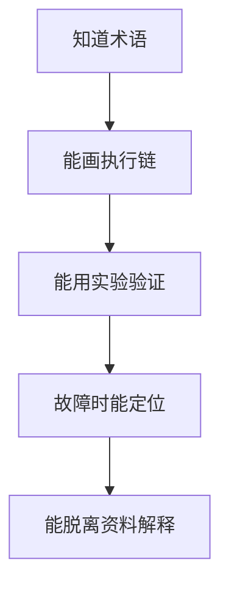

# 学习执行方法

## 1. 每天 2 小时不是“看两小时资料”

推荐固定节奏：

| 时间 | 动作 | 目的 |
|---|---|---|
| 0-15 min | 闭卷回忆、画昨天执行链 | 强制检索，而不是重复阅读 |
| 15-50 min | 原理与难点 | 建立精确心智模型 |
| 50-105 min | Lab + 故障注入 | 把模型与真实系统对象绑定 |
| 105-120 min | 日志、README、commit | 把经验变成可复现资产 |

纯下载时间（ISO、`west update`、SDK）不计入 2 小时主动学习。可以让下载后台运行，但不要用等待时间扩展新知识线。

## 2. 三层掌握标准



只有达到 D/E 才视为目标能力完成。

## 3. AI 使用规则

AI 可以用于：

- 解释编译错误；
- 检查你已经写好的代码；
- 对比官方文档与自己的理解；
- 生成故障注入思路；
- review README。

AI 不用于：

- 第一次就生成完整 Driver；
- 直接给出实验最终配置而你不读原理图/官方文档；
- 代替你分析 `dmesg` / `ftrace`；
- 用“看起来合理”的 pin/address 替代板级资料。

## 4. 实验日志格式

每次实验保存：

```text
Date:
Host:
Target:
Kernel/Zephyr version:
Command:
Expected:
Actual:
Difference:
Root cause:
Fix:
What I learned:
```

原始 log 不要只截图；优先保存为 `.log`，方便 grep/diff。

## 5. 每周复盘

每周最后一天不扩展新知识。完成：

1. 从空 shell 重现环境；
2. 随机抽 3 个机制闭卷画图；
3. 把本周最难问题用 3 分钟讲清；
4. 清理笔记中的“我大概知道”；
5. 写出下周的明确入口条件。
