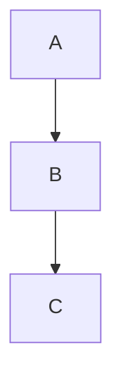
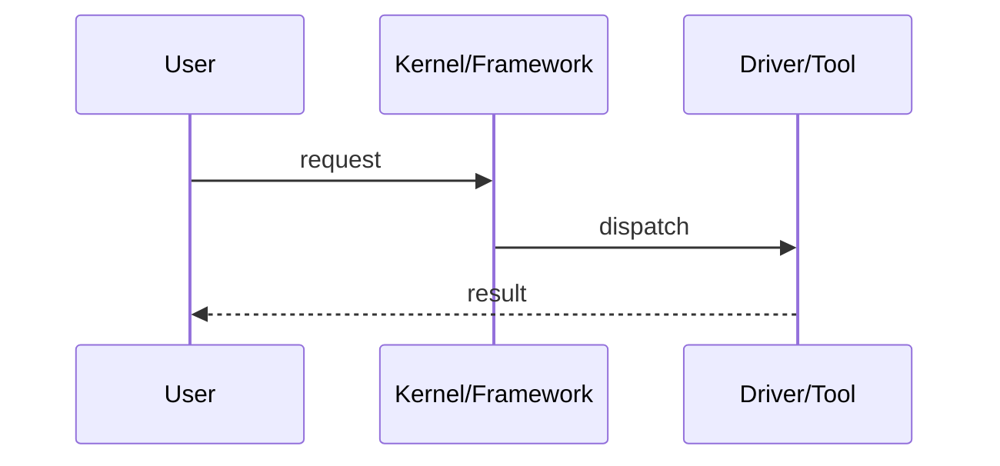

# WxxDxx - 标题

> 本模板用于写“教程”，不是日程清单。核心章节 0/1/3/7/8/9/11/12/14/16 不得省略；UML 时序图仅在存在真正时序关系时使用。

## 0. 今日定位
- 所属能力：
- 前置知识：
- 硬件：
- 软件：
- 主动学习时间：约 2h
- 今日最终产物：
- 与 20 周总目标的关系：

## 1. 今天解决的工程问题
说明工程场景、为什么要学、学完能排除哪类问题。

## 2. 今日能力构成


图必须回答“今天学的东西在系统哪里”，禁止装饰性流程图。

## 3. 先理解：费曼解释

### 3.1 30 秒白话模型
先不用术语说清本质。

### 3.2 精确工程模型
说明白话类比在哪些地方不准确，进入真实对象/接口/执行时机。

### 3.3 常见错误理解
至少列 2 个。

## 4. 原理
### 4.1 关键对象/数据结构
### 4.2 数据流/控制流
### 4.3 生命周期
### 4.4 与 MCU/RTOS 已有知识映射

## 5. 结构/机制图



## 6. UML/时序图（仅需要时）



## 7. 阅读资料

### 7.1 本地 PDF
- `SRC-F407-SCH`
  - 页码：p.3
  - 阅读目标：确认 W25Q128 与 SPI1 的真实连接

### 7.2 官方文档
- 文档标题：...
- 链接：https://...
- 阅读目标：...

### 7.3 源码
- `path/to/file.c`
- 只追本日核心调用路径，不漫游。

## 8. 实验准备
- 接线：
- Host/Target：
- Git branch：`study/wxxdxx-topic`
- baseline：

## 9. Lab 1 - 标题
### 9.1 原理
### 9.2 操作
### 9.3 命令逐条解释
### 9.4 预期结果
### 9.5 结果不同时如何判断

## 10. Lab 2（没有第二个独立实验时可省略）

## 11. 故障注入
主动制造一个**可恢复**的错误，记录症状、证据、根因、恢复。

## 12. 调试路径
遵循：

```text
日志 → 系统对象 → trace/工具 → 源码 → 寄存器/硬件
```

## 13. 源码追踪
只追 1~2 条当天核心路径。

## 14. 今日验收
写明确 Pass/Fail，不使用“理解即可”。

## 15. 面试式复述
5~10 个问题，要求脱离笔记口述。

## 16. Git 交付物
- code/config
- raw log
- README
- commit message

## 17. 明日连接
今天产物如何成为下一天输入。
