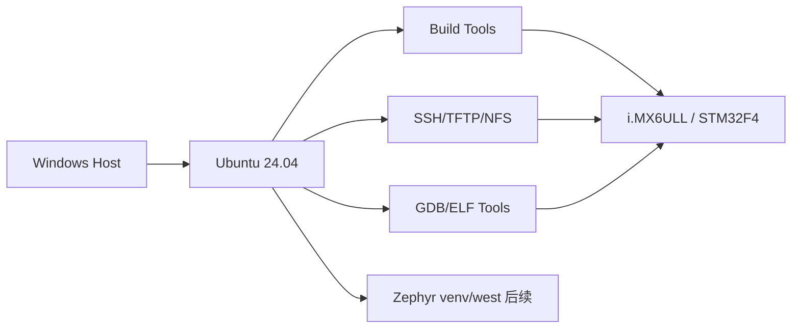
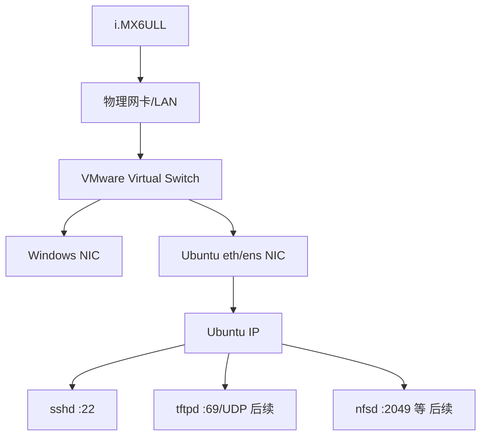

# W01D01 - Ubuntu 主开发环境：先把“开发机”做成可复现系统

## 0. 今日定位

- 所属能力：Embedded Linux 开发基础设施
- 前置知识：Windows 基本使用、IP 地址基本概念
- 硬件：Windows PC；今天不要求连接 6ULL
- 软件：VMware Workstation、Ubuntu 24.04 LTS
- 主动学习时间：约 2h（ISO/apt 下载等待不计）
- 今日最终产物：`host-baseline.txt`、Ubuntu 快照、`hello_x86`
- 与总目标关系：后面所有 Kernel/Driver/Zephyr 实验都依赖今天环境，不允许“每次出错先怀疑电脑”。

## 1. 今天解决的工程问题

很多嵌入式 Linux 初学者一上来就在板子上敲命令，结果后面遇到问题时无法区分：

- 是 VM 网络坏了？
- 是交叉编译器没生效？
- 是 NFS 服务没启动？
- 是板端路由错了？
- 是旧 BSP 依赖与新 Ubuntu 冲突？

大厂环境的第一原则不是“软件装得多”，而是**环境可以被描述、被验证、被重建**。

## 2. 今日能力构成



## 3. 先理解：费曼解释

### 3.1 30 秒白话模型

把 Windows 看成你的办公室，Ubuntu VM 看成一个**标准化实验台**。板子以后只跟这个实验台说话。实验台的 IP、工具版本、目录位置都固定，你才能知道故障发生在“实验对象”而不是“实验台本身”。

### 3.2 精确工程模型

VMware 在 Windows 上虚拟出 CPU、memory、disk、NIC。Ubuntu 认为自己运行在一台独立 PC 上。网络模式决定虚拟 NIC 与物理 LAN 的关系：

- **Bridged**：VM 像局域网里另一台真实主机，适合 6ULL ↔ Ubuntu 双向访问；
- **NAT**：VM 通过 Host 做地址转换，上网方便，但板子主动访问 VM 时多一层映射；
- **Host-only**：只与 Host/同 host-only 网络通信，隔离强，但不适合默认板卡网络拓扑。

课程默认 Bridged，是为了让：

```text
Ubuntu VM <----same L2/L3 LAN----> i.MX6ULL
```

### 3.3 常见错误理解

1. “NAT 能上网，所以肯定最适合开发板。”——错。上网只是一个需求，TFTP/NFS 要求 Target 能稳定访问 Host service。
2. “Ubuntu 版本越老越适合老 BSP。”——不作为主策略。主环境保持当前维护版本，旧 BSP 的 host compatibility 用容器/次级环境隔离。
3. “安装完成就算环境好了。”——错。没有版本清单和复现步骤的环境不可审计。

## 4. 原理

### 4.1 Host、VM、Target 三个边界

```text
Windows：UI/资料/VM 宿主
Ubuntu：编译、服务、调试
Target：运行 ARM Linux/Zephyr
```

以后看到一个命令，先问：**它应该在哪台机器执行？**

### 4.2 为什么 Ubuntu 24.04

Zephyr 当前 Getting Started 官方覆盖 Ubuntu 24.04 LTS+。Linux 主线仍可编译较旧的 vendor BSP；若某旧脚本只兼容旧 Host，单独隔离，不让老依赖污染整个学习环境。

### 4.3 Snapshot 不是备份代码

VM snapshot 保存的是系统状态，用于回到“工具安装完成且网络正常”的基线；源代码仍必须 Git 管理。不要把 snapshot 当版本控制。

## 5. 结构/机制图



## 6. UML/时序图

今天没有需要强行画的复杂运行时协议时序。重点是静态拓扑和可复现性。

## 7. 阅读资料

### 7.1 本地/厂商资料

- `SRC-IMX6ULL-DRV`
  - 第 4 章“开发环境搭建”。
  - 阅读目标：看厂商原始工作流，不要照抄其旧 Ubuntu/旧工具版本。
  - 可跳过：IDE 皮肤、与课程无关的编辑器插件。

- `SRC-IMX6ULL-TFTP-NFS`
  - 今天只看网络拓扑图，不配服务。

### 7.2 官方文档

- Zephyr Getting Started（用于确认主 Host 发行版选择）：
  https://docs.zephyrproject.org/latest/develop/getting_started/

## 8. 实验准备

建议 VM：

```text
4~8 vCPU
8 GB RAM（后续 Yocto 建议 16 GB+）
100~200 GB virtual disk
Network Adapter: Bridged
```

VMware 中先确认桥接到真正连接开发板/LAN 的物理 NIC。笔记本 Wi-Fi 与 USB Ethernet 同时存在时，不要让 “Automatic” 悄悄桥错网卡。

Git 分支：

```bash
mkdir -p ~/work/course
cd ~/work/course
git init
git switch -c study/w01d01-host
```

## 9. Lab 1 - 安装最小开发工具并建立基线

### 9.1 创建目录

```bash
mkdir -p ~/work/{src,toolchains,nfs,tftp,logs,course}
tree -L 2 ~/work
```

这里没有“神秘规定”。目的是让源码、工具链、网络共享和日志有固定职责，后面路径不会散落在 Desktop/Downloads。

### 9.2 安装工具

```bash
sudo apt update
sudo apt install -y \
  build-essential git cmake ninja-build \
  python3 python3-venv python3-pip \
  openssh-server tmux tree \
  gdb gdb-multiarch binutils \
  tftp-hpa tftpd-hpa \
  nfs-common nfs-kernel-server \
  curl wget unzip xz-utils file
```

你现在只要求 package 安装成功；TFTP/NFS 配置在 Day 4。

- `build-essential`：Host C/C++ 编译基本工具；
- `binutils`：`readelf/objdump/nm` 等；
- `gdb-multiarch`：后续跨架构调试；
- `openssh-server`：让 Windows/其他设备主动进入 VM；
- `nfs-kernel-server` / `tftpd-hpa`：后续 Host service。

### 9.3 SSH 服务

```bash
sudo systemctl enable --now ssh
systemctl status ssh --no-pager
ss -lntp | grep ':22'
```

`systemctl` 看“服务管理状态”；`ss` 看“socket 是否真的监听”。这是两个不同证据。

在 Windows PowerShell：

```powershell
ssh <ubuntu-user>@<ubuntu-ip>
```

### 9.4 编译第一个 Host ELF

```bash
cat > ~/work/course/hello.c <<'EOF'
#include <stdio.h>
int main(void) {
    puts("host baseline ok");
    return 0;
}
EOF

gcc -Wall -Wextra -O0 -g ~/work/course/hello.c -o ~/work/course/hello_x86
~/work/course/hello_x86
file ~/work/course/hello_x86
```

预期看到 `ELF 64-bit ... x86-64`。Day 2 会拿它与 ARM ELF 对比。

### 9.5 保存版本基线

```bash
{
  date -Is
  uname -a
  lsb_release -a
  gcc --version | head -1
  cmake --version | head -1
  ninja --version
  python3 --version
  git --version
  ip -br addr
  ip route
} | tee ~/work/logs/host-baseline.txt
```

### 9.6 做 snapshot

关闭无关应用，VMware 创建 snapshot：`ubuntu24-baseline-w01d01`。

## 10. Lab 2 - 识别 bridged 与 NAT 的差异

先记录 Bridged：

```bash
ip -br addr
ip route
```

在 VMware 临时改为 NAT，再运行同样命令。你应看到 IP/网关所属网络发生变化。然后**恢复 Bridged**。

目标不是背 VMware，而是训练：“拓扑变化会在 Linux 网络对象上留下什么证据”。

## 11. 故障注入

### 故障 A：停止 SSH

```bash
sudo systemctl stop ssh
```

Windows 再 SSH，应失败。不要马上启动，先在 VM 执行：

```bash
systemctl status ssh --no-pager
ss -lntp | grep ':22' || echo 'port 22 not listening'
```

恢复：

```bash
sudo systemctl start ssh
```

### 故障 B：错误网络模式

把 VM 改 NAT，记录 Windows/VM 的 IP、route。理解为什么后面板卡直连场景可能访问不到 VM service。恢复 Bridged。

## 12. 调试路径

```text
SSH 不通
→ VM 是否启动/有 IP (`ip -br addr`)
→ route 是否合理 (`ip route`)
→ Host 能否 ping VM
→ ssh service 是否 active
→ 22 端口是否监听 (`ss`)
→ firewall
→ VMware virtual NIC / bridge target
```

不要第一步就“重装 Ubuntu”。

## 13. 源码追踪

今天不追 Kernel 源码。你要建立的是**工具与系统对象的观测习惯**。

## 14. 今日验收

全部满足才 Pass：

- [ ] Ubuntu 24.04 可启动；
- [ ] VM 为 Bridged，IP/route 已记录；
- [ ] Windows 能 SSH 进入 VM；
- [ ] VM 能访问 Internet；
- [ ] `hello_x86` 编译运行；
- [ ] `host-baseline.txt` 已保存；
- [ ] snapshot 已创建；
- [ ] 你能用 60 秒解释 NAT/Bridged/Host-only 的差异。

## 15. 面试式复述

1. 为什么 BSP 开发更适合 VM 与板子处于同一 LAN？
2. service active 与端口监听有什么区别？
3. 为什么环境版本要进入日志？
4. 主 Ubuntu 与旧 BSP 依赖冲突时你怎么处理？
5. snapshot 和 Git 的职责有什么不同？

## 16. Git 交付物

```text
hello.c
logs/host-baseline.txt
notes/W01D01.md
```

建议 commit：

```bash
git add .
git commit -m "study: establish Ubuntu embedded Linux host baseline"
```

## 17. 明日连接

Day 2 会在这台 Host 上同时生成 x86 与 ARM ELF。今天的 `hello_x86` 是对照组。
