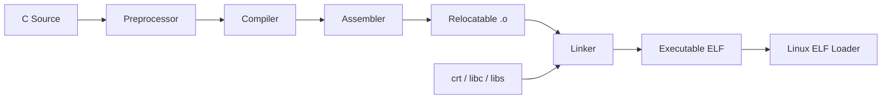
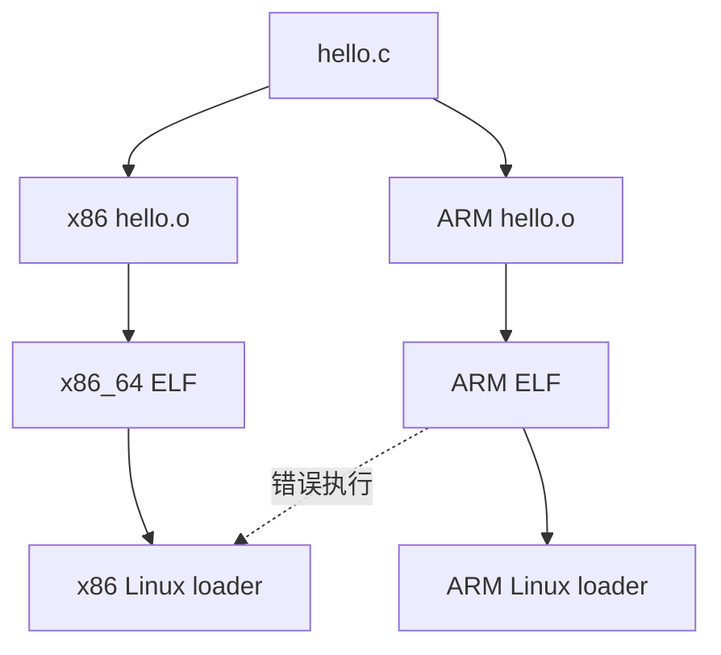
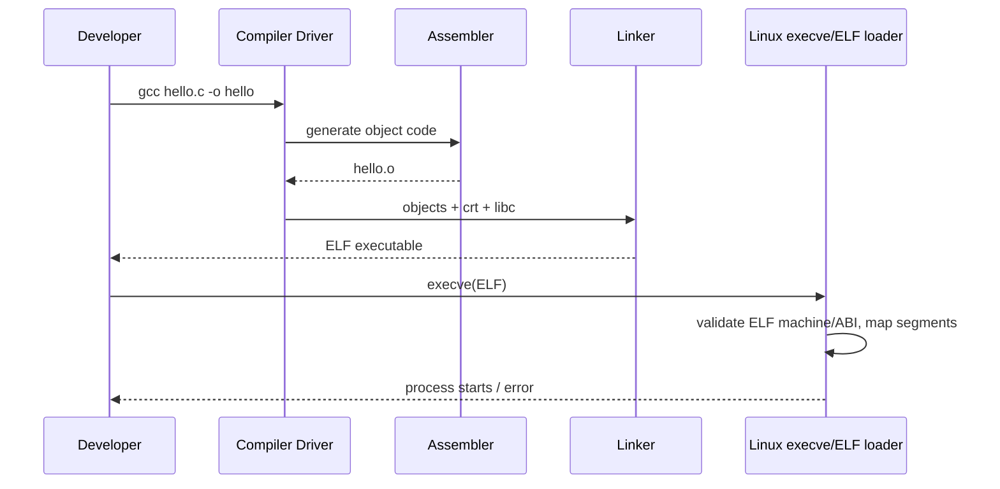

# W01D02 - 交叉编译与 ELF：把你熟悉的 MCU 链接知识迁移到 Linux

## 0. 今日定位

- 所属能力：Toolchain / ABI / ELF
- 前置：W01D01 Pass
- 硬件：无需板卡即可完成核心实验
- 软件：Host GCC、ARM GNU/Linux cross compiler、binutils
- 主动学习时间：约 2h
- 最终产物：`elf_compare.md` + x86/ARM 两份 ELF + `readelf` 原始输出

## 1. 今天解决的工程问题

后面你会频繁遇到：

- “这个 `.so` 为什么加载不了？”
- “为什么动态程序在板上报 `No such file or directory`，文件明明存在？”
- “为什么 kernel module 架构不匹配？”
- “linker script 与 Linux ELF 有什么联系？”

你已经熟悉 MCU startup/linker/memory map。今天不是从零学编译，而是把已有模型升级到 Linux ABI/loader 语境。

## 2. 今日能力构成



## 3. 先理解：费曼解释

### 3.1 30 秒白话模型

编译器不是“把 C 直接变成程序”的魔盒。每个 `.c` 先变成带符号/重定位信息的 `.o`，linker 再决定“哪些东西放到一起、符号地址怎么解、程序怎么加载”。交叉编译只是**这个流水线最后产出的机器指令和 ABI 是给另一台 CPU/OS 用的**。

### 3.2 精确工程模型

GNU triplet 例如：

```text
x86_64-linux-gnu
arm-linux-gnueabihf
```

不是只描述 ISA。它还涉及 OS/ABI conventions。`gnueabihf` 表示 GNU EABI hard-float 环境。动态链接时，程序还依赖 Target 的 dynamic loader 和 shared libraries。

### 3.3 section 与 segment

这是高频混淆点。

- **Section**：linker/debugger 视角。`.text/.rodata/.data/.bss/.symtab` 等；
- **Segment**：loader/MMU 映射视角。Program Header 里的 `PT_LOAD` 等；
- 多个 section 可以被放入一个 segment；
- 执行时 loader 主要看 Program Headers，不需要把 `.symtab` 这类调试/链接信息映射进内存。

费曼类比：section 是仓库里按“货物种类”分箱；segment 是运输时按“这一车怎么装、权限是什么”分车。

## 4. 原理

### 4.1 与 MCU linker script 的迁移

你在 Cortex-M 中熟悉：

```text
.text → FLASH
.data load → FLASH, run → SRAM
.bss → SRAM
vector table → 固定入口
```

Linux user ELF 仍有这些内容，但最终 VA 布局由 ELF Program Header + Linux loader + dynamic linker 共同处理；不再由你给每个应用固定物理 Flash/SRAM 地址。

### 4.2 Sysroot

Sysroot 不是“一个普通 include 目录”，而是 cross toolchain 看到的 Target 文件系统编译视图：

```text
sysroot/
├── usr/include
├── usr/lib
├── lib
└── ...
```

头文件与库版本必须与 Target ABI 匹配。Yocto SDK 本质上也会给你构建这样的目标环境。

## 5. 结构图



## 6. UML/时序图



## 7. 阅读资料

- `SRC-IMX6ULL-DRV`
  - 第 3~4 章中 GCC/交叉编译器与开发环境相关小节；
  - 阅读目标：核对正点原子 BSP 原始工具链命名；
  - 不要求今天使用其旧 Linaro 版本作为唯一工具链。
- `SRC-IMX6ULL-APP`
  - 第一章末尾关于 Ubuntu `gcc` 与提高篇 ARM gcc 的开发方式。
- `man elf`, `man ld.so`, `man execve` 作为 Host reference。

## 8. 实验准备

先确认是否已有 ARM compiler：

```bash
which arm-linux-gnueabihf-gcc || true
arm-linux-gnueabihf-gcc --version || true
```

Ubuntu 可安装发行版工具链用于今天的 ELF 实验：

```bash
sudo apt install -y gcc-arm-linux-gnueabihf binutils-arm-linux-gnueabihf
```

后续真正编译正点原子 BSP/应用时，以 BSP/SDK 指定 toolchain 为准。

## 9. Lab 1 - 同一源代码生成两种架构 ELF

```bash
cd ~/work/course
cat > hello_arch.c <<'EOF'
#include <stdio.h>
int global_init = 42;
int global_bss;
static const char banner[] = "ELF architecture lab";
int main(void) {
    printf("%s init=%d bss=%d\n", banner, global_init, global_bss);
    return 0;
}
EOF

gcc -O0 -g hello_arch.c -o hello_x86
arm-linux-gnueabihf-gcc -O0 -g hello_arch.c -o hello_arm
file hello_x86 hello_arm
```

你应该看到：一个 `x86-64`，一个 `ARM`。

### ELF Header

```bash
readelf -h hello_x86 | tee ~/work/logs/x86-elf-header.log
readelf -h hello_arm | tee ~/work/logs/arm-elf-header.log
```

重点比较：

- Class；
- Data endian；
- Machine；
- Entry point；
- Program Header/Section Header 数量。

### Section Headers

```bash
readelf -S hello_x86 > ~/work/logs/x86-sections.log
readelf -S hello_arm > ~/work/logs/arm-sections.log
```

查：

```bash
grep -E '\.(text|rodata|data|bss)' ~/work/logs/*sections.log
```

### Program Headers / Segments

```bash
readelf -l hello_x86 | less
readelf -l hello_arm | less
```

特别看最后的 `Section to Segment mapping`。这就是“section 如何被 loader segment 包起来”的直接证据。

### Symbols

```bash
nm -n hello_x86 | grep -E 'main|global_init|global_bss|banner'
arm-linux-gnueabihf-nm -n hello_arm | grep -E 'main|global_init|global_bss|banner'
```

### Disassembly

```bash
objdump -d hello_x86 | less
arm-linux-gnueabihf-objdump -d hello_arm | less
```

不用读完汇编，只找 `main`，观察 ISA 完全不同。

## 10. Lab 2 - 动态依赖与 interpreter

```bash
readelf -l hello_x86 | grep -A1 INTERP
readelf -l hello_arm | grep -A1 INTERP
readelf -d hello_arm | grep NEEDED
```

ARM ELF 的 interpreter 路径是给 ARM Target filesystem 用的。它解释了一个经典现象：文件存在但 `execve()` 因动态加载器不存在而可能表现为“找不到文件”。

## 11. 故障注入

```bash
./hello_arm
```

在 x86_64 Host 上预期：

```text
cannot execute binary file: Exec format error
```

调试不要看源码，先：

```bash
file hello_arm
readelf -h hello_arm | grep Machine
uname -m
```

三个证据已经能定位“Host/Target 架构错配”。

## 12. 调试路径

```text
程序运行失败
→ file
→ readelf -h（Machine/ABI）
→ readelf -l（INTERP/LOAD）
→ readelf -d / ldd（动态依赖）
→ Target loader/libs/sysroot
→ 再看源码
```

这比“重新编译试试”有效得多。

## 13. 源码追踪

今天不追 glibc/kernel loader 实现。只记住 Linux 用户态入口：

```text
shell
→ execve()
→ kernel binary format handler
→ ELF loader
→ map PT_LOAD
→ dynamic interpreter（动态 ELF）
→ user entry
```

Week 2 讲 syscall 时再深入。

## 14. 今日验收

- [ ] 同一 `.c` 生成 x86/ARM ELF；
- [ ] 能用 `file/readelf/objdump/nm` 说明差异；
- [ ] 能从 `readelf -l` 指出至少一个 LOAD segment 包含哪些 sections；
- [ ] 主动触发 `Exec format error` 并仅用系统证据定位；
- [ ] 60 秒说明 section vs segment；
- [ ] 说明 sysroot 解决什么问题。

## 15. 面试式复述

1. 交叉编译器与普通编译器的本质区别？
2. triplet 只代表 CPU 吗？
3. ELF section 与 segment 谁面向 linker、谁面向 loader？
4. `.bss` 为什么通常不需要在文件里存放同等大小的零？
5. 动态 ELF 为什么依赖 interpreter？
6. “文件明明存在却 No such file”可能是什么原因？
7. MCU linker script 知识如何迁移到 Linux ELF？

## 16. Git 交付物

```text
hello_arch.c
hello_x86
hello_arm
elf_compare.md
logs/*elf*.log
```

Commit：

```bash
git add .
git commit -m "study: compare x86 and ARM ELF execution models"
```

## 17. 明日连接

Day 3 把 ARM Target 真正接进来。你将开始区分“编译出的 ARM 文件”与“板端如何启动/如何访问”的两条路径。
