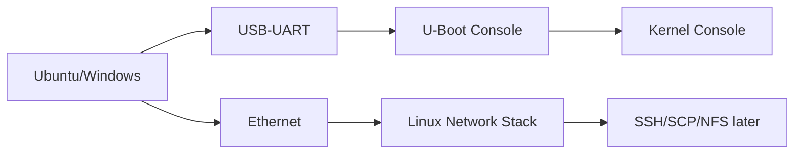
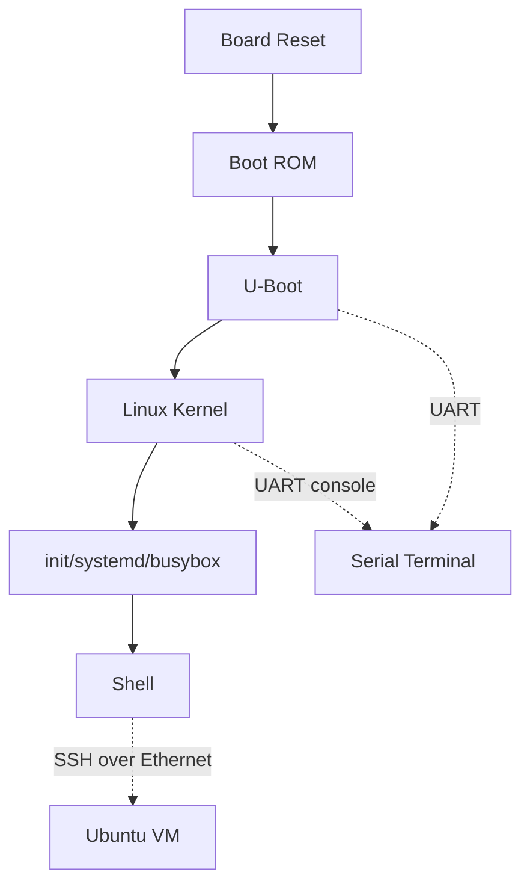
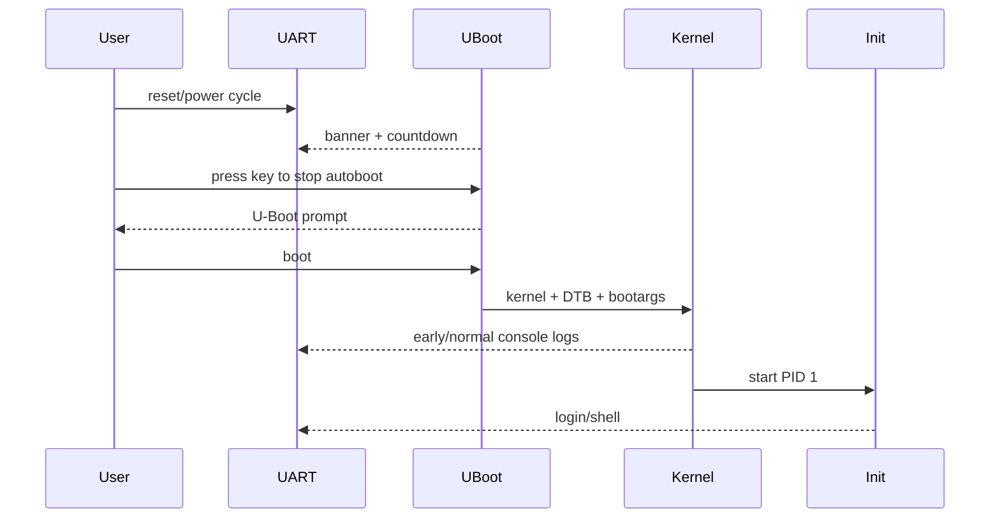

# W01D03 - i.MX6ULL 串口与网络：建立两个独立控制面

## 0. 今日定位

- 所属能力：Target bring-up 最小控制链
- 前置：W01D01/W01D02 Pass
- 硬件：正点原子 i.MX6ULL、USB-UART、网线
- 软件：串口终端、Ubuntu 24.04
- 主动学习时间：约 2h（下载/大文件构建等待时间不计）
- 最终产物：`uboot.log`、`linux-boot.log`、`board_inventory.md`、网络拓扑图

## 1. 今天解决的工程问题

开发板调试不能只依赖 SSH。Kernel 起不来、网卡 Driver 没 probe、IP 配错时，SSH 先死；你必须有更底层的串口控制面。

今天建立两个互相独立的通道：

```text
Serial control plane：复位后第一时间看到 BootROM/U-Boot/Kernel console
Ethernet control plane：Linux 正常后用于 SSH/SCP/NFS/perf
```

## 2. 今日能力构成



## 3. 先理解：费曼解释

### 3.1 白话模型

串口像“设备的维修口”，网络像“正常业务入口”。设备正常时网络更快；设备最坏的时候，你仍需要维修口告诉你它死在哪一步。

### 3.2 精确模型

U-Boot 与 Linux 可以使用同一个 UART 硬件，但它们是**两个不同软件阶段**，各自初始化 UART、解析输入、输出 console。Linux 的网卡又需要 clock/pinctrl/MAC/PHY/driver/network config 都正常后才能工作，因此它不是 bring-up 的最低依赖。

### 3.3 常见误解

1. “能看到 Linux 登录就等于 U-Boot 串口没问题。”——你需要实际中断 autoboot，证明可交互。
2. “ping 不通就是网卡 Driver 坏。”——同网段、ARP、route、VM bridge、firewall 任何一层都可能有问题。

## 4. 原理：最小网络模型

本课程不在今天展开完整路由，只掌握四个对象：

- IP address：接口自己的三层地址；
- netmask/prefix：判断目标是否本地直连；
- ARP/neighbour：同一 IPv4 LAN 中把目标 IP 解析成 MAC；
- default route：目标不在直连网段时交给网关。

如果 VM 和 6ULL 在同一 `/24`：

```text
6ULL 192.168.10.20/24
Ubuntu 192.168.10.10/24
```

二者通信**不需要默认网关参与**，只需 ARP + Ethernet。

## 5. 结构图



## 6. 时序图：复位后你看到的不是一个程序



## 7. 阅读资料

- `SRC-IMX6ULL-TFTP-NFS`：今天只看其“电脑/Ubuntu/开发板网络拓扑”，对应你实际直连或交换机连接方式。
- `SRC-IMX6ULL-DRV` 第 4 章：串口软件/开发环境部分用于对照厂商默认连接。

> 串口波特率不要由教程猜。正点原子 6ULL 常见 console 为 115200 8N1，但你必须从板卡手册、现有 U-Boot env 或 bootargs 中核实。记录实际值。

## 8. 实验准备

先创建目录：

```bash
mkdir -p ~/work/logs/w01d03
```

插上 USB-UART 后：

```bash
dmesg --follow
```

另一终端：

```bash
ls -l /dev/ttyUSB* /dev/ttyACM* 2>/dev/null
```

Linux Host 可用 `picocom`：

```bash
sudo apt install -y picocom
picocom -b 115200 /dev/ttyUSB0
```

若你的实际设备/波特率不同，替换参数并在 `board_inventory.md` 记录证据。

## 9. Lab 1 - 捕获 U-Boot 与 Linux boot log

### 9.1 进入 U-Boot

板卡复位，看到 countdown 时按键中断。

在 U-Boot 执行：

```text
version
printenv
bdinfo
```

重点保存：

- `bootcmd`；
- `bootargs`；
- `ipaddr`；
- `serverip`；
- `netmask`；
- `ethaddr`；
- kernel/dtb load address（只记录，不随便修改）。

`printenv` 是后面 TFTP/NFS 的事实来源。

### 9.2 Linux boot

执行原有 `boot` 或让 autoboot 继续。进入 Linux 后：

```bash
uname -a
cat /proc/cmdline
cat /etc/os-release 2>/dev/null || true
ip -br link
ip -br addr
ip route
```

确认 `/proc/cmdline` 中的 `console=` 与串口实际参数。

### 9.3 board inventory

写：

```markdown
# i.MX6ULL Board Inventory
- board exact model/revision:
- boot media:
- U-Boot version:
- Linux version:
- console device/baud:
- Ethernet interface:
- MAC:
- current IP:
- bootcmd:
- bootargs:
```

## 10. Lab 2 - VM 与板子同网段通信

Ubuntu：

```bash
ip -br addr
ip route
```

板端：

```bash
ip -br addr
ip route
```

若板端没有 IP，可**临时**设置（地址按你的实际 LAN 规划）：

```bash
sudo ip addr add 192.168.10.20/24 dev eth0
sudo ip link set eth0 up
```

Ubuntu 假设 `192.168.10.10/24`。双向：

```bash
ping -c 3 192.168.10.20   # Ubuntu
ping -c 3 192.168.10.10   # Board
```

观察 neighbour：

```bash
ip neigh
```

你应该看到对端 IP 对应 MAC。`ping` 成功的最小证据链不是只有 ICMP reply，而是：

```text
link UP → same prefix → ARP neighbour resolved → ICMP works
```

## 11. 故障注入

### 错 prefix

在**串口仍然可用**的前提下，故意把板端临时 IP 从例如 `192.168.10.20/24` 改成 `192.168.99.20/24`，而 Ubuntu VM 保持 `192.168.10.10/24`。此时两端不再处于同一 /24，观察 `ip route`、`ip neigh` 和 `ping` 的变化，然后通过串口恢复正确地址。

不要用“把 `/24` 改成 `/16`”作为必然失败实验：如果双方地址都落在 192.168.x.x，扩大掩码反而可能仍认为对方直连，不能稳定制造你想观察的错误。

### 错 VM 网卡

如果电脑同时有 Wi-Fi 与 USB Ethernet，把 VMware bridge 临时切到错误物理 NIC，观察 VM IP 与板端网络脱离。恢复正确 bridge。

## 12. 调试路径

```text
串口无输出
→ USB 枚举/tty device
→ baud/8N1
→ TX/RX/GND
→ board power/reset
→ boot stage

网络不通
→ ip link
→ carrier/PHY
→ ip addr/prefix
→ ip route
→ ip neigh/ARP
→ ping
→ firewall
→ driver/dmesg（最后才进入）
```

## 13. 源码追踪

今天只识别路径，不读驱动：

- `/proc/cmdline`：Kernel 实际收到的 bootargs；
- `/sys/class/net/eth0`：网卡 device class 入口；
- `/proc/net/route` 或 `ip route`：路由状态。

## 14. 今日验收

- [ ] 串口能看到并交互 U-Boot；
- [ ] 能继续启动 Linux；
- [ ] `uboot.log` 与 `linux-boot.log` 保存；
- [ ] `board_inventory.md` 完成；
- [ ] VM ↔ 6ULL 双向 ping；
- [ ] `ip neigh` 能解释对端 MAC；
- [ ] 你能解释 U-Boot console 与 Linux console 为什么不是一个软件。

## 15. 面试式复述

1. 为什么串口是 bring-up 的最低依赖控制面？
2. 同一 UART 为什么 U-Boot 和 Kernel 都能使用？
3. 同网段 ping 是否需要 default gateway？
4. ARP 解决什么问题？
5. `ip link` UP 就代表物理 link 一定通吗？
6. 网络不通为什么不应该第一步重编 Driver？

## 16. Git 交付物

```text
logs/w01d03/uboot.log
logs/w01d03/linux-boot.log
board_inventory.md
network_topology.md
```

## 17. 明日连接

Day 4 在这个稳定的 Ethernet + U-Boot console 上搭 TFTP/NFS。没有 Day 3 Pass，不做 Day 4。
