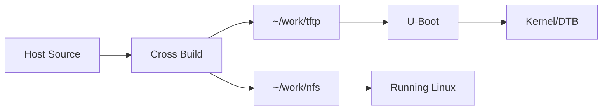
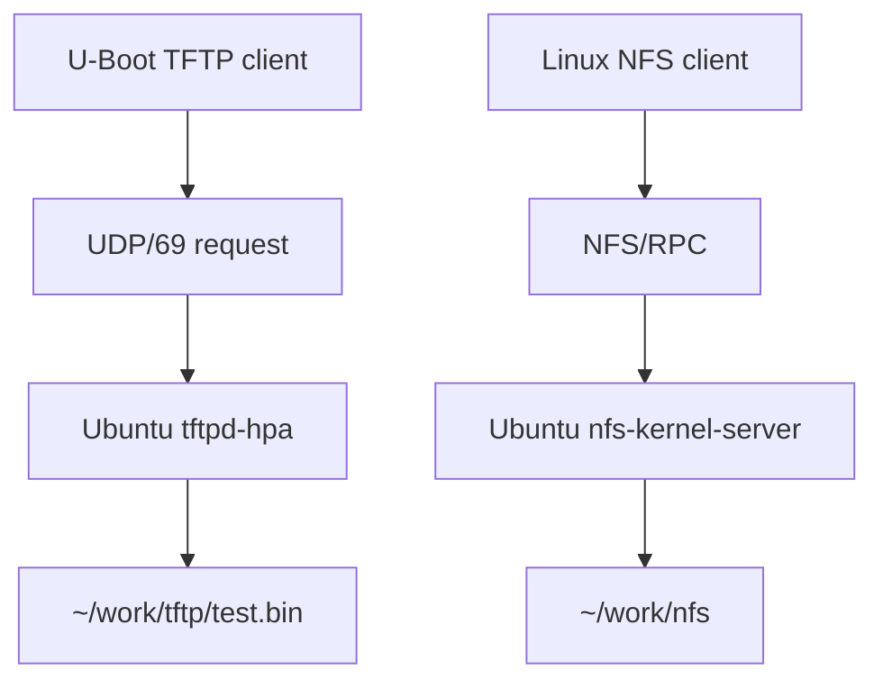
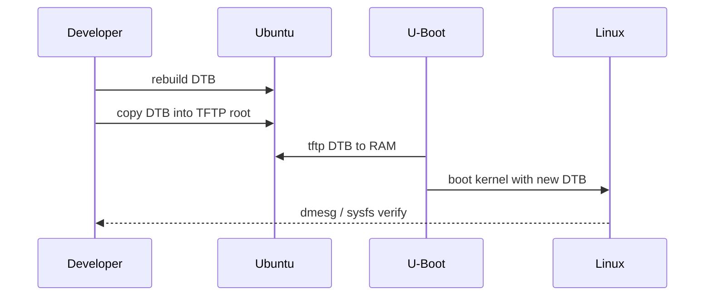

# W01D04 - TFTP + NFS：建立“不烧卡”的 BSP 开发闭环

## 0. 今日定位

- 所属能力：BSP 快速迭代基础设施
- 前置：6ULL 与 Ubuntu 网络双向可达、U-Boot 可交互
- 硬件：i.MX6ULL + Ethernet
- 软件：`tftpd-hpa`、NFS server
- 主动学习时间：约 2h（下载/大文件构建等待时间不计）
- 最终产物：U-Boot TFTP 传输证据、Linux NFS mount、host→target 即时迭代 demo

## 1. 今天解决的工程问题

后面修改一个 DTB 或 Kernel，如果每次都：

```text
编译 → 制作镜像 → 烧 SD/eMMC → 重启
```

你会把大量时间浪费在部署，而不是 Driver。专业 BSP 开发通常把“构建”和“启动/运行”分开：

- U-Boot 从网络拿 `zImage/DTB`；
- Linux 从 NFS 直接读取 Host 上程序/文件，甚至以 NFS root 启动。

## 2. 能力构成



## 3. 先理解：费曼解释

### 3.1 白话模型

TFTP 像“开机前的简易文件快递”：U-Boot 还没有完整 Linux，就能从服务器拉文件到 RAM。NFS 像“把 Ubuntu 的目录远程挂成板子的本地目录”：你在 Host 改文件，Target 立刻看到。

### 3.2 精确工程模型

- TFTP：简单 UDP 文件传输，适合 Bootloader 环境；没有复杂权限/目录语义；
- NFS：Linux VFS 通过网络访问远端文件系统；
- SCP：用户态 SSH 文件复制，适合系统起来后传文件，但每次仍复制一份，不等价于共享目录。

### 3.3 错误理解

1. “TFTP 和 NFS 都是传文件，所以只学一个。”——作用阶段不同。
2. “TFTP 成功就表示 Linux 网络一定成功。”——U-Boot 与 Kernel 使用的是不同网络栈/driver。
3. “NFS root 是今天必须做。”——今天只要求普通 NFS mount；rootfs 网络启动后面 Boot/BSP 周再做。

## 4. 原理

### 4.1 U-Boot TFTP 的关键变量

不要复制网上的固定地址。先：

```text
printenv ipaddr serverip netmask gatewayip loadaddr fdt_addr fdt_addr_r kernel_addr_r
```

不同 U-Boot 配置的变量名称可能不同。**RAM load address 由你现有环境/board config 决定**，教程不猜。

### 4.2 NFS export 的权限模型

Host `/etc/exports` 决定哪些 client、哪些权限能 mount。第一天可以限制到开发网段，例如：

```text
/home/<user>/work/nfs 192.168.10.0/24(rw,sync,no_subtree_check,no_root_squash)
```

`no_root_squash` 方便嵌入式实验，但生产网络要理解它放大了 root 权限风险，只在隔离开发 LAN 使用。

## 5. 结构图



## 6. 时序图：一次快速 DTB 迭代以后会是什么样



## 7. 阅读资料

- `SRC-IMX6ULL-TFTP-NFS`：按你的真实拓扑阅读对应章节；不要机械复制其中旧 Ubuntu 的网络配置方式。
- `SRC-IMX6ULL-DRV`：开发环境/网络部分作为厂商 BSP 上下文。

## 8. 实验准备

确认 Day 3：

```bash
# Ubuntu
ping -c 2 <board-ip>
# Board
ping -c 2 <ubuntu-ip>
```

### 配 TFTP root

Ubuntu：

```bash
sudo mkdir -p /srv/tftp
sudo chown -R "$USER":"$USER" /srv/tftp
printf 'w01d04 tftp ok\n' | sudo tee /srv/tftp/w01d04.txt
```

检查 `/etc/default/tftpd-hpa`：

```text
TFTP_DIRECTORY="/srv/tftp"
TFTP_ADDRESS=":69"
TFTP_OPTIONS="--secure --create"
```

然后：

```bash
sudo systemctl restart tftpd-hpa
sudo systemctl status tftpd-hpa --no-pager
ss -lunp | grep ':69'
```

## 9. Lab 1 - U-Boot TFTP 小文件

在 U-Boot：

```text
printenv ipaddr serverip netmask
```

若 `serverip` 不等于 Ubuntu IP，临时：

```text
setenv serverip <ubuntu-ip>
```

**先用现有 `loadaddr` 或 `bdinfo`/环境中确认的安全 RAM 地址**：

```text
printenv loadaddr
```

然后：

```text
tftp ${loadaddr} w01d04.txt
```

预期看到 `Bytes transferred`。如果 U-Boot 支持 `md.b`，可查看内容对应 ASCII。

不要今天 `saveenv`，除非你已经确认不会破坏现有启动配置。

## 10. Lab 2 - Linux NFS 共享目录

Ubuntu：

```bash
mkdir -p ~/work/nfs
chmod 755 ~/work/nfs
sudoedit /etc/exports
```

添加（网段按实际替换）：

```text
/home/<你的Ubuntu用户名>/work/nfs 192.168.10.0/24(rw,sync,no_subtree_check,no_root_squash)
```

应用：

```bash
sudo exportfs -ra
sudo exportfs -v
sudo systemctl restart nfs-kernel-server
```

Target：

```bash
mkdir -p /mnt/nfs
mount -t nfs -o vers=3,nolock <ubuntu-ip>:/home/<user>/work/nfs /mnt/nfs
mount | grep nfs
```

> 老 BusyBox/Kernel 常对 NFSv3 兼容更稳定。如果你的系统支持 v4，可后续再比较，不在今天为版本争论浪费时间。

Ubuntu：

```bash
date -Is > ~/work/nfs/from-host.txt
```

Target：

```bash
cat /mnt/nfs/from-host.txt
echo "from target $(date)" > /mnt/nfs/from-target.txt
```

Ubuntu 应立即看到 `from-target.txt`。

### 快速应用迭代

Host：

```bash
cat > ~/work/course/nfs_hello.c <<'EOF'
#include <stdio.h>
int main(void) { puts("run directly from NFS"); return 0; }
EOF
arm-linux-gnueabihf-gcc ~/work/course/nfs_hello.c -o ~/work/nfs/nfs_hello
```

如果发行版 cross binary 与板端 libc 不兼容，**这也是有价值的实验结果**：用 Day 2 的 `file/readelf -l/readelf -d` 定位，再改用板卡 SDK toolchain。不要掩盖它。

Target：

```bash
chmod +x /mnt/nfs/nfs_hello
/mnt/nfs/nfs_hello
```

## 11. 故障注入

### A. 停 TFTP 服务

```bash
sudo systemctl stop tftpd-hpa
```

U-Boot 再 TFTP。记录超时症状。恢复：

```bash
sudo systemctl start tftpd-hpa
```

### B. export 错网段

临时把 `/etc/exports` 客户端网段改成不包含开发板，`exportfs -ra` 后 mount 应拒绝。恢复。

## 12. 调试路径

TFTP：

```text
ping serverip
→ U-Boot ipaddr/serverip/netmask
→ Ubuntu :69 是否监听
→ TFTP root/filename/permission
→ firewall
→ packet capture（必要时 tcpdump）
```

NFS：

```text
Linux IP reachability
→ exportfs -v
→ service
→ client allowed network
→ NFS version
→ mount error
→ file permission/UID
```

## 13. 源码追踪

今天不读 NFS 核心源码。你只需要把两个阶段钉住：

```text
U-Boot 网络栈 ≠ Linux 网络栈
TFTP client in U-Boot
NFS client in Linux VFS
```

## 14. 今日验收

- [ ] U-Boot 能 TFTP 一个小文件；
- [ ] 不使用网上固定 `loadaddr`，而从现有 board env 核实；
- [ ] Linux 能 mount Host NFS；
- [ ] Host/Target 双向文件立即可见；
- [ ] 故障注入后能按层排查；
- [ ] 你能解释 TFTP/NFS/SCP 的职责差异。

## 15. 面试式复述

1. 为什么 U-Boot 适合 TFTP？
2. 为什么 NFS 比每次 SCP 更适合高频应用/Driver 测试？
3. TFTP 成功能证明 Linux 网卡 Driver 正常吗？
4. NFS mount denied 从哪几个对象查？
5. 为什么教程不直接给你固定 kernel load address？

## 16. Git 交付物

```text
nfs_hello.c
tftp-nfs-setup.md
logs/tftp.log
logs/nfs-mount.log
```

## 17. 明日连接

Linux 基础设施暂时完成。Day 5 切到 Zephyr Host 环境；Day 7 会回来做一次冷启动复现，确保两条主线都不依赖“当时终端里还留着什么环境变量”。
