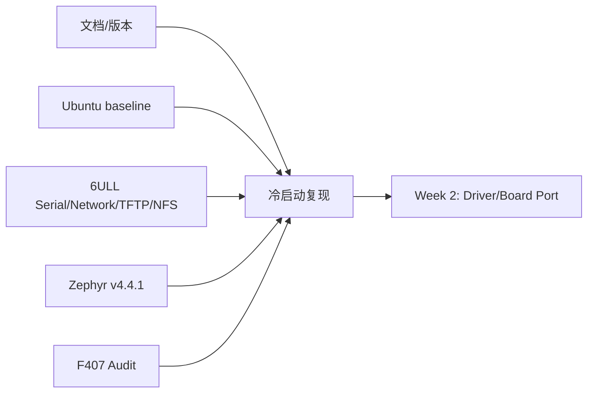
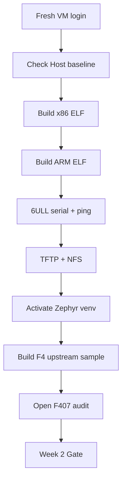

# W01D07 - Week 1 冷启动复现：把“当时能跑”升级为“我能重建”

## 0. 今日定位

- 所属能力：工程可复现性 / 学习验收
- 前置：Day 1~6 已执行
- 硬件：6ULL + Explorer F407（F407 今天只需 audit，不烧写）
- 主动学习时间：约 2h（下载/大文件构建等待时间不计）
- 最终产物：`week1_repro_report.md` + Week 2 entry gate

## 1. 今天解决的工程问题

最危险的学习状态不是“不会”，而是：

> 昨天能跑，但不知道到底靠哪个 shell 环境变量、哪个临时 IP、哪个目录、哪个未记录版本跑起来的。

今天禁止学习新机制。你要用**冷启动**证明环境不是偶然状态。

## 2. 能力构成



## 3. 先理解：费曼解释

### 3.1 白话模型

如果你离开电脑一周，回来只看 Git 仓库就能重新跑起来，这才叫环境搭好了。

### 3.2 精确工程模型

可复现至少包含：

- version pin；
- directory convention；
- service config；
- network facts；
- command log；
- board inventory；
- acceptance output。

## 4. 原理：为什么“冷启动”是测试

在测试术语里，你是在消除 hidden state。关闭 terminal、重新登录、甚至 reboot VM，会删除很多“恰好存在”的 transient state。能够重新激活/发现环境，说明文档和配置覆盖了真实依赖。

## 5. 复现流程



## 6. 时序图

今天执行的是验证流水线，静态复现流程已经足够；不增加装饰性 UML。

## 7. 阅读资料

不读新资料。只看 Day 1~6 自己生成的 README/log。

## 8. 实验准备

1. 保存未提交工作；
2. 关闭所有 terminal；
3. 最好 reboot Ubuntu VM；
4. 不看 shell history 前 15 分钟；
5. 只允许看自己写的 README。

## 9. Lab 1 - Linux 主线复现

### Host

```bash
uname -a
lsb_release -a
ip -br addr
ip route
```

### x86/ARM build

```bash
cd ~/work/course
gcc -O0 -g hello_arch.c -o hello_x86
arm-linux-gnueabihf-gcc -O0 -g hello_arch.c -o hello_arm
file hello_x86 hello_arm
```

### 6ULL

- 串口复位，保存 30 秒 boot log；
- U-Boot `printenv ipaddr serverip netmask`；
- Linux `ip -br addr`；
- VM↔Board ping。

### TFTP/NFS

U-Boot 重新拉小文件；Linux 重新 mount NFS。

若 Day 4 只有“当时 mount 好了”，今天 mount 失败，就说明 Day 4 文档没覆盖 hidden state，立即补文档。

## 10. Lab 2 - Zephyr 主线复现

Fresh shell：

```bash
source ~/zephyrproject/.venv/bin/activate
west topdir
cd ~/zephyrproject/zephyr
git describe --tags --always
west build -p always -b stm32f4_disco/stm32f407xx samples/hello_world
```

检查：

```bash
test -f build/zephyr/zephyr.elf && echo PASS
grep -m1 'model' build/zephyr/zephyr.dts || true
```

打开 `f407_board_audit.md`，随机抽 5 项，不看原理图先说 pin/page，再回原理图核对。

## 11. 故障注入

今天的故障注入是“隐藏状态删除”：

- 新 shell 不自动激活 venv；
- NFS 需要重新 mount；
- 临时 board IP 可能在 reboot 后消失。

记录哪些状态是 persistent、哪些是 runtime-only。不要为了省事把所有东西永久写死。

## 12. 调试路径

复现失败时使用“最早失败点原则”：

```text
Host baseline fail
→ 不继续 Target

Cross compile fail
→ 不继续 ELF/board app

Board network fail
→ 不继续 TFTP/NFS

Zephyr venv fail
→ 不继续 custom board
```

这样不会把上游基础设施故障伪装成后面的 Driver 问题。

## 13. 源码追踪

无新源码。回顾你已经知道的对象：

```text
ELF header/program headers
U-Boot env
Linux network objects
Zephyr build outputs
F407 schematic facts
```

## 14. 今日验收 - Week 1 Pass Gate

全部满足才进入 Week 2：

- [ ] Ubuntu baseline 可从 fresh login 重建；
- [ ] x86/ARM ELF 可重编；
- [ ] 6ULL 串口可进 U-Boot、可启动 Linux；
- [ ] 6ULL ↔ VM 双向网络；
- [ ] TFTP 小文件可拉；
- [ ] NFS 可重新 mount；
- [ ] Zephyr v4.4.1 环境可 fresh shell 激活；
- [ ] 官方 F4 sample 可 pristine build；
- [ ] Explorer board audit 表有真实原理图证据。

任何 P0 项失败，Week 2 不继续“学习新知识”。先修基线。

## 15. 面试式复述（闭卷）

1. Host/Target 分别是什么？
2. 为什么选 Bridged？
3. cross compiler 与 sysroot 的关系？
4. section vs segment？
5. U-Boot console vs Linux console？
6. 同网段通信为什么需要 ARP？
7. TFTP vs NFS vs SCP？
8. west workspace 包含什么？
9. Kconfig vs DTS？
10. `stm32f407xx` SoC support vs Explorer board support？
11. Explorer MCU exact part 是什么？
12. W25Q128 为什么对后续 bootloader/OTA 有用？

每题目标：60~90 秒说明，不背定义。

## 16. Git 交付物

```text
week1_repro_report.md
host-baseline.txt
board_inventory.md
f407_board_audit.md
week1_failures_and_fixes.md
```

Commit：

```bash
git add .
git commit -m "study: pass week1 reproducible environment gate"
```

## 17. 下一阶段连接

Week 2 的 Linux 线进入 process/syscall/file descriptor/ELF runtime；Zephyr 线进入 Explorer custom board port。设备树专题 `A01` 可以提前读一遍，但不要在 Week 1 为了“懂完 DeviceTree”延长学习。
