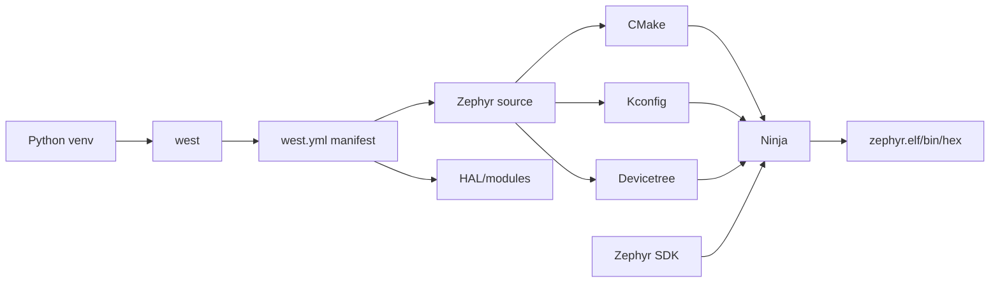
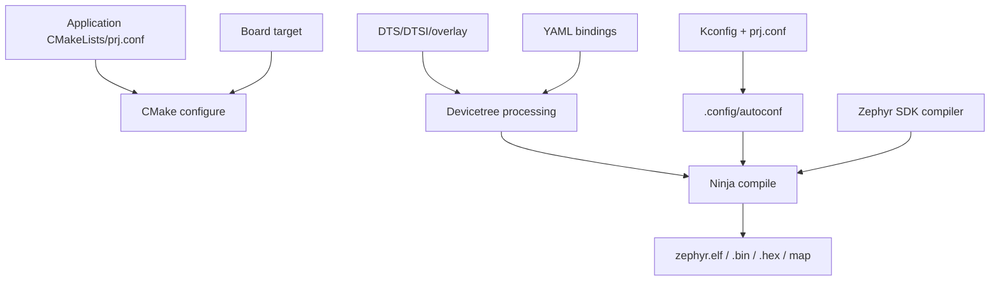
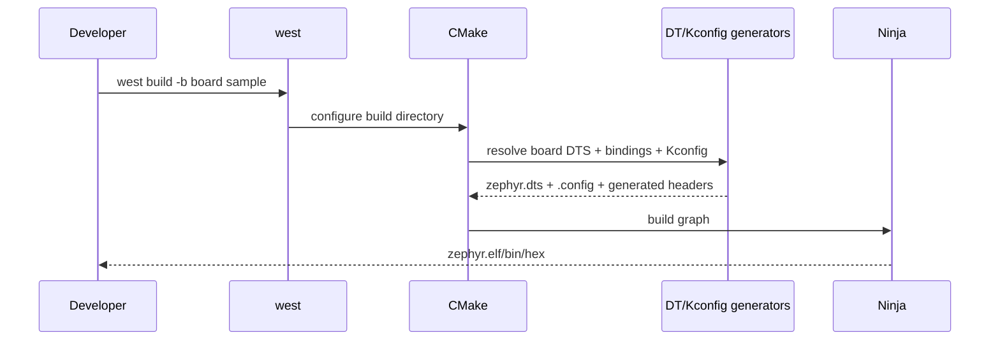

# W01D05 - Zephyr 官方环境：先跑可信上游 target，再碰自定义板

## 0. 今日定位

- 所属能力：RTOS 平台工程 / Zephyr build system
- 前置：Ubuntu 24.04 Host 基线
- 硬件：今天可不连接 Explorer；使用官方 board target 做 build baseline
- 固定版本：**Zephyr v4.4.1**
- 主动学习时间：约 2h（下载/大文件构建等待时间不计）
- 最终产物：可复现 `~/zephyrproject`、`stm32f4_disco/stm32f407xx` build、构建产物解读

## 1. 今天解决的工程问题

如果你第一天就把 Explorer 的 DTS/Kconfig 写错，那么构建失败时无法判断：

- Zephyr 环境没装对；
- SDK/toolchain 不对；
- 自定义 board 写错；
- pin/clock 错；
- application 配置错。

专业做法是先建立一个**官方已维护硬件定义的绿色基线**。以后 custom board 的每一步都与它做 diff。

## 2. 能力构成



## 3. 先理解：费曼解释

### 3.1 白话模型

Zephyr 不是“下载一个 RTOS 源码然后 make”。它更像一个小型平台工程：`west` 管项目集合，CMake 组织构建，Kconfig 决定“编哪些功能”，Devicetree 描述“板上有什么硬件”，SDK 提供各架构编译器。

### 3.2 精确模型

- `west` 本身不是编译器；
- `.west/config` 与 manifest 确定 workspace/project；
- `west build` 最终驱动 CMake/Ninja；
- Kconfig 生成 `.config`/autoconf；
- DTS + bindings 在构建期生成最终 `zephyr.dts` 和 C macros；
- Zephyr SDK 提供 target toolchain、OpenOCD/QEMU 等 host tools。

### 3.3 Kconfig vs DTS

今天先记一句：

> **Kconfig 主要描述“软件能力是否启用”；DTS 描述“这个板子的硬件实例是什么、怎么连”。**

例如 UART Driver 是否编译由 Kconfig 控制；某个 UART instance 的 base address/pins/status 来自 DTS/SoC definition。

## 4. 版本选择

2026-09 的 Zephyr 发布状态：4.4 是当前稳定系列，4.5 尚在开发周期。本课程固定 `v4.4.1`，避免 main 每天变化。

官方 Release index：
https://docs.zephyrproject.org/latest/releases/

## 5. 机制图



## 6. 时序图



## 7. 阅读资料

- `SRC-ZEPHYR-GETTING-STARTED`：完整读 Get Zephyr / Python dependencies / SDK / build sample；
- `SRC-ZEPHYR-F4-DISCO`：看 board 名、SoC 为 `stm32f407xx`、supported features；
- DeviceTree 深入暂不在今天读，Day 6 只看最终生成文件。

## 8. 实验准备

推荐使用新的 workspace，不混已有实验：

```bash
python3 -m venv ~/zephyrproject/.venv
source ~/zephyrproject/.venv/bin/activate
python -m pip install --upgrade pip
pip install west
```

初始化固定版本：

```bash
west init -m https://github.com/zephyrproject-rtos/zephyr --mr v4.4.1 ~/zephyrproject
cd ~/zephyrproject
west update
west packages pip --install
west zephyr-export
cd ~/zephyrproject/zephyr
west sdk install
```

如果网络慢，`west update`/SDK 下载可跨时段完成。**不要为了快改成 main 或混系统 Python。**

记录：

```bash
west topdir
west list | head
cd ~/zephyrproject/zephyr
git describe --tags --always
west --version
```

## 9. Lab 1 - 构建官方 STM32F407 target

先验证 target 名：

```bash
cd ~/zephyrproject/zephyr
west boards | grep stm32f4_disco
```

当前官方文档给出的 target 是：

```text
stm32f4_disco/stm32f407xx
```

构建 hello world：

```bash
west build -p always -b stm32f4_disco/stm32f407xx samples/hello_world
```

如果官方 target 在你固定版本上输出略有差异，以 `west boards` 为事实来源，而不是照抄教程。

### 观察产物

```bash
ls -lh build/zephyr/zephyr.{elf,bin,hex} 2>/dev/null
ls build/zephyr | head
```

重点：

```text
build/zephyr/zephyr.elf    最终 ELF
build/zephyr/zephyr.bin    raw binary（若生成）
build/zephyr/zephyr.hex    Intel HEX（若生成）
build/zephyr/zephyr.dts    最终合并/展开后的 DTS
build/zephyr/.config       Kconfig 最终配置
```

查：

```bash
grep -n "chosen" build/zephyr/zephyr.dts | head
grep -E '^CONFIG_(SERIAL|CONSOLE|GPIO)=' build/zephyr/.config
readelf -h build/zephyr/zephyr.elf | head -30
```

## 10. Lab 2 - 找到“配置不是从一个文件来的”证据

```bash
west build -t menuconfig
```

只观察，不随便改。然后：

```bash
find build/zephyr -maxdepth 3 -type f | grep -E 'devicetree|autoconf|config' | head -30
```

你要确认：最终 build configuration 是很多层输入合并后的产物，不是一个 `main.c` 决定的。

## 11. 故障注入

### A. 错 board target

```bash
west build -p always -b this_board_does_not_exist samples/hello_world
```

读错误信息。然后用：

```bash
west boards | grep -i stm32f4
```

恢复正确 target。

### B. 新 shell 未激活 venv

开新 terminal：

```bash
which python
which west
west topdir
```

比较激活：

```bash
source ~/zephyrproject/.venv/bin/activate
```

前后的 `which python`。理解 venv 是依赖隔离，不是“Zephyr 神秘环境变量”。

## 12. 调试路径

```text
west 命令不存在
→ venv/which west

workspace 找不到
→ west topdir / .west

board 不存在
→ west boards

CMake configure fail
→ Zephyr version + dependencies + board target

compile fail
→ first error, not last linker noise
```

## 13. 源码追踪

只浏览，不深入：

```text
boards/st/stm32f4_disco/
dts/arm/st/
soc/st/stm32/
```

找出：

- board DTS；
- SoC DTSI；
- board defconfig/Kconfig；
- pinctrl file。

目标是为 Day 6 的“哪些可复用，哪些必须重写”做准备。

## 14. 今日验收

- [ ] venv 可在新 shell 激活；
- [ ] `west topdir` 正确；
- [ ] checkout/tag 固定到 v4.4.1；
- [ ] 官方 `stm32f4_disco/stm32f407xx` hello_world 构建成功；
- [ ] 能指出 `zephyr.dts`、`.config`、ELF 的职责；
- [ ] 能 60 秒解释 west/CMake/Kconfig/DTS/SDK 各自解决什么问题。

## 15. 面试式复述

1. west 是编译器吗？
2. 为什么固定 tag，而不是 main？
3. Kconfig 与 DeviceTree 分别描述什么？
4. `zephyr.dts` 是输入文件还是最终展开产物？
5. custom board 出问题前为什么先跑官方同 SoC board？
6. Zephyr SDK 与 Host GCC 有什么关系？

## 16. Git 交付物

```text
zephyr_environment.md
zephyr-version.txt
build-artifacts-notes.md
```

不要把整个 `build/` 提交进个人学习仓库。

## 17. 明日连接

明天拿你的 Explorer 原理图逐项审计。你将明确：Zephyr 已经“知道 STM32F407xx 是什么”，但它不知道**你的 PCB 是怎么把 F407ZET6 连成一块产品板的**。
