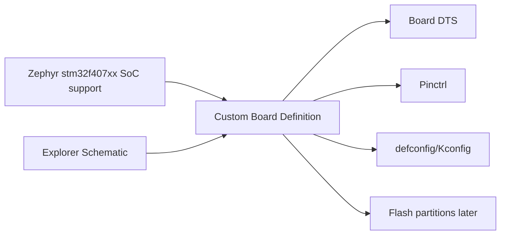
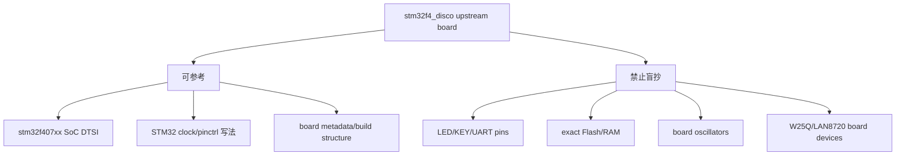

# W01D06 - STM32F407 Explorer 硬件审计：Board Port 先从原理图开始

## 0. 今日定位

- 所属能力：Zephyr BSP/Board Port
- 前置：W01D05 官方 F407 target 构建成功
- 硬件：正点原子 Explorer STM32F4
- 唯一板级事实源：`Explorer STM32F4_V2.2_SCH.pdf`
- 主动学习时间：约 2h（下载/大文件构建等待时间不计）
- 最终产物：`f407_board_audit.md`，成为 Week 2 custom board 定义的输入

## 1. 今天解决的工程问题

“都是 STM32F407”不代表 DTS 可以复制。

官方 STM32F4 Discovery 使用 STM32F407VG，Explorer 原理图实际是 **STM32F407ZET6**。ST DS8626 Rev 12 的 ordering information 明确：`E` 对应 **512 KB internal Flash**；该系列 system SRAM 为 **192 KB（112+16+64 KB，其中 64 KB CCM）**，另有 4 KB backup SRAM。封装、Flash 容量、板载 LED/按键/console/外部 Flash 都不能从 Discovery 迁移假设。真正 BSP 工程师做 board port 的第一步不是写代码，而是构造一张**可追溯硬件事实表**。

## 2. 能力构成



## 3. 先理解：费曼解释

### 3.1 白话模型

SoC support 像“Zephyr 已经会说 STM32F407 这门语言”；board port 是告诉它“这块 PCB 把哪个 pin 接 LED、哪个 UART 接电脑、外部 Flash 接哪里、晶振是多少”。

### 3.2 精确工程模型

上游通常已经提供：

- Cortex-M4 arch；
- STM32F4 RCC/GPIO/UART/SPI 等 drivers；
- `stm32f407xx` SoC DTSI；
- pinctrl binding/macros。

你需要提供：

- board compatible/name；
- memory/flash 具体容量核对；
- oscillator/clock selection；
- chosen console；
- board pinctrl；
- LED/KEY aliases；
- external W25Q128 node；
- 后续 partition layout。

### 3.3 常见错误理解

1. “F407 Discovery 能跑，所以 Explorer 直接改 board 名就行。”——板级连线不同。
2. “设备树是 driver 配置文件，driver 写什么属性我就照着填。”——应从 binding + hardware facts 双向约束。
3. “F407 都是 1 MB Flash。”——错误。Explorer 的 exact part 是 `STM32F407ZE`，其中 `E` 就是 512 KB Flash；官方 Discovery 常见的 `VG` 则是 1 MB。

## 4. 原理图逐页审计

### p.2：核心页

[打开 p.2](../../references/Explorer%20STM32F4_V2.2_SCH.pdf#page=2)

确认：

- U4：`STM32F407ZET6`（ST datasheet：512 KB Flash，192 KB system SRAM + 4 KB backup SRAM）；
- Y2：8 MHz HSE；
- Y3：32.768 kHz LSE；
- USART1：PA9 TX / PA10 RX；p.2 左侧 `USB_UART/USART1` 区还有 P6 2x2 jumper/header，负责把 MCU USART1 与板载 `TXD/RXD` 链路配对；
- JTAG：TMS/SWDIO、TCK/SWCLK、TDO/SWO、RESET；
- LED0 PF9、LED1 PF10；p.3 可见 LED 通过限流电阻接 3.3 V、GPIO 侧灌电流，因此用户 LED 是 **active-low**；
- KEY0 PE4、KEY1 PE3、KEY2 PE2；p.3 可见按键按下把 net 拉到 GND，因此三者是 **active-low**；
- SPI1：PB3/PB4/PB5；
- `F_CS` net 从图中可追到 PB14。

### p.3：外设页

[打开 p.3](../../references/Explorer%20STM32F4_V2.2_SCH.pdf#page=3)

U11 是 **W25Q128**：

```text
CS   ← F_CS
SO   ← SPI1_MISO
SI   ← SPI1_MOSI
CLK  ← SPI1_SCK
```

W25Q128 属于 128 Mbit（16 MiB）容量等级，很适合作为后续升级 image staging/secondary candidate。但原理图没有给完整 W25Q128 后缀，**sector/block erase geometry 必须等你读实物丝印后再匹配 Winbond 对应 datasheet**；今天不能据此宣布最终 partition/swap 策略。

### p.4：USB-UART

[打开 p.4](../../references/Explorer%20STM32F4_V2.2_SCH.pdf#page=4)

U17 是 CH340G。它把 USB 转为板上 `TXD/RXD` nets；再回到 p.2 的 `USB_UART/USART1` 小框，可以看到 **P6 2x2 header/jumper**：PA10/`USART1_RX` 与 `TXD` 成一对，PA9/`USART1_TX` 与 `RXD` 成一对。也就是说，板载 USB-UART 到 MCU 的 console 链路还依赖 P6 的实际跳帽连接状态。Board port 中选 USART1 做 console 前，必须肉眼检查 P6 跳帽并用万用表/串口实测确认。

### p.1：Ethernet

[打开 p.1](../../references/Explorer%20STM32F4_V2.2_SCH.pdf#page=1)

U1 为 LAN8720A，RMII nets 包括 RXD0/1、TXD0/1、CRS_DV、REF_CLK、MDC/MDIO 等。第一批暂不使能 Ethernet，因为当前目标是最小 board port + Bootloader/OTA 基础，不把网络驱动带进 baseline。

## 5. 结构图：可以复用什么，不能复用什么



## 6. 时序图

Board port 主要是构建期静态描述，今天不画虚假的运行时序。Week 2 会画 Zephyr device initialization 的时序。

## 7. 阅读资料

- `SRC-F407-SCH`：p.1~p.4 必看，p.5 用于板上器件定位；
- `SRC-ST-F407-DATASHEET`：Ordering information（PDF p.186）确认 `E=512 KB Flash`；Table 2/SRAM section 确认 192 KB system SRAM + 4 KB backup SRAM；
- `SRC-ST-F407-DATASHEET`：exact-part memory；
- `SRC-WINBOND-W25Q128`：确认 128 Mbit 容量等级；具体 chip suffix/erase geometry 延后到实物核对；
- `SRC-ZEPHYR-F4-DISCO`：官方 board overview + target/SoC；
- `SRC-ZEPHYR-DT`：只阅读 board/devicetree 基础介绍，不深入宏系统。

## 8. 实验准备

复制模板：

```bash
cp 05_labs/stm32f407/f407_board_audit_template.md \
   ~/work/course/f407_board_audit.md
```

打开 Zephyr source：

```bash
cd ~/zephyrproject/zephyr
find boards/st -maxdepth 2 -iname '*stm32f4*' -o -iname '*f4*disco*'
```

查看官方 board 文件，目的不是复制，而是建立字段映射。

## 9. Lab 1 - 完成 board audit 表

至少填：

| Resource | Schematic | Net | MCU pin | Zephyr mapping candidate | Verification |
|---|---|---|---|---|---|
| HSE | p.2 | Y2 | PH0/PH1 OSC | hse clock | schematic |
| LSE | p.2 | Y3 | PC14/PC15 | lse clock | schematic |
| USART1 TX | p.2 | USART1_TX ↔ P6 ↔ RXD | PA9 | uart console pinctrl | schematic + P6 jumper check |
| USART1 RX | p.2 | USART1_RX ↔ P6 ↔ TXD | PA10 | uart console pinctrl | schematic + P6 jumper check |
| LED0 | p.2/3 | LED0 | PF9, active-low | gpio-leds | schematic |
| LED1 | p.2/3 | LED1 | PF10, active-low | gpio-leds | schematic |
| KEY0 | p.2/3 | KEY0 | PE4, active-low | gpio-keys | schematic |
| W25Q CS | p.2/3 | F_CS | PB14 | spi-nor CS GPIO | schematic |
| SPI1 SCK | p.2/3 | SPI1_SCK | PB3 | spi1 pinctrl | schematic |
| SPI1 MISO | p.2/3 | SPI1_MISO | PB4 | spi1 pinctrl | schematic |
| SPI1 MOSI | p.2/3 | SPI1_MOSI | PB5 | spi1 pinctrl | schematic |

对于 Alternate Function，今天不凭记忆填 AF number。Week 2 从 STM32 datasheet/Zephyr pinctrl 宏核实。

在 `f407_board_audit.md` 的 memory 区同时填入：

```text
Internal Flash = 512 KB
System SRAM    = 192 KB (112 + 16 + 64 KB CCM)
Backup SRAM    = 4 KB
```

这些数值来自 ST exact-part datasheet，而不是 Explorer 原理图；原理图只负责证明 MCU 的完整料号。

## 10. Lab 2 - 与官方 `stm32f4_disco` 做“差异审计”

```bash
cd ~/zephyrproject/zephyr
find boards/st/stm32f4_disco -maxdepth 2 -type f -print
```

打开其 DTS/pinctrl/config，建立：

```markdown
## reusable patterns
- SoC include style
- chosen console pattern
- gpio-leds binding syntax
- pinctrl syntax

## board-specific facts that must be replaced
- part memory
- HSE/LSE
- uart pins
- LED/button pins
- external flash
```

这份 diff 是你 Week 2 board port 的设计输入。

## 11. 故障注入

找一个网络教程/另一块 F407 board 的 LED pin，例如官方 Discovery 的 LED。**不要烧板**，只在纸面比较：

1. 它的 LED pin 是什么？
2. Explorer p.2/p.3 的 LED0/1 是什么？
3. 如果直接复制，对 Explorer 会发生什么？

目的：形成“board facts 先于 board code”的纪律。

## 12. 调试路径

后续 board port 起不来时按：

```text
exact MCU part
→ clock source/frequency
→ chosen console
→ pinctrl
→ GPIO/device DTS
→ Kconfig driver enable
→ generated zephyr.dts/.config
→ hardware scope/JTAG
```

而不是直接改 `main.c`。

## 13. 源码追踪

今天只追文件边界：

```text
boards/st/stm32f4_disco/*
→ dts/arm/st/stm32f407*.dtsi
→ dts/bindings/*
→ include/zephyr/dt-bindings/pinctrl/*
```

写出“board 文件引用 SoC，SoC 定义 controller，board 决定哪些 instance/pins 启用”的一句话结论。

## 14. 今日验收

- [ ] 明确 MCU 是 STM32F407ZET6，并能解释 order code 中 `E=512 KB Flash`；
- [ ] HSE/LSE、USART1/P6、LED0/1、KEY0/1/2、W25Q128、SPI1、CH340G、LAN8720 均有页码证据；
- [ ] 能说明 LED/KEY 的 active-low 极性来自原理图哪里，而不是从例程猜出来；
- [ ] `f407_board_audit.md` 完成；
- [ ] 知道 SoC support 与 board support 的边界；
- [ ] 没有从其他 F407 board 盲抄 pin；
- [ ] 能解释为什么外部 W25Q128 很有价值，但今天不能直接宣布最终 MCUboot layout。

## 15. 面试式复述

1. Zephyr 已支持 `stm32f407xx`，为什么还要 board port？
2. DTS 中哪些信息是 SoC 共性，哪些是 board-specific？
3. 为什么 exact MCU suffix 重要？
4. console UART 为什么必须同时核实 MCU pin 与 USB-UART net？
5. 外部 SPI NOR 在 OTA 中可承担什么角色？
6. 为什么今天不做 Ethernet？

## 16. Git 交付物

```text
f407_board_audit.md
f407_vs_stm32f4_disco.md
原理图标注截图（可选）
```

Commit：

```bash
git commit -m "study: audit Explorer F407 hardware for Zephyr board port"
```

## 17. 明日连接

Day 7 不写 board port，先做 Week 1 冷启动复现。Week 2 才依据这张 audit 表建立 `boards/alientek/...` custom board。
