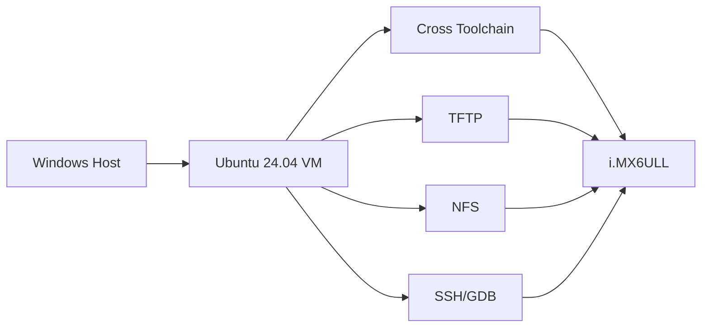
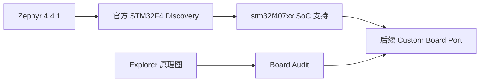

# SoC System Software Daily Course - 第一批正式教程

这套教程服务于 20 周“异构 SoC 平台软件 / Linux BSP & Driver + Zephyr RTOS 产品化”学习计划。本批不是路线图，而是**可直接执行的 Week 1 教材**：每一天先讲清楚原理，再做实验，再主动制造故障，最后用明确的 Pass/Fail 标准验收。

## 使用方式

每个学习日按约 2 小时主动学习设计：

1. 15 min：不看资料回忆前一天执行链；
2. 35 min：阅读“费曼解释 + 精确工程模型”；
3. 55 min：真实命令/硬件实验；
4. 15 min：记录日志、写 README、Git commit。

下载、安装、首次 `west update` 等纯等待时间不算主动学习时间。遇到工具下载慢时，保留命令和日志，第二天继续，不为了“今日必须结束”而乱改版本。

## 第一批内容

| Day / 专题 | 主线 | 直接产物 |
|---|---|---|
| [W01D01 Ubuntu 主开发环境](02_linux/week01/W01D01_Ubuntu_Host_Environment.md) | Linux | 可复现 Ubuntu VM + 环境基线 |
| [W01D02 交叉编译与 ELF](02_linux/week01/W01D02_Cross_Compilation_and_ELF.md) | Linux | x86/ARM ELF 对比报告 |
| [W01D03 6ULL 串口与网络](02_linux/week01/W01D03_iMX6ULL_Serial_and_Network.md) | Linux | U-Boot/Linux boot log + 网络闭环 |
| [W01D04 TFTP 与 NFS](02_linux/week01/W01D04_TFTP_and_NFS_Development_Loop.md) | Linux | 不烧卡的 BSP 快速迭代链 |
| [W01D05 Zephyr 官方环境](03_zephyr/week01/W01D05_Zephyr_Official_Environment.md) | Zephyr | 固定版本 Zephyr 4.4.1 workspace |
| [W01D06 F407 硬件审计](03_zephyr/week01/W01D06_STM32F407_Hardware_Audit_and_Board_Port_Preparation.md) | Zephyr | 正点原子 F407 board audit 表 |
| [W01D07 Week 1 复现门](02_linux/week01/W01D07_Week1_Reproducibility_Review.md) | 综合 | 冷启动复现报告 |
| [A01 DeviceTree：从 DTS 到 Linux Device](04_deep_dive/A01_DeviceTree_From_DTS_to_Linux_Device.md) | Deep Dive | 设备树完整心智模型 + 4 个实验 |

## Linux 主线

Week 1 只做环境闭环，不提前进入 Driver 编码。目标是让后面 Kernel、DTB、`.ko`、U-Boot、ftrace 等实验都建立在稳定 Host/Target 基线之上。



## Zephyr 主线

第一周不“硬移植”正点原子板。先在 Zephyr 官方 `stm32f4_disco/stm32f407xx` target 建立可信构建基线，再对你的 Explorer F407 PCB 做硬件审计。Week 2 才开始 custom board port。



## Deep Dive

每日教程解决“今天怎么做”；Deep Dive 解决“这个机制到底为什么这样工作”。设备树专题会在 Week 4 再被日教程引用，不会重复抄一遍。

## References

- [资料索引](00_course_guide/source_index.md)
- [本地 PDF 目录约定](references/README.md)
- [STM32F4 硬件清单](00_course_guide/hardware_inventory.md)
- [环境基线](00_course_guide/environment_baseline.md)
- [术语表](00_course_guide/glossary.md)

## 第一批质量复核

- [第一批教程质量复核报告](00_course_guide/first_batch_quality_review.md)
- [第一批用户评审清单](00_course_guide/first_batch_review_checklist.md)

## 学习产物约定

每个 Day 至少留下：

```text
代码 / 配置
+ 原始日志
+ 机制图
+ 结论
+ 一次 Git commit
```

“命令执行成功”不是学习完成；你必须能解释命令改变了哪个对象、故障时从哪一层查起。
