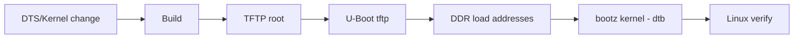
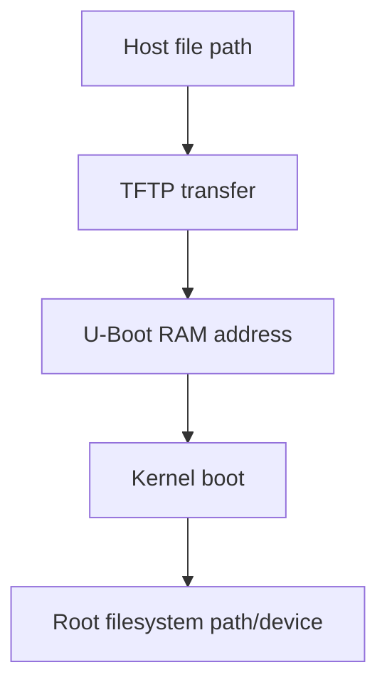
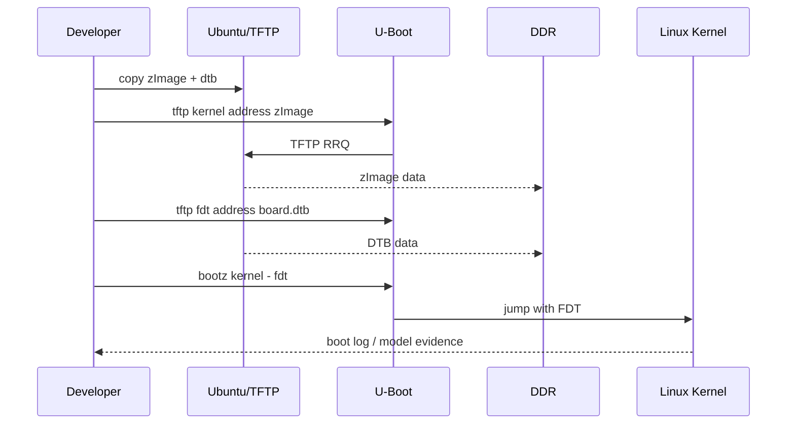

# W02D03 - TFTP Boot：不烧写地替换 Kernel 与 DTB

## 0. 今日定位

- 所属能力：U-Boot / BSP 快速验证
- 前置：W02D02 已生成可确认的 `zImage` 和目标 DTB；Week1 TFTP 可用
- 主动学习时间：约 2h
- 最终产物：一次 RAM-only boot 记录 + 一个可证明“新 DTB 生效”的实验
- 安全原则：今天**不 `saveenv`，不覆盖 eMMC/SD 原系统**

## 1. 今天解决的工程问题

BSP 开发最浪费时间的方式是：改一个 DTS → 烧卡 → 重启 → 再改。正确的开发闭环应该是：

```text
edit
→ build
→ copy to TFTP
→ U-Boot RAM load
→ boot
→ verify
```

这样 DTB 调试通常可以从分钟级压到几十秒级。

## 2. 今日能力构成



## 3. 先理解：费曼解释

### 3.1 白话模型

U-Boot 就像一个“固件装载器”。它不要求 Kernel 必须来自 eMMC；只要能把正确的 `zImage` 和 DTB 放到 RAM 的正确位置，就可以直接启动。

### 3.2 精确模型

典型 ARM `bootz` 需要：

```text
kernel address
initrd address or '-'
fdt address
```

加载地址不能凭教程抄，因为 U-Boot 版本、DDR layout、环境变量可能不同。你必须先读当前 `printenv`。

## 4. 原理：加载与启动是两步

```text
tftp <addr> zImage
```

只是把文件拷到 RAM；并不会运行。

```text
bootz <kernel_addr> - <fdt_addr>
```

才进入 Kernel。

所以问题要分开定位：

- TFTP 失败：网络/服务/路径；
- `bootz` 前数据不对：地址/文件；
- Kernel 启动后设备不对：DTB/driver/rootfs。

## 5. 机制图：三类地址不要混



## 6. UML 时序




## 7. 阅读资料

阅读原则：**先用本机真实 BSP/源码证明，再用教程和官方文档解释。** 正点原子两本大 PDF 当前未作为附件放进课程包，因此本文不伪造页码；若你将 PDF 按 `references/README.md` 的英文别名放入 `references/`，后续可补精确页码。

- `SRC-IMX6ULL-TFTP-NFS`：复习 TFTP 拓扑。
- `SRC-IMX6ULL-DRV`：U-Boot/内核网络启动相关章节，以本机 BSP 版本为准。
- `SRC-ALIENTEK-UBOOT-REPO`：观察厂商 U-Boot 网络命令/环境结构。

## 8. 实验准备

```bash
cp "$KERNEL/arch/arm/boot/zImage" /srv/tftp/zImage-w02
cp "$KERNEL/arch/arm/boot/dts/<YOUR_BOARD>.dtb" /srv/tftp/board-w02.dtb
sha256sum /srv/tftp/zImage-w02 /srv/tftp/board-w02.dtb
```

在 U-Boot **只读环境**：

```text
printenv ipaddr
printenv serverip
printenv kernel_addr_r
printenv fdt_addr_r
printenv loadaddr
printenv fdt_addr
bdinfo
```

若环境没有 `kernel_addr_r/fdt_addr_r`，不要随便选地址；结合当前 `bootcmd`、`bdinfo`、厂商手册决定两个不重叠的 RAM 区域，并记录到实验日志。

## 9. Lab 1 - 只从 RAM 启动当前产物

```text
ping ${serverip}
tftp ${kernel_addr_r} zImage-w02
tftp ${fdt_addr_r} board-w02.dtb
```

每次 TFTP 后记录下载字节数。可用：

```text
iminfo ${kernel_addr_r}
```

如果对 zImage 不支持 `iminfo`，不要把它当失败；至少用 `md.b` 查看首部并依靠 TFTP size 证据。

启动：

```text
bootz ${kernel_addr_r} - ${fdt_addr_r}
```

进入 Linux 后保存：

```bash
uname -a
tr -d '\0' </sys/firmware/devicetree/base/model; echo
cat /proc/cmdline
```


### 9.1 每条 U-Boot 命令要观察什么

执行 `ping` 时，不只是看 `host is alive`，同时确认当前 `ipaddr/serverip/netmask/ethact`。如果有多个网口，先 `printenv ethact`，避免你以为在调 TFTP，其实 U-Boot 选了另一控制器。

`tftp <addr> <file>` 成功后至少记录三个证据：

1. 远端文件名；
2. 下载字节数；
3. U-Boot 设置的 `filesize` 环境变量。

```text
printenv filesize
```

这样遇到“文件加载了但 bootz 失败”时，可以先排除拿到零字节/截断文件。若 U-Boot 支持 `crc32`，可对 RAM 区做 CRC 作为额外证据：

```text
crc32 ${fdt_addr_r} ${filesize}
```

注意：加载第二个文件后 `filesize` 会被覆盖，因此需要立即记录。

### 9.2 地址重叠的工程判断

RAM load address 的核心不是背十六进制，而是保证 kernel、DTB、可选 initrd 与 U-Boot 自己/stack 不发生覆盖。`bdinfo`、现有 `bootcmd` 和厂商环境变量是第一证据。你要在实验日志画一张简单 DDR 布局：

```text
DDR base ------------------------------------------------ DDR end
      [U-Boot relocated region]   [zImage]   [DTB]   [free]
```

如果启动一半出现不可解释的解压错误、FDT magic 错误，地址重叠是必须排查的一类，而不是立刻怀疑 Kernel 源码。

## 10. Lab 2 - 无风险证明新 DTB 生效

不要一开始改 UART/网口。选择一个不影响启动的属性，例如 root 节点增加：

```dts
chosen-learning {
    course-tag = "week02-day03";
};
```

更稳妥的方式是在你自己的测试节点增加自定义字符串属性，不绑定 Driver。

重新编译 DTB、TFTP 启动，然后：

```bash
find /sys/firmware/devicetree/base -maxdepth 2 -type f | grep -i course
```

或对你创建的节点读取属性。**重点是用运行中的 `/sys/firmware/devicetree/base` 证明它确实来自新 DTB。**

## 11. 故障注入

### 错文件名

```text
tftp ${fdt_addr_r} does-not-exist.dtb
```

判断应停留在 TFTP 层。

### 加载旧 DTB

故意加载昨天的 DTB，再读取 course-tag，证明“编译成功”和“板上运行”之间还隔着部署链。

## 12. 调试路径

```text
U-Boot ping
→ tftp response
→ transfer size
→ RAM address overlap
→ bootz parameters
→ early kernel log
→ /sys/firmware/devicetree/base
```

## 13. 源码追踪

今天不追 U-Boot 网络栈源码。只理解命令执行对象：

```text
tftp command → RAM
bootz → Linux entry + FDT pointer
```

真正的 Linux FDT 展开机制复习：

[DeviceTree Deep Dive](../../04_deep_dive/A01_DeviceTree_From_DTS_to_Linux_Device.md)

## 14. 今日验收

- [ ] 不覆盖存储介质即可从 TFTP 启动新 Kernel/DTB；
- [ ] 能说明 `tftp` 和 `bootz` 的职责差异；
- [ ] 用运行系统证明新 DTB 属性存在；
- [ ] 没有执行 `saveenv` 或写 eMMC/SD；
- [ ] 把 RAM 地址选择依据写入日志。

## 15. 面试式复述

1. TFTP load 和 Kernel boot 为什么是两步？
2. DTB 在 RAM 中是什么形式？
3. 怎么证明运行的是新 DTB？
4. 为什么不能照抄别人 `0x80800000` 之类地址？
5. 如果 Kernel 启动了但网卡没了，第一层看什么？

## 16. Git 交付物

```text
w02d03_uboot_env.txt
w02d03_tftp_boot.log
w02d03_dtb_change.patch
w02d03_runtime_dt_proof.txt
```

## 17. 明日连接

明天转到用户态 GDB：建立 Host 与 Target 的源码级调试闭环，为以后 Runtime/Hailo/Linux 应用调试打基础。
