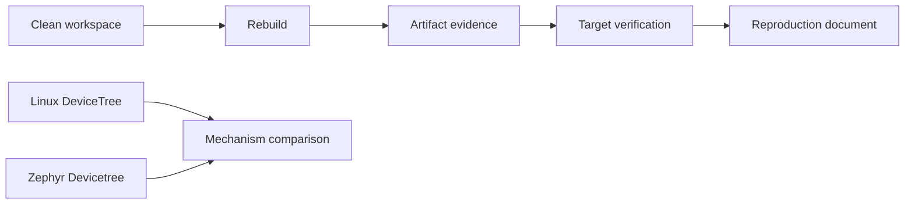
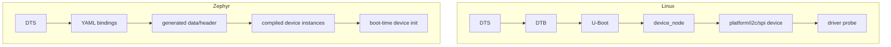
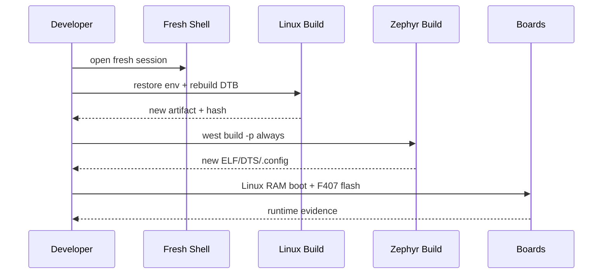

# W02D07 - Week 2 Gate：Clean Build、可复现性与 Linux/Zephyr DeviceTree 对照

## 0. 今日定位

- 所属能力：Reproducible Build / BSP Mental Model
- 前置：W02D01~D06
- 主动学习时间：1~2h
- 今日最终产物：`week02_reproducibility_report.md` + `linux_vs_zephyr_devicetree.md`
- Gate：本日不通过，不进入 Week3

## 1. 今天解决的工程问题

“我昨天构建成功”没有工程价值。真正有价值的是：

> 换一个 fresh shell、删除 build cache、按文档重新执行，仍然得到正确产物。

同时，Week2 已经同时接触 Linux DTS 和 Zephyr DTS。今天必须把两者从“看起来语法一样”提升到机制层面区分。

## 2. 今日能力构成



## 3. 先理解：费曼解释

### 3.1 白话模型

Clean build 就像把做菜台面全部清空，再按菜谱做一次。如果只有“昨天锅里剩的东西”才能做成功，说明你的菜谱不完整。

Linux 与 Zephyr 的 DTS 则像“同一种硬件描述语言被两个系统用不同方式消费”：Linux 运行时拿 DTB 建设备对象；Zephyr 大量工作在 build time 完成。

### 3.2 精确工程模型

Linux：

```text
DTS/DTSI → dtc → DTB/FDT → bootloader → kernel unflatten → device_node → bus objects → match/probe
```

Zephyr：

```text
DTS + YAML binding → build-time processing → generated headers/data → DEVICE_DT_* / driver instances
```

详细机制引用：

[DeviceTree Deep Dive](../../04_deep_dive/A01_DeviceTree_From_DTS_to_Linux_Device.md)

## 4. 原理：为什么 incremental build 会骗你

可能残留：

- old `.config`；
- generated headers；
- CMake cache；
- old DTB；
- copied TFTP file；
- `BOARD_ROOT` cache；
- different toolchain env。

所以 Gate 必须至少做一次 pristine rebuild。

## 5. 结构图：两套 DT 的关键差异



## 6. UML 时序：Clean Build Gate




## 7. 阅读资料

阅读原则：**先用本机真实 BSP/源码证明，再用教程和官方文档解释。** 正点原子两本大 PDF 当前未作为附件放进课程包，因此本文不伪造页码；若你将 PDF 按 `references/README.md` 的英文别名放入 `references/`，后续可补精确页码。

- `SRC-LINUX-DT`：Linux runtime DT usage model。
- `SRC-ZEPHYR-DT`：Zephyr build-time Devicetree。
- `SRC-ZEPHYR-BOARD-PORTING`：board definition。
- `SRC-IMX6ULL-DRV`：6ULL DTS/BSP 章节。

## 8. 实验准备

先把今天需要恢复的环境变量写成文件，而不是靠 shell history：

```bash
cat > ~/work/course/env_imx6ull.sh <<'EOF'
export BSP=...
export UBOOT=...
export KERNEL=...
export ARCH=arm
export CROSS_COMPILE=...
EOF
```

Zephyr 使用标准 venv activation，并记录 `west topdir`。

## 9. Lab 1 - Linux clean DTB rebuild + RAM boot

Fresh shell：

```bash
source ~/work/course/env_imx6ull.sh
cd "$KERNEL"
```

不要删除整个 Kernel tree。执行你 BSP 支持的 clean 策略，至少确保目标 DTB 重新生成：

```bash
rm -f arch/arm/boot/dts/<YOUR_BOARD>.dtb
make -j"$(nproc)" arch/arm/boot/dts/<YOUR_BOARD>.dtb 2>&1 | tee /tmp/w02_linux_dtb_build.log
```

如果老 Kernel 不支持这种精确 target 名，使用：

```bash
make -j"$(nproc)" dtbs
```

然后：

```bash
sha256sum arch/arm/boot/dts/<YOUR_BOARD>.dtb
cp ... /srv/tftp/week02-final.dtb
```

用 Day3 的 RAM-only 流程启动并读取 model/course test property。

## 10. Lab 2 - Zephyr pristine build

```bash
source ~/work/zephyr/.venv/bin/activate   # 按你的实际路径
cd ~/zephyrproject/zephyr
west topdir

west build -p always \
  -b f407_explorer/stm32f407xx \
  samples/hello_world \
  -- -DBOARD_ROOT=$HOME/work/zephyr/f407-platform
```

保存：

```bash
cp build/zephyr/zephyr.dts ~/work/course/week02/f407_final_zephyr.dts
cp build/zephyr/.config ~/work/course/week02/f407_final_config
sha256sum build/zephyr/zephyr.elf build/zephyr/zephyr.bin 2>/dev/null
```

flash 实板并保存 console log。

## 10.1 Lab 3 - Linux vs Zephyr DT 对照表

完成：

| Question | Linux | Zephyr |
|---|---|---|
| DTS 何时消费 | boot/runtime | build time 为主 |
| 中间产物 | DTB/FDT | generated DTS/header/config data |
| 节点对象 | `device_node` | DT generated macros/data |
| Driver match | bus/driver runtime match | compatible + build/instance generation |
| probe/init | driver probe | device initialization |
| binding | Linux YAML schema | Zephyr YAML binding |

要求每行写 2~4 句话，不只填关键词。

## 11. 故障注入

### Zephyr stale build

不加 `-p always`，切换一次 board/修改 BOARD_ROOT，观察 CMake cache 可能带来的提示。然后 pristine build 恢复。

### Linux stale deploy

重新编译 DTB，但故意不复制到 TFTP，启动旧文件，利用 runtime property 证明部署链断了。

## 12. 调试路径

Week2 以后遇到环境/构建问题先问：

```text
source clean?
environment clean?
config clean?
build cache clean?
artifact copied?
target loaded exact artifact?
```


## 13. 源码追踪

今天不扩展新源码，只用生成物证明两套 DT 机制：

```text
Linux: arch/arm/boot/dts/*.dts → *.dtb → runtime /sys/firmware/devicetree/base
Zephyr: board *.dts → build/zephyr/zephyr.dts → include/generated/devicetree_generated.h
```

分别保存一个关键节点在“输入”和“生成结果”中的对应关系，形成可检查证据。

## 14. 今日验收

- [ ] Fresh shell 能恢复 i.MX6ULL build env；
- [ ] Linux DTB clean rebuild 后可以 TFTP RAM boot；
- [ ] Zephyr `-p always` custom-board build 成功；
- [ ] F407 能重新 flash 并输出 hello；
- [ ] 完成 Linux vs Zephyr DT 对照；
- [ ] 能口述 `DTS → device` 两套完全不同的消费流程。

## 15. Week 2 面试式复述

1. 如何证明一个 BSP artifact 是你刚生成的？
2. Kernel `vmlinux/zImage/DTB` 的区别？
3. U-Boot 如何从 RAM 启动 Kernel+DTB？
4. remote GDB 的 Host/Target 各保存什么？
5. Zephyr Hardware Model v2 的 board.yml 做什么？
6. `BOARD_ROOT` 做什么？
7. Zephyr console 无输出时如何逐层定位？
8. Linux DTB 与 Zephyr DTS 的消费时机有什么根本差异？
9. SoC support 与 board port 的边界是什么？
10. 为什么 clean build 是 BSP 工程能力的一部分？

## 16. Git 交付物

```text
week02_reproducibility_report.md
linux_vs_zephyr_devicetree.md
linux_dtb_build.log
f407_final_zephyr.dts
f407_final_config
f407_console_final.log
```

建议 tag（可选）：

```text
course-week02-baseline
```

## 17. 下一周连接

Week3 进入 Linux 用户态系统机制和 Zephyr LED/KEY/Debug。因为 Week2 已把构建与 board port 固定，后续所有实验不再被环境问题反复打断。
