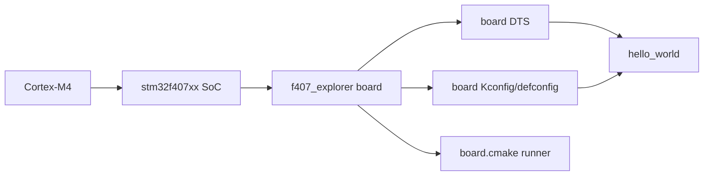
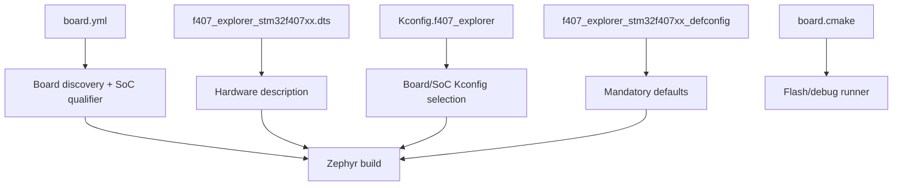
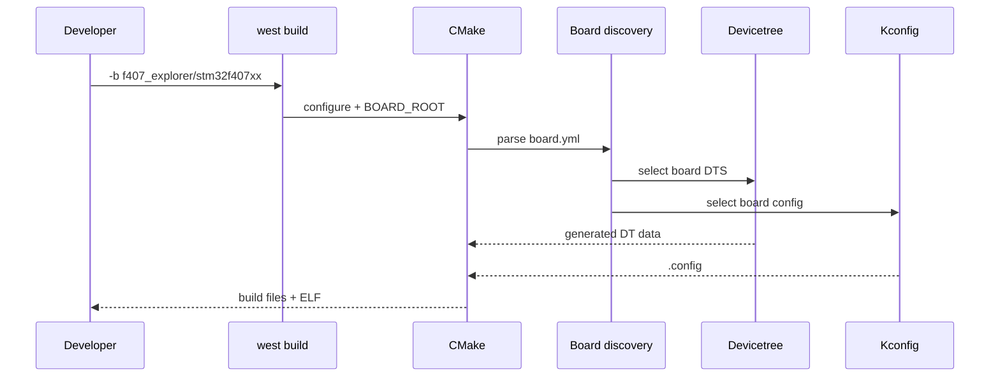

# W02D05 - Zephyr Out-of-Tree Board：把 Explorer F407 加入 Hardware Model v2

## 0. 今日定位

- 所属能力：Zephyr BSP / Board Port
- 前置：W01D05 官方 `stm32f4_disco/stm32f407xx` 能构建；W01D06 硬件审计完成
- Zephyr 基线：课程固定 v4.4.1；执行时记录实际 commit
- 主动学习时间：约 2h
- 今日最终产物：`boards/alientek/f407_explorer/` 最小 board definition，`west boards` 可发现并能编译 hello_world

## 1. 今天解决的工程问题

Zephyr 已经支持 `stm32f407xx` SoC，但**不等于支持你的 PCB**。今天要建立清晰分层：

```text
Architecture support
→ SoC support
→ Board support
→ Application
```

你只补 Board 层，不重写 GPIO/UART driver。

## 2. 今日能力构成



## 3. 先理解：费曼解释

### 3.1 白话模型

Zephyr 已经知道“STM32F407 的 RCC、UART、GPIO 寄存器怎么驱动”。你的 board port 只需要告诉它：

> 我这块板用哪个 F407、晶振是什么、console 用哪个 UART、哪些 pin 接了 LED/KEY、怎么烧写。

### 3.2 精确工程模型

Zephyr Hardware Model v2 的 board metadata 由 `board.yml` 描述；Devicetree 描述板级硬件；Kconfig/defconfig 提供软件/board 默认配置；`board.cmake` 声明 flash/debug runner。

官方 Board Porting Guide 的 v2 结构中，核心文件包括：

```text
board.yml
<board>_<qualifier>.dts
Kconfig.<board>
```

`*_defconfig`、`Kconfig.defconfig`、`board.cmake` 等按需要加入。

### 3.3 为什么用 out-of-tree

你的个人项目不需要把 board 文件直接改进 Zephyr 源码树。out-of-tree 能做到：

```text
Zephyr upstream clean
+
your board repository
```

升级 Zephyr 时也更容易看差异。

## 4. 原理：BOARD_ROOT 与 board discovery

推荐课程工程：

```text
~/work/zephyr/f407-platform/
├── boards/
│   └── alientek/
│       └── f407_explorer/
├── app/
└── CMakeLists.txt / prj.conf as needed
```

构建时显式指定 root：

```bash
west build -b f407_explorer/stm32f407xx \
  ~/zephyrproject/zephyr/samples/hello_world \
  -- -DBOARD_ROOT=$HOME/work/zephyr/f407-platform
```

也可以将 board root 通过 Zephyr module metadata 管理，今天先用显式 `BOARD_ROOT`，行为最容易观察。

## 5. 结构图：Board 文件各自负责什么



## 6. 构建时序




## 7. 阅读资料

阅读原则：**先用本机真实 BSP/源码证明，再用教程和官方文档解释。** 正点原子两本大 PDF 当前未作为附件放进课程包，因此本文不伪造页码；若你将 PDF 按 `references/README.md` 的英文别名放入 `references/`，后续可补精确页码。

- `SRC-ZEPHYR-BOARD-PORTING`：**今天主文档**。重点看 mandatory/optional board files 和 board.yml。
- `SRC-ZEPHYR-APP-DEVELOPMENT`：out-of-tree custom board 与 `BOARD_ROOT`。
- `SRC-ZEPHYR-F4-DISCO`：只参考同 SoC 的组织方式，不复制板级 pin/flash。
- `SRC-F407-SCH`：板级事实源。

## 8. 实验准备

确认 Zephyr 版本：

```bash
cd ~/zephyrproject/zephyr
git describe --tags --always
git rev-parse HEAD
```

创建：

```bash
mkdir -p ~/work/zephyr/f407-platform/boards/alientek/f407_explorer
cd ~/work/zephyr/f407-platform
```

Zephyr vendor prefix registry 已包含 `alientek`，所以目录使用 `boards/alientek/` 是合理的。

## 9. Lab 1 - 最小 board metadata

创建 `boards/alientek/f407_explorer/board.yml`：

```yaml
board:
  name: f407_explorer
  full_name: ALIENTEK STM32F407 Explorer
  vendor: alientek
  socs:
  - name: stm32f407xx
```

创建 `Kconfig.f407_explorer`。**不要从网络随机复制 symbol**；先打开官方同 SoC board：

```bash
find ~/zephyrproject/zephyr/boards/st/stm32f4_disco -maxdepth 1 -type f -print
```

根据 v4.4.1 真实 `Kconfig.*` 和 `stm32f407xx` SoC selection 写最小版本。

> 这里教程刻意不把 Kconfig symbol 写死：Zephyr board Kconfig 细节可能随 release 调整，正确训练方式是基于你固定的 v4.4.1 源码复制**结构模式**，而不是把本文变成另一个过期 BSP。

## 10. Lab 2 - 最小 DTS，不加 LED/Flash

创建目标 DTS，命名遵循你的 board qualifier：

```text
f407_explorer_stm32f407xx.dts
```

第一版只做：

1. include 正确的 STM32F407 SoC DTSI；
2. `model` / `compatible`；
3. memory/flash 使用 SoC/board 正确容量；
4. chosen console 暂时可以留到 Day6；
5. 不加 W25Q128、不加 Ethernet。

先参考上游文件：

```bash
find ~/zephyrproject/zephyr/boards/st/stm32f4_disco -maxdepth 1 -name '*.dts' -print -exec sed -n '1,180p' {} \;
```

构建：

```bash
west boards | grep -i f407_explorer || true

west build -p always \
  -b f407_explorer/stm32f407xx \
  ~/zephyrproject/zephyr/samples/hello_world \
  -- -DBOARD_ROOT=$HOME/work/zephyr/f407-platform
```

今天的第一目标是 **CMake 能发现 board + DTS/Kconfig 进入编译链**。即使 console 还没配置，编译通过就完成主要目标。

检查：

```bash
grep -n "model" build/zephyr/zephyr.dts | head
grep -E 'CONFIG_BOARD|CONFIG_SOC' build/zephyr/.config | head -30
```

## 11. 故障注入

把 `board.yml` 的 SoC 名故意改错一个字符，执行 pristine build，观察失败发生在 board/SoC resolution 层；恢复后再编。

另一个实验：构建时去掉 `-DBOARD_ROOT`，观察 west 是否还能发现你的 out-of-tree board。

## 12. 调试路径

```text
west boards 看不到
→ BOARD_ROOT
→ board.yml syntax/name/vendor/soc

board found but CMake fails
→ target qualifier / Kconfig

DTS compile fails
→ include / node label / binding

link fails
→ SoC memory/config
```

## 13. 源码追踪

今天只追：

```text
boards/st/stm32f4_disco/
dts/arm/st/...
dts/bindings/
```

理解一句话：**board 文件描述具体 PCB；SoC DTSI 定义控制器；driver 由 compatible/Kconfig 进入 build。**

## 14. 今日验收

- [ ] `west boards` 能发现 `f407_explorer`；
- [ ] board target 使用 `stm32f407xx` qualifier；
- [ ] `hello_world` 能完成编译；
- [ ] `build/zephyr/zephyr.dts` 显示自定义 board model；
- [ ] 能解释 board.yml、DTS、Kconfig、defconfig、board.cmake 各自职责；
- [ ] 没有复制 Discovery 的 LED/UART/Flash board facts。

## 15. 面试式复述

1. SoC support 与 board support 差在哪？
2. `BOARD_ROOT` 干什么？
3. board.yml 是否描述 pin？
4. DTS 与 defconfig 职责怎么分？
5. 为什么 out-of-tree board 更适合产品仓库？
6. 为什么 fixed Zephyr release 很重要？

## 16. Git 交付物

```text
boards/alientek/f407_explorer/board.yml
boards/alientek/f407_explorer/Kconfig.f407_explorer
boards/alientek/f407_explorer/f407_explorer_stm32f407xx.dts
boards/alientek/f407_explorer/*_defconfig  # 若 v4.4.1 结构需要
```

## 17. 明日连接

明天把“能编译的 board”变成“能在真实板上说话的 board”：时钟、USART1 console、pinctrl 和 flash/debug runner。
