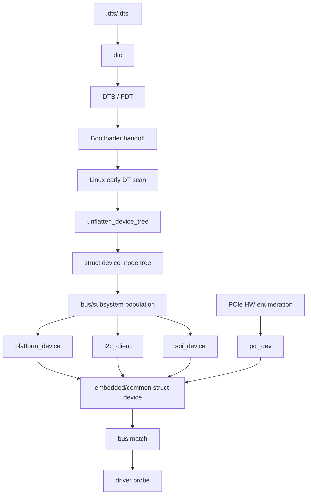
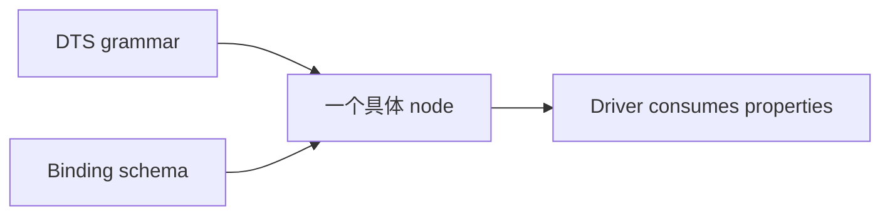
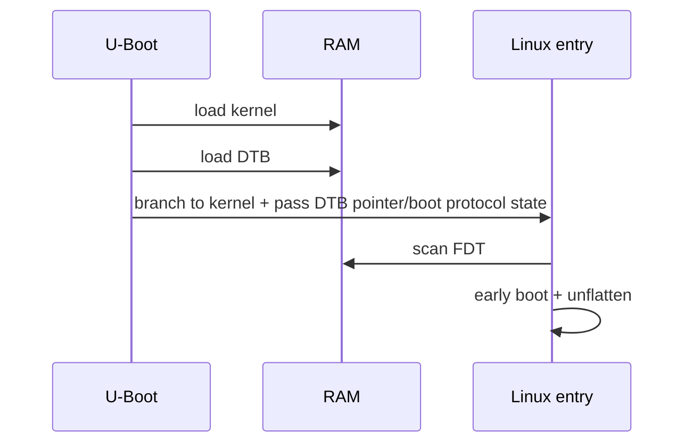
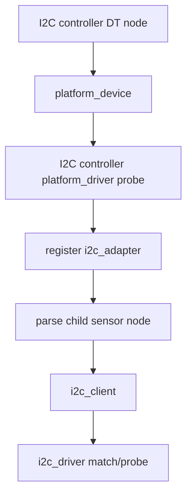
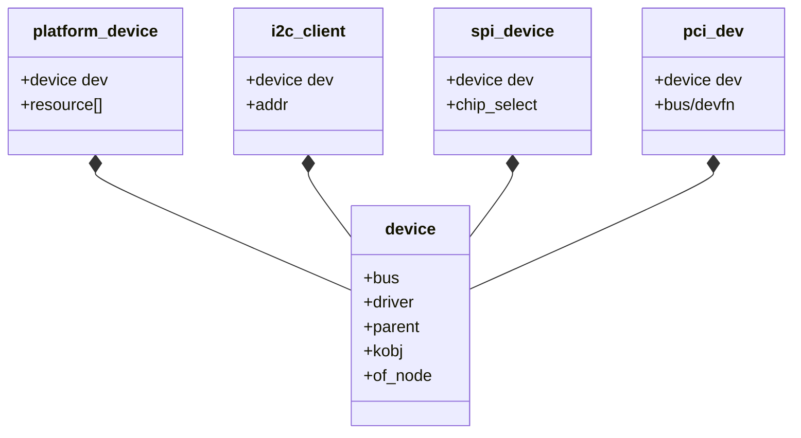
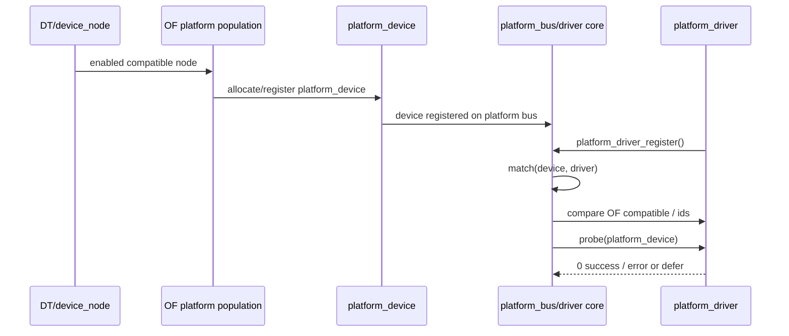
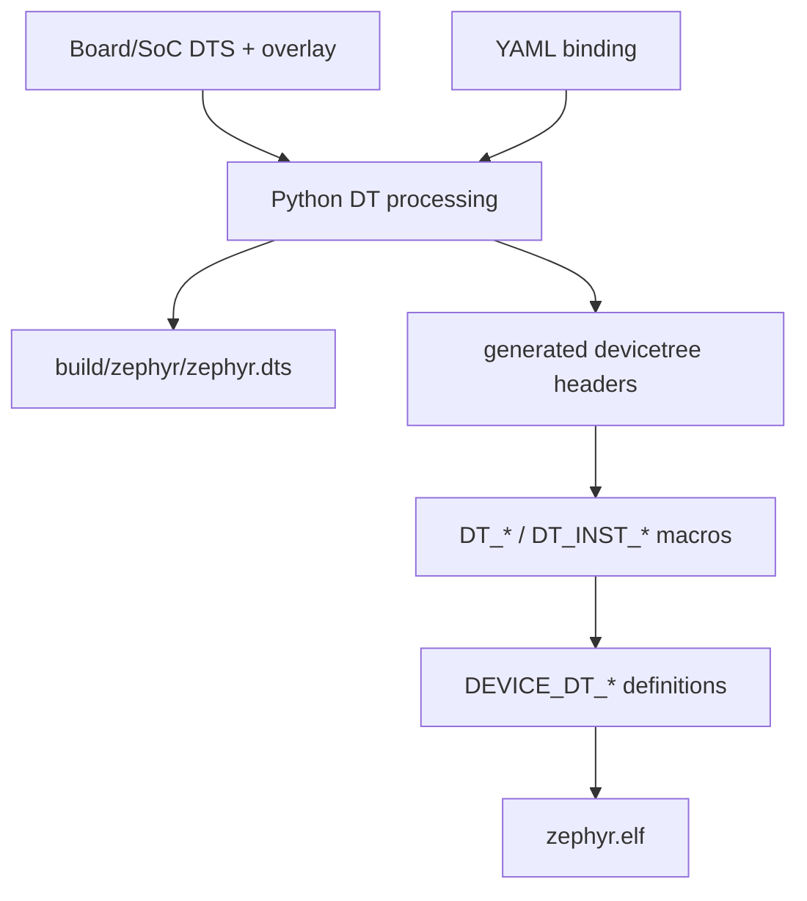
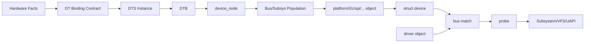
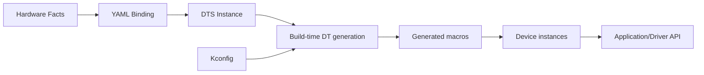

# A01 - DeviceTree 深入：从 DTS 文本到 Linux `struct device` / Driver `probe()`

> 目标：解决一个核心困惑——**各厂商 DTS 看起来都不同，Linux 为什么仍能把硬件组织进统一 Driver Model？DTS 到底怎样变成 `device_node`、`platform_device`、`i2c_client` 等对象？**

本文先讲 Linux，再对照 Zephyr。它不是只教 DTS 语法，而是讲完整生命周期。

---

# 1. 先给结论：DTS 不会直接“生成一个统一 `struct device`”

最重要的图先放这里：



精确结论：

1. DTS 经 `dtc` 成为 flattened binary DTB；
2. Linux 启动时先扫描 FDT，再 `unflatten_device_tree()` 建立 `struct device_node` 树；
3. **不是每个 node 都立刻变成 `struct device`**；
4. 不同 bus/subsystem 按自己的规则创建 `platform_device`、`i2c_client`、`spi_device` 等；
5. 这些设备对象进入公共 Linux Driver Model，使用 `struct device` / `struct device_driver` / `struct bus_type`；
6. bus 的 `match()` 判断 device/driver 是否匹配，之后调用 `probe()`。

Linux 官方 usage model 明确描述了 `unflatten_device_tree()` 和 device population；platform 文档明确显示 `struct platform_device` 内含 `struct device dev`。

官方：

- https://docs.kernel.org/devicetree/usage-model.html
- https://docs.kernel.org/driver-api/driver-model/platform.html
- https://docs.kernel.org/driver-api/driver-model/binding.html

---

# 2. 为什么 Device Tree 会出现

## 2.1 费曼解释

想象没有 DT，每一块板子的“UART 地址、GPIO pin、中断号、I2C 上挂什么 sensor”都写进 Kernel C 文件：

```c
board_a_devices[] = {...};
board_b_devices[] = {...};
board_c_devices[] = {...};
```

同一个 UART Driver 没变，但换一块 PCB 就要改 Kernel C code。板型增加后，大量与“驱动算法”无关的硬件连线污染 Kernel source。

Device Tree 的思路：

> Driver 写“我会驱动什么类型的硬件”；DT 写“这块机器实际有什么硬件、资源在哪里”。

## 2.2 精确模型

DT 是 data structure for hardware description。它适合描述：

- topology；
- MMIO address ranges；
- interrupt wiring；
- clocks/resets；
- GPIO/phandle relations；
- bus child devices；
- board-specific enable/disable。

它**不应该**成为：

- 任意应用业务配置仓库；
- driver algorithm 参数的垃圾桶；
- runtime user preference；
- 用来绕过 Driver Model 的“神秘配置”。

---

# 3. 三个不同层次：语法、Binding、Driver

你说“各厂商设备树都不一样”，要拆成三层：



## 3.1 DTS grammar：统一语法

例如所有厂商都遵守类似结构：

```dts
serial@2020000 {
    compatible = "fsl,imx6ul-uart";
    reg = <0x02020000 0x4000>;
    interrupts = <GIC_SPI 26 IRQ_TYPE_LEVEL_HIGH>;
    status = "okay";
};
```

大括号、property、phandle、cell 等是 DT syntax/data model 层面。

## 3.2 Binding：属性契约

Binding 回答：

> 对 `compatible = "vendor,device"` 的节点，哪些 property 合法/必须？每个值是什么意思、类型和数量是什么？

现代 Linux binding 使用 JSON Schema vocabulary，文件使用 YAML 表达。官方：
https://docs.kernel.org/devicetree/bindings/writing-schema.html

因此：

```text
DTS grammar ≠ binding schema ≠ driver implementation
```

厂商可以有 vendor-specific compatible/property，但不是“想写什么都行”。upstream binding 要约束它们。

## 3.3 Driver：消费已描述的资源

Driver 可能通过：

```c
platform_get_resource()
devm_platform_ioremap_resource()
platform_get_irq()
devm_clk_get()
gpiod_get()
of_property_read_*()
```

获取资源。具体 API 取决于 subsystem/Kernel version。

---

# 4. DTS 基础语法，但每个属性都要知道“谁消费”

## 4.1 根节点与 node

```dts
/ {
    model = "example-board";

    soc {
        uart1: serial@2020000 {
            compatible = "vendor,uart";
            reg = <0x02020000 0x4000>;
        };
    };
};
```

`uart1:` 是 label，`serial@2020000` 是 node name + unit-address。

### unit-address

通常与 `reg` 的首地址对应；它不是 C 变量名，也不是 Linux device name 的唯一来源。

## 4.2 `.dts` 与 `.dtsi`

典型：

```text
SoC common .dtsi
      ↑ include
Board .dts
      ↑ overlay/override nodes
```

SoC `.dtsi` 描述芯片内部公共控制器；board `.dts` 选择实际使用的 pin、外设、PHY、panel、sensor 等。

这就是“同一个 i.MX6ULL SoC，多个厂商 board DTS 为什么不同”的第一原因。

## 4.3 `compatible`

```dts
compatible = "fsl,imx6ul-uart", "fsl,imx6q-uart";
```

它是 hardware programming model identity/fallback list，不是“驱动文件名”。Driver 的 OF match table 可能：

```c
static const struct of_device_id my_ids[] = {
    { .compatible = "vendor,my-uart" },
    { }
};
```

bus/subsystem 通过 OF matching 逻辑比较，而不是字符串直接跳转函数。

## 4.4 `status`

常见：

```dts
status = "okay";
status = "disabled";
```

`disabled` 通常意味着该 hardware node 不应作为可用设备参与正常 population/probe。它不是“Driver 禁用开关”的唯一层级；Kconfig 仍决定 Driver code 是否编进 Kernel。

## 4.5 `reg`、`#address-cells`、`#size-cells`

父总线决定 child `reg` 每个 tuple 怎么解析。

例如父节点：

```dts
#address-cells = <1>;
#size-cells = <1>;
```

child：

```dts
reg = <0x02020000 0x4000>;
```

表示一个 address cell + 一个 size cell。

如果父节点是 64-bit address，可能：

```dts
#address-cells = <2>;
#size-cells = <2>;
```

此时一个 `reg` tuple 需要 4 个 cells。**不要数值看起来像地址就凭感觉拆。先看 parent cells。**

## 4.6 `ranges`

`ranges` 描述 child bus address space 到 parent bus address space 的 translation。空 `ranges;` 常表示 identity mapping；缺失/不同 binding 下的意义需要结合 bus spec。

## 4.7 interrupts

典型不是一个简单“中断号”：

```dts
interrupt-parent = <&gic>;
interrupts = <...>;
```

一个 interrupt specifier 有几个 cells、每 cell 意义，由 interrupt controller 的 `#interrupt-cells`/binding 决定。

所以不同 SoC 的 `interrupts = <...>` 长得不同，不代表语法不统一；是**provider binding 不同**。

## 4.8 phandle：为什么 clock/GPIO 不是硬编码 ID

```dts
clocks = <&ccm IMX6UL_CLK_UART1_IPG>;
reset-gpios = <&gpio1 3 GPIO_ACTIVE_LOW>;
```

`&ccm`、`&gpio1` 指向 provider node。后面的 cells 由 provider binding 定义。

费曼解释：不是写“GPIO 控制器编号 2”这种全局 magic number，而是“指向那个控制器对象，再给它自己的参数”。

## 4.9 pinctrl

```dts
pinctrl-names = "default";
pinctrl-0 = <&pinctrl_uart1>;
```

consumer device 引用 pin controller 中的一组 pin configuration。Driver 通常不自己在 probe 里一行行写 IOMUX 寄存器，pinctrl subsystem 管理状态。

---

# 5. DTS → DTB：只是把文本变成可传递的数据，不是生成 Driver


常用：

```bash
dtc -I dts -O dtb -o test.dtb test.dts
dtc -I dtb -O dts -o roundtrip.dts test.dtb
fdtdump test.dtb | less
```

实际 Kernel DTS 还可能经过 C preprocessor/include/macros，因此不要把手工 `dtc file.dts` 当成完整 Kernel build pipeline 的复制。

---

# 6. U-Boot 如何把 DTB 交给 Linux

ARM Linux 常见启动要素：

```text
Kernel image
DTB address
initrd（可选）
bootargs
```

U-Boot 常见：

```text
fdt addr <dtb-ram-address>
fdt print /
bootz <kernel> - <fdt>
```

不同 board 的变量/地址不同。你应该：

```text
printenv
bdinfo
```

再判断 `kernel_addr_r/fdt_addr_r/loadaddr` 等，而不是复制别人的地址。



---

# 7. FDT 进入 Kernel：先变 `device_node`，不是 `device`

Linux 官方 usage model 描述：early boot 会扫描 flat tree，之后 `unflatten_device_tree()` 把它转换为运行时更高效的树结构。

核心模型：

```text
Serialized FDT bytes
        ↓
unflatten_device_tree()
        ↓
struct device_node hierarchy
```

你可以把 `device_node` 理解为：“Linux 内存里一个可遍历、可查询 property 的 DT 节点对象”。

它主要属于 OF(Open Firmware)/Devicetree representation，不等于 Driver Model 的“已注册设备”。

这是你的原问题最关键的分界线。

---

# 8. `device_node` 什么时候变成真正的设备对象

## 8.1 根/SoC MMIO：常见 `platform_device`

Linux 官方 usage model：board support 调 `of_platform_populate()` 从合适节点开始 population；对适合的 root/SoC child nodes 分配并注册 `platform_device`。

`platform_device` 结构核心关系：

```c
struct platform_device {
    const char *name;
    int id;
    struct device dev;
    unsigned int num_resources;
    struct resource *resource;
    /* ... */
};
```

注意这里的：

```c
struct device dev;
```

这才是统一 Driver Model 的入口之一。

## 8.2 为什么 I2C sensor 不是 `platform_device`

假设：

```dts
i2c@... {
    sensor@68 {
        compatible = "vendor,sensor";
        reg = <0x68>;
    };
};
```

I2C controller 自己可能先作为 platform device probe。它注册 I2C adapter/master 后，I2C core 根据 child nodes 创建 `i2c_client`。



这就是 Linux 官方文档说的 device hierarchy：`i2c_client` 是 `i2c_master` 的 child；SPI 同理。

## 8.3 PCIe 为什么更不一样

PCIe 有标准 configuration space / enumeration protocol。EP 的存在通常由 PCI core 对总线进行硬件枚举得到 `pci_dev`，不是依赖 DT 给每个 EP 写一个 node。

DT 常用于描述**PCIe Host/RC controller**及其 platform resources；下游 EP 由 PCI bus 枚举。

---

# 9. “统一 device”到底在哪里

看 class relation：



因此“统一”不是让所有设备丢掉总线特性，变成一个同样的结构体；而是：

> 每个 bus-specific object 保留自己的数据，同时嵌入/关联公共 `struct device`，由 Driver Model 统一管理 parent/bus/driver/PM/sysfs/lifecycle。

这与你熟悉的 C “基类嵌入”非常相似。

---

# 10. Device + Driver 怎样 match，然后 `probe()`

Driver Model 官方说明：匹配格式是 bus-specific，bus 提供 match callback。当匹配成功，driver core 关联 driver，并调用 probe。

platform driver 典型：

```c
static const struct of_device_id demo_of_match[] = {
    { .compatible = "student,mydev" },
    { }
};
MODULE_DEVICE_TABLE(of, demo_of_match);

static struct platform_driver demo_driver = {
    .probe = demo_probe,
    .remove = demo_remove,
    .driver = {
        .name = "student-mydev",
        .of_match_table = demo_of_match,
    },
};
```

## 10.1 谁调用 probe？

不是 DTS；不是应用；不是你手工直接调用。



设备先注册、驱动后注册；或驱动先注册、设备后出现，都可以触发匹配检查。

## 10.2 `compatible` 是谁跟谁比

精确地说，platform bus/OF matching 逻辑利用：

```text
device's of_node compatible list
vs
driver's of_match_table
```

匹配成功只表示“这个 driver 声称支持该 hardware identity”；`probe()` 还要申请 resource、clock、IRQ，最终可能失败或 `-EPROBE_DEFER`。

---

# 11. “厂商 Driver 是根据 DTS 开发的”该怎样精确理解

更准确地说：

1. hardware spec 决定 resource/model；
2. binding 定义 hardware description contract；
3. DTS instance 按 binding 填入这块板/SoC 的具体资源；
4. Driver 使用 subsystem API/firmware property API 获取这些资源。

不是“Driver 想读一个 `foo = <3>`，厂商就在 DTS 随便写 foo”。如果要 upstream，vendor property 要有 binding schema 与清晰语义。

## 11.1 通用属性 vs vendor-specific

例如：

```text
compatible
reg
interrupts
clocks
resets
dmas
pinctrl-0
```

是广泛存在的通用机制；具体 compatible、clock IDs、vendor extension 取决于硬件/binding。

所以你看到 NXP、Rockchip、TI、Xilinx DTS 风格不同，底层模型仍一致：provider/consumer、bus hierarchy、resources、bindings。

---

# 12. Linux DeviceTree 与 Zephyr DeviceTree：语法像，生命周期完全不同

这是非常重要的迁移点。

## 12.1 Linux

```text
DTS/DTSI
→ dtc
→ runtime DTB
→ bootloader passes FDT
→ Kernel unflatten
→ struct device_node
→ bus population/enumeration
→ device object
→ match/probe
```

Linux 可以在 Kernel runtime 查询 node/property。

## 12.2 Zephyr

Zephyr 核心是**构建期**：



Driver 代码常见：

```c
#define DT_DRV_COMPAT vendor_device

DT_INST_FOREACH_STATUS_OKAY(DEVICE_INIT_MACRO)
```

或应用：

```c
const struct device *dev = DEVICE_DT_GET(DT_NODELABEL(...));
```

关键区别：

> Zephyr 通常不带一个 Linux 风格的完整 DTB 到 runtime 再动态 population；它把 DT 信息在 build 时变成 C compile-time information/device instances。

## 12.3 为什么这对你特别重要

你会同时学 Linux 和 Zephyr。如果不区分生命周期，很容易误以为：

- Zephyr 也有 `unflatten_device_tree()`；
- Linux DTS 也主要靠生成 C macro；
- 两边 `compatible` 的 driver match 时机完全一样。

这些都不准确。

---

# 13. 实验 A：从 i.MX6ULL UART DTS 追到 Driver

> 目标：不用背 Driver 文件名，建立“从 DT identity 找 Driver”的方法。

## A1. 找 UART 节点

在 BSP Kernel source：

```bash
grep -Rni 'serial@\|uart@' arch/arm/boot/dts | grep -i imx6ul | head
```

新版 Kernel DTS 路径可能为 `arch/arm/boot/dts/nxp/imx/`；旧 BSP 常是 `arch/arm/boot/dts/`。以你的 source tree 为准。

找 `compatible`：

```bash
grep -Rni 'fsl,imx6.*uart' arch/arm/boot/dts* | head
```

## A2. 用 compatible 反查 Driver

```bash
grep -Rni 'fsl,imx6.*uart' drivers include | head -30
```

找到 OF match table，再找：

```text
platform_driver
probe = ...
```

## A3. 追资源

在 probe 中找：

```text
platform_get_resource / ioremap
irq
clk
pinctrl
```

不同 Kernel version API 会不同，不要要求函数名一模一样，要求**资源类别对应**。

## A4. 运行时证据

Target：

```bash
ls /sys/bus/platform/devices | grep -i serial
ls /sys/bus/platform/drivers | grep -i imx
cat /proc/interrupts | grep -i uart
```

把 DTS node、sysfs device、driver name、console device 做一张 mapping 表。

---

# 14. 实验 B：`status = "disabled"` 会发生什么

选择一个**不影响 console/boot/storage/network 管理通道**的安全设备。

1. 原 DTS `status = "okay"`；
2. 修改为 `disabled`；
3. rebuild DTB；
4. U-Boot TFTP 新 DTB；
5. Linux boot；
6. 比较：

```bash
dmesg | grep -i <device>
find /sys/bus/platform/devices -maxdepth 1 -iname '*<device>*'
```

然后恢复。

这个实验会直接证明：DT node presence ≠ device availability；population 受 status 等规则影响。

---

# 15. 实验 C：自己造一个 `student,mydev`，观察 match/probe

> 不控制真实硬件，先验证 Driver Model。

DTS（选择不冲突的 simple node；不要伪造真实 MMIO 地址去访问）：

```dts
mydev {
    compatible = "student,mydev";
    status = "okay";
    demo-value = <1234>;
};
```

最小 driver：

```c
#include <linux/module.h>
#include <linux/of.h>
#include <linux/platform_device.h>

static int demo_probe(struct platform_device *pdev)
{
    u32 value = 0;
    int ret;

    ret = of_property_read_u32(pdev->dev.of_node, "demo-value", &value);
    if (ret) {
        dev_err(&pdev->dev, "missing demo-value: %d\n", ret);
        return ret;
    }

    dev_info(&pdev->dev, "probe: demo-value=%u\n", value);
    return 0;
}

/* 正点原子常见 Linux 4.x BSP 使用 int remove(...)。 */
static int demo_remove(struct platform_device *pdev)
{
    dev_info(&pdev->dev, "remove\n");
    return 0;
}

static const struct of_device_id demo_ids[] = {
    { .compatible = "student,mydev" },
    { }
};
MODULE_DEVICE_TABLE(of, demo_ids);

static struct platform_driver demo_driver = {
    .probe = demo_probe,
    .remove = demo_remove,
    .driver = {
        .name = "student-mydev",
        .of_match_table = demo_ids,
    },
};
module_platform_driver(demo_driver);
MODULE_LICENSE("GPL");
```

> **Kernel API 版本差异：** 正点原子常见 i.MX6ULL 教学 BSP 基于较老 Linux 4.x，因此示例优先使用 `dev_err()` 和 `int remove(...)`，避免依赖后续内核才出现的 `dev_err_probe()` 等便利 API。切换到新内核时，必须打开你实际源码的 `include/linux/platform_device.h`，按该版本 `struct platform_driver` 的 callback 签名修改；教程不是 ABI。

实验：

```bash
insmod student_mydev.ko
dmesg | tail
ls -l /sys/bus/platform/drivers/student-mydev
```

如果支持 bind/unbind，可观察 lifecycle。

---

# 16. 实验 D：Zephyr 中追一个 LED，从 DTS 到 C

官方 F4 build 后：

```bash
cd ~/zephyrproject/zephyr
grep -n 'led' build/zephyr/zephyr.dts | head -30
grep -Rni 'gpio-leds' dts/bindings | head
```

应用常用 alias：

```c
#define LED0_NODE DT_ALIAS(led0)
static const struct gpio_dt_spec led = GPIO_DT_SPEC_GET(LED0_NODE, gpios);
```

你要追四层：

```text
board DTS alias/node
→ YAML binding (`gpio-leds`, child `gpios`)
→ generated devicetree macros
→ application/driver C macro expansion
```

用 build 的 generated headers 搜 node identifier。目标不是手动读完宏，而是理解：**Zephyr 在 build time 把硬件描述编译进程序。**

---

# 17. 常见故障矩阵

| 症状 | 优先检查 | 原因模型 |
|---|---|---|
| `dtc` syntax error | 行号、括号、分号、include | grammar 失败，根本没生成 DTB |
| DTB 能编但 Driver 不 probe | `status`、compatible、Driver Kconfig、sysfs | representation 成功 ≠ match 成功 |
| device 有但 probe fail | dmesg、resource/clock/IRQ | match 成功 ≠ init 成功 |
| probe `-EPROBE_DEFER` | provider 是否 ready | dependency ordering |
| wrong `reg` | parent cells/ranges、RM | Driver 映射错误资源 |
| wrong `interrupts` | interrupt-parent/binding | specifier 解释错误 |
| pin 没波形 | pinctrl state、clock、pad mux | peripheral Driver 可能已 probe，但 pin 未配置正确 |
| `/dev/xxx` 不存在 | class/cdev/subsystem registration | `struct device` probe ≠ 自动产生 char device |
| Zephyr DT node 看得到但代码没 instance | `status`, Kconfig, compatible binding, macro | build-time generation 条件不满足 |

---

# 18. 你必须形成的最终心智模型

## 18.1 Linux



## 18.2 Zephyr



---

# 19. 面试式复述

必须脱离本文回答：

1. Device Tree 为什么存在？
2. DTS、DTB、FDT 有什么关系？
3. `unflatten_device_tree()` 的输出是什么？
4. `struct device_node` 与 `struct device` 是一回事吗？
5. 是否所有 DT node 都变成 `platform_device`？
6. 为什么 I2C sensor 是 `i2c_client`？
7. PCIe EP 为什么通常不是靠 DT 枚举？
8. `platform_device` 如何进入统一 Linux Driver Model？
9. 谁调用 Driver `probe()`？
10. `compatible` 具体是谁和谁匹配？
11. Binding、DTS grammar、Driver implementation 有什么区别？
12. 为什么 NXP/Rockchip/Xilinx DTS 看起来不同但仍属同一模型？
13. `#address-cells/#size-cells` 为什么必须看 parent？
14. phandle 解决什么问题？
15. Linux DT 与 Zephyr DT 最大生命周期差异是什么？

如果第 4/5/8/9/15 题不能清晰回答，不算学会设备树。

---

# 20. 推荐源码阅读入口

Linux（路径随 Kernel version 变化）：

```text
include/linux/of.h
include/linux/device.h
include/linux/platform_device.h
drivers/of/
drivers/base/
```

不要从 `start_kernel()` 通读。按问题追：

```text
DTB 怎么变 device_node？
→ unflatten_device_tree

device_node 怎么变 platform_device？
→ of_platform_populate / of_platform_device_create

match 怎么发生？
→ platform bus match / driver core binding
```

Zephyr：

```text
dts/
boards/
include/zephyr/devicetree.h
include/zephyr/device.h
scripts/dts/
```

按一个 LED/UART 实例追，不做宏海洋漫游。

---

# 21. 资料定位

- `SRC-IMX6ULL-DRV`：第 43 章“Linux 设备树”；第 55 章“设备树下的 platform 驱动”。公开连载可确认这些章名。
- `SRC-LINUX-DT`：Linux and the Devicetree，重点看 early scan、unflatten 与 device population。
- `SRC-LINUX-DRIVER-MODEL`：Platform Devices/Drivers + Driver Binding，重点看 common `struct device`、bus match 与 probe。
- `SRC-LINUX-DT-BINDING`：Writing Devicetree Bindings in json-schema，重点看 binding schema 对属性契约的约束。
- `SRC-ZEPHYR-DT`：Zephyr Devicetree，重点看 build-time generation、YAML binding 与 `DT_*`/`DEVICE_DT_*`。

> 正点原子 V1.5.2 PDF 当前没有在会话里上传，因此本文只写已核实章节，不捏造页码。将本地 PDF 放入 `references/` 后，可按章节目录直接定位；后续如果你上传该 PDF，我可以再给每个子章节补精确页码锚点。
## References / Manuals

- **ALIENTEK I.MX6U Embedded Linux Driver Development Guide V1.5.2**  
  Local: [`../references/ALIENTEK_iMX6ULL_Linux_Driver_Development_Guide_V1.5.2.pdf`](../references/ALIENTEK_iMX6ULL_Linux_Driver_Development_Guide_V1.5.2.pdf)  
  Online: [GitHub public archive](https://github.com/alientek-openedv/imx6ull-document/blob/master/%E3%80%90%E6%AD%A3%E7%82%B9%E5%8E%9F%E5%AD%90%E3%80%91I.MX6U%E5%B5%8C%E5%85%A5%E5%BC%8FLinux%E9%A9%B1%E5%8A%A8%E5%BC%80%E5%8F%91%E6%8C%87%E5%8D%97V1.5.2.pdf)  
  Read: Chapter 43 **Linux Device Tree**, Chapter 54 **platform device/driver**, Chapter 55 **DeviceTree-based platform driver**.
- [Linux and the Devicetree](https://docs.kernel.org/translations/zh_CN/devicetree/usage-model.html) — especially **Device population**.
- [Linux DeviceTree Kernel API](https://docs.kernel.org/devicetree/kernel-api.html) — `of_platform_populate()` and OF helpers.
- [Zephyr Devicetree Guide](https://docs.zephyrproject.org/latest/build/dts/index.html) — for the Linux-vs-Zephyr comparison.


