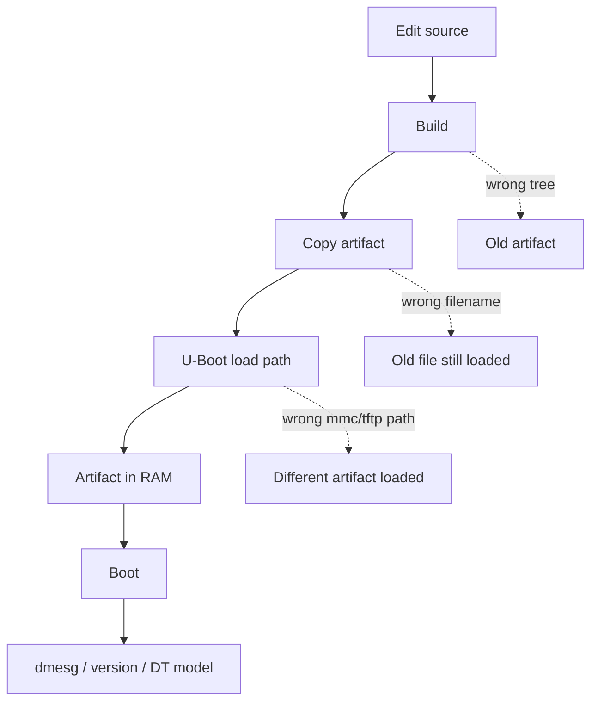
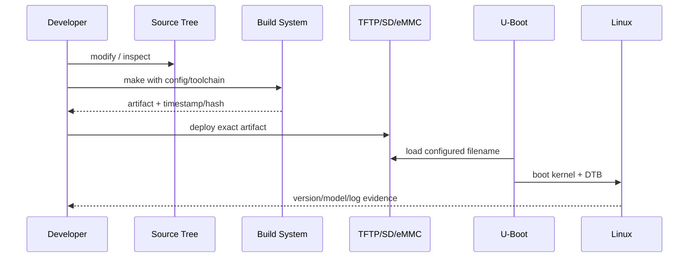

# W02D01 - i.MX6ULL BSP Artifact Map：先搞清楚“源码、构建、产物、板卡”四个空间

## 0. 今日定位

- 所属能力：Linux BSP / Build System 基础
- 前置：Week 1 的 Ubuntu、交叉工具链、串口、TFTP/NFS 已通过验收
- 硬件：正点原子 i.MX6ULL
- 主动学习时间：约 2h
- 今日最终产物：`6ull_artifact_map.md`
- 今天不做：不烧写、不改驱动、不抄教程里的固定路径

## 1. 今天解决的工程问题

在真实 BSP 中最常见的低级问题不是“不会编译”，而是**不知道自己编的是哪棵源码、用了哪个配置、生成的哪个文件、板子实际启动的是不是它**。

你未来调 Driver、DTB、Kernel panic、U-Boot 时都必须先回答四个问题：

1. Source 在哪里？
2. Configuration 从哪里来？
3. Artifact 生成在哪里？
4. Target 最终从哪里加载它？

今天不追求编译，先把这个地图建立起来。

## 2. 今日能力构成


## 3. 先理解：费曼解释

### 3.1 30 秒白话模型

把 BSP 想成一家工厂：

- U-Boot 源码是一条生产线；
- Kernel 源码是另一条生产线；
- defconfig 是“车型配置”；
- DTS 是“硬件装配清单”；
- `zImage/.dtb/.imx` 是出厂零件；
- SD/eMMC/TFTP 是仓库和物流。

你如果只知道“make 成功”，却不知道板子从哪个仓库拿了哪个零件，调试时一定会出现“我明明改了，为什么没变化”。

### 3.2 精确工程模型

BSP 通常至少包含四类独立工程：

```text
U-Boot source
Linux kernel source
Root filesystem
Cross toolchain / SDK
```

它们的版本、配置和输出目录可以完全不同。`CROSS_COMPILE` 只是把 host 上的 compiler 指向 target ABI，并不会自动告诉 U-Boot/Kernel 你的板型。

### 3.3 常见错误理解

- “有 `zImage` 就代表是我刚编的。”——可能是旧文件。
- “DTB 文件名像我的板子就一定匹配。”——必须反编译看 `model/compatible`。
- “U-Boot 和 Kernel 用同一个 defconfig。”——不是同一个构建系统。
- “rootfs 属于 Kernel 编译产物。”——不是。

## 4. 原理：四个空间

### 4.1 Source Space

先建立变量，不写死路径：

```bash
export BSP=~/work/linux/imx6ull
export UBOOT=$BSP/u-boot
export KERNEL=$BSP/linux
export ROOTFS=$BSP/rootfs
export TFTP=/srv/tftp
```

如果你实际目录不同，就按真实路径写。今天的产物就是把“真实路径”固定下来。

### 4.2 Configuration Space

U-Boot：

```bash
cd "$UBOOT"
find configs -maxdepth 1 -type f | grep -Ei 'mx6|imx6|alientek|ull'
```

Kernel：

```bash
cd "$KERNEL"
find arch/arm/configs -maxdepth 1 -type f | grep -Ei 'imx|mx6'
find arch/arm/boot/dts -maxdepth 1 -type f | grep -Ei 'imx6.*ull|alientek'
```

不要先问“应该用哪个”，先看你手上 BSP 真正提供了什么。

### 4.3 Artifact Space

典型但不能盲信的路径：

```text
U-Boot: u-boot / u-boot.bin / u-boot-dtb.imx / *.imx
Kernel: vmlinux / arch/arm/boot/zImage
DTB:    arch/arm/boot/dts/*.dtb
Rootfs: tarball / ext image / directory tree
```

### 4.4 Target Load Space

在 U-Boot 中先只观察：

```text
printenv bootcmd
printenv bootargs
printenv loadaddr
printenv fdt_addr
printenv fdt_addr_r
printenv kernel_addr_r
printenv serverip
printenv ipaddr
```

**不要在今天 `saveenv`。** 只记录板子当前到底从 MMC/NAND/TFTP 的什么位置加载。

## 5. 结构图：一次“改了没生效”可能错在哪



## 6. UML/时序图：BSP 开发中的“证据链”




## 7. References / Manuals

### 7.1 ALIENTEK local/manual link

- **ALIENTEK I.MX6U Embedded Linux Driver Development Guide V1.5.2**  
  Local: [`../references/ALIENTEK_iMX6ULL_Linux_Driver_Development_Guide_V1.5.2.pdf`](../references/ALIENTEK_iMX6ULL_Linux_Driver_Development_Guide_V1.5.2.pdf)  
  Online: [GitHub public archive](https://github.com/alientek-openedv/imx6ull-document/blob/master/%E3%80%90%E6%AD%A3%E7%82%B9%E5%8E%9F%E5%AD%90%E3%80%91I.MX6U%E5%B5%8C%E5%85%A5%E5%BC%8FLinux%E9%A9%B1%E5%8A%A8%E5%BC%80%E5%8F%91%E6%8C%87%E5%8D%97V1.5.2.pdf)  
  Read: Chapter 30 **U-Boot Usage** (especially build/artifact/boot commands) and Chapter 35 **Linux Kernel Top Makefile**; focus on §35.2 kernel build and §35.3 source tree/artifact locations.

### 7.2 Official references

- [Linux Kconfig](https://docs.kernel.org/kbuild/kconfig.html) — understand how defconfig expands to `.config`.

### 7.3 Reading rule

Do not copy fixed paths/addresses blindly from the vendor guide. Use the vendor guide to locate the topic, then verify the actual defconfig, DTB name, U-Boot environment, kernel version and source path on your board. If the local V1.5.2 PDF page number differs from an online excerpt, use the chapter/section title and search keyword as the authority.

## 8. 实验准备

```bash
mkdir -p ~/work/course/week02/day01
cd ~/work/course/week02/day01
```

创建：

```bash
touch 6ull_artifact_map.md
```

## 9. Lab 1 - 自己发现 BSP，不靠记忆

### 9.1 找 Git 根与版本

```bash
cd "$UBOOT"
git rev-parse --show-toplevel 2>/dev/null || true
git describe --always --dirty 2>/dev/null || true

cd "$KERNEL"
git rev-parse --show-toplevel 2>/dev/null || true
git describe --always --dirty 2>/dev/null || true
```

如果厂商源码没有 `.git`，在报告里写明“release source, no git metadata”，不要伪造 commit。

### 9.2 找 artifact

```bash
find "$BSP" -maxdepth 4 -type f \
  \( -name 'zImage' -o -name 'vmlinux' -o -name '*.dtb' -o -name '*.imx' \) \
  -printf '%TY-%Tm-%Td %TH:%TM %10s %p\n' | sort
```

用 `file` 看类型：

```bash
file /path/to/zImage
file /path/to/u-boot*.imx
file /path/to/*.dtb
```

DTB 再做一次反编译：

```bash
dtc -I dtb -O dts -o /tmp/running_candidate.dts /path/to/board.dtb
grep -nE 'model|compatible' /tmp/running_candidate.dts | head -20
```

## 10. Lab 2 - 形成 artifact map

你的 `6ull_artifact_map.md` 至少写成：

| Layer | Source root | Config | Output | Deploy location | Runtime verification |
|---|---|---|---|---|---|
| U-Boot | ... | ... | ... | ... | `version` |
| Kernel | ... | ... | `zImage/vmlinux` | ... | `uname -a`/banner |
| DTB | ... | DTS chain | ... | ... | `/sys/firmware/devicetree/base/model` |
| Rootfs | ... | ... | ... | ... | `/etc/os-release`, mount |

## 11. 故障注入

不烧写，只做静态检查：从目录里找两个不同的 DTB，分别反编译比较：

```bash
for f in /path/to/a.dtb /path/to/b.dtb; do
  echo "===== $f ====="
  dtc -I dtb -O dts "$f" 2>/dev/null | grep -m1 -E 'model|compatible'
done
```

你必须能证明“文件名像”不等于“硬件描述相同”。

## 12. 调试路径

以后遇到“修改没生效”，固定按下面顺序：

```text
source diff
→ active defconfig/DTS
→ build log
→ artifact timestamp/hash
→ deployment copy
→ U-Boot actual load filename/address
→ runtime version/model
```

## 13. 源码追踪

今天只追两条：

```text
U-Boot: configs/<board_defconfig> → .config → Makefile → *.imx
Kernel: arch/arm/configs/<defconfig> → .config → zImage + dtbs
```

## 14. 今日验收

- [ ] 完成 `6ull_artifact_map.md`；
- [ ] 能指出 U-Boot 与 Kernel 两棵源码的真实路径和版本；
- [ ] 能找到你板子的 defconfig/DTS 候选；
- [ ] 能找到 `zImage/vmlinux/DTB/U-Boot image`；
- [ ] 知道板子当前从哪里加载 Kernel/DTB；
- [ ] 能用 DTB 反编译证明候选文件是什么板。

## 15. 面试式复述

1. BSP 为什么不是一个单独工程？
2. `vmlinux` 和 `zImage` 的角色区别？
3. defconfig 是最终 `.config` 吗？
4. 如何证明板子启动的是你刚编的 DTB？
5. 为什么仅看文件时间不够？
6. U-Boot 和 Kernel 的配置体系有什么共同点和区别？

## 16. Git 交付物

```text
week02/day01/6ull_artifact_map.md
week02/day01/artifact_find.log
week02/day01/uboot_env_snapshot.txt
```

建议 commit：

```text
docs: map imx6ull bsp sources configs and artifacts
```

## 17. 明日连接

明天不再“找文件”，而是从 clean-ish 状态真正编出 U-Boot、Kernel、DTB，并把今天的 artifact map 变成可重复构建记录。
