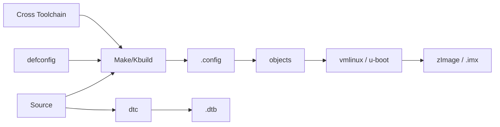
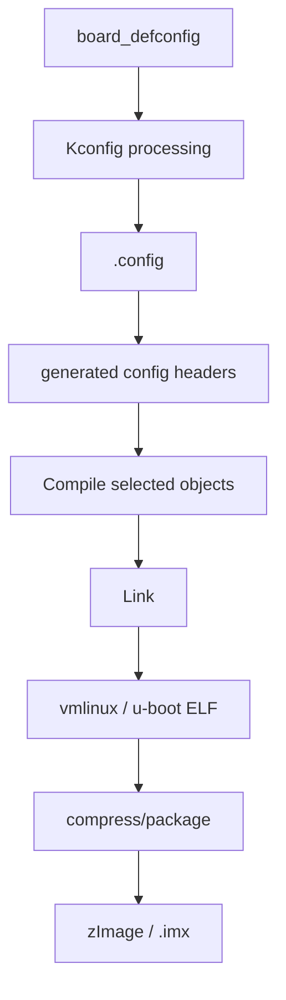

# W02D02 - i.MX6ULL Full Build：独立编译 U-Boot、Kernel 和 DTB

## 0. 今日定位

- 所属能力：Linux BSP Build / Kconfig / Cross Compile
- 前置：W02D01 已完成 artifact map
- 主动学习时间：约 2h；首次完整编译的等待时间不计
- 最终产物：`6ull_build_baseline.md` + 三类新产物的 hash

## 1. 今天解决的工程问题

高级 BSP 工程师不能只会运行厂商一键脚本。你至少要能拆开解释：

```text
ARCH / CROSS_COMPILE
        +
defconfig
        +
source tree
        ↓
.config
        ↓
compiler/linker
        ↓
U-Boot image / vmlinux / zImage / DTB
```

今天的目标不是自己重写构建系统，而是**知道脚本背后调用了什么，并能够脱离 IDE 完成一次可复现构建**。

## 2. 今日能力构成



## 3. 先理解：费曼解释

### 3.1 白话模型

`defconfig` 不是完整固件，它只是“默认选项表”。构建系统把它展开成 `.config`，然后 Make/Kbuild 决定哪些 `.c` 被编译、哪些 Driver 被链接、最终生成什么镜像。

### 3.2 精确模型

Kernel 的 `vmlinux` 是带 ELF 信息的未压缩内核链接产物；`zImage` 是 ARM 启动使用的自解压镜像。DTB 独立于 Kernel image，是硬件描述二进制。

U-Boot 也有 Kconfig/Makefile，但它的最终 SoC boot image 还可能经过 NXP i.MX image packaging，生成 `.imx`；具体名字以你手头 BSP 为准。

### 3.3 不能死记命令

正点原子不同资料版本、eMMC/NAND 版本可能使用不同 defconfig、script 和 DTB 名称。今天用“发现命令”先确认真实值，再构建。

## 4. 原理：环境变量到底解决什么

```bash
export ARCH=arm
export CROSS_COMPILE=/absolute/path/to/arm-linux-gnueabihf-
```

验证：

```bash
${CROSS_COMPILE}gcc --version
${CROSS_COMPILE}ld --version
```

`CROSS_COMPILE` 是前缀，不是 gcc 可执行文件本身。

## 5. 机制图：配置到产物



## 6. UML/时序图

```mermaid
sequenceDiagram
    participant Dev as Developer
    participant Make as make/Kbuild
    participant Kcfg as Kconfig
    participant GCC as ARM GCC
    participant Link as Linker

    Dev->>Make: make <defconfig>
    Make->>Kcfg: expand defaults
    Kcfg-->>Dev: .config
    Dev->>Make: make -jN
    Make->>GCC: compile selected sources
    GCC->>Link: objects
    Link-->>Dev: ELF/image/DTB
```


## 7. References / Manuals

### 7.1 ALIENTEK local/manual link

- **ALIENTEK I.MX6U Embedded Linux Driver Development Guide V1.5.2**  
  Local: [`../references/ALIENTEK_iMX6ULL_Linux_Driver_Development_Guide_V1.5.2.pdf`](../references/ALIENTEK_iMX6ULL_Linux_Driver_Development_Guide_V1.5.2.pdf)  
  Online: [GitHub public archive](https://github.com/alientek-openedv/imx6ull-document/blob/master/%E3%80%90%E6%AD%A3%E7%82%B9%E5%8E%9F%E5%AD%90%E3%80%91I.MX6U%E5%B5%8C%E5%85%A5%E5%BC%8FLinux%E9%A9%B1%E5%8A%A8%E5%BC%80%E5%8F%91%E6%8C%87%E5%8D%97V1.5.2.pdf)  
  Read: Chapter 30 §30.2 (U-Boot build, defconfig, `u-boot.bin/u-boot.imx`) and Chapter 35 §35.2 (kernel build) + §35.3 (kernel tree, `arch/arm/boot`, DTS locations).

### 7.2 Official references

- [Linux Kconfig](https://docs.kernel.org/kbuild/kconfig.html)
- [Linux external/Kbuild overview](https://docs.kernel.org/kbuild/modules.html) — not for the final kernel image itself, but useful to understand Kbuild conventions.

### 7.3 Reading rule

Do not copy fixed paths/addresses blindly from the vendor guide. Use the vendor guide to locate the topic, then verify the actual defconfig, DTB name, U-Boot environment, kernel version and source path on your board. If the local V1.5.2 PDF page number differs from an online excerpt, use the chapter/section title and search keyword as the authority.

## 8. 实验准备

保存昨日环境：

```bash
source ~/work/course/env_imx6ull.sh  # 如果你昨天创建了
mkdir -p ~/work/course/week02/day02
```

先记录机器并行度：

```bash
nproc
```

## 9. Lab 1 - U-Boot 构建

### 9.1 找 defconfig/脚本

```bash
cd "$UBOOT"
find configs -maxdepth 1 -type f | grep -Ei 'mx6ull|alientek|emmc|nand'
ls -1 *mx6ull* 2>/dev/null || true
```

如果存在厂商脚本，先看而不是直接执行：

```bash
sed -n '1,220p' mx6ull_alientek_emmc.sh 2>/dev/null || true
```

把它实际使用的 `make <defconfig>` 记录到 baseline。

### 9.2 清理并构建

仅在你确认源码目录正确后：

```bash
make distclean
make <YOUR_REAL_UBOOT_DEFCONFIG>
time make -j"$(nproc)"
```

不要把 `<...>` 原样执行；替换成你 W02D01 找到并由厂商脚本/指南证明的值。

构建后：

```bash
find . -maxdepth 2 -type f \( -name 'u-boot' -o -name '*.imx' -o -name 'u-boot.bin' \) -ls
sha256sum u-boot* 2>/dev/null | tee ~/work/course/week02/day02/uboot.sha256
```

## 10. Lab 2 - Kernel + DTB

```bash
cd "$KERNEL"
make mrproper
make <YOUR_REAL_KERNEL_DEFCONFIG>
cp .config ~/work/course/week02/day02/kernel.config

time make -j"$(nproc)" zImage
```

如果该老 BSP 的 Makefile/文档建议一次编译全部，可按其方式执行；但你仍要确认最终 `zImage` 路径。

DTB：

```bash
make -j"$(nproc)" dtbs
find arch/arm/boot/dts -name '*.dtb' -newer .config -ls | head -50
```

确认目标 DTB：

```bash
dtc -I dtb -O dts arch/arm/boot/dts/<YOUR_BOARD>.dtb 2>/dev/null | \
  grep -m3 -E 'model|compatible'
```

比较：

```bash
file vmlinux arch/arm/boot/zImage arch/arm/boot/dts/<YOUR_BOARD>.dtb
readelf -h vmlinux | sed -n '1,25p'
```

## 11. 故障注入

故意把 `CROSS_COMPILE` 改成不存在前缀：

```bash
OLD=$CROSS_COMPILE
export CROSS_COMPILE=does-not-exist-
make -n 2>&1 | head -30
export CROSS_COMPILE=$OLD
```

理解错误发生在“工具链发现”，而不是 C 代码。

另一个安全实验：修改一个无关 Kconfig，然后 `diff` `.config`，观察配置如何落地，不烧板。

## 12. 调试路径

```text
compiler not found
→ CROSS_COMPILE/path

wrong board behavior
→ defconfig/DTS target

link failure
→ first real ld error

image missing
→ target name + output path
```

## 13. 源码追踪

今天只看：

```text
Makefile VERSION/PATCHLEVEL
configs/<board_defconfig>
.config
arch/arm/boot/Makefile
arch/arm/boot/dts/Makefile
```

## 14. 今日验收

- [ ] U-Boot 完整构建成功；
- [ ] Kernel `vmlinux` 和 `zImage` 生成；
- [ ] 目标 DTB 生成；
- [ ] 记录真实 defconfig、ARCH、CROSS_COMPILE；
- [ ] 记录构建耗时与 SHA256；
- [ ] 能说明 `vmlinux / zImage / DTB / .imx` 的角色。

## 15. 面试式复述

1. defconfig 与 `.config` 区别？
2. `vmlinux` 为什么调试重要？
3. `zImage` 是否包含 DTB？
4. `ARCH` 与 `CROSS_COMPILE` 各解决什么？
5. 为什么一键脚本必须读懂再用？

## 16. Git 交付物

```text
6ull_build_baseline.md
kernel.config
uboot.sha256
kernel_dtb.sha256
build_time.log
```

## 17. 明日连接

明天用 TFTP 把今天的 Kernel/DTB **从 RAM 启动**，构建第一条真正高效率 BSP 改动闭环。
