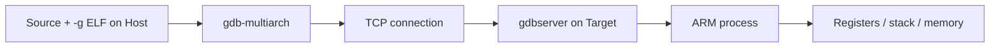
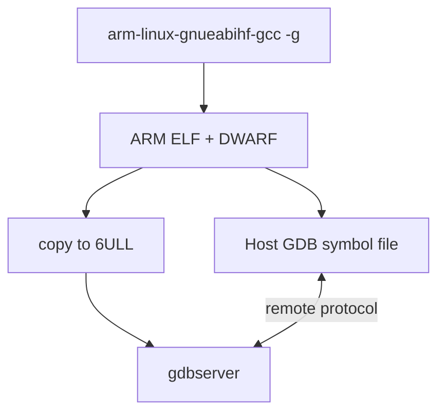
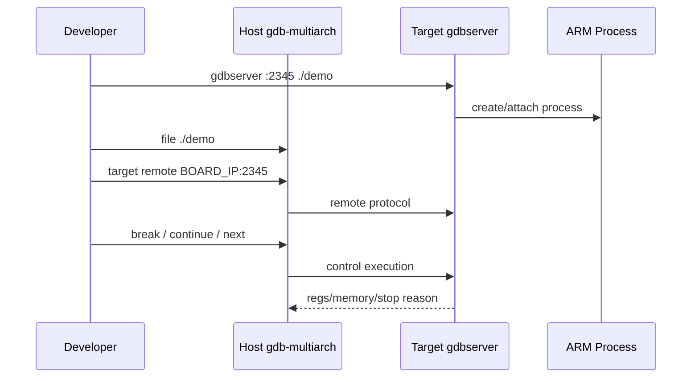

# W02D04 - Remote GDB：在 Host 上源码级调试 6ULL 用户程序

## 0. 今日定位

- 所属能力：Linux Debugging / Cross Debug
- 前置：6ULL SSH/NFS 正常；ARM 交叉工具链可用
- 主动学习时间：约 2h
- 最终产物：`gdb_remote_session.txt` + 一个可复现调试程序

## 1. 今天解决的工程问题

你未来分析 HailoRT、daemon、测试程序时，不能只靠 `printf`。远程 GDB 的核心模式是：

```text
Host 保存完整源码/带符号 ELF
Target 只运行程序 + gdbserver
Host GDB 通过 TCP 控制 Target process
```

## 2. 今日能力构成



## 3. 先理解：费曼解释

### 3.1 白话模型

`gdbserver` 像目标机上的“遥控接收器”，真正懂源码、符号、类型信息的是 Host 上的 GDB 和 ELF。

### 3.2 精确模型

编译 `-g` 会在 ELF 中保留 DWARF 调试信息。`-O0` 适合第一天学习，因为优化会让变量、代码顺序与源码对应变复杂；但以后必须学会调优化版，不要形成“只能 -O0 调试”的依赖。

## 4. 原理：三个文件不要混

- Target executable：实际执行 ARM ELF；
- Host symbol file：通常就是同一份未 strip ELF；
- source files：GDB 用 DWARF 路径映射源码。

如果产品侧 strip 了目标程序，也可以保留 Host-side unstripped symbol file。

## 5. 机制图



## 6. UML 时序




## 7. References / Manuals

### 7.1 ALIENTEK local/manual link

- **ALIENTEK I.MX6U Embedded Linux C Application Programming Guide V1.1**  
  Local: [`../references/ALIENTEK_iMX6ULL_Linux_C_Application_Programming_Guide_V1.1.pdf`](../references/ALIENTEK_iMX6ULL_Linux_C_Application_Programming_Guide_V1.1.pdf)  
  Online: [GitHub public archive](https://github.com/alientek-openedv/imx6ull-document/blob/master/%E3%80%90%E6%AD%A3%E7%82%B9%E5%8E%9F%E5%AD%90%E3%80%91I.MX6U%E5%B5%8C%E5%85%A5%E5%BC%8FLinux%20C%E5%BA%94%E7%94%A8%E7%BC%96%E7%A8%8B%E6%8C%87%E5%8D%97V1.1.pdf)  
  Read: Chapter 1 **Application Programming Concepts** for syscall/libc/user-vs-kernel context. This manual is not the primary GDB reference; use it to anchor the Linux application model.

### 7.2 Official references

- [GNU GDB manual](https://sourceware.org/gdb/current/onlinedocs/gdb.html) — sections: Remote Debugging, `target remote`, breakpoints, examining registers/memory.

### 7.3 Reading rule

The ALIENTEK application guide is used to establish the basic model; system-call semantics and edge cases are cross-checked against Linux man-pages/official documentation linked above.

## 8. 实验准备

创建：

```c
// debug_demo.c
#include <stdio.h>
#include <stdlib.h>

static int accumulate(int n)
{
    int sum = 0;
    for (int i = 0; i < n; ++i)
        sum += i * 3;
    return sum;
}

int main(int argc, char **argv)
{
    int n = argc > 1 ? atoi(argv[1]) : 10;
    int result = accumulate(n);
    printf("n=%d result=%d\n", n, result);
    return 0;
}
```

编译：

```bash
${CROSS_COMPILE}gcc -g3 -O0 -Wall -Wextra debug_demo.c -o debug_demo
file debug_demo
readelf -S debug_demo | grep -E 'debug|symtab'
```

复制：

```bash
scp debug_demo root@<BOARD_IP>:/tmp/
```

确认板上有 `gdbserver`：

```bash
ssh root@<BOARD_IP> 'which gdbserver || gdbserver --version'
```

如果 rootfs 没有 `gdbserver`，今天的第一任务是从 BSP/Yocto/Buildroot 包中加入它，或使用与目标 ABI 匹配的 gdbserver；不要拿 x86 binary 复制过去。

## 9. Lab 1 - 第一次 remote session

Target：

```bash
gdbserver 0.0.0.0:2345 /tmp/debug_demo 12
```

Host：

```bash
gdb-multiarch ./debug_demo
```

GDB：

```gdb
set pagination off
target remote <BOARD_IP>:2345
break main
break accumulate
continue
bt
info registers
info locals
next
step
print n
print sum
x/16wx $sp
disassemble /m accumulate
continue
```

将整个会话：

```bash
script -f ~/work/course/week02/day04/gdb_remote_session.txt
```


### 9.1 为什么 Host 端用 `gdb-multiarch`

Host 是 x86_64，而被调程序是 ARM。普通发行版 `gdb` 是否带 ARM target 支持取决于打包方式；`gdb-multiarch` 明确提供多架构 target 支持，适合课程统一环境。连接前可确认：

```gdb
show architecture
set architecture auto
```

当 `file ./debug_demo` 载入 ARM ELF 后，GDB 应根据 ELF machine 自动识别 ARM。

### 9.2 Sysroot：以后调真实程序一定会遇到

当前 demo 几乎不需要你手工指定 shared library symbols；但真实程序使用目标 rootfs 的 libc/libstdc++ 时，Host 不能拿 Ubuntu x86 库替代。典型做法是保留一份与板端 rootfs 一致的 sysroot：

```gdb
set sysroot /path/to/arm-rootfs
set solib-search-path /path/to/arm-rootfs/lib:/path/to/arm-rootfs/usr/lib
info sharedlibrary
```

这与交叉编译中的 sysroot 是同一思想：**Host 工具必须看到 Target ABI 对应的头文件/库/符号，而不是 Host 自己的库。**

### 9.3 远程调试的边界

今天调的是 user process，不是 Linux Kernel：

- process crash/变量/线程 → GDB/gdbserver；
- syscall 卡住 → GDB + strace；
- Kernel driver/IRQ/Oops → ftrace/kgdb/crash 等后续工具；
- 硬件总线无响应 → 最终仍可能需要寄存器/JTAG/示波器。

大厂调试能力的关键不是“会一个工具”，而是知道问题属于哪一层。

## 10. Lab 2 - 观察栈和反汇编

在 `accumulate()` breakpoint：

```gdb
info frame
bt
info registers sp pc lr
x/32wx $sp
disassemble accumulate
```

把你熟悉的 Cortex-M 调试映射到 Linux：

```text
MCU JTAG breakpoint
≈
Linux process ptrace/gdb remote breakpoint
```

区别是 Linux 下 GDB 主要调一个虚拟地址空间中的 process，而不是整个 SoC 固件。

## 11. 故障注入

### Host 用了错误 ELF

改一行源码重新编译，但 Target 仍运行旧 binary；Host GDB 加载新 ELF。观察 breakpoint/源码行可能出现不一致。

结论：**符号文件必须与目标执行文件匹配。**

建议记录 hash：

```bash
sha256sum debug_demo
ssh root@<BOARD_IP> sha256sum /tmp/debug_demo
```

## 12. 调试路径

```text
connection refused
→ gdbserver/listen/firewall/IP

breakpoint strange
→ Host/Target ELF hash

shared library symbol missing
→ sysroot / solib-search-path

source not found
→ directory / substitute-path
```

## 13. 源码追踪

今天不读 GDB 源码。必须掌握命令背后的对象：

```text
ELF symbol + DWARF
process virtual address
register context
stack frame
```

## 14. 今日验收

- [ ] Host 成功连接 gdbserver；
- [ ] 能断在 `main` 和子函数；
- [ ] 能看寄存器、locals、stack、assembly；
- [ ] Host/Target ELF SHA256 一致；
- [ ] 能解释 GDB 调 Linux process 与 JTAG 调 MCU 的区别。

## 15. 面试式复述

1. `-g` 做了什么？
2. `-O0` 为什么容易调试？
3. gdbserver 是否需要源码？
4. strip 之后还能怎么线上调试？
5. 为什么 shared library debug 需要 sysroot？
6. `bt` 的 stack frame 信息来自哪里？

## 16. Git 交付物

```text
debug_demo.c
gdb_remote_session.txt
gdb_commands.txt
elf_hash.txt
```

## 17. 明日连接

Linux 一侧的 Week2 基础闭环完成。明天开始 Zephyr out-of-tree board port：把 W01D06 的硬件事实正式变成 build system 能识别的 board target。
