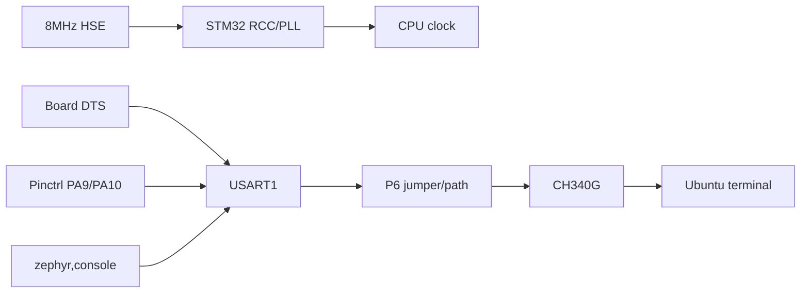
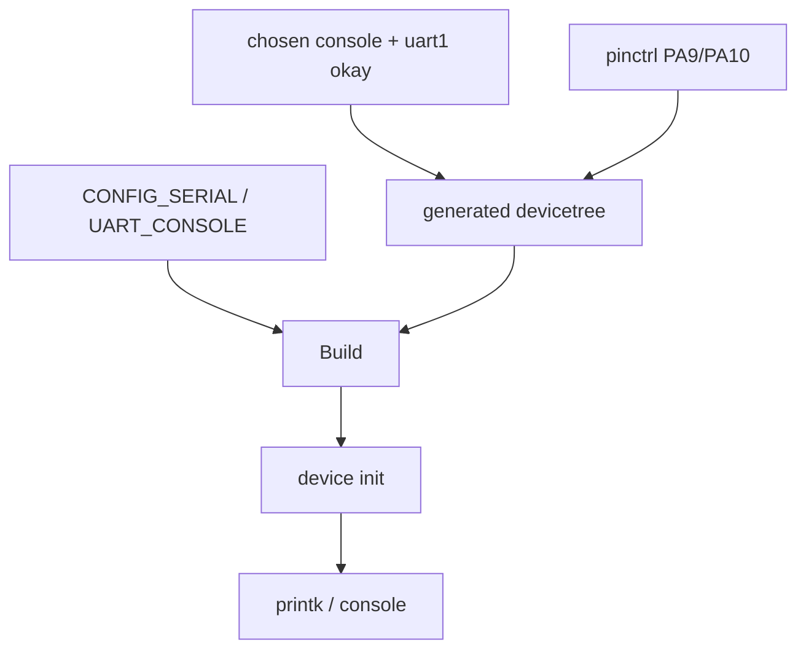
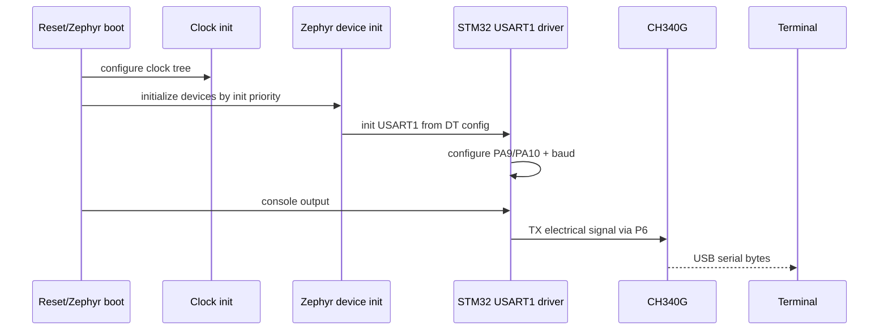

# W02D06 - STM32F407 Bring-up：Clock、USART1 Console 与首次 Flash

## 0. 今日定位

- 所属能力：Zephyr Board Bring-up / Pinctrl / Runner
- 前置：W02D05 custom board 可编译
- 硬件事实：Explorer STM32F407ZET6，HSE=8 MHz，USART1=PA9/PA10，板载 CH340G，经 P6 路由到 USART1
- 主动学习时间：约 2h
- 今日最终产物：真实板串口输出 Zephyr banner/hello；记录可重复 flash 命令

## 1. 今天解决的工程问题

“编译成功”只是 BSP 的第一半。真正 board bring-up 需要验证：

```text
CPU clock
→ pin mux
→ UART controller
→ chosen console
→ serial driver
→ physical TX/RX path
→ USB-UART
→ terminal
```

任何一层错，屏幕上都是同一个现象：**没输出**。

## 2. 今日能力构成



## 3. 先理解：费曼解释

### 3.1 白话模型

串口没字，不代表 UART Driver 坏了。它像一条水管：时钟是水压、pinctrl 是阀门方向、chosen 是“系统决定用哪根管子”、P6 是物理跳线、CH340 是 USB 转换器。任一处断开都没水。

### 3.2 精确工程模型

Zephyr console 的关键链通常是：

```text
DTS chosen zephyr,console
→ USART node status=okay
→ pinctrl state
→ SERIAL/UART_CONSOLE Kconfig
→ STM32 UART driver device initialization
→ printk/console backend
```

### 3.3 Explorer 的实际硬件

来自 `SRC-F407-SCH`：

- p.2：U4=`STM32F407ZET6`；Y2=8 MHz HSE；Y3=32.768 kHz LSE；USART1 TX/RX 为 PA9/PA10；
- p.2：P6 `USB_UART/USART1` 路由板载 TXD/RXD 与 MCU USART1 nets；
- p.4：U17=CH340G，USB 转板上 TXD/RXD；
- 所以 console 起不来时，P6 跳帽/连接状态必须进入排障链。

## 4. 原理：Clock 与 pinctrl 为什么属于 Board

SoC Driver 知道 USART1 寄存器，但不知道你的 PCB：

- 外部晶振实际是多少；
- USART1 是否被板子接到 USB-UART；
- PA9/PA10 是否用于其他功能。

因此 board DTS/pinctrl 是“硬件事实到通用 driver 的适配层”。

## 5. 机制图：Console 初始化



## 6. UML 时序




## 7. References / Manuals

### 7.1 Board hardware source

- **ALIENTEK Explorer STM32F4 V2.2 Schematic**  
  Local: [`../references/Explorer_STM32F4_V2.2_SCH.pdf`](../references/Explorer_STM32F4_V2.2_SCH.pdf)  
  Read: Schematic p.2: U4 STM32F407ZET6, Y2 8 MHz, Y3 32.768 kHz, USART1 PA9/PA10 and P6; p.4: CH340G USB-UART.

- **ST RM0090 STM32F407 Reference Manual**  
  Online: [ST direct PDF](https://www.st.com/resource/en/reference_manual/rm0090-stm32f405415-stm32f407417-stm32f427437-and-stm32f429439-advanced-armbased-32bit-mcus-stmicroelectronics.pdf)

### 7.2 Zephyr official references

- [Zephyr Board Porting Guide](https://docs.zephyrproject.org/latest/hardware/porting/board_porting.html)
- [Zephyr build/flash/debug](https://docs.zephyrproject.org/latest/develop/west/build-flash-debug.html)
- [Zephyr Devicetree Guide](https://docs.zephyrproject.org/latest/build/dts/index.html)

### 7.3 Optional ALIENTEK F4 manuals visible in your local manual set

- HAL guide V1.2: [`../references/ALIENTEK_STM32F4_HAL_Development_Guide_V1.2.pdf`](../references/ALIENTEK_STM32F4_HAL_Development_Guide_V1.2.pdf) — public download center: http://www.openedv.com/docs/index.html
- Register guide V1.2: [`../references/ALIENTEK_STM32F4_Register_Development_Guide_V1.2.pdf`](../references/ALIENTEK_STM32F4_Register_Development_Guide_V1.2.pdf) — public download center: http://www.openedv.com/docs/index.html

Use the F4 manuals for board/peripheral review; Zephyr DTS/Kconfig/device-model behavior is governed by Zephyr official docs and the fixed course Zephyr source revision.

## 8. 实验准备

先看官方同 SoC board 的 pinctrl/clock 写法：

```bash
cd ~/zephyrproject/zephyr
find boards/st/stm32f4_disco -maxdepth 2 -type f -print
rg -n "usart|uart|pinctrl|hse|pll|chosen" boards/st/stm32f4_disco dts/arm/st | head -120
```

再打开你的原理图 p.2/p.4，不从别板复制 pin。

终端侧先确认 CH340：

```bash
lsusb | grep -i -E 'ch340|1a86' || true
dmesg | tail -50
ls -l /dev/ttyUSB* 2>/dev/null
```

## 9. Lab 1 - 配置 clock + USART1 console

### 9.1 Clock

在你的 board DTS 中根据 Zephyr v4.4.1 STM32F4 board pattern 设置 8 MHz HSE 及 PLL/clock tree。**不要直接复制 Discovery 的 HSE 数值，必须与 Explorer Y2=8MHz 对齐。**

构建后用 generated DTS/.config 证明：

```bash
rg -n "hse|clock-frequency|pll" build/zephyr/zephyr.dts build/zephyr/.config | head -100
```

### 9.2 USART1 pinctrl

根据 Zephyr v4.4.1 STM32 pinctrl macros 查 PA9 USART1_TX 与 PA10 USART1_RX 的合法定义，不手写 AF number。

建议搜索：

```bash
rg -n "USART1_TX.*PA9|USART1_RX.*PA10|PA9.*USART1" \
  ~/zephyrproject/zephyr/include ~/zephyrproject/zephyr/dts | head -50
```

board DTS 需要达到逻辑：

```dts
&usart1 {
    pinctrl-0 = <&usart1_tx_pa9 &usart1_rx_pa10>; // 名字以 v4.4.1 实际宏为准
    pinctrl-names = "default";
    current-speed = <115200>;
    status = "okay";
};

/ {
    chosen {
        zephyr,console = &usart1;
        zephyr,shell-uart = &usart1;
    };
};
```

上述 pinctrl label 只是**结构示意**；必须从固定 Zephyr 源码查到 v4.4.1 实际 label 后替换。

### 9.3 Kconfig

确认构建输出：

```bash
grep -E 'CONFIG_SERIAL=|CONFIG_CONSOLE=|CONFIG_UART_CONSOLE=' build/zephyr/.config
```

## 10. Lab 2 - Flash 与真实串口输出

### 10.1 Runner 选择

先盘点你手上的 probe：J-Link/ST-Link/板载调试器。如果有 J-Link：

```bash
west flash -H
west debug -H
```

查看 board runner。`board.cmake` 应基于 Zephyr 官方 runner helper 配置，而不是自写 shell 执行器。

如果当前 board 无法 `west flash`，允许第一天明确记录一个替代下载命令（如 J-Link Commander/OpenOCD），但**必须把“build”和“flash”分开记录**。

### 10.2 上板

1. 检查 P6 跳帽连接；
2. 打开 `/dev/ttyUSBx` 115200 8N1；
3. flash hello_world；
4. reset；
5. 保存 console log。

Linux 终端示例：

```bash
picocom -b 115200 /dev/ttyUSB0
# 或 screen /dev/ttyUSB0 115200
```

预期能看到 Zephyr 启动/banner/hello。具体 banner 格式依 build config，不用死记。

## 11. 故障注入

### 故障 A：拔掉/改变 P6 跳帽

只在确认不会短接电源的前提下进行。观察 firmware 仍运行但 PC 无输出，说明问题在物理 UART path，而不是 CPU boot。

### 故障 B：chosen 指向未启用 UART

在 Git branch 中临时改错，构建/运行观察错误，再恢复。目的是学会从 generated DTS 看 console target。

## 12. 调试路径

无串口时严格分层：

```text
probe can halt CPU?
→ image really flashed?
→ CPU clock/reset?
→ zephyr.dts chosen?
→ USART1 status/current-speed?
→ .config serial console?
→ pinctrl PA9/PA10?
→ oscilloscope on PA9 TX?
→ P6 path?
→ CH340 / ttyUSB / baud?
```

这就是你硬件调试优势要迁移到 Zephyr BSP 的地方。

## 13. 源码追踪

只追 3 个边界：

```text
board DTS → generated zephyr.dts
pinctrl DT data → STM32 pinctrl/UART driver
board.cmake → runner
```

## 14. 今日验收

- [ ] HSE=8 MHz 的配置来源可追溯到 Explorer 原理图；
- [ ] USART1 PA9/PA10 pinctrl 来自 Zephyr v4.4.1 实际宏；
- [ ] chosen console 指向 USART1；
- [ ] `CONFIG_SERIAL/CONSOLE/UART_CONSOLE` 可在 `.config` 证明；
- [ ] 实板能输出 Zephyr/hello；
- [ ] 有可复现 flash 命令；
- [ ] P6/CH340 已纳入排障链。

## 15. 面试式复述

1. Board DTS 为什么要描述 clock？
2. `chosen` 与 `status = "okay"` 区别？
3. pinctrl 与 UART driver 如何协作？
4. 无串口输出如何区分软件和硬件问题？
5. `board.cmake` 在产品项目里负责什么？

## 16. Git 交付物

```text
board DTS/Kconfig/board.cmake changes
w02d06_console.log
w02d06_flash_command.md
w02d06_bringup_checklist.md
```

## 17. 明日连接

明天不学新 subsystem，而是做 clean build 和双系统 DeviceTree 对比，确保 Week2 产物不是“某个 build 目录碰巧能用”。
