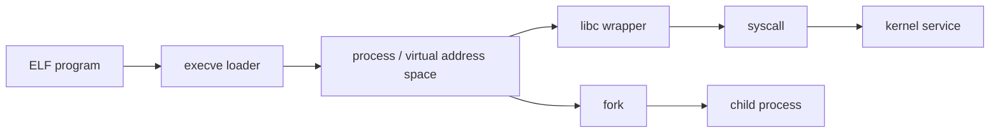
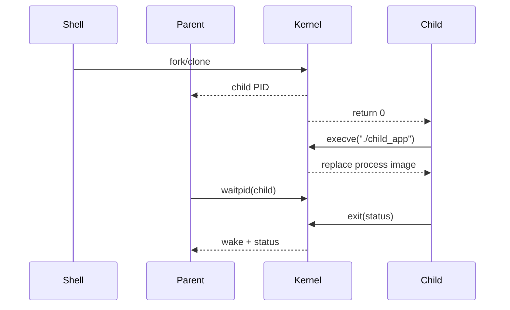

# W03D01 - Process and Syscall: fork/exec/wait + strace

## 0. 今日定位

- 主线：Linux User Space / System Programming
- 时间：2h active study
- 硬件：先在 Ubuntu VM 完成；再交叉编译到 i.MX6ULL 复跑
- 产物：`process_lab.c`、`strace_fork_exec.log`、`process_model.md`

## 1. 今天解决的工程问题

你过去更多面对 MCU/RTOS task。Linux 用户态首先要建立一个不同的执行模型：**程序文件不是进程；fork 创建进程，exec 替换进程映像；系统调用是用户态进入内核服务的入口。** 今天只解决这一条主线，不扩展 IPC。

## 2. 今日能力构成



## 3. 先理解：费曼解释

### 3.1 30 秒白话模型

把程序想成“磁盘上的配方”，把进程想成“正在做这道菜的厨房实例”。`fork()` 是复制一个厨房；`execve()` 不是再造一个厨房，而是把当前厨房里的配方和工作台全部换成另一个程序；`wait()` 是父进程等待/回收子进程的结束状态。

### 3.2 精确工程模型

`fork()` 创建新的 task/process context；父子最初通过 copy-on-write 共享物理页但拥有独立虚拟地址空间语义。`execve()` 成功后当前进程 PID 通常不变，但用户地址空间、代码、栈等被新程序映像替换。glibc 封装大量系统调用，但并非所有 libc 函数都会进入内核。

### 3.3 今天必须避免的误解

- API 名字背下来不等于理解执行路径。
- 看到一次成功输出不等于建立了可复现工程闭环。
- 教程里的地址/路径只能作为例子；板上真实值必须用工具验证。

## 4. 原理与执行路径

先画出：

```text
Shell process
   | fork
   +------ child
             | execve("./demo")
             v
          demo process image

parent --waitpid()--> kernel wait state --> child exit status
```

然后用 `strace -f -tt -T` 观察 `clone/fork`、`execve`、`wait4`/`waitid` 等真实系统调用名。注意 libc API 与最终 syscall 名可能不同。

## 5. UML / 时序



## 6. References / Manuals

### ALIENTEK manual
- **I.MX6U Embedded Linux C Application Programming Guide V1.1**
  - Local: [`../references/ALIENTEK_iMX6ULL_Linux_C_Application_Programming_Guide_V1.1.pdf`](../references/ALIENTEK_iMX6ULL_Linux_C_Application_Programming_Guide_V1.1.pdf)
  - Online: [GitHub archive](https://github.com/alientek-openedv/imx6ull-document/blob/master/%E3%80%90%E6%AD%A3%E7%82%B9%E5%8E%9F%E5%AD%90%E3%80%91I.MX6U%E5%B5%8C%E5%85%A5%E5%BC%8FLinux%20C%E5%BA%94%E7%94%A8%E7%BC%96%E7%A8%8B%E6%8C%87%E5%8D%97V1.1.pdf)
  - Read: **Chapter 1 Application Programming Concepts** (§1.1 syscall, §1.2 libc); **Chapter 9 Process** (§9.1 process vs program, §9.5 `fork`, §9.9 process birth/termination, §9.10 `wait*`, §9.11 `exec`).
  - Search keywords: `系统调用`, `fork`, `exec`, `waitpid`.

### Linux man-pages
- [`fork(2)`](https://man7.org/linux/man-pages/man2/fork.2.html)
- [`execve(2)`](https://man7.org/linux/man-pages/man2/execve.2.html)
- [`wait(2)`](https://man7.org/linux/man-pages/man2/wait.2.html)

## 7. 实验准备

```bash
mkdir -p ~/work/course/week03/day01 && cd $_
which strace || sudo apt install -y strace
gcc --version
```

先在 x86 Ubuntu 上跑，避免交叉环境干扰；实验通过后再用 ARM toolchain 交叉编译，复制到 6ULL。

## 8. 实验

### Lab A - fork / wait

创建：

```c
#include <stdio.h>
#include <unistd.h>
#include <sys/wait.h>
#include <stdlib.h>

int main(void) {
    printf("before fork pid=%d\n", getpid());
    pid_t pid = fork();
    if (pid < 0) { perror("fork"); return 1; }
    if (pid == 0) {
        printf("child pid=%d ppid=%d\n", getpid(), getppid());
        execl("/bin/echo", "echo", "hello-from-exec", NULL);
        perror("execl");
        _exit(127);
    }
    int status = 0;
    pid_t r = waitpid(pid, &status, 0);
    printf("parent reaped=%d exited=%d code=%d\n", r, WIFEXITED(status), WEXITSTATUS(status));
    return 0;
}
```

```bash
gcc -Wall -Wextra -O0 -g process_lab.c -o process_lab
./process_lab
strace -f -tt -T -o strace_fork_exec.log ./process_lab
grep -E 'clone|fork|execve|wait|exit' strace_fork_exec.log
```

### Lab B - 6ULL replay

```bash
arm-linux-gnueabihf-gcc -Wall -O0 -g process_lab.c -o process_lab_arm
file process_lab_arm
# copy by NFS/SCP, then run on board
```

记录 x86 与 ARM 输出中相同的“语义”，不要纠结 syscall number。

## 9. 故障注入

- 删除 `waitpid()`：观察子进程退出后父进程未及时回收时的状态，并用 `ps` 查看。
- 把 `execl()` 路径改错：确认只有 exec 失败时才会执行 `perror()` 后面的代码。
- 在 `fork()` 前后各加一行未 flush 的 `printf`，观察 stdio buffer 在不同终端/重定向条件下可能带来的重复输出。

## 10. 调试路径

现象 → `strace -f` → `ps -ef`/`ps -o pid,ppid,state,cmd` → man-page → 源码。遇到“为什么 exec 后代码没执行”，先检查 exec 返回值：**成功的 exec 不返回**。

## 11. 源码 / 系统对象追踪

用户态先追系统对象，不追 kernel 源码：`/proc/<pid>/status`、`/proc/<pid>/maps`、`/proc/<pid>/fd/`。Week 3 的目标是先把“可观测对象”用熟。

## 12. 今日验收

- [ ] 能解释 program / process / thread 的区别。
- [ ] 能解释 fork 与 exec 不是一回事。
- [ ] 能用 `strace -f -tt -T` 找到 exec 和 wait。
- [ ] 同一程序在 Ubuntu 和 6ULL 均运行。

## 13. 面试式复述

1. `fork()` 返回两次是什么意思？
2. `execve()` 成功后 PID 是否必然变化？
3. 为什么 `system()` 通常可以理解成 fork+exec+wait 的组合？
4. libc 和 syscall 的边界在哪里？
5. zombie 的本质是什么？

## 14. Git 交付物

`linux/week03/process_lab.c`（你自己的实验仓库） + 两份 strace log + `process_model.md`。Commit: `lab: trace fork exec and wait on host and imx6ull`

## 15. 明日连接

明天用 ELF 工具回答另一个问题：**exec 到底加载了什么？**
