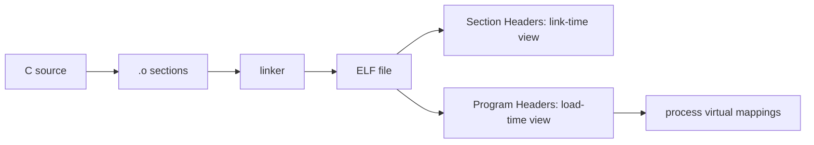

# W03D02 - ELF and Linking: section, segment, symbol, entry

## 0. 今日定位

- 主线：Linux binary / toolchain
- 时间：2h
- 平台：Ubuntu + ARM cross toolchain
- 产物：`elf_notes.md` + x86/ARM ELF diff

## 1. 今天解决的工程问题

你已经懂 MCU linker script，但 Linux 上动态链接、program header、共享库会增加一层。今天要把 `readelf` 输出和“程序被 loader 映射进进程地址空间”建立连接。

## 2. 今日能力构成



## 3. 先理解：费曼解释

### 3.1 30 秒白话模型

把 ELF 想成“一个文件里同时放了两张目录”：section table 给编译器/链接器和调试工具看；program header 告诉 loader 运行时哪些范围要映射到内存。

### 3.2 精确工程模型

`.text/.data/.bss/.symtab/.debug_*` 等是 section。`PT_LOAD` 等 program segment 是装载视角，通常会把多个 section 合并到一个可映射 segment。`e_entry` 是初始控制转移地址，不等于 C 的 `main()`。动态链接 ELF 还会依赖 interpreter/loader，例如 `/lib/ld-linux-*.so.*`。

### 3.3 今天必须避免的误解

- API 名字背下来不等于理解执行路径。
- 看到一次成功输出不等于建立了可复现工程闭环。
- 教程里的地址/路径只能作为例子；板上真实值必须用工具验证。

## 4. 原理与执行路径

重点命令：

```bash
readelf -h demo
readelf -S demo
readelf -l demo
readelf -s demo
readelf -d demo
objdump -d demo
nm -n demo
```

用 `readelf -l` 底部的 **Section to Segment mapping** 直接建立 section→segment 对应关系。

## 5. UML / 时序

本日核心问题主要是静态结构，不强行画时序图。

## 6. References / Manuals

### Manuals
- **ALIENTEK C Application Guide V1.1**: [`../references/ALIENTEK_iMX6ULL_Linux_C_Application_Programming_Guide_V1.1.pdf`](../references/ALIENTEK_iMX6ULL_Linux_C_Application_Programming_Guide_V1.1.pdf) / [online](https://github.com/alientek-openedv/imx6ull-document/blob/master/%E3%80%90%E6%AD%A3%E7%82%B9%E5%8E%9F%E5%AD%90%E3%80%91I.MX6U%E5%B5%8C%E5%85%A5%E5%BC%8FLinux%20C%E5%BA%94%E7%94%A8%E7%BC%96%E7%A8%8B%E6%8C%87%E5%8D%97V1.1.pdf)
  - Read Chapter 1 §1.4 `main()` and Chapter 9 §9.3 process memory layout as context; ELF internals以官方 ELF 文档为主。
- [`elf(5)` Linux man-page](https://man7.org/linux/man-pages/man5/elf.5.html)
- [GNU GDB manual](https://sourceware.org/gdb/current/onlinedocs/gdb.html) — later use symbols/debug sections.

Search keywords in your local manual: `main函数`, `内存布局`, `虚拟地址空间`.

## 7. 实验准备

```bash
mkdir -p ~/work/course/week03/day02 && cd $_
cat > demo.c <<'EOF'
#include <stdio.h>
int g_init = 7;
int g_bss;
static const char msg[] = "ELF";
int add(int a,int b){return a+b;}
int main(void){ int local=3; printf("%s %d %p\n", msg, add(g_init,local), (void*)&local); return 0; }
EOF
```

## 8. 实验

### Lab A - 同一源码三种 ELF

```bash
gcc -O0 -g demo.c -o demo_x86
arm-linux-gnueabihf-gcc -O0 -g demo.c -o demo_arm
gcc -O0 -g -static demo.c -o demo_x86_static
file demo_*
```

逐个执行 `readelf -h/-S/-l/-s/-d`。重点记录：Machine、Entry、INTERP、DYNAMIC、LOAD。

### Lab B - section vs segment

```bash
readelf -S demo_x86 | less
readelf -l demo_x86 | less
size demo_x86
nm -n demo_x86 | grep -E 'g_init|g_bss|add|main'
```

在 `elf_notes.md` 画出 `.text/.rodata/.data/.bss` 与 LOAD segments 的关系。

## 9. 故障注入

- `strip demo_x86` 后再看 `.symtab`/调试能力变化。
- 去掉 `-g` 对比 `.debug_*`。
- 尝试把 ARM ELF 在 x86 上运行，解释 `Exec format error` 与 Week1 的联系。

## 10. 调试路径

`file` → ELF header → program headers → dynamic section → loader dependency → symbols。不要看到程序“打不开”就只盯源码。

## 11. 源码 / 系统对象追踪

先用工具追，不通读 linker 源码。理解 `readelf` 每类表回答什么问题；下一阶段再结合 linker script。

## 12. 今日验收

- [ ] 能用一句话区分 section 与 segment。
- [ ] 能指出 ELF entry 并解释它不等于 main。
- [ ] 能识别动态/静态 ELF。
- [ ] 能从 symbol table 找到自己的函数/全局变量。

## 13. 面试式复述

1. `.bss` 为什么可以很大但不显著增加文件大小？
2. loader 为什么更关心 program header 而不是 section header？
3. `strip` 删除什么？
4. 动态链接器从哪里得知？
5. MCU linker script 知识如何迁移到 Linux ELF？

## 14. Git 交付物

`elf_notes.md`, `readelf_*.txt`; commit `lab: analyze x86 and arm ELF load views`

## 15. 明日连接

明天把 ELF 的 LOAD 结果放到运行中的 `/proc/<pid>/maps` 里验证。
