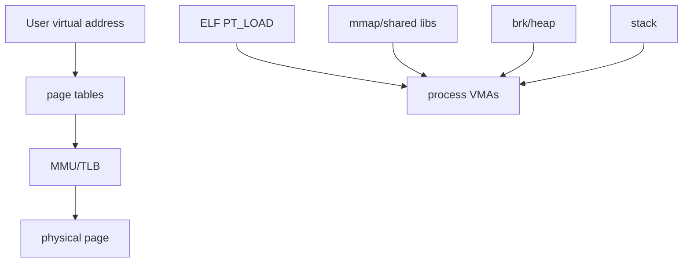

# W03D03 - Virtual Address Space: from ELF mappings to process memory

## 0. 今日定位

- 主线：Linux process memory
- 时间：2h
- 平台：Ubuntu first, i.MX6ULL compare
- 产物：`va_map.md` + `/proc/<pid>/maps` snapshots

## 1. 今天解决的工程问题

MCU 常把“地址”直接理解成物理地址；Linux 应用进程里你打印出来的大多数地址都是虚拟地址。今天要建立 VA → page table/MMU → PA 的第一层模型，并和 ELF segment 对上。

## 2. 今日能力构成



## 3. 先理解：费曼解释

### 3.1 30 秒白话模型

把每个 Linux 进程想成拿到一张“自己的 4GB 虚拟地图”（32-bit ARM 示例）。地图上的门牌号相同，不代表落到同一块物理内存；内核通过页表决定实际映射。

### 3.2 精确工程模型

地址空间由多个 VMA 组成，权限通常显示为 `rwxp/s`。ELF PT_LOAD 形成代码/数据映射；共享库和 `mmap` 加入其他区域；heap 通常由 `brk` 扩展；stack 单独增长。具体 3G/1G 划分与内核配置/架构相关，不作为所有 Linux 的普适常量。

### 3.3 今天必须避免的误解

- API 名字背下来不等于理解执行路径。
- 看到一次成功输出不等于建立了可复现工程闭环。
- 教程里的地址/路径只能作为例子；板上真实值必须用工具验证。

## 4. 原理与执行路径

运行中的关键证据：

```text
ELF program headers
       | exec
       v
mm_struct / VMAs
       | /proc/<pid>/maps
       v
virtual address ranges
       | page tables
       v
physical memory
```

## 5. UML / 时序

本日核心问题主要是静态结构，不强行画时序图。

## 6. References / Manuals

### ALIENTEK manual
- **C Application Guide V1.1**: [`../references/ALIENTEK_iMX6ULL_Linux_C_Application_Programming_Guide_V1.1.pdf`](../references/ALIENTEK_iMX6ULL_Linux_C_Application_Programming_Guide_V1.1.pdf) / [online](https://github.com/alientek-openedv/imx6ull-document/blob/master/%E3%80%90%E6%AD%A3%E7%82%B9%E5%8E%9F%E5%AD%90%E3%80%91I.MX6U%E5%B5%8C%E5%85%A5%E5%BC%8FLinux%20C%E5%BA%94%E7%94%A8%E7%BC%96%E7%A8%8B%E6%8C%87%E5%8D%97V1.1.pdf)
  - Read **Chapter 9 §9.3 Process memory layout** and **§9.4 Process virtual address space**.
  - Search: `进程的内存布局`, `进程的虚拟地址空间`.

### Official
- [`/proc/<pid>/maps` man-page](https://man7.org/linux/man-pages/man5/proc_pid_maps.5.html)
- [`elf(5)`](https://man7.org/linux/man-pages/man5/elf.5.html)

## 7. 实验准备

Reuse yesterday `demo.c`. Add a `sleep(120)` before return so the process stays alive. Compile `-O0 -g`.

## 8. 实验

### Lab A - 打印各区地址

```c
extern char **environ;
static int sg_init=1;
static int sg_bss;
static const char ro[]="ro";

int main(void){
  int stack=0;
  void *heap=malloc(4096);
  printf("main=%p ro=%p data=%p bss=%p heap=%p stack=%p\n", main, ro, &sg_init, &sg_bss, heap, &stack);
  sleep(120);
}
```

```bash
./va_demo &
PID=$!
cat /proc/$PID/maps
pmap -x $PID
readelf -l ./va_demo
```

把程序打印地址逐一落到 maps 的区间里。

### Lab B - ARM compare

交叉编译到 6ULL，重复 `/proc/<pid>/maps`。对比地址宽度、动态 loader 名称和共享库路径；只比较机制，不要求地址值一致。

## 9. 故障注入

- 两次运行同一 PIE 程序，观察地址是否变化，理解 ASLR。
- 用 `setarch $(uname -m) -R`（仅学习机、若可用）临时关闭 ASLR 对比，不要改系统全局安全配置。

## 10. 调试路径

地址异常 → `/proc/pid/maps` → ELF program header → `pmap` → GDB `info proc mappings`。后面进入 kernel memory 时再学 page table 细节。

## 11. 源码 / 系统对象追踪

用户态对象：`/proc/<pid>/maps`, `/proc/<pid>/smaps`, `/proc/<pid>/status`。今天不追 `mm_struct` 源码，只知道这些接口背后是进程内存描述。

## 12. 今日验收

- [ ] 画出 text/rodata/data/bss/heap/mmap/stack。
- [ ] 能从 maps 找到一个打印地址。
- [ ] 能解释 VA 不等于 PA。
- [ ] 能解释 ASLR 为什么让地址变化。

## 13. 面试式复述

1. 两个进程能有相同 VA 吗？
2. `.bss` 在 maps 里如何体现？
3. stack/heap 的增长方式是否相同？
4. `mmap` 区域为什么重要？
5. 用户态可以直接拿 PA 做 load/store 吗？

## 14. Git 交付物

`va_map.md`, `maps_host.txt`, `maps_imx6ull.txt`; commit `lab: map ELF segments into Linux virtual address space`

## 15. 明日连接

明天从内存模型转到文件描述符：用户态如何拿一个整数 fd 访问内核对象/设备。
