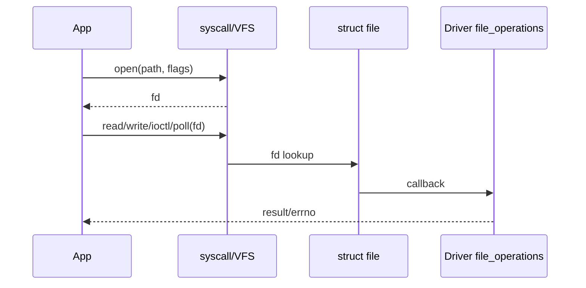

# W03D04 - File Descriptor and UAPI: open/read/write/poll/ioctl pre-driver lab

## 0. 今日定位

- 主线：Linux user/kernel interface
- 时间：2h
- 平台：Ubuntu + i.MX6ULL
- 产物：`user_tool.c`，后续字符设备/驱动周复用

## 1. 今天解决的工程问题

Linux Driver 以后最终要被用户程序调用。今天先从用户侧把 `fd → syscall → kernel file object → file_operations` 心智模型立起来，实际 Driver 到 Week6 再写。

## 2. 今日能力构成


## 3. 先理解：费曼解释

### 3.1 30 秒白话模型

fd 就像用户进程手里的“取件号”。它不是设备对象，也不是指针；内核用 fd 在当前进程的文件表里找到 `struct file`，再从里面路由到具体操作。

### 3.2 精确工程模型

`open()` 返回 fd；对普通文件、pipe、socket、字符设备都能使用部分相同接口，但底层对象和实现不同。`poll()` 是“告诉我何时可读写”；`ioctl()` 用于不适合 read/write 语义的控制命令。用户态不能直接解引用 kernel pointer。

### 3.3 今天必须避免的误解

- API 名字背下来不等于理解执行路径。
- 看到一次成功输出不等于建立了可复现工程闭环。
- 教程里的地址/路径只能作为例子；板上真实值必须用工具验证。

## 4. 原理与执行路径

先用现成对象验证统一接口：

- `/dev/null`：write 成功、read EOF；
- pipe：fd + poll；
- terminal/device：ioctl；
- Week6 自己的 char driver：同一 user_tool 直接复用。

## 5. UML / 时序



## 6. References / Manuals

### ALIENTEK manual
- **C Application Guide V1.1**: [`../references/ALIENTEK_iMX6ULL_Linux_C_Application_Programming_Guide_V1.1.pdf`](../references/ALIENTEK_iMX6ULL_Linux_C_Application_Programming_Guide_V1.1.pdf) / [online](https://github.com/alientek-openedv/imx6ull-document/blob/master/%E3%80%90%E6%AD%A3%E7%82%B9%E5%8E%9F%E5%AD%90%E3%80%91I.MX6U%E5%B5%8C%E5%85%A5%E5%BC%8FLinux%20C%E5%BA%94%E7%94%A8%E7%BC%96%E7%A8%8B%E6%8C%87%E5%8D%97V1.1.pdf)
  - **Chapter 2 File I/O Basics**: §2.2 fd, §2.3 open, §2.4 write, §2.5 read, §2.6 close.
  - Advanced I/O: search `poll()` and `mmap()` in the first-part advanced I/O chapter; exact page depends on your V1.1 pagination.

### Official man-pages
- [`open(2)`](https://man7.org/linux/man-pages/man2/open.2.html)
- [`poll(2)`](https://man7.org/linux/man-pages/man2/poll.2.html)
- [`ioctl(2)`](https://man7.org/linux/man-pages/man2/ioctl.2.html)

## 7. 实验准备

Install `strace`; create `~/work/course/week03/day04`. Keep this tool source in Git because it will become your generic driver test app.

## 8. 实验

### Lab - generic user_tool

```c
#include <fcntl.h>
#include <poll.h>
#include <stdio.h>
#include <string.h>
#include <unistd.h>
#include <errno.h>

int main(int argc, char **argv) {
  if (argc != 2) { fprintf(stderr, "usage: %s <path>\n", argv[0]); return 2; }
  int fd = open(argv[1], O_RDWR | O_NONBLOCK);
  if (fd < 0) { perror("open"); return 1; }
  struct pollfd p = {.fd=fd, .events=POLLIN|POLLOUT};
  int pr = poll(&p, 1, 200);
  printf("fd=%d poll=%d revents=0x%x\n", fd, pr, p.revents);
  const char msg[]="abc";
  ssize_t wr=write(fd,msg,sizeof(msg));
  printf("write=%zd errno=%d(%s)\n",wr,errno,strerror(errno));
  char buf[16]={0};
  ssize_t rd=read(fd,buf,sizeof(buf));
  printf("read=%zd errno=%d(%s)\n",rd,errno,strerror(errno));
  close(fd);
  return 0;
}
```

```bash
gcc -Wall -O0 -g user_tool.c -o user_tool
strace -yy -e trace=openat,read,write,poll,close ./user_tool /dev/null
ls -l /proc/$$/fd
```

把它交叉编译到 6ULL，对 `/dev/null` 或一个安全设备节点重复。

## 9. 故障注入

- 传入不存在路径：观察 `ENOENT`。
- 传入无权限文件：观察 `EACCES`。
- 用 `O_NONBLOCK` 打开 FIFO/pipe 场景，观察 `EAGAIN`，建立 non-blocking 直觉。

## 10. 调试路径

`strace -yy` → `/proc/<pid>/fd` → `ls -l` 设备节点 → `errno` → man-page。以后 Driver 出问题先判断“open 都没成功”还是“callback 内部失败”。

## 11. 源码 / 系统对象追踪

Week6 会从 `sys_read/vfs_read`（不同 kernel version 名称可能变化）追到 `file_operations`. 今天只记住 fd table → `struct file` → f_op 这个稳定模型。

## 12. 今日验收

- [ ] `user_tool` 能编译并在 host/board 跑。
- [ ] 能解释 fd 是进程局部整数。
- [ ] 能解释 `poll` 和 `ioctl` 分别解决什么。
- [ ] 能从 strace 看到系统调用参数和 errno。

## 13. 面试式复述

1. fd=3 的“3”有什么全局意义吗？
2. fork 后 fd 会怎样？
3. 为什么设备也能 read/write？
4. ioctl 为什么不能乱定义？
5. blocking/nonblocking 的区别由谁实现？

## 14. Git 交付物

`user_tool.c`, `strace_user_tool.log`, `fd_model.md`; commit `lab: build reusable Linux device user tool`

## 15. 明日连接

Day5 切到 Zephyr，同样看“硬件描述如何生成可用 device handle”，建立 Linux/RTOS 对照。
