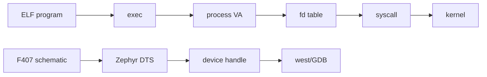

# W03D07 - Week 3 Gate: Feynman teach-back and evidence review

## 0. 今日定位

- 主线：Review / mental model
- 时间：1-2h
- 产物：10-minute oral outline + `week03_questions.md`

## 1. 今天解决的工程问题

本日禁止继续加新知识。目标是确认前六天是否真正形成可复述、可验证模型，而不是“命令跑过”。

## 2. 今日能力构成

## 3. 先理解：费曼解释

### 3.1 30 秒白话模型

把本周讲给一个只懂 STM32/FreeRTOS 的同事：Linux 中“程序/进程/虚拟地址/fd”分别是什么；Zephyr 中“DTS/设备对象/调试链”分别是什么。讲不顺的地方就是知识洞。

### 3.2 精确工程模型

验收不是背定义，而是能从一个现象反推层级。例如 `open()` 返回 ENOENT 是路径/设备节点问题，不应该先怀疑 Driver ISR；LED 不亮先比对 schematic/DTS/active level，再进 Driver。

### 3.3 今天必须避免的误解

- API 名字背下来不等于理解执行路径。
- 看到一次成功输出不等于建立了可复现工程闭环。
- 教程里的地址/路径只能作为例子；板上真实值必须用工具验证。

## 4. 原理与执行路径

用证据文件完成 review：strace log、readelf 输出、maps、user_tool、zephyr.dts、GDB session。每个概念必须指向一个真实证据。

## 5. UML / 时序

本日核心问题主要是静态结构，不强行画时序图。

## 6. References / Manuals

Re-read only targeted sections:
- [C Application Guide V1.1](https://github.com/alientek-openedv/imx6ull-document/blob/master/%E3%80%90%E6%AD%A3%E7%82%B9%E5%8E%9F%E5%AD%90%E3%80%91I.MX6U%E5%B5%8C%E5%85%A5%E5%BC%8FLinux%20C%E5%BA%94%E7%94%A8%E7%BC%96%E7%A8%8B%E6%8C%87%E5%8D%97V1.1.pdf): Ch.1, Ch.2, Ch.9.
- [Explorer schematic](../references/Explorer_STM32F4_V2.2_SCH.pdf): p.2/3/4.
- [Zephyr Devicetree](https://docs.zephyrproject.org/latest/build/dts/index.html) and [west debug](https://docs.zephyrproject.org/latest/develop/west/build-flash-debug.html).
- [Source index](../references/source_index.md).

## 7. 实验准备

Collect all Week3 output into one directory. Do not open chat history during the first oral run.

## 8. 实验

### Oral run 1 - 10 minutes
1. program→process→exec
2. section vs segment
3. VA map
4. fd→struct file→f_op (preview)
5. schematic→Zephyr DTS→device
6. west→debug server→probe→CPU

### Evidence review
For every point, attach one command/output path.

### Gap list
Write exactly 5 uncertain questions. Each must be phrased as a mechanism question, e.g. “Who creates struct file after open?” rather than “VFS 不懂”.

## 9. 故障注入

Pick one command you relied on heavily and remove its output/log; reproduce from scratch. If you cannot, mark Week3 gate failed for that item.

## 10. 调试路径

Use the “层级定位” order: app/tool → syscall/system object → kernel/driver model → hardware. Do not skip directly from symptom to register unless evidence points there.

## 11. 源码 / 系统对象追踪

No new source tracing today. Review the exact source/docs already referenced in D1-D6.

## 12. 今日验收

- [ ] 10-minute oral explanation completed without notes.
- [ ] All 6 mechanisms have evidence.
- [ ] 5 uncertainties recorded.
- [ ] `user_tool.c` retained for later Driver weeks.
- [ ] Zephyr LED/KEY and debug path still reproducible.

## 13. 面试式复述

Explain to interviewer: “Why your MCU background helps but is insufficient for Linux process/driver work?” Give a 2-minute structured answer.

## 14. Git 交付物

`week03_oral_outline.md`, `week03_questions.md`, `week03_evidence_index.md`; commit `docs: close week3 user-space and Zephyr peripheral gate`

## 15. 明日连接

Week4 moves below user space: Kernel build system/modules, while Zephyr track goes deeper into scheduler/thread resource budgeting.
