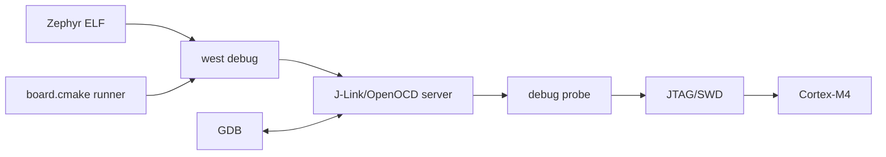
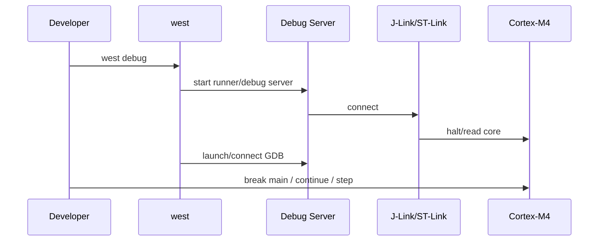

# W03D06 - west debug: GDB, runner, breakpoint and thread state

## 0. 今日定位

- 主线：Zephyr debug
- 时间：2h
- Hardware: Explorer F407 + J-Link/ST-Link as actually available
- 产物：`west_debug_session.md` + breakpoint screenshots/logs

## 1. 今天解决的工程问题

真正产品调试不能只看串口。今天建立 Zephyr build metadata → runner → debug server → GDB → Cortex-M core 的链路。

## 2. 今日能力构成



## 3. 先理解：费曼解释

### 3.1 30 秒白话模型

`west debug` 像一个“总控命令”：它根据 board runner 配置启动对应 debug server 和 GDB。真正让 CPU 停住的是探针经 SWD/JTAG 控制内核 debug 单元。

### 3.2 精确工程模型

Zephyr 的 `west debug`, `west debugserver` 依赖构建目录中的 runner metadata。GDB 使用 `zephyr.elf` 的符号/DWARF；探针协议和 runner 可以是 J-Link、OpenOCD 等。board port 只应声明你真实可用的 runner，不能为了让命令看起来漂亮虚构探针。

### 3.3 今天必须避免的误解

- API 名字背下来不等于理解执行路径。
- 看到一次成功输出不等于建立了可复现工程闭环。
- 教程里的地址/路径只能作为例子；板上真实值必须用工具验证。

## 4. 原理与执行路径

调试时区分三层：1) build has symbols; 2) debug server can connect probe/target; 3) GDB can set breakpoint and read memory/registers。任何一层失败表现不同。

## 5. UML / 时序



## 6. References / Manuals

- [Explorer schematic](../references/Explorer_STM32F4_V2.2_SCH.pdf) — p.2 JTAG connector and PA13/PA14 debug nets.
- [Zephyr west build/flash/debug](https://docs.zephyrproject.org/latest/develop/west/build-flash-debug.html) — `west debug`, `west debugserver`, runner selection.
- [ST PM0214 Cortex-M4 programming manual](https://www.st.com/resource/en/programming_manual/pm0214-stm32-cortexm4-mcus-and-mpus-programming-manual-stmicroelectronics.pdf) — exception/core debug context.
- [ST RM0090](https://www.st.com/resource/en/reference_manual/rm0090-stm32f405415-stm32f407417-stm32f427437-and-stm32f429439-advanced-armbased-32bit-mcus-stmicroelectronics.pdf) — DBGMCU / MCU-specific debug behavior when needed.

## 7. 实验准备

Confirm your actual probe. Run `west debug -H` and record available runners. Keep the same build from D5 with `-g` symbols (Zephyr debug build normally contains ELF symbols).

## 8. 实验

### Lab A - runner inspection
```bash
west flash -H
west debug -H
west debug -H -r jlink   # only if jlink is actually available
```

### Lab B - break at main
```bash
west debug
(gdb) break main
(gdb) continue
(gdb) bt
(gdb) info registers
(gdb) p/x some_variable
(gdb) x/16wx $sp
```

### Lab C - debugserver split
Run `west debugserver`, then connect a separate GDB if your runner supports it. This teaches the separation between server and debugger.

Record which command succeeded with your actual probe; do not fabricate an ST-Link/J-Link path you do not own.

## 9. 故障注入

- Start with the probe unplugged: classify the failure as server/probe connection, not application bug.
- Set a breakpoint on a line optimized away; observe source-level stepping limitations and compare with disassembly.

## 10. 调试路径

`west debug -H` → runner command line → probe USB detection → target voltage/reset/SWD wiring → GDB connection → symbol/breakpoint. Hardware probe failures should be diagnosed before changing application code.

## 11. 源码 / 系统对象追踪

Inspect `boards/.../board.cmake` and Zephyr runner configuration generated into build. Use `west debug --context` as the first introspection tool.

## 12. 今日验收

- [ ] Can halt at `main`.
- [ ] Can display registers/stack.
- [ ] Can explain runner/debug-server/GDB responsibilities.
- [ ] Saved exact working command for your probe.

## 13. 面试式复述

1. west debug 和 west debugserver 区别？
2. ELF 为什么必须保留 symbols?
3. UART 没输出但 GDB 能 halt 说明什么？
4. SWD 与 JTAG 对应用层有何差异？
5. optimized build 为什么更难逐行调试？

## 14. Git 交付物

`west_debug_session.md`, command log; commit `docs: capture repeatable Zephyr hardware debug workflow`

## 15. 明日连接

D7 做 Week3 口述验收：syscall/ELF/VA/fd 与 Zephyr DTS/debug 必须串成一张图。
