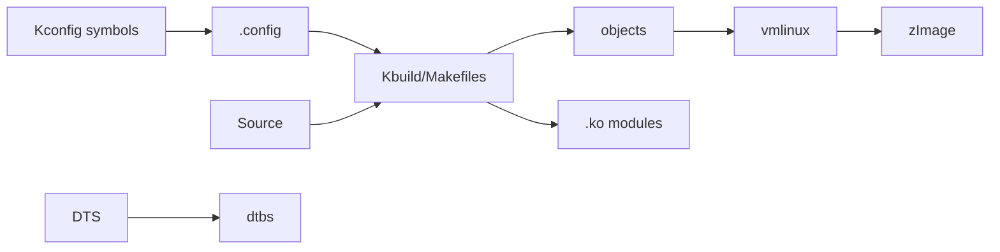

# W04D01 - Kernel Build System: Kconfig -> .config -> Kbuild -> artifacts

## 0. 今日定位

- 主线：Linux Kernel build system
- 时间：2h active; full rebuild wall-clock not counted
- 平台：i.MX6ULL kernel source
- 产物：`kernel_build_flow.md` + `.config` diff

## 1. 今天解决的工程问题

今天不写 Driver。先理解为什么一个 Kconfig symbol 能决定某个 `.c` 是否进入 kernel/module，以及 `.config`、Makefile/Kbuild、vmlinux、zImage、modules、dtbs 分别处在哪一层。

## 2. 今日能力构成



## 3. 先理解：费曼解释

### 3.1 30 秒白话模型

Kconfig 像“功能选择表”，Kbuild 像“工厂排产系统”。你在 menuconfig 选 `y/m/n`，最终改变的是哪些对象被编译、静态链接还是生成模块。

### 3.2 精确工程模型

`defconfig` 是一个初始配置来源；`make <defconfig>` 生成/更新 `.config`。Kconfig 处理依赖、默认值、choice；Kbuild 根据 `obj-y`, `obj-m` 等决定对象进入 built-in 或 module。`vmlinux` 是核心 ELF；ARM `zImage` 是启动镜像；DTB 是独立硬件描述产物。

### 3.3 今天必须避免的误解

- API 名字背下来不等于理解执行路径。
- 看到一次成功输出不等于建立了可复现工程闭环。
- 教程里的地址/路径只能作为例子；板上真实值必须用工具验证。

## 4. 原理与执行路径

今天要在真实 kernel tree 中追一条 symbol：`CONFIG_xxx` → Kconfig 定义 → Makefile `obj-$(CONFIG_xxx)` → source file。选择一个你能安全改成 `m`/`y` 的非关键 driver，**不要随意关闭 console/rootfs/存储相关配置**。

## 5. UML / 时序

本日核心问题主要是静态结构，不强行画时序图。

## 6. References / Manuals

### ALIENTEK manual
- **Linux Driver Development Guide V1.5.2**: [`../references/ALIENTEK_iMX6ULL_Linux_Driver_Development_Guide_V1.5.2.pdf`](../references/ALIENTEK_iMX6ULL_Linux_Driver_Development_Guide_V1.5.2.pdf) / [online](https://github.com/alientek-openedv/imx6ull-document/blob/master/%E3%80%90%E6%AD%A3%E7%82%B9%E5%8E%9F%E5%AD%90%E3%80%91I.MX6U%E5%B5%8C%E5%85%A5%E5%BC%8FLinux%E9%A9%B1%E5%8A%A8%E5%BC%80%E5%8F%91%E6%8C%87%E5%8D%97V1.5.2.pdf)
  - Read **Chapter 35 Linux Kernel Top Makefile**; focus §35.2 kernel build, §35.3 source directory, and the sections explaining top Makefile/config flow.

### Linux official
- [Kconfig configuration targets/editors](https://docs.kernel.org/kbuild/kconfig.html)
- [External modules/Kbuild conventions](https://docs.kernel.org/kbuild/modules.html)

## 7. 实验准备

Use the same kernel source/config that actually boots your board. Before changing anything: `git status`, copy `.config`, record `git rev-parse HEAD`, `make kernelversion`.

## 8. 实验

### Lab A - config diff
```bash
cp .config ../config.before
make ARCH=arm menuconfig
# change ONE harmless learning option
cp .config ../config.after
scripts/diffconfig ../config.before ../config.after
```

### Lab B - trace symbol to object
```bash
grep -R "config <SYMBOL>" -n . | head
grep -R "CONFIG_<SYMBOL>" -n drivers arch | head -20
```

Write `symbol_trace.md`: Kconfig file → Makefile line → `.c` file → expected `y/m/n` effect.

### Lab C - artifact map
```bash
file vmlinux arch/arm/boot/zImage 2>/dev/null || true
find . -name '*.ko' | head
find arch/arm/boot/dts -name '*.dtb' | head
```

## 9. 故障注入

- Set a chosen symbol back to its original value and confirm `diffconfig` becomes empty for that symbol.
- Try `make olddefconfig` after intentionally removing a noncritical config line in a copy, observe Kconfig default resolution (do not damage baseline).

## 10. 调试路径

`scripts/diffconfig` → search Kconfig symbol → search Makefile → inspect build command with `V=1` if needed. Build failures first classify host tool/dependency vs compiler vs Kconfig dependency.

## 11. 源码 / 系统对象追踪

Trace only one symbol. This is the habit for future driver enablement in Yocto/BSP: config → object → module/artifact.

## 12. 今日验收

- [ ] Can draw Kconfig→.config→Kbuild→artifact flow.
- [ ] Can trace one CONFIG symbol to a source file.
- [ ] Can explain y vs m vs n.
- [ ] Config change is recorded and reversible.

## 13. 面试式复述

1. defconfig 与 .config 区别？
2. obj-y / obj-m 如何形成？
3. vmlinux 和 zImage 区别？
4. 为什么 `make menuconfig` 可能自动改变其他 symbol？
5. 如何证明板子跑的是你这次构建的 kernel？

## 14. Git 交付物

`kernel_build_flow.md`, `symbol_trace.md`, config before/after; commit `lab: trace kernel config symbol through kbuild`

## 15. 明日连接

明天写最小 out-of-tree `.ko`，把今天的 Kbuild 模型落地。
