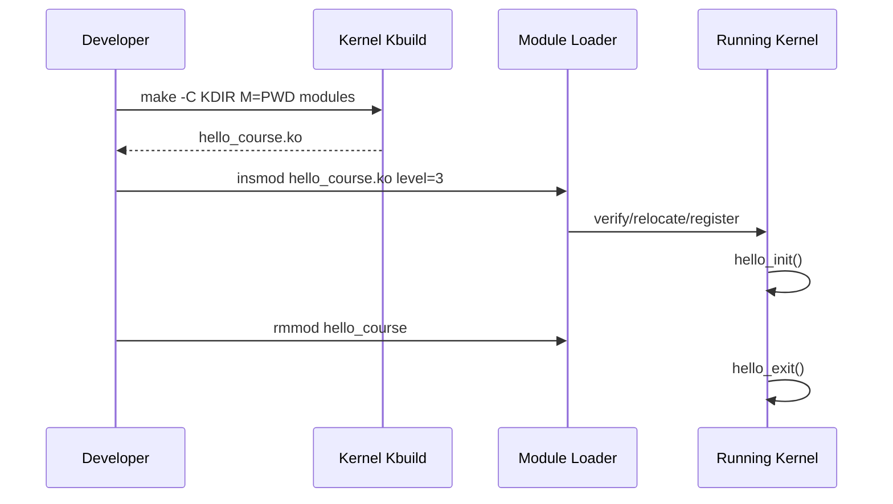

# W04D02 - Hello Kernel Module: init/exit/module_param and Kbuild

## 0. 今日定位

- 主线：Linux loadable module
- 时间：2h
- 平台：i.MX6ULL
- 产物：`hello_course.ko` + repeated load/unload log

## 1. 今天解决的工程问题

这是你第一次真正自己写内核代码。目标刻意很小：不碰硬件，只证明“source → Kbuild → ko → loader → init/exit → sysfs/module metadata”链路。

## 2. 今日能力构成

```mermaid
flowchart LR
    C[hello_course.c] --> KB[Kbuild obj-m]
    KB --> KO[hello_course.ko]
    KO --> IN[insmod/modprobe]
    IN --> RESOLVE[symbol relocation/vermagic]
    RESOLVE --> INIT[module_init]
    INIT --> SYS[/sys/module]
    SYS --> EXIT[module_exit/rmmod]
```

## 3. 先理解：费曼解释

### 3.1 30 秒白话模型

`.ko` 可以理解成“能被运行中内核动态链接/装载的一块内核代码”。和用户 ELF 最大差别是：它不是被普通 process loader 装入用户地址空间，而是由 kernel module loader 校验、重定位并加入内核地址空间。

### 3.2 精确工程模型

out-of-tree module 必须针对目标 kernel build/config/header 构建。`module_init`/`module_exit` 注册入口/出口；`MODULE_LICENSE` 等提供 metadata；`module_param` 可以在 load time 接收参数并映射到 `/sys/module/<name>/parameters`（取决权限/定义）。

### 3.3 今天必须避免的误解

- API 名字背下来不等于理解执行路径。
- 看到一次成功输出不等于建立了可复现工程闭环。
- 教程里的地址/路径只能作为例子；板上真实值必须用工具验证。

## 4. 原理与执行路径

Makefile 的核心不是自己调用 gcc，而是 `make -C $KDIR M=$PWD modules` 让目标 kernel 的 Kbuild 接管编译参数、include、modpost 等。

## 5. UML / 时序



## 6. References / Manuals

### ALIENTEK manual
- [Driver Guide V1.5.2 local](../references/ALIENTEK_iMX6ULL_Linux_Driver_Development_Guide_V1.5.2.pdf) / [online](https://github.com/alientek-openedv/imx6ull-document/blob/master/%E3%80%90%E6%AD%A3%E7%82%B9%E5%8E%9F%E5%AD%90%E3%80%91I.MX6U%E5%B5%8C%E5%85%A5%E5%BC%8FLinux%E9%A9%B1%E5%8A%A8%E5%BC%80%E5%8F%91%E6%8C%87%E5%8D%97V1.5.2.pdf)
  - Read **Chapter 40 character-device-driver introduction / first driver experiment** only for module Makefile/load/unload style. Later Ch.41/42 extend it to real/new char devices; today do not jump ahead.
  - Search keywords: `obj-m`, `module_init`, `module_exit`, `insmod`, `rmmod`.

### Linux official
- [Building External Modules](https://docs.kernel.org/kbuild/modules.html) — today’s primary reference.
- [Kernel module parameters overview](https://docs.kernel.org/kbuild/kconfig.html) is not the module-param reference; inspect `modinfo -p` and `/sys/module/.../parameters` on the running target as runtime evidence.

## 7. 实验准备

Ensure `KDIR` is the exact built kernel source for the running 6ULL. Record `uname -r` on board and `make kernelrelease` in source. If different, stop and solve version alignment first.

## 8. 实验

### Lab A - source
```c
#include <linux/init.h>
#include <linux/module.h>
#include <linux/kernel.h>

static int level = 1;
module_param(level, int, 0644);
MODULE_PARM_DESC(level, "course log level");

static int __init hello_init(void) {
    pr_info("hello_course: init level=%d\n", level);
    return 0;
}
static void __exit hello_exit(void) {
    pr_info("hello_course: exit\n");
}
module_init(hello_init);
module_exit(hello_exit);
MODULE_LICENSE("GPL");
MODULE_AUTHOR("course");
MODULE_DESCRIPTION("Week4 minimal module");
```

Makefile:
```make
obj-m := hello_course.o
KDIR ?= /absolute/path/to/kernel
PWD := $(shell pwd)
all:
	$(MAKE) -C $(KDIR) M=$(PWD) modules
clean:
	$(MAKE) -C $(KDIR) M=$(PWD) clean
```

### Lab B - inspect and load
```bash
file hello_course.ko
modinfo hello_course.ko
# copy to board
insmod ./hello_course.ko level=3
dmesg | tail -30
cat /sys/module/hello_course/parameters/level
rmmod hello_course
```

### Lab C - stability repetition
Run load/unload 20 times with a shell loop; verify no unexpected error/log leak.

## 9. 故障注入

- Pass a non-integer `level=abc`; capture loader error.
- Change module init to return `-EINVAL` after one log, observe `insmod` failure and confirm module is not retained.

## 10. 调试路径

`modinfo` → `uname -r` vs `make kernelrelease` → `dmesg` → `/sys/module` → Kbuild command `V=1`. Never solve module load errors by copying random headers.

## 11. 源码 / 系统对象追踪

Inspect generated `.mod.c`, `Module.symvers` if present, and `modinfo` fields. Do not edit generated files.

## 12. 今日验收

- [ ] load/unload works 20 times.
- [ ] module parameter visible.
- [ ] can explain why KDIR must match running kernel.
- [ ] generated/metadata files identified.

## 13. 面试式复述

1. Why not compile module with `arm-linux-gnueabihf-gcc hello.c` directly?
2. module_init is called when?
3. why is module code privileged?
4. insmod vs modprobe?
5. module parameter lives where at runtime?

## 14. Git 交付物

module source/Makefile + `module_load_cycle.log`; commit `lab: build and load minimal imx6ull kernel module`

## 15. 明日连接

Tomorrow inspect symbols, dependency resolution and intentionally create a vermagic mismatch.
