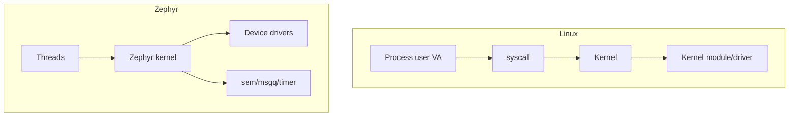

# W04D07 - Week 4 Gate: Linux process/thread vs Zephyr thread/context

## 0. 今日定位

- 主线：Cross-system mental model
- 时间：1-2h
- 产物：`linux_vs_zephyr_runtime.md`
- Gate：不通过则不进入 DeviceTree/Driver Model next stage

## 1. 今天解决的工程问题

你不能把 Linux task 和 RTOS task 只按 API 对照。今天把真正影响 Driver/System Software 的差异：地址空间、权限、调度、资源、系统调用、模块化和调试方式放到一张表。

## 2. 今日能力构成

## 3. 先理解：费曼解释

### 3.1 30 秒白话模型

Linux 像“大楼”：普通应用住在不同房间（进程地址空间），进内核服务要过门禁（syscall）。典型 MCU Zephyr 系统更像一个受 RTOS 管理的单体固件，线程共享同一系统映像/多数地址资源；具体 userspace/MPU 特性另说。

### 3.2 精确工程模型

对比必须限定配置：Linux i.MX6ULL 是 MMU、多进程；Zephyr F407 默认 supervisor threads/单固件模型。不要把“Zephyr 永远无用户态/无保护”写成绝对结论，因为 Zephyr 也支持 userspace/MPU。当前项目先掌握默认 product configuration。

### 3.3 今天必须避免的误解

- API 名字背下来不等于理解执行路径。
- 看到一次成功输出不等于建立了可复现工程闭环。
- 教程里的地址/路径只能作为例子；板上真实值必须用工具验证。

## 4. 原理与执行路径

制作 12 行对照：program image、address space、thread stack、syscall、driver integration、dynamic module、blocking object、scheduler, memory protection, debug, crash scope, update model。每行必须写“对工程的影响”。

## 5. UML / 时序

本日核心问题主要是静态结构，不强行画时序图。

## 6. References / Manuals

### Re-read
- [ALIENTEK C App Guide V1.1](https://github.com/alientek-openedv/imx6ull-document/blob/master/%E3%80%90%E6%AD%A3%E7%82%B9%E5%8E%9F%E5%AD%90%E3%80%91I.MX6U%E5%B5%8C%E5%85%A5%E5%BC%8FLinux%20C%E5%BA%94%E7%94%A8%E7%BC%96%E7%A8%8B%E6%8C%87%E5%8D%97V1.1.pdf): Ch.9 process/VA.
- [Linux external module docs](https://docs.kernel.org/kbuild/modules.html).
- [Zephyr Threads](https://docs.zephyrproject.org/latest/kernel/services/threads/index.html) / [Scheduling](https://docs.zephyrproject.org/latest/kernel/services/scheduling/index.html).
- [Zephyr Thread Analyzer](https://docs.zephyrproject.org/latest/services/debugging/thread-analyzer.html).
- [Source index](../references/source_index.md).

## 7. 实验准备

Use Week3/4 evidence only. No new feature development.

## 8. 实验

### Deliverable table template
| Dimension | Linux i.MX6ULL | Zephyr F407 | Engineering impact |
|---|---|---|---|
| Address space | per-process VA + kernel | shared firmware model by default | pointer bugs/crash scope differ |
| App→kernel | syscall | direct kernel API in typical supervisor app | interface/privilege design differs |
| Driver | kernel built-in/module | linked device driver | deploy/debug differs |
| Stack budget | per-thread + virtual memory system | fixed embedded RAM budget | RTOS needs explicit budget |

Continue at least 12 rows.

### Oral gate
5 minutes Linux runtime + 5 minutes Zephyr runtime + 5 minutes differences affecting system software.

## 9. 故障注入

- Deliberately write one absolute statement such as “RTOS has no memory protection”, then correct it with configuration/architecture nuance. This trains interview precision.

## 10. 调试路径

When comparing systems, always state: architecture, OS build/config, privilege mode, and whether feature is default/optional. Avoid ideological “Linux is heavy/RTOS is real-time” slogans.

## 11. 源码 / 系统对象追踪

No new source trace. Link each table row to at least one prior experiment or official reference.

## 12. 今日验收

- [ ] 12+ row comparison complete.
- [ ] each row includes engineering impact.
- [ ] 15-minute oral explanation possible.
- [ ] kernel module lab still reproducible.
- [ ] Zephyr stack budget retained.

## 13. 面试式复述

1. Why Linux driver crash blast radius differs from user process?
2. Why RTOS thread stack budget is a first-class product concern?
3. Does Zephyr support user mode? Why is “RTOS has no protection” imprecise?
4. Linux module vs Zephyr linked driver deployment difference?
5. Which model better matches your current A53+MCU heterogeneous SoC?

## 14. Git 交付物

`linux_vs_zephyr_runtime.md`; commit `docs: compare Linux and Zephyr runtime models for system software`

## 15. 明日连接

Next planned stage: Linux DeviceTree/Driver Model and Zephyr DTS/Kconfig separation. The earlier A01 DeviceTree deep-dive becomes the main reference.
