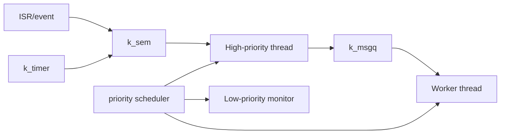
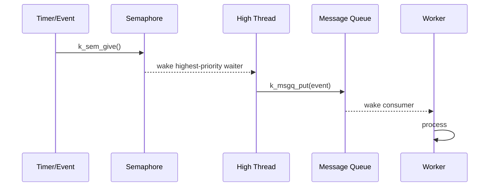

# W04D05 - Zephyr Threads, Scheduling and Synchronization

## 0. 今日定位

- 主线：RTOS kernel in real use
- 时间：2h
- 硬件：Explorer F407
- 产物：3-thread scheduling/sync demo + timing log

## 1. 今天解决的工程问题

你分析过 FreeRTOS 源码，但岗位里更重要的是能把线程、优先级、同步对象用于平台服务设计。今天用 Zephyr 做一个可观察的多线程系统，并对照 FreeRTOS 心智模型。

## 2. 今日能力构成



## 3. 先理解：费曼解释

### 3.1 30 秒白话模型

把 scheduler 想成机场塔台：只有 ready 的线程有资格起飞，优先级决定谁先拿 CPU；semaphore 是“事件闸门”，message queue 是“带数据的等待队列”。

### 3.2 精确工程模型

Zephyr thread 有独立 stack、`k_thread`、priority、state。scheduler 在线程阻塞/就绪、中断返回、yield 等点重新选择 runnable thread。semaphore 可以从 ISR give；message queue 传固定大小 item；timer callback context 与普通 thread 不同，避免在 callback 做长时间阻塞工作。

### 3.3 今天必须避免的误解

- API 名字背下来不等于理解执行路径。
- 看到一次成功输出不等于建立了可复现工程闭环。
- 教程里的地址/路径只能作为例子；板上真实值必须用工具验证。

## 4. 原理与执行路径

设计三线程：event producer → high-priority control thread → msgq → worker；monitor 低优先级周期打印状态。通过 timestamp 证明唤醒顺序，而不是凭肉眼判断。

## 5. UML / 时序



## 6. References / Manuals

- [Zephyr Threads](https://docs.zephyrproject.org/latest/kernel/services/threads/index.html) — lifecycle, states, stack, priorities.
- [Zephyr Scheduling](https://docs.zephyrproject.org/latest/kernel/services/scheduling/index.html) — reschedule points, preemptive/cooperative behavior.
- [Zephyr Semaphores](https://docs.zephyrproject.org/latest/kernel/services/synchronization/semaphores.html)
- [Zephyr Message Queues](https://docs.zephyrproject.org/latest/kernel/services/data_passing/message_queues.html)
- [Explorer schematic](../references/Explorer_STM32F4_V2.2_SCH.pdf) only if KEY IRQ is used as event source.

FreeRTOS cross-reference: map task/queue/semaphore conceptually, but do not force API one-to-one equivalence.

## 7. 实验准备

Use existing board/console. Add timestamp utility based on `k_uptime_get()`; use thread names if configuration supports them.

## 8. 实验

### Lab
Create 3 threads with explicit priorities and stacks. Suggested behavior:

```c
K_SEM_DEFINE(event_sem, 0, 1);
K_MSGQ_DEFINE(work_q, sizeof(uint32_t), 8, 4);

/* producer gives sem periodically or from key callback */
/* high thread: take sem -> timestamp -> put sequence into msgq */
/* worker: get msgq -> simulate 10 ms work */
/* monitor: every second print counts */
```

Log format:
```text
1234 producer give seq=7
1235 high woke seq=7
1236 worker got seq=7
```

Change high thread priority and compare. Use `k_sleep` vs busy loop to observe impact.

## 9. 故障注入

- Make worker higher priority than control and observe ordering/latency change.
- Intentionally fill message queue using nonblocking put, log `-ENOMSG`/failure result; restore normal rate.

## 10. 调试路径

timeline log → thread state/priority → blocking object count/queue fill → scheduler docs → GDB if thread stuck. Avoid “加 delay 解决同步问题”.

## 11. 源码 / 系统对象追踪

Search `k_sem_take`, `k_sem_give`, `k_msgq_put/get`, scheduling docs. The goal is API semantics + scheduling points, not reading all kernel scheduler source.

## 12. 今日验收

- [ ] logs prove wake/processing order.
- [ ] can explain semaphore vs message queue.
- [ ] can explain why blocking changes runnable set.
- [ ] can map FreeRTOS concepts without claiming implementations are identical.

## 13. 面试式复述

1. high priority thread blocked on semaphore时会不会占 CPU？
2. ISR give semaphore 后何时切线程？
3. msgq 与共享 ring buffer 各有什么 ownership tradeoff？
4. cooperative/preemptive priority 怎么理解？
5. timer callback 为什么不应做重活？

## 14. Git 交付物

`scheduler_demo/`, timing log, `freertos_vs_zephyr_sync.md`; commit `lab: prove Zephyr scheduling and synchronization order`

## 15. 明日连接

Tomorrow quantify stack and runtime use; move from “能跑”到 product resource budget.
