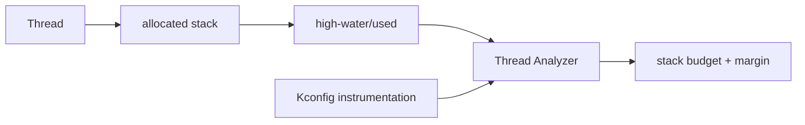

# W04D06 - Thread Analyzer and Stack Budget: make RTOS resource use measurable

## 0. 今日定位

- 主线：RTOS observability/product robustness
- 时间：2h
- 硬件：Explorer F407
- 产物：`stack_budget.csv/md` + controlled low-stack experiment

## 1. 今天解决的工程问题

产品 RTOS 最常见的隐患之一是线程栈“拍脑袋”。今天要用 Zephyr Thread Analyzer/stack instrumentation 获得证据，并理解为什么 release 版本还要保留合理 margin。

## 2. 今日能力构成



## 3. 先理解：费曼解释

### 3.1 30 秒白话模型

每个线程像拿了一块固定大小的私人工作台。太大浪费 RAM，太小会踩到别人内存甚至随机崩溃。Thread Analyzer 就是用来量“实际用到多少”的尺子。

### 3.2 精确工程模型

Zephyr Thread Analyzer can report stack usage and optional runtime statistics when related configs are enabled. Stack instrumentation can add overhead, and worst-case path may not occur in a short lab, so measured high-water mark is **lower bound evidence**, not final production size. F407 RAM budget makes this exercise especially relevant.

### 3.3 今天必须避免的误解

- API 名字背下来不等于理解执行路径。
- 看到一次成功输出不等于建立了可复现工程闭环。
- 教程里的地址/路径只能作为例子；板上真实值必须用工具验证。

## 4. 原理与执行路径

从 D5 三线程 demo 开始，给每个 thread 明确 stack size，打开 analyzer，跑 normal/stress paths，再建立 `allocated / peak observed / margin / rationale` 表。

## 5. UML / 时序

本日核心问题主要是静态结构，不强行画时序图。

## 6. References / Manuals

- [Zephyr Thread Analyzer](https://docs.zephyrproject.org/latest/services/debugging/thread-analyzer.html) — configuration and output fields.
- [Zephyr Threads: stack/runtime safety](https://docs.zephyrproject.org/latest/kernel/services/threads/index.html)
- [Zephyr Scheduling](https://docs.zephyrproject.org/latest/kernel/services/scheduling/index.html)
- [ST STM32F407 documentation page](https://www.st.com/en/microcontrollers-microprocessors/stm32f407-417/documentation.html) — verify MCU RAM capabilities if budgeting whole image.
- [Explorer schematic](../references/Explorer_STM32F4_V2.2_SCH.pdf) — MCU identity is STM32F407ZET6.

## 7. 实验准备

Keep D5 functional baseline. Save `build/zephyr/zephyr.map` and `west build -t ram_report` if supported by your Zephyr build; otherwise use available size output.

## 8. 实验

### Lab A - analyzer
Add/update `prj.conf` using options supported by your fixed Zephyr revision, starting with:
```conf
CONFIG_THREAD_NAME=y
CONFIG_THREAD_ANALYZER=y
CONFIG_THREAD_ANALYZER_USE_PRINTK=y
CONFIG_THREAD_ANALYZER_AUTO=y
CONFIG_THREAD_ANALYZER_AUTO_INTERVAL=5
```
If a symbol name differs in your fixed revision, use `menuconfig`/docs to resolve it; do not blindly paste unknown symbols.

Record output for at least 60 seconds under normal load.

### Lab B - controlled stress
Exercise deeper call paths / larger local buffers in ONE test thread. Reduce that thread stack gradually only in the lab until warnings/fault behavior appears, then restore a safe size.

### Budget table
```text
thread | allocated | peak observed | stress path | proposed margin | reason
```

Also record total RAM/ROM size before/after analyzer config so you see observability cost.

## 9. 故障注入

- Make one lab thread stack intentionally too small; capture diagnostic/fault, then restore.
- Disable analyzer and confirm production-like build resource change. Do not leave unsafe stack size committed.

## 10. 调试路径

thread analyzer output → identify thread → inspect stack allocation macro → reproduce workload → GDB/call stack if fault → adjust budget with margin → rerun. Randomly doubling every stack is not a diagnosis.

## 11. 源码 / 系统对象追踪

Inspect generated map file and thread stack declarations. Use Kconfig search for analyzer-related symbols to understand what instrumentation gets selected.

## 12. 今日验收

- [ ] analyzer output captured.
- [ ] stack budget table has all D5 threads.
- [ ] one controlled low-stack failure/warning observed or safely documented.
- [ ] can explain measurement limitations and margin.

## 13. 面试式复述

1. 高水位为什么不等于 worst case？
2. stack overflow 与 heap exhaustion 表现区别？
3. analyzer 开启会不会有成本？
4. ISR stack 与 thread stack 是一回事吗？
5. 你如何给一个产品线程定 stack size？

## 14. Git 交付物

`stack_budget.md`, analyzer logs, config diff; commit `lab: measure Zephyr thread stack and runtime budget`

## 15. 明日连接

D7 把 Linux process/thread 与 Zephyr thread/context 做工程差异对照。
