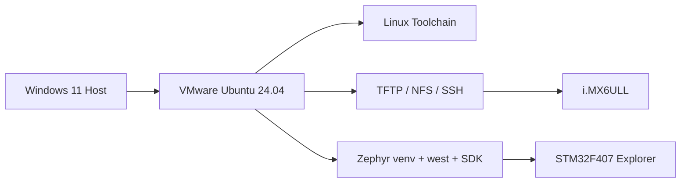

# Chapter 1 - Build a Reproducible Embedded Linux Development Host

> Week 1 / Day 1 - 先把开发环境从“能用”提升为“可复现”。

[← Part README](README.md) · [Next →](ch02_cross_compilation_elf.md)

## 1.1 本章要解决的不是“装一个 Ubuntu”，而是建立可复现的开发宿主机

后面 19 周里，你会反复编译 U-Boot、Kernel、DTB、Linux 用户程序和 Zephyr 固件。真正拖慢开发的通常不是代码，而是“环境到底是什么状态”：某个包什么时候装的、工具链从哪里来的、VM 网络为什么突然找不到开发板、旧 BSP 为什么今天能编明天不能编。

所以第一章的目标不是把软件装满，而是建立一个**可描述、可恢复、可迁移**的 Host 基线。



### 费曼模型：Host 就是一间实验室

把开发机想成实验室：开发板是被测设备，编译器、GDB、TFTP/NFS 是仪器。实验室里最怕的不是仪器少，而是仪器位置、量程、版本都不记录。于是一个实验“碰巧成功”，换一台机器就无法复现。

工程上对应三件事：

1. 固定 OS 与虚拟机资源；
2. 工具链、Python 环境和源码分目录；
3. 每个阶段记录版本并打快照。

## 1.2 为什么主环境用 Ubuntu 24.04，而旧 BSP 不应该绑架主机

Zephyr 当前官方 Getting Started 面向现代 Ubuntu；你的 6ULL BSP 很可能年代较老。正确做法不是把主机降级到一个十年前的 Ubuntu，而是：

```text
Modern Host (长期使用)
    ├── native: Git/GDB/Zephyr/现代工具
    └── container/secondary VM: 只包住旧 BSP 的兼容性依赖
```

这和你做 Yocto 时隔离 host dependency 是同一思想：**把不稳定因素限制在边界内。**

## 1.3 VMware 三种网络模式：为什么课程默认 Bridged

NAT、Bridged、Host-only 很容易背成名词，但你只需要从“开发板能不能主动访问 VM”思考。

- **NAT**：VM 借宿主机出网，适合普通桌面虚拟机；板卡主动访问 VM 时常多一层地址转换/端口问题。
- **Bridged**：VM 像局域网里独立的一台 PC，最适合 `开发板 ↔ VM` 的 TFTP/NFS/SSH。
- **Host-only**：Host 和 VM 的私有网，隔离性强，但默认无法直接与物理 LAN 上的板通信。

课程默认 Bridged。后面 Day 3 你会亲自验证 ARP 和双向 ping，从现象反推这个选择。

## 1.4 建立目录：源码、工具链、共享目录和日志不能混

```bash
mkdir -p ~/work/{src,toolchains,course,logs,zephyr}
mkdir -p ~/nfs
sudo mkdir -p /srv/tftp
```

推荐心智模型：

```text
~/work/src         可删除/重新 clone 的源码
~/work/toolchains  明确版本的交叉工具链
~/work/course      本课程代码和笔记
~/work/logs        boot/build/debug 记录
~/nfs              Linux 运行阶段共享
/srv/tftp          U-Boot 阶段下载
```

不要把编译产物、源码和下载包全放在 `~/Downloads`。后面追错版本时，这会直接害死你。

## 1.5 Worked Example：一次把基础工具装全，但知道每一类工具解决什么

```bash
sudo apt update
sudo apt install -y \
  git build-essential make cmake ninja-build \
  gdb gdb-multiarch binutils \
  python3 python3-venv python3-pip \
  openssh-server rsync ccache tree tmux \
  device-tree-compiler u-boot-tools \
  tftp-hpa tftpd-hpa nfs-kernel-server \
  flex bison bc libssl-dev libncurses-dev pkg-config \
  strace trace-cmd
```

按功能分组理解：

- `build-essential/binutils`：Host C/C++ 与 ELF 工具；
- `gdb-multiarch`：后面跨架构调试 ARM；
- `dtc/u-boot-tools`：DTB 与 U-Boot 镜像工具；
- `tftp/nfs`：Host-Target 快速开发闭环；
- `flex/bison/bc/openssl/ncurses`：Kernel/U-Boot 常见构建依赖；
- `strace/trace-cmd`：从用户态观察系统调用与后续 trace。

### 记录基线

```bash
{
  date
  uname -a
  lsb_release -a
  gcc --version | head -1
  cmake --version | head -1
  python3 --version
  git --version
  gdb-multiarch --version | head -1
  ip -br addr
  ip route
} | tee ~/work/logs/host_baseline.txt
```

以后出问题先 diff 这个基线，而不是靠记忆。

## 1.6 Guided Lab：把 Host 做到“可远程、可快照、可恢复”

1. VMware 网卡切到 Bridged；
2. `ip -br addr` 记录 VM 地址；
3. `sudo systemctl enable --now ssh`；
4. Windows PowerShell `ssh <user>@<vm-ip>`；
5. 创建 VMware snapshot：`env-base`；
6. 把 `host_baseline.txt` 提交到你的学习仓库。

### 预期结果

你应该能回答：“VM 的 IP 是谁分配的？默认路由走哪个接口？Windows 为什么能直连它？”

## 1.7 Independent Challenge：亲自制造一次网络错误

把 VM 临时切到 NAT，重新执行：

```bash
ip -br addr
ip route
```

比较 Bridged 前后的地址和路由。然后恢复 Bridged。

这不是为了记 VMware 菜单，而是训练一个习惯：**配置改变 → 系统对象改变 → 用命令观察，而不是猜。**

## 1.8 本章检查点

在不看教程的情况下，你应该能讲清：

- 为什么用 VM 而不是把所有环境直接塞进 Windows/WSL；
- 为什么板卡开发默认 Bridged；
- `~/nfs` 与 `/srv/tftp` 分别准备给哪个运行阶段；
- 为什么要保存工具版本和网络基线。

## 1.9 下一章：有了实验室，还没有“制造 ARM 程序的机床”

现在 Host 已稳定，但 `gcc hello.c` 生成的是 x86-64 ELF。下一章从你熟悉的 linker/startup 出发，解释为什么 x86 PC 可以生成 ARM 程序，以及 Linux ELF 与 MCU 固件到底哪里相同、哪里不同。

## References and manuals

### ALIENTEK i.MX6ULL VM Guide V1.2
- Local expected path: `../references/ALIENTEK_iMX6ULL_VM_Guide_V1.2.pdf`
- Online: [ALIENTEK i.MX6ULL VM Guide V1.2](https://github.com/alientek-openedv/imx6ull-document/blob/master/%E3%80%90%E6%AD%A3%E7%82%B9%E5%8E%9F%E5%AD%90%E3%80%91I.MX6U%E8%99%9A%E6%8B%9F%E6%9C%BA%E4%BD%BF%E7%94%A8%E5%8F%82%E8%80%83%E6%89%8B%E5%86%8CV1.2.pdf)
- 本章阅读定位：重点看 VMware/Ubuntu 基础配置、虚拟网络和共享相关章节；不要照抄旧 Ubuntu 版本号。

### Zephyr Getting Started

- Online: [Zephyr Getting Started](https://docs.zephyrproject.org/latest/develop/getting_started/index.html)
- 本章阅读定位：只看 Host OS、Python virtual environment 与 SDK prerequisites。

- [Unified source index](../common/source_index.md)

[← Part README](README.md) · [Next →](ch02_cross_compilation_elf.md)
