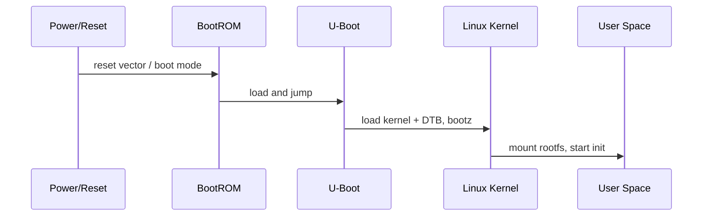

# Chapter 3 - First Contact with i.MX6ULL: Serial Console, U-Boot and Network

> Week 1 / Day 3 - 从上电日志建立 Bootloader、Kernel 和网络的第一手观察能力。

[← Part README](README.md) · [← Previous](ch02_cross_compilation_elf.md) · [Next →](ch04_tftp_nfs_loop.md)

## 3.1 为什么嵌入式 Linux 的第一调试接口永远应该是串口

网络驱动可能没起来、rootfs 可能挂载失败、用户态甚至还没启动，但 SoC 早期串口往往已经能输出 Bootloader/Kernel 信息。它覆盖启动链最早阶段，因此是 BSP bring-up 的第一控制面。



今天你不需要研究 BootROM 细节；目标是能够从串口日志分辨：**当前系统死在 U-Boot、Kernel 还是 User Space。**

## 3.2 U-Boot console 与 Linux console 是两个不同的软件世界

串口线没换，但驱动者换了：

```text
上电 -- U-Boot UART driver --> U-Boot shell
            |
          bootz
            v
        Linux UART driver --> kernel console --> getty/shell
```

所以“串口没有输出”不能只检查一个层次。U-Boot 有输出而 Kernel 没输出，优先看 `bootargs console=`、DT、Kernel driver；连 U-Boot 都没输出，再回到 boot source/串口硬件。

## 3.3 Worked Example：完整保存一次启动日志

先确定 Windows/Ubuntu 能看到 USB-UART。常用：

```bash
dmesg --follow
ls -l /dev/ttyUSB* /dev/ttyACM* 2>/dev/null
```

串口参数以你的 6ULL 配套手册为准。进入终端后：

1. Reset 板卡；
2. 保存从第一行到 shell 的完整日志；
3. 再 Reset，在 U-Boot 倒计时按键停止 autoboot；
4. 执行：

```text
version
printenv
bdinfo
```

不要急着改 env，先把“现状”保存。

建立 `~/work/logs/imx6ull_boot_baseline.txt`，以后所有启动异常都和这份正常样本比。

## 3.4 从 U-Boot 环境变量读懂“下一步准备怎么启动”

重点观察：

- `bootcmd`：默认启动脚本；
- `bootargs`：传给 Kernel 的 command line；
- `console=`：Kernel console；
- `root=`：根文件系统；
- `ipaddr/serverip`：TFTP 相关；
- kernel/DTB load address：**只记录板上当前值，不从教程硬抄地址。**

费曼解释：U-Boot 不是 Linux 的“前半部分”，而是独立程序。它的任务是把硬件带到足够状态、把 Kernel/DTB 放到内存、组织参数，然后跳过去。

## 3.5 网络只学今天必要的三个对象：IP、邻居、路由

Host 和 6ULL 直连/同 LAN 时，先不要把 TCP/IP 学成大部头。

```text
IP address + prefix -> 我在哪个网段
ARP/neighbour       -> 同网段目标的 MAC 是谁
route               -> 目标不在本地网段时交给谁
```

VM：

```bash
ip -br addr
ip route
ip neigh
```

6ULL Linux：

```bash
ip addr
ip route
ip neigh
```

如果目标 IP 判断为同网段，却 ping 不通，先看 `ip neigh` 是否出现 `FAILED/INCOMPLETE`；这时优先查二层/网卡/VM 桥接，而不是 DNS。

## 3.6 Guided Lab：建立 VM ↔ 6ULL 双向链路

给两端设置同网段地址（具体地址自行按局域网规划）：

```text
Ubuntu VM: 192.168.X.10/24
6ULL:      192.168.X.20/24
```

验证：

```bash
ping -c 3 192.168.X.20
ip neigh
ssh root@192.168.X.20
```

板端再 ping VM。只有**双向**都通，Day 4 的 TFTP/NFS 才算有资格继续。

## 3.7 故障实验：故意把 prefix 配错

比如 VM `/24`、板端临时 `/16` 或完全不同网段，观察：

```bash
ip route get <peer-ip>
ip neigh
```

不要只说“ping 不通”。写出内核此时认为 peer 是 on-link 还是应该走 gateway。

## 3.8 本章检查点

你现在应该能回答：

1. U-Boot console 与 Linux console 为什么可能一个有输出一个没有？
2. `bootargs` 是谁产生、谁消费？
3. 同网段通信时为什么先有 ARP/neighbor？
4. Bridged VM 为什么更适合 TFTP/NFS？

## 3.9 下一章：网络通只是“路修好了”，还缺快速搬运 Kernel/文件的运输方式

下一章把 TFTP 放在 U-Boot 阶段、NFS 放在 Linux 阶段，构建“改代码 -> 编译 -> 板上立即验证”的高速闭环。

## References and manuals

### ALIENTEK i.MX6ULL Quick Start V1.8
- Local expected path: `../references/ALIENTEK_iMX6ULL_Quick_Start_V1.8.pdf`
- Online: [ALIENTEK i.MX6ULL Quick Start V1.8](https://github.com/alientek-openedv/imx6ull-document/blob/master/%E3%80%90%E6%AD%A3%E7%82%B9%E5%8E%9F%E5%AD%90%E3%80%91I.MX6U%E7%94%A8%E6%88%B7%E5%BF%AB%E9%80%9F%E4%BD%93%E9%AA%8CV1.8.pdf)
- 本章阅读定位：重点找“串口终端/系统启动/网络测试”章节，核对你的具体板型串口参数与默认账号。

### ALIENTEK Linux Driver Guide V1.5.2
- Local expected path: `../references/ALIENTEK_iMX6ULL_Linux_Driver_Guide_V1.5.2.pdf`
- Online: [ALIENTEK Linux Driver Guide V1.5.2](https://github.com/alientek-openedv/imx6ull-document/blob/master/%E3%80%90%E6%AD%A3%E7%82%B9%E5%8E%9F%E5%AD%90%E3%80%91I.MX6U%E5%B5%8C%E5%85%A5%E5%BC%8FLinux%E9%A9%B1%E5%8A%A8%E5%BC%80%E5%8F%91%E6%8C%87%E5%8D%97V1.5.2.pdf)
- 本章阅读定位：找 U-Boot 移植/启动、Linux 启动参数相关章节；本章只建立启动链位置。

- [Unified source index](../common/source_index.md)

[← Part README](README.md) · [← Previous](ch02_cross_compilation_elf.md) · [Next →](ch04_tftp_nfs_loop.md)
