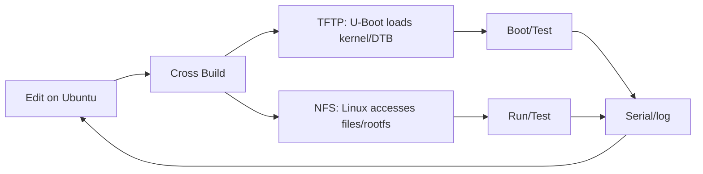

# Chapter 4 - Shorten the Development Cycle: TFTP and NFS

> Week 1 / Day 4 - 建立 BSP 开发最重要的快速试错闭环。

[← Part README](README.md) · [← Previous](ch03_imx6ull_console_network.md) · [Next →](ch05_zephyr_build_world.md)

## 4.1 为什么“每次烧 SD/eMMC”会毁掉驱动学习效率

后面改 DTS、Kernel、module 时，正常节奏应该是分钟级甚至秒级验证，而不是反复制作镜像。BSP 开发最先要构建的不是 Driver，而是**传输与启动闭环**。



## 4.2 TFTP 和 NFS 看起来都“传文件”，为什么必须分开理解

### TFTP：Bootloader 阶段的极简取文件机制

U-Boot 没有完整 Linux 用户空间，因此需要简单协议从 server 把 zImage/DTB 放入 RAM。TFTP 的价值是**不写 Flash 也能换启动产物**。

### NFS：Linux 已启动后的远程文件系统

Kernel 网络栈和 VFS 已经工作，NFS 可以把 Host 目录挂载为 Target 的文件系统。后面你编译一个测试程序，直接放 `~/nfs`，板上立即看到。

### SCP：只是 Linux 用户态拷文件

SCP 很方便，但它没有解决 U-Boot 阶段替换 Kernel/DTB，也不提供共享目录语义。

## 4.3 Worked Example：配置 TFTP Server

Ubuntu：

```bash
sudo systemctl status tftpd-hpa
sudo mkdir -p /srv/tftp
sudo chown -R $USER:$USER /srv/tftp
printf 'tftp-smoke-test\n' > /srv/tftp/smoke.txt
```

检查 `/etc/default/tftpd-hpa` 时，关键不是照抄文件，而是确认：

- service 监听哪个地址；
- `TFTP_DIRECTORY` 是否 `/srv/tftp`；
- 权限允许读取。

修改后：

```bash
sudo systemctl restart tftpd-hpa
sudo systemctl status tftpd-hpa
```

U-Boot 先看现有环境：

```text
printenv ipaddr
printenv serverip
printenv netmask
ping ${serverip}
```

然后**选择板上当前可用 RAM 地址**下载小文件，不要抄网上固定地址：

```text
tftp <safe_load_address> smoke.txt
```

看到 transferred bytes 才算 TFTP 链路闭环。

## 4.4 Worked Example：配置 NFS 共享

Ubuntu `/etc/exports` 示例：

```text
/home/<user>/nfs *(rw,sync,no_subtree_check,no_root_squash)
```

应用：

```bash
sudo exportfs -ra
sudo exportfs -v
sudo systemctl restart nfs-kernel-server
```

Target Linux：

```bash
mkdir -p /mnt/nfs
mount -t nfs -o nolock <vm-ip>:/home/<user>/nfs /mnt/nfs
mount | grep nfs
```

不同老 BSP 的 NFS client 可能只支持特定协议版本，若失败再尝试 `vers=3`，并用错误信息判断，不要一开始就塞一堆选项。

## 4.5 Guided Lab：从 Host 改一行代码到 Target 运行

把 Day 2 的 `hello.c` 放到课程目录：

```bash
arm-linux-gnueabihf-gcc -g -O0 hello.c -o ~/nfs/hello_arm
```

板端：

```bash
/mnt/nfs/hello_arm
```

如果提示动态加载器/库缺失：

```bash
readelf -l /mnt/nfs/hello_arm | grep interpreter
```

这时你已经遇到真实的 sysroot/runtime ABI 问题，而不是“程序没复制过去”。记录它，Week 3 会系统解释动态加载。

## 4.6 故障树：TFTP/NFS 不通时按层定位

```text
服务端进程是否运行？
    ↓ yes
VM IP 是否正确/与板互通？
    ↓ yes
端口/防火墙是否阻断？
    ↓ no
路径/权限是否正确？
    ↓ yes
协议版本/客户端能力是否匹配？
```

典型命令：

```bash
systemctl status tftpd-hpa nfs-kernel-server
ss -lunp | grep ':69'
exportfs -v
journalctl -u tftpd-hpa --since '10 min ago'
```

## 4.7 Independent Challenge：把“开发闭环”做成 5 分钟复现脚本/清单

不要自动修改网络，只写一个 `check_dev_loop.sh` 检查：

- `/srv/tftp` 存在；
- NFS export 存在；
- 服务 active；
- Host 当前 IP；
- Target 是否 ping 通（参数传入）。

目标是把“环境感觉没问题”变成可检查事实。

## 4.8 本章小结与下一章

现在 Linux 这条线已经具备：Host、交叉编译、串口、网络、快速文件通路。接下来并行建立第二条 RTOS 平台线。Day 5 不直接移植你的 F407，而先学 Zephyr 官方构建世界，避免把“Host 环境问题”和“自定义板问题”混在一起。

## References and manuals

### ALIENTEK TFTP & NFS Guide V1.3.1
- Local expected path: `../references/ALIENTEK_iMX6ULL_TFTP_NFS_Guide_V1.3.1.pdf`
- Online: [ALIENTEK TFTP & NFS Guide V1.3.1](https://github.com/alientek-openedv/imx6ull-document/blob/master/%E3%80%90%E6%AD%A3%E7%82%B9%E5%8E%9F%E5%AD%90%E3%80%91I.MX6U%E7%BD%91%E7%BB%9C%E7%8E%AF%E5%A2%83TFTP%26NFS%E6%90%AD%E5%BB%BA%E6%89%8B%E5%86%8CV1.3.1.pdf)
- 本章阅读定位：这是本章主手册。按目录阅读 TFTP server、U-Boot 网络参数、NFS server/mount；具体 IP/路径按你当前环境重写。

### ALIENTEK Linux Driver Guide V1.5.2
- Local expected path: `../references/ALIENTEK_iMX6ULL_Linux_Driver_Guide_V1.5.2.pdf`
- Online: [ALIENTEK Linux Driver Guide V1.5.2](https://github.com/alientek-openedv/imx6ull-document/blob/master/%E3%80%90%E6%AD%A3%E7%82%B9%E5%8E%9F%E5%AD%90%E3%80%91I.MX6U%E5%B5%8C%E5%85%A5%E5%BC%8FLinux%E9%A9%B1%E5%8A%A8%E5%BC%80%E5%8F%91%E6%8C%87%E5%8D%97V1.5.2.pdf)
- 本章阅读定位：只查网络启动/Kernel 与 DTB 更新相关章节，为 Week 2 RAM boot 做准备。

- [Unified source index](../common/source_index.md)

[← Part README](README.md) · [← Previous](ch03_imx6ull_console_network.md) · [Next →](ch05_zephyr_build_world.md)
