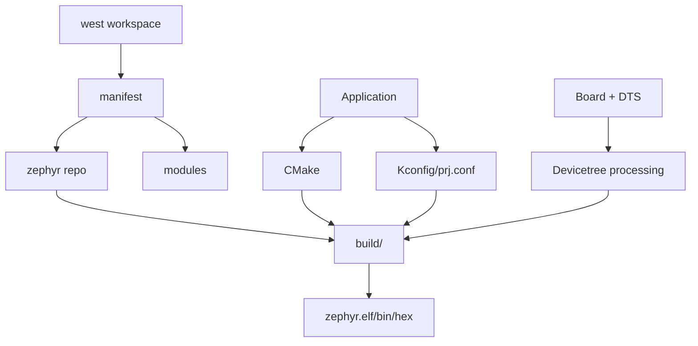

# Chapter 5 - Understand the Zephyr Build World: west, Kconfig and Devicetree

> Week 1 / Day 5 - 在碰自定义板之前，把 Zephyr 的构建对象分清。

[← Part README](README.md) · [← Previous](ch04_tftp_nfs_loop.md) · [Next →](ch06_f407_hardware_audit.md)

## 5.1 Zephyr 最大的门槛不是 RTOS API，而是“构建系统看起来不像 MCU IDE”

你已经理解 FreeRTOS task/queue，所以本课程不从 `k_thread_create()` 开始。Zephyr 真正需要补的是平台生态：workspace、west、CMake、Kconfig、Devicetree、board/SoC/driver 的组织关系。



## 5.2 先分清 5 个经常混在一起的对象

### workspace
包含 manifest project 和由 west 拉取的多个 repository，是多仓库工作空间。

### west
既是 workspace 管理器，也提供 `build/flash/debug` 等 extension command。不要把它理解成“Zephyr 的 make”。

### Zephyr SDK
提供交叉编译器、GDB、QEMU/工具等。它和 Zephyr source 是两套东西。

### Kconfig
决定**编译哪些软件能力、参数是什么**。

### Devicetree
描述**这块板有什么硬件、怎么连**。后面会专门比较 Linux DT 与 Zephyr DT。

## 5.3 Worked Example：建立隔离的 Python/West 环境

```bash
python3 -m venv ~/work/zephyr/.venv
source ~/work/zephyr/.venv/bin/activate
python -m pip install --upgrade pip
pip install west
west --version
```

然后按 Zephyr 官方 Getting Started 建立 workspace。为了课程可复现，建议 checkout 一个明确 release/tag（例如课程生成时的 4.4.x 稳定系列），不要长期跟 `main`。

典型流程：

```bash
west init ~/work/zephyr/ws
cd ~/work/zephyr/ws
west update
west zephyr-export
west packages pip --install
```

SDK 安装遵循当前官方文档。不要把旧博客里的 SDK 路径复制进 shell profile。

## 5.4 为什么第一块 target 必须是官方 `stm32f4_disco`

你的正点原子板不是 Zephyr upstream board。第一天就做 custom board，会同时暴露：

- Host Python/SDK 问题；
- board metadata 问题；
- DTS/clock/pin 问题；
- runner/debug probe 问题。

无法定位。

所以先：

```bash
cd ~/work/zephyr/ws/zephyr
west build -p always -b stm32f4_disco samples/hello_world
```

只要**编译成功**即可，不要求把 Discovery 镜像烧到你的正点原子板。

## 5.5 拆开 build 目录：编译成功以后真正应该看什么

```bash
find build/zephyr -maxdepth 2 -type f | sort | less
```

重点：

```text
zephyr.elf        最完整调试映像
zephyr.bin/hex    烧录形式
zephyr.dts        合并后的最终设备树
.config           最终 Kconfig 配置
include/generated 生成头文件
```

执行：

```bash
arm-zephyr-eabi-readelf -h build/zephyr/zephyr.elf
head -80 build/zephyr/zephyr.dts
head -80 build/zephyr/.config
```

把 Day 2 的 ELF 知识迁移过来：Zephyr 最终也是 ELF，只是它不是由 Linux kernel loader 启动，而是作为 MCU firmware 被 reset/startup 链拉起。

## 5.6 Kconfig 与 Devicetree 的最小分工实验

找 `.config`：

```bash
grep -E '^CONFIG_(SERIAL|CONSOLE|GPIO)=' build/zephyr/.config
```

找 DTS：

```bash
grep -n 'chosen\|console\|gpio' build/zephyr/zephyr.dts | head -30
```

形成一句准确的话：

> “有没有 UART0、地址/引脚是什么”属于 hardware description；“是否编译 serial console 功能”属于 software configuration。

它们最终共同决定系统能否输出 console。

## 5.7 故障实验：故意写错 board 名

```bash
west build -p always -b this_board_does_not_exist samples/hello_world
```

观察错误到底来自 C compiler 之前的哪一层。然后：

```bash
west boards | grep stm32f4
```

这训练你以后看到 `No board named ...` 时不去查 C 代码。

## 5.8 Independent Challenge：从 clean shell 复现 Zephyr build

关闭终端，新 shell：

1. 激活 venv；
2. `west topdir`；
3. `cd zephyr`；
4. clean build；
5. 找到 `zephyr.dts/.config/zephyr.elf`。

如果做不到，说明环境还依赖“当前 terminal 的偶然状态”。

## 5.9 下一章：工具链没问题了，现在才有资格碰真实 F407 板

Day 6 不写代码，先读你上传的原理图。因为 board port 的本质不是“复制一个 DTS”，而是把 PCB 上真实的 clock、UART、LED、KEY、SPI NOR 转写成 Zephyr board description。

## References and manuals

### Zephyr Getting Started

- Online: [Zephyr Getting Started](https://docs.zephyrproject.org/latest/develop/getting_started/index.html)
- 本章阅读定位：本章主资料：environment、west workspace、SDK、build sample。

### Zephyr west documentation

- Online: [Zephyr west documentation](https://docs.zephyrproject.org/latest/develop/west/index.html)
- 本章阅读定位：只理解 workspace/manifest/extensions 的职责。

### Zephyr Devicetree vs Kconfig

- Online: [Zephyr Devicetree vs Kconfig](https://docs.zephyrproject.org/latest/build/dts/dt-vs-kconfig.html)
- 本章阅读定位：重点建立“硬件事实 vs 软件选择”的边界。

- [Unified source index](../common/source_index.md)

[← Part README](README.md) · [← Previous](ch04_tftp_nfs_loop.md) · [Next →](ch06_f407_hardware_audit.md)
