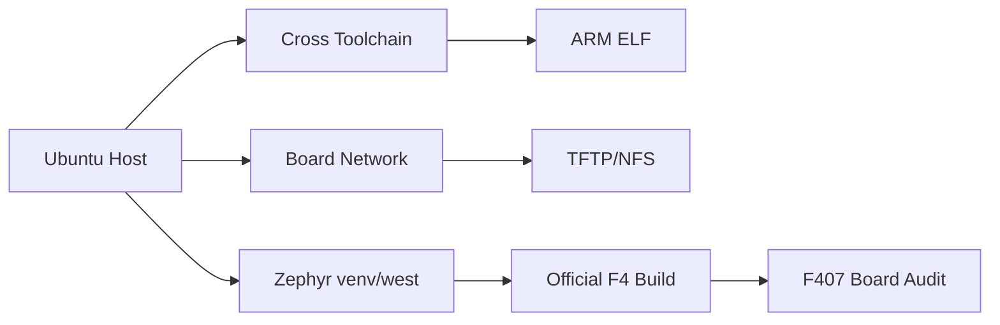

# Chapter 7 - Integration: Reproduce the Entire Week from a Clean State

> Week 1 / Day 7 - 用冷启动复现证明环境和知识真正归你所有。

[← Part README](README.md) · [← Previous](ch06_f407_hardware_audit.md)

## 7.1 这一章不是“复习”，而是做一次可复现性验收

工程里最危险的假成功是：当前 terminal 恰好有 PATH、某服务恰好启动、某文件恰好在目录里，于是“今天能跑”。真正的能力必须能从 clean state 恢复。

本章把 Week 1 的知识压成一条链：



## 7.2 Cold Start：关闭“历史状态”

至少做到：

1. 关闭所有 terminal；
2. 重新启动 VM（更好）；
3. 不翻聊天记录，只使用自己的 README/笔记；
4. 从 `~/work` 恢复各环境。

## 7.3 Linux Host 复现清单

```bash
uname -a
gcc --version | head -1
gdb-multiarch --version | head -1
ip -br addr
ip route
systemctl is-active ssh
systemctl is-active tftpd-hpa
systemctl is-active nfs-kernel-server
```

与 `host_baseline.txt` 对比。

## 7.4 Cross Build 复现

从空目录重新创建最小 hello：

```bash
gcc hello.c -o hello_x86
arm-linux-gnueabihf-gcc hello.c -o hello_arm
file hello_x86 hello_arm
readelf -h hello_arm | grep -E 'Machine|Entry'
```

你必须能在 2 分钟内说明两者差异来自 target ABI，而不是文件扩展名。

## 7.5 6ULL 控制面复现

### 串口

Reset -> 看到 U-Boot -> 停止 autoboot -> `printenv` -> 继续 boot -> Linux shell。

### 网络

```bash
ping <board-ip>
ssh root@<board-ip>
```

### TFTP/NFS

- U-Boot 下载 `smoke.txt`；
- Linux mount NFS；
- 执行 `/mnt/nfs/hello_arm`。

只有全部闭环，Week 2 的“自己编译和替换 kernel/dtb”才有意义。

## 7.6 Zephyr 环境复现

新 shell：

```bash
source ~/work/zephyr/.venv/bin/activate
cd ~/work/zephyr/ws
west topdir
cd zephyr
west build -p always -b stm32f4_disco samples/hello_world
```

检查：

```bash
test -f build/zephyr/zephyr.elf
test -f build/zephyr/zephyr.dts
test -f build/zephyr/.config
```

如果某一步依赖你手动 export 一个没记录的变量，立刻补回环境文档。

## 7.7 Board Audit 口述验收

不看原理图先说，然后再用原理图验证：

- MCU 型号；
- HSE/LSE；
- USART1 TX/RX pin；
- LED0/LED1 pin 与极性；
- W25Q128 挂在哪条 SPI；
- CH340G 的角色。

“先说再查”是 retrieval practice；错了不要遮掩，把错误写进 `week1_gaps.md`。

## 7.8 Week 1 Gate：满足这些条件才能进 Week 2

- [ ] VM Bridged 网络稳定；
- [ ] Host 工具版本有基线；
- [ ] ARM cross toolchain 可用；
- [ ] 6ULL 串口从 U-Boot 到 Linux 可观察；
- [ ] VM ↔ 6ULL 双向网络可用；
- [ ] TFTP/NFS 都已实际成功一次；
- [ ] Zephyr 官方 F4 sample clean build 成功；
- [ ] F407 board audit 有原理图证据。

## 7.9 Part I 结语：下周从“使用别人做好的系统”走向“掌控 BSP 产物”

Week 1 解决的是开发基础设施。Week 2 开始进入真正的 BSP：你会先把 6ULL 的源码、defconfig、zImage、vmlinux、DTB、rootfs 关系画出来，然后独立编译、通过 TFTP 在 RAM 中替换 Kernel/DTB；Zephyr 侧则把本周的板级事实正式写成 out-of-tree board。

## References and manuals

### ALIENTEK manuals index

- Online: [ALIENTEK manuals index](https://github.com/alientek-openedv/imx6ull-document)
- 本章阅读定位：用仓库 README 核对：Linux Driver、Linux C、TFTP/NFS 各自对应哪本手册。

### Unified source index


- 本章阅读定位：回查本课程所有资料 ID 和本地命名约定。

- [Unified source index](../common/source_index.md)

[← Part README](README.md) · [← Previous](ch06_f407_hardware_audit.md)
