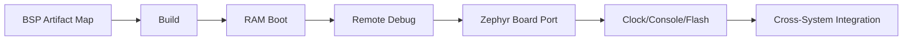

# Part II - Own the BSP and the Board

> Week 2 的核心问题：**怎样从“能使用厂商系统”升级为“知道每个产物从哪里来、能自己构建/替换/调试”？**

知识链：

## Reading order

- [Chapter 8 - What Exactly Is a BSP?](ch08_bsp_artifact_map.md) - 源码/配置/产物地图
- [Chapter 9 - Build the Boot Chain Yourself](ch09_build_uboot_kernel_dtb.md) - 独立构建 U-Boot/Kernel/DTB
- [Chapter 10 - Boot Without Flashing](ch10_tftp_ram_boot.md) - TFTP RAM boot 与证据链
- [Chapter 11 - Debug Across Architectures](ch11_remote_gdb.md) - gdbserver/gdb-multiarch
- [Chapter 12 - Build a Zephyr Board from Scratch](ch12_zephyr_out_of_tree_board.md) - out-of-tree board
- [Chapter 13 - Bring the STM32F407 Board Alive](ch13_f407_clock_console_flash.md) - clock/console/flash
- [Chapter 14 - Integration](ch14_week2_integration.md) - clean build + DT 对照

## Week 2 final capability

能够独立定位 6ULL BSP 源码/配置/产物，生成并通过 TFTP RAM boot 自己的 Kernel/DTB，用 GDB 远程调试 ARM 用户程序；Zephyr 侧创建并 bring-up 正点原子 STM32F407ZET6 自定义 board。

## Manuals and primary references

- [ALIENTEK Linux Driver Guide V1.5.2](https://github.com/alientek-openedv/imx6ull-document/blob/master/%E3%80%90%E6%AD%A3%E7%82%B9%E5%8E%9F%E5%AD%90%E3%80%91I.MX6U%E5%B5%8C%E5%85%A5%E5%BC%8FLinux%E9%A9%B1%E5%8A%A8%E5%BC%80%E5%8F%91%E6%8C%87%E5%8D%97V1.5.2.pdf)
- [ALIENTEK TFTP & NFS Guide V1.3.1](https://github.com/alientek-openedv/imx6ull-document/blob/master/%E3%80%90%E6%AD%A3%E7%82%B9%E5%8E%9F%E5%AD%90%E3%80%91I.MX6U%E7%BD%91%E7%BB%9C%E7%8E%AF%E5%A2%83TFTP%26NFS%E6%90%AD%E5%BB%BA%E6%89%8B%E5%86%8CV1.3.1.pdf)
- [ALIENTEK Linux C Application Guide V1.1](https://github.com/alientek-openedv/imx6ull-document/blob/master/%E3%80%90%E6%AD%A3%E7%82%B9%E5%8E%9F%E5%AD%90%E3%80%91I.MX6U%E5%B5%8C%E5%85%A5%E5%BC%8FLinux%20C%E5%BA%94%E7%94%A8%E7%BC%96%E7%A8%8B%E6%8C%87%E5%8D%97V1.1.pdf)
- [Local STM32F4 Explorer schematic](../references/ALIENTEK_Explorer_STM32F4_V2.2_Schematic.pdf)
- [Zephyr Board Porting](https://docs.zephyrproject.org/latest/hardware/porting/board_porting.html)
- [Unified source index](../common/source_index.md)

## Manual reading map

| Manual | Local expected filename | Online | This Part uses |
|---|---|---|---|
| I.MX6U Linux Driver Guide V1.5.2 | `ALIENTEK_iMX6ULL_Linux_Driver_Guide_V1.5.2.pdf` | [Open PDF page](https://github.com/alientek-openedv/imx6ull-document/blob/master/%E3%80%90%E6%AD%A3%E7%82%B9%E5%8E%9F%E5%AD%90%E3%80%91I.MX6U%E5%B5%8C%E5%85%A5%E5%BC%8FLinux%E9%A9%B1%E5%8A%A8%E5%BC%80%E5%8F%91%E6%8C%87%E5%8D%97V1.5.2.pdf) | Ch08-10: BSP/U-Boot/Kernel/DTB；公开资料可定位 Ch33 U-Boot |
| I.MX6U Quick Start V1.8 | `ALIENTEK_iMX6ULL_Quick_Start_V1.8.pdf` | [Open archive](https://github.com/alientek-openedv/imx6ull-document) | Chapter 4: cross compile; 4.3 U-Boot; 4.4 kernel/modules |
| I.MX6U TFTP & NFS Guide V1.3.1 | `ALIENTEK_iMX6ULL_TFTP_NFS_Guide_V1.3.1.pdf` | [Open archive](https://github.com/alientek-openedv/imx6ull-document) | Ch10: RAM boot transfer |
| Explorer STM32F4 V2.2 Schematic | packaged | [Local PDF](../references/ALIENTEK_Explorer_STM32F4_V2.2_Schematic.pdf) | Ch12-13: F407 board port / clock / USART1 |

