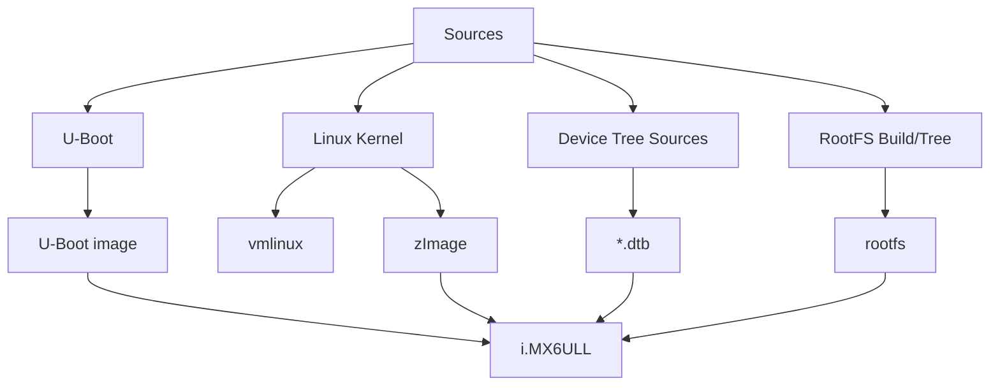

# Chapter 8 - What Exactly Is a BSP? Map Source Code to Boot Artifacts

> Week 2 / Day 1 - 把“资料盘”拆成源码、配置、构建产物和运行阶段。

[← Part README](README.md) · [Next →](ch09_build_uboot_kernel_dtb.md)

## 8.1 BSP 不是一个目录名，而是“让某块板启动并可使用的最小软件集合”

Week 1 你使用的是已经能启动的 6ULL。现在反过来问：**这个系统到底由哪些源代码和产物拼出来？**

费曼模型：BSP 就像一套“让通用 Linux 适配到这块具体 PCB 的施工图和零件包”。Kernel 本身是通用建筑材料，BSP 负责 bootloader、board config、DT、驱动、rootfs 配置等板级连接。



## 8.2 先用 `file/find/git` 认识你手里的 BSP，而不是先背正点原子目录

不同资料盘版本目录名可能不同。今天的原则是：**通过特征找组件，不依赖教程作者的绝对路径。**

在 BSP 根目录：

```bash
find . -maxdepth 3 -type d \( -name 'u-boot*' -o -name 'linux*' -o -name '*kernel*' -o -name '*rootfs*' \) | sort
find . -type f \( -name '*defconfig' -o -name '*.dts' -o -name '*.dtsi' \) | head -100
```

然后分别进入 U-Boot/Kernel 仓库：

```bash
git status
git log -1 --oneline
make help | head -80
```

记录真实版本，而不是写“我用的是正点原子的 Linux”。

## 8.3 U-Boot 源码与产物：它解决的是 Kernel 之前的问题

找：

- board/vendor 目录；
- i.MX6ULL 对应 defconfig；
- device tree（若该 U-Boot 版本使用）；
- 最终 `u-boot`, `u-boot.bin`, SPL/`u-boot.imx` 等具体产物。

不要假定产物名。用：

```bash
find . -maxdepth 2 -type f -name 'u-boot*' -printf '%p\t%s bytes\n' | sort
file u-boot* 2>/dev/null
```

### 为什么 U-Boot ELF 和烧写镜像可能不是同一个文件

`u-boot` 往往是带符号的 ELF，适合调试/分析；烧写介质需要带 SoC boot header/特定布局的镜像。这个区别和 `vmlinux` vs `zImage` 类似：**“信息最完整的链接产物”不等于“最终启动介质格式”。**

## 8.4 Kernel：vmlinux、zImage、modules、DTB 各自是什么

### `vmlinux`

未压缩、可带完整符号的 ELF。以后 `addr2line`、GDB、Oops 符号定位都靠它。

### `zImage`

ARM 传统自解压/压缩启动镜像之一，适合由 U-Boot 加载启动。

### `*.ko`

可动态装载 Kernel module，不和 zImage 等价。

### `*.dtb`

由 `.dts/.dtsi` 编译出的 Flat Device Tree，描述硬件。

实验：

```bash
file arch/arm/boot/zImage
file vmlinux
readelf -h vmlinux | head -30
find arch/arm/boot/dts -name '*.dtb' | head
```

## 8.5 RootFS：Kernel 成功不等于系统能进 shell

启动日志常见分界：

```text
Kernel 解压/启动成功
   ↓
初始化 driver/subsystem
   ↓
mount root filesystem
   ↓
exec /sbin/init
   ↓
userspace services / shell
```

所以 Kernel panic “No working init found” 和“U-Boot 加载 Kernel 失败”是两类问题。BSP 工程师必须快速判断层级。

## 8.6 Guided Lab：建立 `6ull_artifact_map.md`

必须填写真实路径，不允许照抄：

| Layer | Source path | Config | Build command | Output | Runtime role |
|---|---|---|---|---|---|
| U-Boot | | | | | |
| Kernel | | | | `vmlinux/zImage` | |
| DT | | | | `*.dtb` | |
| RootFS | | | | | |
| Toolchain | | | | | |

再加一列 `How to verify`：比如 `file`, `git log`, `strings`, boot log。

## 8.7 Independent Challenge：从板子反查回源码

板上：

```bash
uname -a
cat /proc/cmdline
cat /proc/device-tree/model 2>/dev/null; echo
```

U-Boot：`version`, `printenv`。

尝试把运行时信息映射回 `artifact_map`：Kernel version 与哪个 source commit/配置对应？当前 DTB 是哪个 board variant？如果无法证明，写“unknown”并列出下一步如何证明。

## 8.8 下一章：知道零件在哪里后，必须亲手制造一次

Chapter 9 不再使用现成产物。你会清理构建目录，明确 ARCH/CROSS_COMPILE/defconfig，然后自己生成 U-Boot、vmlinux、zImage 和 DTB。只有这样，后面“我改的 DTS 为什么没生效”才有确定答案。

## References and manuals

### ALIENTEK Linux Driver Guide V1.5.2
- Local expected path: `../references/ALIENTEK_iMX6ULL_Linux_Driver_Guide_V1.5.2.pdf`
- Online: [ALIENTEK Linux Driver Guide V1.5.2](https://github.com/alientek-openedv/imx6ull-document/blob/master/%E3%80%90%E6%AD%A3%E7%82%B9%E5%8E%9F%E5%AD%90%E3%80%91I.MX6U%E5%B5%8C%E5%85%A5%E5%BC%8FLinux%E9%A9%B1%E5%8A%A8%E5%BC%80%E5%8F%91%E6%8C%87%E5%8D%97V1.5.2.pdf)
- 本章阅读定位：本章主手册：看开发环境、U-Boot 移植、Kernel 移植、设备树相关目录；重点是把手册路径映射到你手头实际 BSP。

### ALIENTEK Quick Start V1.8
- Local expected path: `../references/ALIENTEK_iMX6ULL_Quick_Start_V1.8.pdf`
- Online: [ALIENTEK Quick Start V1.8](https://github.com/alientek-openedv/imx6ull-document/blob/master/%E3%80%90%E6%AD%A3%E7%82%B9%E5%8E%9F%E5%AD%90%E3%80%91I.MX6U%E7%94%A8%E6%88%B7%E5%BF%AB%E9%80%9F%E4%BD%93%E9%AA%8CV1.8.pdf)
- 本章阅读定位：查运行系统版本、启动方式和板卡型号，辅助 runtime -> source 反查。

- [Unified source index](../common/source_index.md)

[← Part README](README.md) · [Next →](ch09_build_uboot_kernel_dtb.md)
