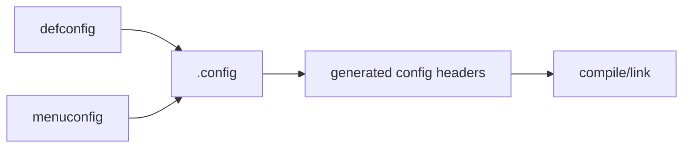

# Chapter 9 - Build the Boot Chain Yourself: U-Boot, Kernel and DTB

> Week 2 / Day 2 - 第一次独立生成并保存可调试 BSP 产物。

[← Part README](README.md) · [← Previous](ch08_bsp_artifact_map.md) · [Next →](ch10_tftp_ram_boot.md)

## 9.1 构建的目标不是“make 成功”，而是建立输入 -> 输出的因果关系

BSP 构建最容易出现的假会：记住一串命令，但不知道 `defconfig`、环境变量和产物为什么这样组织。今天每执行一条命令，都要回答它改变了什么。

## 9.2 先固定三个变量：ARCH、CROSS_COMPILE、O（可选）

典型 ARM 32-bit：

```bash
export ARCH=arm
export CROSS_COMPILE=<your-toolchain-prefix>
```

`CROSS_COMPILE` 是**前缀**，通常以 `-` 结尾，不是 gcc 可执行文件完整路径。验证：

```bash
${CROSS_COMPILE}gcc -dumpmachine
${CROSS_COMPILE}gcc --version | head -1
```

如果使用 out-of-tree build：

```text
Source tree -> make O=../build-imx6ull -> Build tree
```

这是好习惯，但旧 vendor BSP 若脚本强依赖 in-tree，先遵循其已验证方式，之后再整理。

## 9.3 Worked Example A：独立构建 U-Boot

原则步骤：

```bash
make distclean
make <board_defconfig>
make -j$(nproc)
```

`<board_defconfig>` 必须从你 Week 2 Chapter 8 的 artifact map 确认。

### 观察，而不是只看最后一行

```bash
grep -E '^CONFIG_(ARCH|TARGET|SYS_)' .config | head -50
file u-boot
${CROSS_COMPILE}readelf -h u-boot | head
find . -maxdepth 2 -type f -name 'u-boot*' -printf '%p %s\n' | sort
```

记录：耗时、commit、defconfig、toolchain version、最终烧写/启动产物。

## 9.4 Worked Example B：Kernel 配置与构建

```bash
make mrproper
make <imx6ull_defconfig>
make -j$(nproc) zImage dtbs modules
```

再次强调 defconfig 以配套 BSP/手册为准。

观察：

```bash
ls -lh vmlinux arch/arm/boot/zImage
find arch/arm/boot/dts -name '*.dtb' -printf '%p %s\n' | sort | tail -30
file vmlinux arch/arm/boot/zImage
```

## 9.5 `defconfig -> .config -> build`：为什么 menuconfig 改动会“消失”



`defconfig` 是一个可保存的基线；`.config` 是当前构建树的最终配置。`make mrproper` 会清掉 `.config`，所以你临时 menuconfig 的变化如果没保存进 defconfig/fragment，下次可能丢失。

实验：

```bash
cp .config /tmp/config.before
make menuconfig
cp .config /tmp/config.after
diff -u /tmp/config.before /tmp/config.after | less
```

只改一个无风险选项，观察差异，不必马上刷板。

## 9.6 为什么 `vmlinux` 对后面调试比 zImage 更重要

`zImage` 用来启动；`vmlinux` 保存 ELF sections/symbol/debug info（取决于 config）。Week 4 Oops 里：

```text
PC/LR address -> vmlinux symbol -> source line
```

如果你每次编译完只复制 zImage、把对应 vmlinux 扔掉，后面 crash dump 很难和二进制精确匹配。

所以建立 build archive：

```text
artifacts/<date>-<gitsha>/
  zImage
  vmlinux
  System.map
  board.dtb
  .config
  build_info.txt
```

## 9.7 Guided Lab：在 DT 中做一个“可观察但不破坏硬件”的变更

选板级 root/model 或一个自定义 harmless property；不要一开始禁用 console/ethernet。修改后：

```bash
make -j$(nproc) dtbs
```

用：

```bash
dtc -I dtb -O dts <new.dtb> | grep -n '<your-marker>'
```

先在 Host 证明 DTB 包含改动，明天再 TFTP boot。这样如果板上看不到变化，你知道问题在“部署/选择 DTB”，不是“编译没生效”。

## 9.8 Independent Challenge：回答“为什么 clean build 很慢但有时必须做”

从依赖图角度解释增量构建如何工作，列出至少三个需要 clean/mrproper 的场景，以及两个不应该随手 clean 的场景。目标是避免“编译不对就 make clean”的迷信。

## 9.9 下一章：产物已经属于你，现在要证明板子运行的也是它

Chapter 10 使用 TFTP 把你刚生成的 zImage/DTB 放入 RAM 启动，不烧写。你会用一个 DT marker 和 boot log 建立“source -> artifact -> running board”的证据链。

## References and manuals

### ALIENTEK Linux Driver Guide V1.5.2
- Local expected path: `../references/ALIENTEK_iMX6ULL_Linux_Driver_Guide_V1.5.2.pdf`
- Online: [ALIENTEK Linux Driver Guide V1.5.2](https://github.com/alientek-openedv/imx6ull-document/blob/master/%E3%80%90%E6%AD%A3%E7%82%B9%E5%8E%9F%E5%AD%90%E3%80%91I.MX6U%E5%B5%8C%E5%85%A5%E5%BC%8FLinux%E9%A9%B1%E5%8A%A8%E5%BC%80%E5%8F%91%E6%8C%87%E5%8D%97V1.5.2.pdf)
- 本章阅读定位：重点看 U-Boot 移植/编译、Linux Kernel 移植/编译、设备树编译章节；命令中的具体 defconfig 以你的板型版本为准。

### Linux Kernel Kbuild
- Online: [Linux Kernel Kbuild](https://docs.kernel.org/kbuild/index.html)
- 本章阅读定位：用于理解 .config/Kbuild/目标产物关系，不需要通读。

- [Unified source index](../common/source_index.md)

[← Part README](README.md) · [← Previous](ch08_bsp_artifact_map.md) · [Next →](ch10_tftp_ram_boot.md)
