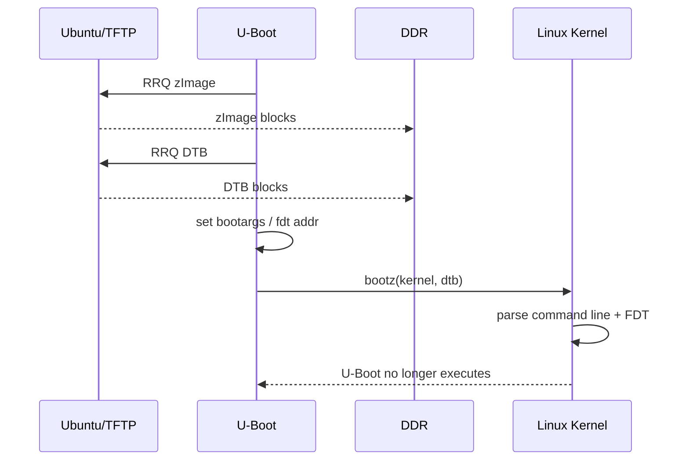

# Chapter 10 - Boot Without Flashing: Load Kernel and DTB into RAM with TFTP

> Week 2 / Day 3 - 建立 source -> artifact -> running target 的证据链。

[← Part README](README.md) · [← Previous](ch09_build_uboot_kernel_dtb.md) · [Next →](ch11_remote_gdb.md)

## 10.1 为什么 RAM Boot 是 BSP 工程师的高频基本功

你已经有“能烧进去启动”的系统，但驱动/DT 调试阶段最高效的模式是：

```text
edit -> build -> TFTP to RAM -> boot -> observe -> reset
```

不写 eMMC/SD 有两个好处：快；失败后 reset 回原系统，不容易把启动介质搞坏。

## 10.2 U-Boot 启动 Linux 至少需要哪几个对象

ARM 6ULL 常见：

```text
zImage address
DTB address
bootargs
   ↓
bootz <kernel> - <fdt>
```

RootFS 可以继续用原介质，也可以 NFS root。今天先不动 rootfs，减少变量。

**地址绝不从教程硬抄。**先：

```text
printenv
bdinfo
```

记录厂商默认 kernel/DTB load address 或选择确认不冲突的 RAM 区域。

## 10.3 Worked Example：先把“网络参数”变成显式变量

U-Boot：

```text
setenv ipaddr <board-ip>
setenv serverip <vm-ip>
ping ${serverip}
```

如果你的板子需要 `ethaddr`、gateway、netmask，也先检查已有值，不随意覆盖永久 MAC。

Host 将本章产物放到 `/srv/tftp/`：

```bash
cp arch/arm/boot/zImage /srv/tftp/zImage-course
cp arch/arm/boot/dts/<board>.dtb /srv/tftp/board-course.dtb
sha256sum /srv/tftp/zImage-course /srv/tftp/board-course.dtb
```

## 10.4 第一次只下载，不启动

```text
tftp ${loadaddr} zImage-course
tftp <fdt_addr> board-course.dtb
```

每次记录 U-Boot 输出的文件大小。你可以对照 Host `stat`，确认传输对象正确。

然后用 U-Boot FDT 命令（若启用）：

```text
fdt addr <fdt_addr>
fdt print / model
```

如果 Chapter 9 加了 marker，在这里先确认。**这一步能把错误定位在 bootz 之前。**

## 10.5 UML：从 TFTP 到 Kernel 接管 UART 的时序



最后一行很重要：一旦跳进 Kernel，U-Boot 不在后台“继续管理 Linux”。

## 10.6 Guided Lab：用 DT marker 证明当前运行的是新 DTB

启动后：

```bash
tr -d '\0' </proc/device-tree/model; echo
cat /proc/cmdline
```

若 marker 是自定义 property：

```bash
find /proc/device-tree -maxdepth 2 -type f | grep <keyword>
```

记录 boot log 中 Kernel build/version 与你的 artifact archive。

证据链：

```text
source change
 -> dtc decompile sees marker
 -> U-Boot fdt print sees marker
 -> Linux /proc/device-tree sees marker
```

这条链以后排查“DTS 改了没生效”非常值钱。

## 10.7 故障实验 A：故意加载错误 DTB 文件名

观察 TFTP 的报错发生在：网络层、server path，还是 boot 阶段？恢复正确文件。

## 10.8 故障实验 B：故意使用旧 DTB

Kernel 仍能启动但 marker 不见。这个实验说明：**“系统能起来”不能证明使用了你刚编译的 DTB。**

## 10.9 Independent Challenge：把手工命令整理成临时 U-Boot script，但暂不 `saveenv`

用 `setenv courseboot '...'` 组合 tftp + bootz，执行验证。课程前期不立即 `saveenv`，避免把调试参数永久写坏；当你能解释所有变量后再决定持久化。

## 10.10 下一章：能快速替换系统后，调试也不能只靠 printf

Chapter 11 从用户态开始做 remote GDB。先在风险最低的 Linux process 上练 Host/Target symbol、断点、栈、寄存器，再逐步进入 Kernel debug。

## References and manuals

### ALIENTEK TFTP & NFS Guide V1.3.1
- Local expected path: `../references/ALIENTEK_iMX6ULL_TFTP_NFS_Guide_V1.3.1.pdf`
- Online: [ALIENTEK TFTP & NFS Guide V1.3.1](https://github.com/alientek-openedv/imx6ull-document/blob/master/%E3%80%90%E6%AD%A3%E7%82%B9%E5%8E%9F%E5%AD%90%E3%80%91I.MX6U%E7%BD%91%E7%BB%9C%E7%8E%AF%E5%A2%83TFTP%26NFS%E6%90%AD%E5%BB%BA%E6%89%8B%E5%86%8CV1.3.1.pdf)
- 本章阅读定位：重点看 U-Boot 下 serverip/ipaddr/tftp 使用与网络拓扑。

### ALIENTEK Linux Driver Guide V1.5.2
- Local expected path: `../references/ALIENTEK_iMX6ULL_Linux_Driver_Guide_V1.5.2.pdf`
- Online: [ALIENTEK Linux Driver Guide V1.5.2](https://github.com/alientek-openedv/imx6ull-document/blob/master/%E3%80%90%E6%AD%A3%E7%82%B9%E5%8E%9F%E5%AD%90%E3%80%91I.MX6U%E5%B5%8C%E5%85%A5%E5%BC%8FLinux%E9%A9%B1%E5%8A%A8%E5%BC%80%E5%8F%91%E6%8C%87%E5%8D%97V1.5.2.pdf)
- 本章阅读定位：查 Kernel/DTB 网络启动、bootz/bootargs 相关章节；地址只采用你当前 BSP 的实际值。

- [Unified source index](../common/source_index.md)

[← Part README](README.md) · [← Previous](ch09_build_uboot_kernel_dtb.md) · [Next →](ch11_remote_gdb.md)
