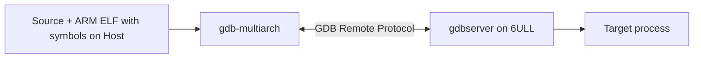

# Chapter 11 - Debug Across Architectures: gdb-multiarch and gdbserver

> Week 2 / Day 4 - 把“打印日志”升级为源码/栈/寄存器级远程调试。

[← Part README](README.md) · [← Previous](ch10_tftp_ram_boot.md) · [Next →](ch12_zephyr_out_of_tree_board.md)

## 11.1 Remote GDB 的本质：代码和符号在 Host，进程执行在 Target

嵌入式调试最常见的误区是“板上也得装完整 GDB 和源码”。实际上 gdbserver 可以非常薄：



Host 负责解释 source/symbol，Target 负责控制真实 ARM process。

## 11.2 为什么必须用与 Target 完全一致的 ELF

GDB 的断点行号和符号地址来自 Host ELF。如果你板上运行的是 A，Host 打开的是 B，即使函数名字相同，地址也可能不同。

建立最小纪律：

```bash
sha256sum hello_debug
```

Host 和 NFS/Target 同一文件，或至少保存同一 build ID/commit。

## 11.3 Worked Example：编译可调试程序

```bash
arm-linux-gnueabihf-gcc -g3 -O0 -fno-omit-frame-pointer demo.c -o demo_arm
file demo_arm
readelf -S demo_arm | grep debug
```

今天故意 `-O0`，因为优化会让变量消失、代码重排；Week 后期再学习 optimized code debug。

## 11.4 Target 启动 gdbserver

若 rootfs 自带：

```bash
gdbserver 0.0.0.0:2345 /mnt/nfs/demo_arm
```

如果没有 gdbserver，优先从 BSP/toolchain 对应包补齐，不随便拿另一个发行版二进制。

Host：

```bash
gdb-multiarch ./demo_arm
(gdb) set architecture arm
(gdb) target remote <board-ip>:2345
(gdb) break main
(gdb) continue
```

## 11.5 断点不是目的：练 5 个真正有用的动作

```text
bt                 当前调用栈
frame N            切换 stack frame
info registers     CPU register
x/16wx ADDRESS     观察内存
 disassemble /m    source + instruction
```

对你这种底层工程师，GDB 的价值是把 C、assembly、register 和 memory 连到一起。

## 11.6 Guided Lab：观察函数参数如何落到 ARM 调用约定

写函数：

```c
int sum4(int a, int b, int c, int d) { return a+b+c+d; }
```

在 `sum4` 入口断点，观察 ARM 32-bit ABI 常见参数寄存器。不要只背 r0-r3，结合反汇编验证编译器实际生成。

然后单步到 return，观察返回值。

## 11.7 shared library 找不到源码/符号时发生了什么

`info sharedlibrary`。如果 Host sysroot 与 Target 不一致，GDB 可能无法正确加载 libc symbols。可以用：

```gdb
set sysroot /path/to/target/sysroot
set solib-search-path /path/to/target/lib:/path/to/target/usr/lib
```

这正好把 Chapter 2 的 sysroot 从“名词”变成调试需求。

## 11.8 故障实验：Host 换成一个重新编译后的不同 ELF

保持 Target process 旧版，Host 打开新版 ELF，观察 breakpoint/symbol 的异常。立刻恢复。

这会建立一个重要纪律：**调试结果必须绑定 build artifact。**

## 11.9 Independent Challenge：保存一次完整 session

输出 `gdb_remote_session.txt`，至少包含：

- Target command；
- Host ELF hash；
- breakpoint；
- `bt`；
- registers；
- 一段 disassembly；
- 你如何确认源/二进制匹配。

## 11.10 下一章：Linux 侧已经能自己构建和远程调试，Zephyr 侧开始真正创建“你的板”

Chapter 12 用 Week 1 的 board audit 创建 out-of-tree board。这里会第一次系统解释：SoC support、board DTS、defconfig、Kconfig、runner 分别负责什么。

## References and manuals

### ALIENTEK Linux C Application Guide V1.1
- Local expected path: `../references/ALIENTEK_iMX6ULL_Linux_C_Application_Guide_V1.1.pdf`
- Online: [ALIENTEK Linux C Application Guide V1.1](https://github.com/alientek-openedv/imx6ull-document/blob/master/%E3%80%90%E6%AD%A3%E7%82%B9%E5%8E%9F%E5%AD%90%E3%80%91I.MX6U%E5%B5%8C%E5%85%A5%E5%BC%8FLinux%20C%E5%BA%94%E7%94%A8%E7%BC%96%E7%A8%8B%E6%8C%87%E5%8D%97V1.1.pdf)
- 本章阅读定位：查 GDB/交叉调试/程序编译相关章节；若手册没有 remote gdb 细节，以 GNU GDB 官方文档为准。

### GDB Remote Debugging
- Online: [GDB Remote Debugging](https://sourceware.org/gdb/current/onlinedocs/gdb.html/Remote-Debugging.html)
- 本章阅读定位：重点看 target remote、gdbserver、sysroot/remote file 的基本模型。

- [Unified source index](../common/source_index.md)

[← Part README](README.md) · [← Previous](ch10_tftp_ram_boot.md) · [Next →](ch12_zephyr_out_of_tree_board.md)
