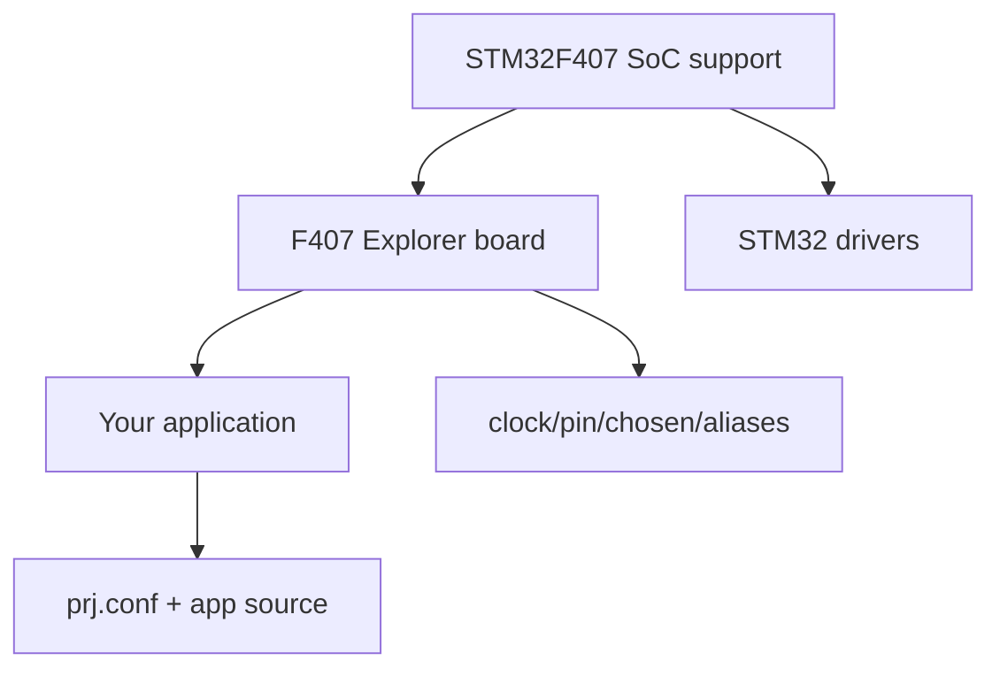

# Chapter 12 - Build a Zephyr Board from Scratch: Out-of-Tree Board Architecture

> Week 2 / Day 5 - 把原理图事实转成 Zephyr 可识别的 board，而不是复制 Discovery。

[← Part README](README.md) · [← Previous](ch11_remote_gdb.md) · [Next →](ch13_f407_clock_console_flash.md)

## 12.1 Custom Board Port 的边界：不要把 SoC driver 重新写一遍

Week 1 已确认 MCU 是 STM32F407ZET6。Zephyr upstream 已经有 STM32F4 SoC 系列支持。你的任务不是重写 RCC/GPIO/UART driver，而是创建板级描述让已有 subsystem 知道：

```text
这块板选哪个 SoC
晶振是什么
console 用哪个 UART
LED/KEY 在哪些 pin
如何 flash/debug
默认启用哪些最小功能
```

## 12.2 Out-of-tree 的价值：你的产品板不应该塞进 Zephyr 源码仓库

目标结构示意：

```text
my-zephyr-platform/
├── boards/
│   └── alientek/
│       └── f407_explorer/
│           ├── board.yml
│           ├── f407_explorer.dts
│           ├── f407_explorer_defconfig
│           ├── Kconfig.defconfig
│           └── board.cmake   # 仅在 runner/特殊板级需要时
└── app/
    └── hello/
```

具体文件名/metadata schema 必须以你安装的 Zephyr 版本的 Hardware Model v2 官方 board porting 文档为准；不要拿旧 Zephyr 3.x 教程生搬硬套。

## 12.3 SoC、Board、Application 三层的职责



- SoC：CPU/interrupt controller/peripheral IP/clock controller 能力；
- Board：这块 PCB 实际连接；
- App：本产品要开启的软件功能与业务。

如果 UART pin 是 PCB 事实，却写进 application C 常量，你就在破坏这个分层。

## 12.4 Worked Example：从 `stm32f4_disco` 只借“结构”，不借 pin

先定位 upstream board：

```bash
west boards | grep stm32f4
find boards -path '*stm32f4*' -maxdepth 5 -type f | sort
```

阅读它的：

- board metadata；
- DTS；
- defconfig；
- pinctrl include；
- aliases/chosen。

然后列出“可复用”与“不可复制”：

| 项目 | 能否借鉴 | 原因 |
|---|---|---|
| STM32F4 SoC DTSI 组织 | 是 | 同系列 SoC support |
| LED pin | 否 | PCB 不同 |
| console UART | 否 | PCB 路由不同 |
| HSE frequency | 必须核对 | board oscillator 不同风险 |
| runner 模式 | 可参考 | 取决于 probe |

## 12.5 创建最小 board：第一目标只是让 `west boards` 认识它

此阶段**先不加 LED/W25Q**。按当前官方文档创建 board metadata 和最小 DTS/defconfig。

构建时通过 out-of-tree board root（具体参数以当前版本为准，例如 `--board-root` 或 workspace/module 方式）让 CMake 找到它。

验收顺序：

1. `west boards` 能列出 target；
2. `hello_world` 能进入 configure；
3. Devicetree/Kconfig 无错误；
4. 生成 `zephyr.elf`。

只有 Host build 通过，才开始上板。

## 12.6 DTS 第一版只表达“启动必须有的事实”

最小目标：

- model/compatible；
- SoC include；
- memory；
- clocks；
- chosen console；
- console UART status/pinctrl。

LED/KEY/W25Q 留后。一次只引入一个变量，board bring-up 才能定位。

## 12.7 故障实验：故意让 board metadata 名称与 build target 不一致

观察错误发生在 CMake board discovery，而不是 compiler。恢复后，再故意把 DTS node label 写错，观察 Devicetree 阶段的报错。

把两类错误记录成：

```text
Board discovery error
Devicetree generation error
Kconfig error
C compile error
Link error
```

以后 Zephyr 构建失败，先判断阶段。

## 12.8 Independent Challenge：画出你自己的 Board Port dependency graph

必须从 `f407_explorer.dts` 画到 STM32 SoC DTSI、pinctrl、binding、driver，写出“我没有重新实现什么”。

## 12.9 下一章：Board 已能进入编译链，下一步才是让真实硬件说出第一句话

Chapter 13 聚焦 HSE/PLL、pinctrl、USART1 console、debug probe 和 flashing。LED/KEY 仍然不抢跑，因为第一条可靠输出链比任何外设 demo 都重要。

## References and manuals

### STM32F407 Explorer V2.2 Schematic
- Local expected path: `../references/ALIENTEK_Explorer_STM32F4_V2.2_Schematic.pdf`
- 本章阅读定位：回看 p.2 的 MCU/HSE/LSE/USART1，只使用已验证板级事实。

### Zephyr Board Porting Guide
- Online: [Zephyr Board Porting Guide](https://docs.zephyrproject.org/latest/hardware/porting/board_porting.html)
- 本章阅读定位：本章主资料：当前 hardware model、board metadata、DTS/Kconfig/runner 结构。

### Zephyr Devicetree
- Online: [Zephyr Devicetree](https://docs.zephyrproject.org/latest/build/dts/index.html)
- 本章阅读定位：只看 board DTS 如何继承 SoC 与 overlay/include。

- [Unified source index](../common/source_index.md)

[← Part README](README.md) · [← Previous](ch11_remote_gdb.md) · [Next →](ch13_f407_clock_console_flash.md)
