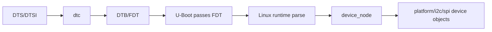

# Chapter 14 - Integration: Clean Build and Linux/Zephyr Hardware Description Comparison

> Week 2 / Day 7 - 用两套 clean build 固化 BSP/board 能力，并建立 DT 生命周期对照。

[← Part README](README.md) · [← Previous](ch13_f407_clock_console_flash.md)

## 14.1 本周真正的能力不是“编译了两个系统”，而是掌握两条可重复的构建链

今天所有实验从删除 build/临时产物开始。目标是证明源码、配置、命令足以重新得到相同系统。

## 14.2 Clean Rebuild A：i.MX6ULL DTB

记录 source commit/config：

```bash
git status
git rev-parse --short HEAD
```

重新生成目标 DTB，并：

```bash
sha256sum <dtb>
dtc -I dtb -O dts <dtb> > /tmp/running-source-check.dts
```

确认 Chapter 9/10 的 marker/板型节点存在。

## 14.3 Clean Rebuild B：Zephyr F407 board

```bash
rm -rf build
west build -b f407_explorer <app> -- -DBOARD_ROOT=<root>
```

确认：

```text
build/zephyr/zephyr.elf
build/zephyr/zephyr.dts
build/zephyr/.config
```

然后 flash，串口输出仍正确。

## 14.4 Linux DeviceTree 与 Zephyr Devicetree：语法相似，生命周期完全不同

### Linux 主线（先建立概念，Week 5 深挖）



### Zephyr 主线


最重要的区别：Linux 会在 boot/runtime 解析 FDT 并构造内核对象；Zephyr 主要把 DT 信息在 build-time 转成编译期可用数据/实例。

## 14.5 同一个“UART”问题，两套系统分别在哪里找证据

### Linux

```text
source DTS
 -> dtb
 -> /proc/device-tree
 -> /sys/bus/platform
 -> driver probe log
```

### Zephyr

```text
source DTS
 -> build/zephyr/zephyr.dts
 -> generated devicetree header
 -> .config
 -> device init/runtime log
```

这张对照表以后是排错路线，不是概念考试。

## 14.6 Guided Lab：选 USART 做完整双系统对照

填写：

| Question | Linux 6ULL UART | Zephyr F407 USART1 |
|---|---|---|
| Hardware described where? | | |
| final DT representation? | | |
| who consumes `compatible`? | | |
| pinctrl represented how? | | |
| enable/disable knob? | | |
| runtime observable where? | | |
| driver match/init path? | | |

不要求今天追 Linux probe 源码，先把问题留下，Week 5 再验证。

## 14.7 Retrieval Practice：不看笔记画两条构建链

白纸画：

```text
6ULL source -> U-Boot/Kernel/DTB -> TFTP -> running Linux
F407 source -> west/CMake/Kconfig/DTS -> ELF -> runner -> running Zephyr
```

然后再看文档纠错。你应该特别检查有没有把 `west` 画成 compiler、把 `DTS` 画成 driver。

## 14.8 Week 2 Gate

- [ ] 知道 BSP 中每个 source/config/output 的真实路径；
- [ ] 独立生成 U-Boot/Kernel/DTB；
- [ ] 能用 TFTP RAM boot 自己的 zImage/DTB；
- [ ] 用 marker 证明运行的是新 DTB；
- [ ] 完成一次 remote GDB；
- [ ] 自定义 Zephyr board 可 clean build；
- [ ] F407 console 可真实输出；
- [ ] 能解释 Linux vs Zephyr DT 生命周期区别。

## 14.9 Part II 结语：下周开始跨过 User/Kernel 边界

你已经能“控制 BSP 产物”。Week 3 不立即写 Driver，而先把 Linux 用户态的 process/ELF/virtual memory/fd 系统模型补齐。因为以后所有 Driver API 最终都要被用户态通过 syscall/UAPI 使用；不理解上层调用者，驱动只会变成孤立 API 练习。

## References and manuals

### Linux DeviceTree Usage Model
- Online: [Linux DeviceTree Usage Model](https://docs.kernel.org/devicetree/usage-model.html)
- 本章阅读定位：本章只读 overview/device population 概念，Week 5 再深入。

### Zephyr Devicetree
- Online: [Zephyr Devicetree](https://docs.zephyrproject.org/latest/build/dts/index.html)
- 本章阅读定位：重点比较 build-time pipeline 与 generated outputs。

- [Unified source index](../common/source_index.md)

[← Part README](README.md) · [← Previous](ch13_f407_clock_console_flash.md)
