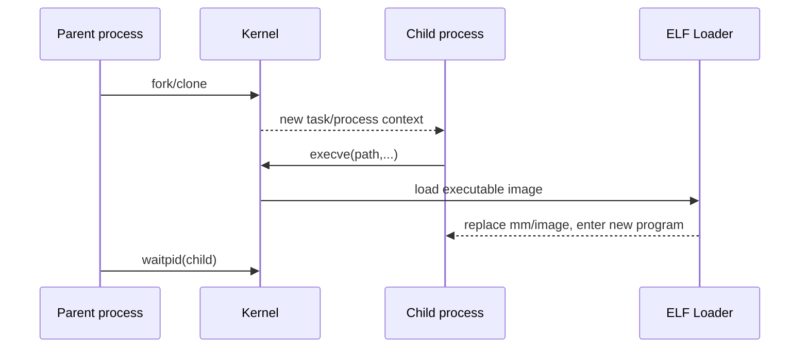

# Chapter 15 - Process Is Not Program: fork, exec, wait and syscall

> Week 3 / Day 1 - 从“RTOS task”迁移到 Linux process 生命周期。

[← Part README](README.md) · [Next →](ch16_elf_loader_dynamic_linker.md)

## 15.1 程序、进程、线程：先把三个对象拆开

你在 MCU/RTOS 里习惯“固件一上电就在那里，Task 是调度单位”。Linux 多了一个非常关键的抽象：**process 是内核管理的一份运行上下文，program 是磁盘上的可执行文件。**

费曼模型：

> program 像菜谱文件；process 是厨房里正在按这份菜谱做菜的一套灶台、锅、原料和状态。`execve()` 不是“创建一个新厨房”，而是把当前厨房换成另一份菜谱和映像。

## 15.2 fork：为什么“复制进程”不是简单 memcpy 全部内存

最小程序：

```c
#include <stdio.h>
#include <unistd.h>
#include <sys/wait.h>

int main(void)
{
    pid_t pid = fork();
    if (pid == 0) {
        printf("child pid=%d ppid=%d\n", getpid(), getppid());
        _exit(0);
    }
    printf("parent pid=%d child=%d\n", getpid(), pid);
    waitpid(pid, NULL, 0);
    return 0;
}
```

用：

```bash
strace -f -tt -T ./fork_demo
```

现代 glibc 可能不直接发出名为 `fork` 的 syscall，而用 `clone/clone3` 实现相同语义。不要因为 strace 没看到字符串 `fork` 就判断 fork 没发生。

## 15.3 COW：fork 为什么没有把整个地址空间立刻复制一份

工程精确模型：父子最开始可以共享相同物理页，页表权限/引用被安排为 copy-on-write；某一方写入时触发 page fault，再复制对应页面。

```text
Parent VA ----\
               -> shared physical page (read-only/COW)
Child VA  -----/

Child write
   -> page fault
   -> allocate/copy page
   -> child PTE points to new page
```

今天不追 MM 内核源码，Chapter 17 再讲 VA/page table。

## 15.4 execve：进程 ID 可以不变，但“程序本体”被替换

Child 分支改成：

```c
execl("/bin/echo", "echo", "hello-from-exec", NULL);
perror("execl");
_exit(127);
```

观察：

```bash
strace -f -e trace=process,execve ./fork_exec_demo
```

精确心智模型：



## 15.5 wait：为什么父进程需要回收 child exit status

Child 退出后，内核仍需保留最小状态供 parent `wait*()` 获取。长期不 wait 会出现 zombie。实验：child 立即退出，parent sleep 30s，另一终端 `ps -o pid,ppid,stat,cmd` 看 `Z` 状态。

不要把 zombie 和“CPU 还在运行的死循环进程”混在一起。

## 15.6 syscall：用户态函数调用如何跨过特权边界

```text
Application function
 -> libc wrapper
 -> architecture syscall instruction
 -> kernel syscall entry
 -> implementation
 -> return to userspace
```

`strace` 正好位于 syscall 边界观察。它看不到普通 C 函数 `foo()`，但能看到 `openat/read/write/ioctl` 等进入内核的操作。

## 15.7 Guided Lab：用 strace 读一个真实程序的“系统需求”

```bash
strace -f -tt -T -o /tmp/ls.trace ls -l /
less /tmp/ls.trace
```

找：

- `execve`；
- `openat` 动态库/locale；
- `mmap`；
- `getdents64`；
- `write`。

把程序行为从“ls 列目录”展开成 Kernel 提供的原语。

## 15.8 Independent Challenge：解释 `system()` 为什么不是 syscall

写 C 调 `system("echo hi")`，用 strace 跟踪。回答：libc 的高层 API 如何组合 fork/exec/wait 之类的系统能力。

## 15.9 下一章：exec 说“加载 ELF”，但 Kernel 到底把 ELF 做成什么运行映像？

Chapter 16 把 Week 1 的 Section/Segment 接到真正 loader 流程，并解释动态 linker 为什么在 main 之前运行。

## References and manuals

### ALIENTEK Linux C Application Guide V1.1
- Local expected path: `../references/ALIENTEK_iMX6ULL_Linux_C_Application_Guide_V1.1.pdf`
- Online: [ALIENTEK Linux C Application Guide V1.1](https://github.com/alientek-openedv/imx6ull-document/blob/master/%E3%80%90%E6%AD%A3%E7%82%B9%E5%8E%9F%E5%AD%90%E3%80%91I.MX6U%E5%B5%8C%E5%85%A5%E5%BC%8FLinux%20C%E5%BA%94%E7%94%A8%E7%BC%96%E7%A8%8B%E6%8C%87%E5%8D%97V1.1.pdf)
- 本章阅读定位：阅读进程控制、fork/exec/wait、system call/系统编程相关章节。

### fork(2)
- Online: [fork(2)](https://man7.org/linux/man-pages/man2/fork.2.html)
- 本章阅读定位：重点看返回语义、COW 描述。

### execve(2)
- Online: [execve(2)](https://man7.org/linux/man-pages/man2/execve.2.html)
- 本章阅读定位：重点看“replace current process image”的语义。

- [Unified source index](../common/source_index.md)

[← Part README](README.md) · [Next →](ch16_elf_loader_dynamic_linker.md)
